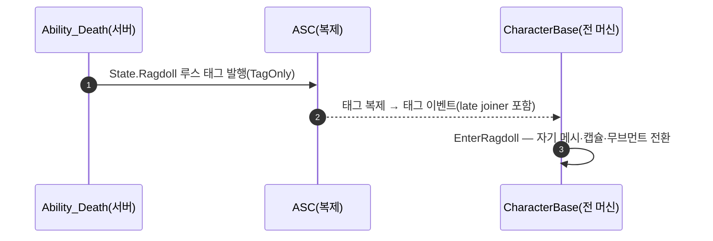

# 래그돌 물리 전환을 WxAbility_Death에서 WxCharacterBase로 이관 (캐릭터↔어빌리티 태그 분리)

## 계획

### 목표
직전 래그돌 이관에서 베이스 캐릭터가 `UWxAbility_Death`를 `#include`하고 그 static `ApplyRagdoll`을 직접 호출하는 종속이 생겼다. 물리 전환을 자기 몸의 주인인 캐릭터가 소유하게 하고 어빌리티는 `State.Ragdoll` 태그 발행만 남겨, 두 클래스가 태그로만 통신하도록 분리한다.

### 수정 범위
| 파일 | 수정할 내용 | 구분 |
|---|---|---|
| `Plugins/WxCombat/.../Ability/WxAbility_Death.{h,cpp}` | `static ApplyRagdoll(ACharacter*)` 선언·정의 제거, 미사용 `class ACharacter;` 전방선언·래그돌 전용 include 정리, 클래스 주석을 "캐릭터가 자체 래그돌 전환 수행"으로 갱신. `EnableRagdoll`(태그 발행)은 유지 | 수정 |
| `Source/WxGame/Character/WxCharacterBase.{h,cpp}` | `EnterRagdoll()` 추가(기존 `ApplyRagdoll` 본문을 `this` 대상으로 이식), `#include WxAbility_Death.h` 제거, `ApplyRagdoll(this)` 호출 2곳을 `EnterRagdoll()`로 교체 | 수정 |
| `Docs/Programmer/Ability_Activation_Flow.md` | `WxAbility_Death` 행의 래그돌 호출 서술을 캐릭터 자체 `EnterRagdoll`으로 갱신 | 수정 |

### 접근 방식
- **불가능한 직역을 방향 전환으로 대체**: 구독을 어빌리티 인스턴스로 옮기면 `ServerInitiated` 어빌리티가 없는 시뮬 프록시·late joiner에서 래그돌이 안 걸린다. 대신 물리 전환의 주인을 어빌리티→캐릭터로 옮긴다.
- **정책/메커니즘/배선 3분리 유지**: 어빌리티=언제(태그 발행), 캐릭터=어떻게(자기 메시·캡슐·무브먼트 전환), 태그(WxCore)=배선. 두 클래스 간 코드 참조는 0이 된다.
- **구독·즉시적용 지점 불변**: `PostInitializeComponents`의 전 머신 구독과 late-join 즉시 1회 적용은 그대로, 내부 호출만 self 메서드로 교체.

---

## 완료

### 수정한 파일
| 파일 | 수정한 내용 | 구분 |
|---|---|---|
| `Plugins/WxCombat/.../Ability/WxAbility_Death.{h,cpp}` | `static ApplyRagdoll` 선언·정의 제거, 미사용 `class ACharacter;` 전방선언 제거, 래그돌 전용 include 정리(`CapsuleComponent`·`CharacterMovementComponent` 제거, `Character.h`→`Pawn.h`), 클래스 주석을 "캐릭터가 자체 래그돌 전환 수행"으로 갱신 | 수정 |
| `Source/WxGame/Character/WxCharacterBase.{h,cpp}` | `EnterRagdoll()` 추가(기존 물리 전환 본문 이식), `#include WxAbility_Death.h` 제거, 즉시적용·`HandleRagdollTagChanged`의 호출 2곳을 `EnterRagdoll()`로 교체 | 수정 |
| `Docs/Programmer/Ability_Activation_Flow.md` | `WxAbility_Death` 행 래그돌 서술을 캐릭터 자체 `EnterRagdoll` 수행으로 갱신 | 수정 |

### 구현·결정과 그 이유
- **물리 전환의 주인을 캐릭터로**: 구독은 전 머신에 존재하는 객체에만 둘 수 있는데 어빌리티는 서버·오너 클라 전용이라 후보에서 빠진다. 자기 메시·캡슐·무브먼트를 만지는 코드는 몸의 주인인 캐릭터에 두는 게 가장 자연스럽고, 어빌리티는 `State.Ragdoll` 발행만 남겨 두 클래스가 태그로만 통신한다(코드 참조 0).
- **`ApplyRagdoll`은 캐릭터로 옮겨도 의미 불변**: 본문에 사망 고유 로직이 전혀 없고 순수 캐릭터 물리 전환이라 static→멤버 이식에 동작 변화가 없다.
- **`Character.h`→`Pawn.h`**: `ApplyRagdoll` 제거로 `ACharacter` 의존이 사라졌으나 `ActivateAbility`의 `APawn` 캐스트가 남아, 그 헤더만 최소로 남겼다.

### 계획 대비 달라진 점
- 지역 변수 `Mesh`가 상속된 `ACharacter::Mesh` 멤버를 가려 C4458(에러)이 났다. static일 땐 없던 문제라, 지역명을 `MeshComp`로 바꿔 해결.

### 후속 과제
- **런타임 검증(사용자)**: 직전 워크로그와 동일 — PIE 데디+클라 2대에서 몽타주 없는 적 처치 시 서버·오너·시뮬 프록시·late-join 시체 각각 래그돌 확인. 코드 경로만 바뀌고 발행/감지 구조는 그대로라 종전 검증 범위를 승계한다.
