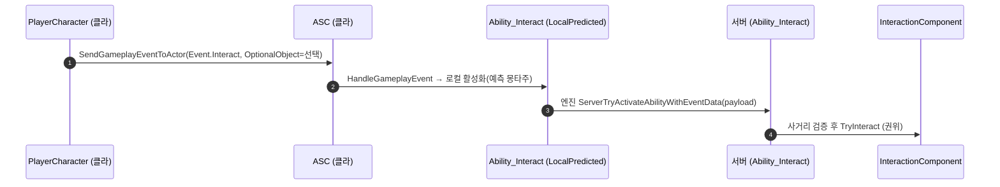

# 상호작용을 Lyra식 LocalPredicted + 게임플레이 이벤트로 전환

## 계획

### 목표
상호작용 실행을 순정 GAS·Lyra 방식으로 맞춘다. 직전 작업의 `ServerInitiated` + 커스텀 캐릭터 RPC(`ServerInteract`)를, Lyra가 쓰는 **LocalPredicted + 게임플레이 이벤트** 전송으로 교체한다. 선택 대상은 `FGameplayEventData.OptionalObject`에 실려 엔진의 `ServerTryActivateAbilityWithEventData`로 서버에 전달된다. 커스텀 구조체·RPC·ASC virtual 없이 순정 GAS만 쓴다.

### 수정 범위
| 파일 | 수정할 내용 | 구분 |
|---|---|---|
| `Source/WxGame/.../Ability/WxAbility_Interact.cpp` | `NetExecutionPolicy` ServerInitiated → LocalPredicted, 주석 갱신 | 수정 |
| `Source/WxGame/.../Ability/WxAbility_Interact.h` | 클래스 주석의 네트 정책·예측 서술 정정 | 수정 |
| `Source/WxGame/Character/WxPlayerCharacter.{h,cpp}` | `ServerInteract` RPC 제거, `Interact()`가 직접 `SendGameplayEventToActor` 송출 | 수정 |
| `Docs/Programmer/Interaction_System.md` | 실행 절을 LocalPredicted + 클라 이벤트 송출로 갱신 | 수정 |

변경 없음: 태그(이미 정합), `WxInputConfig`(InteractAction 유지), ASC, 커스텀 구조체(이미 삭제).

### 접근 방식
- **순정 페이로드 통로 = LocalPredicted**: 클라→서버 이벤트 페이로드 전송(`ServerTryActivateAbilityWithEventData`)은 LocalPredicted 분기에만 존재한다(`HasNetworkAuthorityToActivateTriggeredAbility`가 정책으로 가름). 그래서 LocalPredicted가 필수.
- **예측은 코스메틱만**: 클라가 예측 재생하는 건 로컬 몽타주뿐. 실행(`TryInteract`)은 서버 권위 게이트를 통과하고 사거리도 서버에서 재검증. 게임플레이 상태는 예측하지 않는다. 이득: RTT 지연 없는 즉시 몽타주.
- **캐릭터는 순정 이벤트 송출만**: `Interact()`가 레지스트리 선택을 읽어 `SendGameplayEventToActor(this, Event.Interact, {OptionalObject=선택})` 한 줄. 커스텀 RPC가 사라져 직전보다 단순. 서버 홉은 LocalPredicted 어빌리티가 담당하므로 캐릭터엔 서버 홉 코드 없음.

---

## 완료

### 수정한 파일
| 파일 | 수정한 내용 | 구분 |
|---|---|---|
| `Source/WxGame/.../Ability/WxAbility_Interact.cpp` | `NetExecutionPolicy` ServerInitiated → LocalPredicted, 생성자·`ActivateAbility` 주석을 전송 통로·코스메틱 예측 기준으로 정정 | 수정 |
| `Source/WxGame/.../Ability/WxAbility_Interact.h` | 클래스 주석을 LocalPredicted + 이벤트 페이로드 전송으로 정정 | 수정 |
| `Source/WxGame/Character/WxPlayerCharacter.{h,cpp}` | `ServerInteract` RPC 제거, `Interact()`가 직접 `SendGameplayEventToActor`로 선택 페이로드 송출, 미사용 전방선언 정리 | 수정 |
| `Docs/Programmer/Interaction_System.md` | 요약·flowchart·실행 절·제약·주의·타입 표를 LocalPredicted + 클라 이벤트 송출로 갱신 | 수정 |

### 구현·결정과 그 이유
- **LocalPredicted가 곧 전송 통로**: 클라가 고른 페이로드를 서버로 나르는 순정 통로 `ServerTryActivateAbilityWithEventData`는 LocalPredicted 분기에만 존재한다(`HasNetworkAuthorityToActivateTriggeredAbility`). 그래서 커스텀 RPC·TargetData 없이 순정 GAS만으로 성립하려면 LocalPredicted가 필수. 예측은 로컬 몽타주뿐(코스메틱)이고 실행은 여전히 권위 게이트.
- **캐릭터는 이벤트 송출 한 줄**: 직전의 `ServerInteract` 커스텀 RPC를 지우고 `SendGameplayEventToActor`로 대체. 서버 홉은 LocalPredicted 어빌리티가 담당하므로 캐릭터에 네트워크 코드가 없다.
- **스캔 분리는 보류(결정)**: Lyra는 스캔↔실행만 나누고 사용자 대상 선택은 미구현(조준한 것 자동 사용)임을 공식 문서·X157 분석으로 확인. 우리 레지스트리의 휠 선택은 Lyra엔 없는 Wx 고유 확장. 스캔을 별도 어빌리티로 떼는 것은 타이머 재장전 군더더기 하나를 없애줄 뿐 GAS 클래스 +1·교차결합을 부르므로, 향후 스캔이 무거워질 조짐이 없는 현재로선 병합 유지가 낫다고 판단.

### 계획 대비 달라진 점
- 계획대로. 태그·InputConfig·ASC·구조체 무변경(이미 정합·삭제 상태), 어빌리티 정책 1줄 + 캐릭터 이벤트 송출 교체가 실제 델타.

### 후속 과제
- **에디터 데이터(사용자)**: `DA_InputConfig`의 `InteractAction` 슬롯에 `IA_Interact` 지정, `ABS_Player`의 `GA_Interact` 행 `InputTag` 비움(이벤트 트리거라 불요). 직전 작업에서 했다면 없음.
- **런타임 검증(사용자)**: 데디 서버+클라 2대 — 원격 클라 몽타주 즉시(예측) 재생·응시·시뮬 프록시 가시성, 사거리 밖 위조 요청 거부. 빌드는 통과, 실측은 미완.
