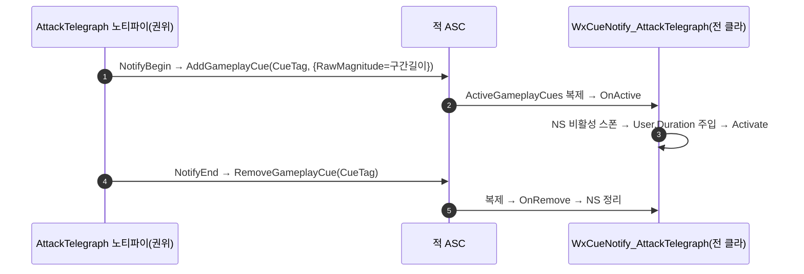

# 공격 텔레그래프: 직접 스폰 → GameplayCue 전환

## 계획

### 목표
공격 텔레그래프 NS 4색(Red/Yellow/Blue/Purple)을 GameplayCue로 전환한다. 노티파이가 각 머신에서 NS를 직접 스폰하던 방식을, 서버 권위에서 `AddGameplayCue`를 발행해 복제(reliable)로 전 클라에 도달시키는 GAS 표준 경로로 옮긴다. 어제 도입한 "차징 길이 = 노티파이 구간 길이"(`User.Duration` 주입)와 구간 중단 시 즉시 제거 동작은 그대로 보존한다.

### 수정 범위
| 파일 | 수정할 내용 | 구분 |
|---|---|---|
| `WxCore/.../Public/WxGameplayTags.h` | `GameplayCue_AttackTelegraph_{Red,Yellow,Blue,Purple}` 4개 선언 | 수정 |
| `WxCore/.../Private/WxGameplayTags.cpp` | 동일 4개 정의 | 수정 |
| `WxCombat/Public/AbilitySystem/Cue/WxCueNotify_AttackTelegraph.h` | `AGameplayCueNotify_Actor` 상속 큐 | 신규 |
| `WxCombat/Private/AbilitySystem/Cue/WxCueNotify_AttackTelegraph.cpp` | OnActive(비활성 스폰→Duration 주입→Activate)/OnRemove | 신규 |
| `WxCombat/Public/AnimNotify/WxAnimNotifyState_AttackTelegraph.h` | 베이스 `UAnimNotifyState`로 교체, `FGameplayTag CueTag` | 재작성 |
| `WxCombat/Private/AnimNotify/WxAnimNotifyState_AttackTelegraph.cpp` | NotifyBegin=AddGameplayCue, NotifyEnd=RemoveGameplayCue(권위 가드) | 재작성 |
| `WxCombat/WxCombat.Build.cs` | Public 의존 `NiagaraAnimNotifies` 제거 | 수정 |
| (에디터) `Content/AbilitySystem/Cue/GC_AttackTelegraph_*` BP 4개 | 부모=WxCueNotify_AttackTelegraph, 태그·NS 지정 | 신규(사용자) |
| (에디터) `AM_Pattern_1..4` 노티파이 트랙 | CueTag 색상 재설정 | 수정(사용자) |

### 접근 방식
- **트리거는 노티파이 유지**: 텔레그래프의 시작 시점·지속 길이는 몽타주 트랙에 저작된 값이라 노티파이가 캡처하는 게 자연스럽다. 노티파이의 역할만 "NS 직접 스폰"→"큐 발행"으로 바꾼다.
- **Add/RemoveGameplayCue(reliable)**: ASC의 `ActiveGameplayCues`(복제 상태)로 동작해 `ExecuteGameplayCue`의 unreliable multicast 문제를 피한다. 반드시 보여야 하는 선딜에 적합.
- **권위 가드**: 노티파이는 복제 몽타주라 전 머신에서 발화하므로, `AddGameplayCue`는 `HasAuthority()`에서만 호출→복제로 전 클라 도달(중복 방지).
- **Duration 채널 = RawMagnitude**: `FGameplayCueParameters`의 자유 float은 이것뿐이고 NetSerialize로 복제됨. 큐가 이 값을 `User.Duration`에 주입.
- **색상 = 태그 4개**: "큐 1개=태그 1개" 관례와 일치, 색 파라미터 배선 불필요. 큐 클래스는 1개, BP 에셋 4개가 각자 태그+NS 지정.

---

## 완료

### 수정한 파일
| 파일 | 수정한 내용 | 구분 |
|---|---|---|
| `WxCore/.../Public/WxGameplayTags.h`·`.cpp` | `GameplayCue.AttackTelegraph.{Red,Yellow,Blue,Purple}` 4개 선언·정의 | 수정 |
| `WxCombat/.../Cue/WxCueNotify_AttackTelegraph.h`·`.cpp` | `AGameplayCueNotify_Actor` 상속 큐. OnActive=비활성 스폰→User.Duration(RawMagnitude) 주입→Activate, OnRemove=정리 | 신규 |
| `WxCombat/.../AnimNotify/WxAnimNotifyState_AttackTelegraph.h`·`.cpp` | 베이스를 `UAnimNotifyState`로 교체, `FGameplayTag CueTag` 추가, NotifyBegin=AddGameplayCue·NotifyEnd=RemoveGameplayCue(권위 가드) | 재작성 |
| `WxCombat/WxCombat.Build.cs` | Public 의존 `NiagaraAnimNotifies` 제거 | 수정 |

### 구현·결정과 그 이유
- **트리거는 노티파이 유지**: 텔레그래프의 시점·길이는 몽타주 트랙에 저작된 값이라, 역할만 "NS 직접 스폰"→"큐 발행/제거"로 바꿨다. 어제 만든 duration 주입 로직은 큐의 OnActive로 이동해 그대로 보존.
- **Add/RemoveGameplayCue(reliable) 채택**: ASC의 `ActiveGameplayCues` 복제 상태로 동작해, `ExecuteGameplayCue`의 unreliable multicast 문제를 피한다. 반드시 보여야 하는 선딜 표시에 적합하고, 구간 중단 시 RemoveGameplayCue로 즉시 정리(기존 bDestroyAtEnd 동작 대체).
- **권위 가드**: 복제 몽타주라 노티파이가 전 머신에서 발화하므로 `Owner->HasAuthority()`에서만 Add/Remove 호출 → 복제로 전 클라 도달, 중복 추가 방지.
- **RawMagnitude를 Duration 채널로**: `FGameplayCueParameters`의 자유 float은 이것뿐이고 NetSerialize로 복제됨.
- **큐 클래스 1개 + BP 4개**: 색상은 BP 서브클래스가 각자 GameplayCueTag+NiagaraSystem 지정. 신규 C++ 클래스 증식 최소화.

### 계획 대비 달라진 점
- 계획대로. 빌드 성공(WxEditor Development, 종료 코드 0). 경고는 전부 기존 엔진 deprecation, 신규 코드 무관.

### 후속 과제
- **에디터 작업(사용자)**: ① `Content/AbilitySystem/Cue/`에 BP 큐 4개(`GC_AttackTelegraph_{Red,Yellow,Blue,Purple}`, 부모=WxCueNotify_AttackTelegraph) 생성 후 각 `GameplayCueTag`+`NiagaraSystem` 지정. ② `AM_Pattern_1..4` 텔레그래프 노티파이 트랙의 `CueTag`를 색상에 맞게 설정(기존 Template NS 참조는 사라짐).
- **검증 미완**: 실제 인게임 확인(단일 PIE 표시·차징·캔슬 정리, 네트워크 PIE 복제 일치)은 에디터 작업 완료 후.
- 어제 worklog(`2026-07-18-텔레그래프-길이조절-AnimNotifyState.md`)의 직접 스폰 방식을 이 작업이 대체함.
