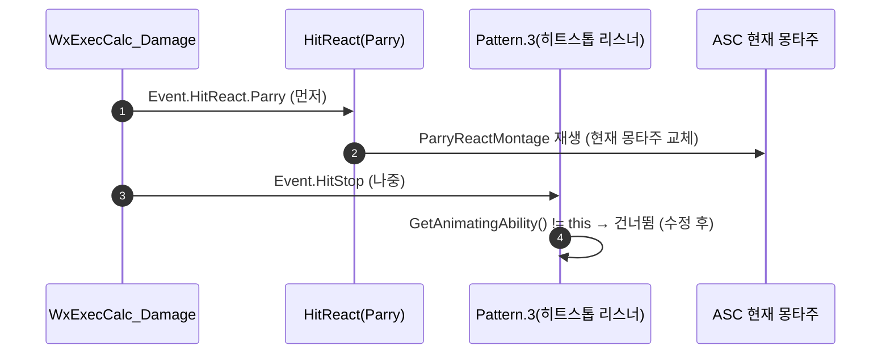

# 패리 시 보스 몽타주 영구 정지 버그 수정

## 계획

### 목표
적의 `Ability.Pattern.3` 돌진 공격을 퍼펙트 가드(패리)하면 보스 몽타주가 재생속도 ~0으로 영구 정지하는 버그를 고친다. 히트스톱이 자기 것이 아닌 몽타주에 걸려 복원되지 않는 것이 원인이다.

### 수정 범위
| 파일 | 수정할 내용 | 구분 |
|---|---|---|
| `Plugins/WxCombat/Source/WxCombat/Private/AbilitySystem/Ability/WxAbilityBase.cpp` | `HandleHitStopEvent`에 애니메이팅 어빌리티 가드 추가 | 수정 |

### 접근 방식
- **근본 원인**: 퍼펙트 가드 성립 시 `WxExecCalc_Damage`가 공격자에게 `Event.HitReact.Parry`(먼저) → `Event.HitStop`(나중) 순으로 보낸다. 앞의 이벤트로 HitReact가 `ParryReactMontage`를 재생해 ASC의 현재/애니메이팅 몽타주가 바뀐 뒤, 아직 종료 안 된 `Pattern.3`의 히트스톱 리스너가 뒤의 이벤트를 받아 `CurrentMontageSetPlayRate(0.001)`로 **남의 몽타주(ParryReact)**를 얼린다. 이어서 `Pattern.3` 종료 시 `EndAbility`가 복원 타이머를 지워 영구 정지가 된다.
- **가드**: 히트스톱은 자기 몽타주를 잠깐 멈추는 self-local 연출이므로, `HandleHitStopEvent`에서 `ASC->GetAnimatingAbility() != this`면 조기 리턴한다. 다른 어빌리티가 몽타주를 가로챈 뒤엔 히트스톱을 건너뛰어 남의 몽타주를 얼리지 않는다. 순정 GAS의 몽타주 소유권 추적을 그대로 활용, 최소 변경.

---

## 완료

### 수정한 파일
| 파일 | 수정한 내용 | 구분 |
|---|---|---|
| `Plugins/WxCombat/Source/WxCombat/Private/AbilitySystem/Ability/WxAbilityBase.cpp` | `HandleHitStopEvent`에 `GetAnimatingAbility() != this` 조기 리턴 가드 추가 | 수정 |

### 구현·결정과 그 이유
- **애니메이팅 어빌리티 가드**: 히트스톱은 "자기 몽타주를 잠깐 멈추는" self-local 연출이다. `CurrentMontageSetPlayRate`가 ASC의 현재 몽타주(어빌리티 무관)를 건드리는 게 화근이므로, 자기가 현재 몽타주의 주인일 때만 적용하도록 좁혔다. 순정 GAS의 몽타주 소유권 추적(`GetAnimatingAbility`)을 쓰므로 상태 플래그·리플렉션 이탈 없이 최소 변경.
- **정상 경로 무영향 확인**: 비패리 적중 시 공격 어빌리티가 곧 애니메이팅 어빌리티라 가드를 통과, 기존 히트스톱 그대로. 다단 히트도 공격 몽타주가 계속 애니메이팅 중이라 정상.
- **빌드**: WxEditor(Development) 컴파일·링크 성공. 경고는 엔진 헤더 deprecation뿐, 이번 수정과 무관.

### 계획 대비 달라진 점
- 계획대로.

### 후속 과제
- 에디터 인게임 검증(보스 Pattern.3 돌진 패리 시 정상 복귀, 비패리 적중 히트스톱 정상)은 미실시. 다음 플레이 테스트에서 확인 필요.
