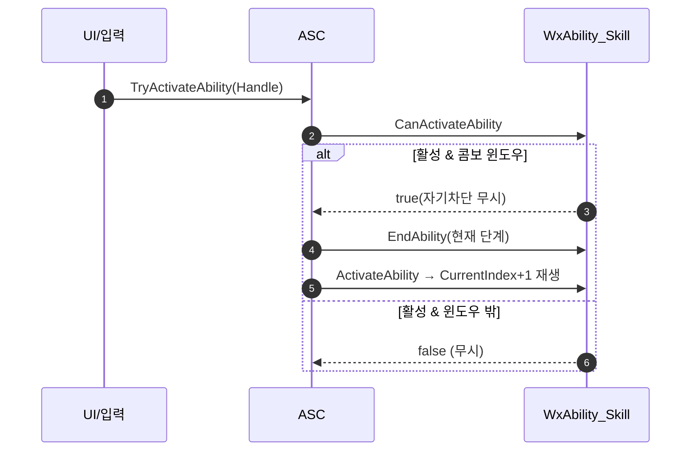

# 스킬 콤보를 엔진 재발동(retrigger) 구조로 전환

## 계획

### 목표
UI 버튼(`UWxViewModel_Ability::TryActivateAbility` → `ASC->TryActivateAbility`)으로는 콤보가 첫 몽타주에서 멈추는 버그를 해결한다. 콤보 진행을 자체 `WaitInputPress`/`InputPressed` 기계장치 대신 엔진 순정 `bRetriggerInstancedAbility`로 바꿔, "콤보 진행 = 평범한 `TryActivateAbility` 재호출"로 통일한다. 그러면 하드웨어 입력과 UI가 같은 경로를 쓰고, InputPressed 없이 MP 안전하게 콤보가 진행된다. (WxCore·VM은 손대지 않는다.)

### 수정 범위
| 파일 | 수정할 내용 | 구분 |
|---|---|---|
| `WxAbility_Skill.h` | `WaitForComboInput`·`HandleComboInputPressed`·`WaitInputTask`·`NextComboIndex` 제거, `WaitInputPress` 전방선언 제거. `CanActivateAbility` 오버라이드 선언. `CurrentIndex` 기본값 `INDEX_NONE` | 수정 |
| `WxAbility_Skill.cpp` | 생성자 `bRetriggerInstancedAbility=true`. `CanActivateAbility`(재발동은 콤보 윈도우+비용/쿨다운/사망만, 자기 차단 우회; 신규는 `Super`). `ActivateAbility`에서 인덱스 전진. `EndAbility`는 몽타주 태스크만 정리(인덱스 리셋 안 함). 몽타주 종료 핸들러가 `CurrentIndex=INDEX_NONE`로 콤보 종료 표시. `WaitInputPress` include 제거 | 수정 |
| `WxAbilitySystemComponent.cpp` | `AbilityInputTagPressed` 활성 분기: 먼저 `TryActivateAbility` 시도(콤보면 재발동), false면(재발동 불가) 기존 `InputPressed`(가드/회피 카운터)로 폴백 — 별도 판별 게터 불필요 | 수정 |

VM(`WxViewModel_Ability`)은 현재 코드 그대로 — 이미 `TryActivateAbility`를 호출하므로 재발동 구조가 갖춰지면 콤보가 자동 진행된다. (선행 작업: [[2026-07-20-viewmodel-ability-tryactivate]])

### 접근 방식
- **엔진 순서 활용**: `InternalTryActivateAbility`는 `CanActivateAbility` → `IsActive()`+retrigger 종료 순이다(UE5.8). 그래서 `CanActivateAbility` 오버라이드로 콤보 윈도우 밖 재발동을 막고, 윈도우 안이면 통과시켜 엔진이 현재 단계를 끝내고 다음 단계를 재발동하게 한다.
- **자기 차단 우회**: 재발동 시점엔 아직 `BlockAbilitiesWithTag(Ability)`가 켜져 있어 `Super`는 실패한다. 재발동 분기에서만 자기 차단을 건너뛰고(직후 EndAbility가 해제) 사망/비용/쿨다운/윈도우만 판정한다.
- **인덱스 단일 원천**: `CurrentIndex` 하나가 원천. 재발동은 이를 보존해 `ActivateAbility`에서 `+1`(터미널→0), 콤보 자연 종료 시 몽타주 핸들러가 `INDEX_NONE`으로 리셋한다. 재발동의 EndAbility가 몽타주 태스크 종료 콜백으로 인덱스를 되돌리지 않도록 `EndTask`로 콜백을 먼저 해제한다.
- **입력 라우팅**: `InputPressed`는 콤보가 아니라 Dodge/Guard 카운터 전용으로만 남는다. 활성 스펙이 재발동 가능하면 `TryActivateAbility`로, 아니면 `InputPressed`로 라우팅한다.

---

## 완료

### 수정한 파일
| 파일 | 수정한 내용 | 구분 |
|---|---|---|
| `WxAbility_Skill.h` | `WaitInputPress` 계열(태스크·전방선언·`WaitForComboInput`·`HandleComboInputPressed`)과 `NextComboIndex` 제거. `CanActivateAbility` 오버라이드 선언. `CurrentIndex` 기본값 `INDEX_NONE` | 수정 |
| `WxAbility_Skill.cpp` | 생성자 `bRetriggerInstancedAbility=true`. `CanActivateAbility`(재발동=콤보 윈도우+`CheckCost`/`CheckCooldown`+`ActivationBlockedTags`만, 자기 차단 우회; 신규는 `Super`). `ActivateAbility`에서 `CurrentIndex` 전진. `EndAbility`는 몽타주 태스크만 `EndTask`로 정리(인덱스 리셋 안 함). 몽타주 종료 핸들러 3종이 `CurrentIndex=INDEX_NONE` | 수정 |
| `WxAbilitySystemComponent.cpp` | `AbilityInputTagPressed` 활성 분기: `TryActivateAbility` 먼저 시도(콤보면 재발동), false면 `InputPressed` 폴백 | 수정 |

### 구현·결정과 그 이유
- **엔진 재발동으로 통일**: 콤보 진행이 곧 `TryActivateAbility` 재호출이 되어, UI 버튼(`VM->TryActivateAbility`, 수정 불필요)과 하드웨어 입력이 같은 경로를 탄다. MP는 `TryActivateAbility`의 예측/복제로 자연히 안전(서버도 동일 재발동). InputPressed는 콤보에서 빠지고 Dodge/Guard 카운터 전용으로만 남는다.
- **윈도우 게이트를 `CanActivateAbility`에**: `InternalTryActivateAbility`가 `CanActivateAbility`를 재발동 종료보다 먼저 부르므로(UE5.8), 여기서 콤보 윈도우 밖 재발동을 막으면 현재 몽타주를 끊지 않고 조용히 무시된다. 자기 차단은 재발동 직후 EndAbility가 어차피 해제하므로 이 분기에서만 건너뛰되, 사망/비용/쿨다운은 그대로 판정한다.
- **인덱스 단일 원천**: 별도 `NextComboIndex` 없이 `CurrentIndex`만. 재발동의 EndAbility는 인덱스를 보존하고(그래서 다음 `ActivateAbility`가 `+1`), 콤보 자연 종료는 몽타주 핸들러가 `INDEX_NONE`으로 리셋해 다음 신규 발동이 0부터 시작하게 한다. 재발동 EndAbility가 몽타주 태스크 종료 콜백으로 인덱스를 되돌리지 않도록 `EndTask`로 콜백을 먼저 해제한다.

### 계획 대비 달라진 점
- **`WxAbilityBase::AllowsInputRetrigger()` 게터 폐기**: 라우팅에서 재발동 가능 여부를 묻는 대신, 활성 스펙에 `TryActivateAbility`를 먼저 시도하고 false면 `InputPressed`로 폴백하는 방식으로 바꿔 게터(및 ASC의 `WxAbilityBase` 의존)를 없앴다. (구현 중 사용자 제안 반영)

### 후속 과제
- 에디터 PIE에서 GA_Skill_3 UI 버튼 연타 → 콤보 진행, 윈도우 밖 클릭 무시, 하드웨어 입력 콤보 정상 확인(사용자 진행).
- Attack 콤보(`WxAbility_Attack`)는 동일 패턴이나 이번 스코프 제외(non-retriggerable로 남아 기존 `InputPressed`→`WaitInputPress`로 동작). 원하면 같은 구조로 후속 통일 가능.
