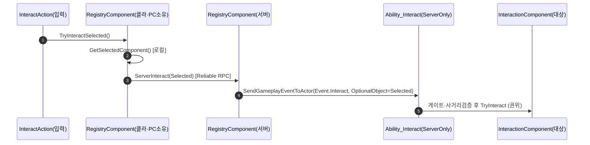

# 상호작용 레지스트리를 PlayerController 컴포넌트로 이관 + 어빌리티 ServerOnly 전환

## 계획

### 목표
상호작용 어빌리티에서 클라 선예측을 없앤다. 몽타주·응시가 이미 제거(2026-07-19)돼 코스메틱 예측이 사라졌으므로, 클라 인스턴스를 정당화하던 근거가 없다. 동시에 캐릭터의 `Interact()` 직접 구현을 걷어낸다. 이를 위해 선택을 서버로 나르는 통로(RPC)를 담을 수 있도록 `UWxInteractionRegistrySubsystem`(LocalPlayerSubsystem, RPC 불가)을 `PlayerController`에 붙는 컴포넌트로 이관한다.

### 접근 방식
- **레지스트리 → PC 컴포넌트**: `LocalPlayerSubsystem`은 액터가 아니라 Server RPC를 못 단다. `AWxPlayerController` 소유 컴포넌트로 옮기면 컴포넌트가 직접 `ServerInteract` RPC를 든다. PC 선택 이유: 리스폰에도 생존(폰과 디커플), 소유 클라 연결로 net-owned(RPC 유효), 타 클라 미복제(로컬리티가 기존 LocalPlayerSubsystem과 근접).
- **스캔도 컴포넌트로**: ServerOnly 어빌리티는 클라에서 활성화되지 않아 클라측 주기 스캔을 더는 못 돈다. 감지 스캔·in-range·선택·하이라이트·프롬프트를 컴포넌트가 소유한다(기존 서브시스템 로직 + 어빌리티의 `ScanAndPush` 병합). 소유 클라(리슨호스트 포함)에서만 타이머로 스캔.
- **선택 전달 = 로컬 읽기 + RPC 파라미터**: 입력 시 컴포넌트가 로컬 선택을 읽어 `ServerInteract(Selected)` 호출. 서버가 `Event.Interact`(OptionalObject=Selected)를 폰 ASC로 송출 → ServerOnly 어빌리티가 권위에서 게이트·사거리검증·`TryInteract`. 선택을 복제하지 않고 원자 전송하므로 "사이클→즉시입력" 순서 보장 유지.
- **모듈 경계**: 컴포넌트는 WxWorld(상호작용 도메인). WxUI VM push(전역 선택 VM)는 WxWorld가 WxUI를 못 보므로 WxGame의 PC가 컴포넌트 델리게이트를 구독해 담당.
- **어빌리티 유지**: ServerOnly로 얇게 유지(이벤트 트리거 + 사거리검증 + 게이트). 삭제하면 AbilitySet 그랜트(에셋) 수정이 필요하고 이 환경에선 불가하므로 유지가 안전.

### 수정 범위
| 파일 | 수정할 내용 | 구분 |
|---|---|---|
| `Plugins/WxWorld/.../Interaction/WxInteractionRegistryComponent.{h,cpp}` | 신규 `UActorComponent`: 스캔·in-range·선택·하이라이트·프롬프트·델리게이트(서브시스템 이관) + `TryInteractSelected`(입력 진입) + `ServerInteract`(Server RPC) | 신규 |
| `Plugins/WxWorld/.../Interaction/WxInteractionRegistrySubsystem.{h,cpp}` | 컴포넌트가 대체 | 삭제 |
| `Source/WxGame/.../Ability/WxAbility_Interact.{h,cpp}` | 정책 `LocalPredicted`→`ServerOnly`, 스캔·타이머·레지스트리·VM push·OnGive/Remove 제거. 이벤트 트리거·`ActivateAbility`(페이로드→사거리검증→`TryInteract`)·`ExecuteInteract`·차단태그 유지. 서버 사거리검증용 `ScanRadius` 유지 | 수정 |
| `Source/WxGame/Controller/WxPlayerController.{h,cpp}` | 컴포넌트 subobject 생성 + `GetInteractionRegistry()` 게터. BeginPlay(로컬)에서 컴포넌트 선택 델리게이트 구독 → 전역 선택 VM push | 수정 |
| `Source/WxGame/Character/WxPlayerCharacter.{h,cpp}` | `Interact()` 제거, `InteractAction` 바인딩을 PC 컴포넌트의 `TryInteractSelected`로 재연결. 레지스트리 include 제거 | 수정 |
| `Source/WxGame/MVVM/WxViewModelResolver_InteractionList.cpp` | LocalPlayer 서브시스템 조회 → PC 컴포넌트 조회 | 수정 |
| `Source/WxGame/Input/WxInputConfig.h` | `InteractAction` 직접 바인딩 사유 주석 갱신 | 수정 |

---

## 완료

### 수정한 파일
| 파일 | 수정한 내용 | 구분 |
|---|---|---|
| `Plugins/WxWorld/.../Interaction/WxInteractionRegistryComponent.{h,cpp}` | 신규 `UActorComponent`. 서브시스템의 in-range·선택·하이라이트·프롬프트·델리게이트 + 어빌리티의 스캔(`ScanAndPush`)을 병합. `SetIsReplicatedByDefault(true)`로 `ServerInteract`(Server, Reliable) RPC 라우팅. BeginPlay(로컬만) 스캔 타이머, `TryInteractSelected` 입력 진입, 사망·처형 게이트를 폰 ASC 태그 조회로 미러링 | 신규 |
| `Plugins/WxWorld/.../Interaction/WxInteractionRegistrySubsystem.{h,cpp}` | 컴포넌트가 대체 | 삭제 |
| `Source/WxGame/.../Ability/WxAbility_Interact.{h,cpp}` | `LocalPredicted`→`ServerOnly`. 스캔·타이머·레지스트리·VM push·OnGive/Remove/EndAbility 오버라이드 제거. 이벤트 트리거·`ActivateAbility`·`ExecuteInteract`·차단태그·서버검증용 `ScanRadius` 유지. 클래스 주석 갱신 | 수정 |
| `Source/WxGame/Controller/WxPlayerController.{h,cpp}` | `InteractionRegistry` subobject 생성 + `GetInteractionRegistry()`. BeginPlay(로컬)에서 컴포넌트 델리게이트 구독 → `PushSelectionToViewModel`로 전역 선택 VM 브리지(WxWorld→WxUI) | 수정 |
| `Source/WxGame/Character/WxPlayerCharacter.{h,cpp}` | `Interact()` 선언·정의 제거, `InteractAction` 바인딩을 PC 컴포넌트 `TryInteractSelected`로 재연결. 미사용 include(레지스트리 서브시스템·WxInteractionComponent·ASBlueprintLibrary) 정리, PC·컴포넌트 include 추가 | 수정 |
| `Source/WxGame/MVVM/WxViewModelResolver_InteractionList.{h,cpp}` | LocalPlayer 서브시스템 조회 → PC 컴포넌트 조회. 주석 갱신 | 수정 |
| `Source/WxGame/Input/WxInputConfig.h` | `InteractAction` 라우팅 사유 주석 갱신 | 수정 |
| `Plugins/WxWorld/.../Interaction/WxInteractionComponent.h` | 흐름 설명 주석을 컴포넌트+RPC+ServerOnly 기준으로 갱신(구 TargetData 서술 정정) | 수정 |

### 구현·결정과 그 이유
- **ServerOnly가 이제 가능**: 클라 인스턴스를 정당화하던 몽타주·응시가 2026-07-19에 제거돼(연출은 대상 StateTree로 이관) 코스메틱 예측이 없다. 따라서 클라 인스턴스를 없애도 잃는 게 없어 ServerOnly로 전환. 과거 ServerInitiated→LocalPredicted 회귀 사유가 무효화됨.
- **레지스트리를 PC 컴포넌트로**: LocalPlayerSubsystem은 RPC를 못 든다. 컴포넌트가 `ServerInteract`를 직접 들어 "선택 로컬 읽기 → RPC 파라미터 원자 전송"이 성립. 선택을 복제하지 않으므로 "사이클→즉시입력" 순서는 로컬 동기 읽기로 보장(2026-07-17이 우려한 것은 선택 복제 대안이었고 이 설계엔 무관).
- **스캔이 컴포넌트로 강제 이동**: ServerOnly 어빌리티는 클라 스캔을 못 돈다. 스캔·선택·하이라이트를 컴포넌트가 소유. 2026-07-18이 "스캔 분리 보류"한 전제(LocalPredicted 유지 시 어빌리티 병합이 저렴)가 ServerOnly로 무너지므로 분리가 정당.
- **어빌리티 유지(삭제 안 함)**: 이벤트로 트리거되는 얇은 ServerOnly 실행체로 남겨 사거리검증·차단태그 게이트를 GAS에 유지. 삭제하면 AbilitySet 그랜트(에셋) 수정이 필요하나 원격 환경엔 에디터가 없어 불가.
- **VM 브리지는 PC(WxGame)에**: 컴포넌트(WxWorld)는 WxUI를 참조 못 하므로 전역 선택 VM push를 PC가 델리게이트 구독으로 담당. 모듈 경계 유지.

### 계획 대비 달라진 점
- 계획대로.

### 후속 과제
- **⚠ 빌드 미검증**: 원격 클라우드 환경에 언리얼 엔진·에디터가 없어 컴파일하지 못했다. 로컬에서 WxEditor(Development) 빌드 확인 필요. 코드 정합성은 정독·기존 코드 대조로 담보.
- **에디터 데이터(사용자)**: `WBP_InteractionList`의 `CycleSelection` 호출 노드를 LocalPlayer 서브시스템 조회에서 `PlayerController→GetInteractionRegistry`로 재연결(레지스트리가 컴포넌트로 이동). `ABS_Player`의 `GA_Interact` 그랜트·`DA_InputConfig`의 `InteractAction`은 변경 불요(그대로 유효).
- **README 갱신**: `Plugins/WxWorld/README.md`가 삭제된 서브시스템을 핵심 타입으로 나열 → WxWorld 소스 변경으로 stale 처리되어 다음 `/readme-writer` 정기 실행이 자동 재생성.
- **런타임 검증(사용자)**: 데디 서버+클라 2대 — 원격 클라 상호작용(RTT 후 대상 상태 수렴), 휠 사이클→즉시 상호작용, 사거리 밖 위조 요청 거부, 리스폰 후 재동작.
