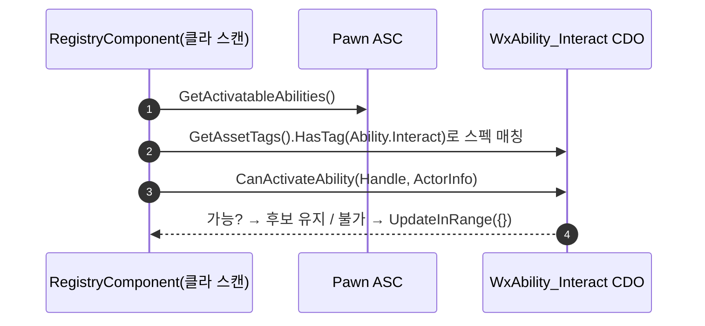

# 상호작용 표시 게이트를 어빌리티 CanActivateAbility로 위임

## 계획

### 목표
`UWxInteractionRegistryComponent::ScanAndPush`가 클라 표시 게이트를 위해 `State.Dead`/`State.Finisher`를 하드코딩해 `WxAbility_Interact`의 `ActivationBlockedTags`를 미러링하던 것을 제거한다. 어빌리티의 `CanActivateAbility()`를 표시 게이트로 위임해 어빌리티를 차단 조건의 단일 소스로 복원한다.

### 수정 범위
| 파일 | 수정할 내용 | 구분 |
|---|---|---|
| `Source/WxGame/.../Ability/WxAbility_Interact.cpp` | 생성자에서 `SetAssetTags({Ability.Interact})` 부여(식별용). `ActivationBlockedTags`는 유지 | 수정 |
| `Plugins/WxWorld/.../Interaction/WxInteractionRegistryComponent.h` | `UAbilitySystemComponent` 전방선언 + `CanInteractNow(const UAbilitySystemComponent*)` private 헬퍼 선언 | 수정 |
| `Plugins/WxWorld/.../Interaction/WxInteractionRegistryComponent.cpp` | `ScanAndPush`의 하드코딩 태그 게이트를 `CanInteractNow` 호출로 교체, 헬퍼 정의 추가, 주석 갱신 | 수정 |

### 접근 방식
- **애셋 태그로 어빌리티 조회**: WxWorld는 WxGame(어빌리티 클래스)을 참조할 수 없으므로 클래스가 아닌 WxCore 애셋 태그 `Ability.Interact`로 스펙을 찾는다(`UWxBTTask_ActivateAbility`의 `GetActivatableAbilities()` + `GetAssetTags().HasTag()` 관례 재사용). 인터랙트 어빌리티엔 현재 애셋 태그가 없어 `SetAssetTags`로 부여한다(`WxAbility_UseItem`과 동일 패턴).
- **CanActivateAbility 위임**: 찾은 스펙의 `Spec.Ability->CanActivateAbility(Spec.Handle, ActorInfo)` 결과를 표시 게이트로 쓴다. 차단 조건 단일 소스는 어빌리티의 `ActivationBlockedTags`.
- **부작용(의도적)**: `Ability.Interact`는 `Ability` 하위라, 어빌리티가 `AreAbilityTagsBlocked(Ability)` 대상에 편입 → 마시는 중·기믹 연출 중 등 `Ability` 차단 시 서버 활성·클라 표시 양쪽에서 상호작용 억제(더 일관·정확, 기존 갭 해소).

---

## 완료

### 수정한 파일
| 파일 | 수정한 내용 | 구분 |
|---|---|---|
| `Source/WxGame/.../Ability/WxAbility_Interact.cpp` | 생성자에 `SetAssetTags({Ability.Interact})` 추가(식별용), `ActivationBlockedTags` 유지, 주석 갱신 | 수정 |
| `Plugins/WxWorld/.../Interaction/WxInteractionRegistryComponent.h` | `UAbilitySystemComponent` 전방선언 + `CanInteractNow` private 헬퍼 선언 | 수정 |
| `Plugins/WxWorld/.../Interaction/WxInteractionRegistryComponent.cpp` | `ScanAndPush`의 하드코딩 태그 게이트를 `CanInteractNow` 위임으로 교체, 헬퍼 정의 추가 | 수정 |

### 구현·결정과 그 이유
- **애셋 태그로 조회(클래스 아님)**: WxWorld→WxGame 의존 금지라 어빌리티 클래스를 못 본다. `UWxBTTask_ActivateAbility`가 쓰는 `GetActivatableAbilities()` + `GetAssetTags().HasTag()` 관례를 재사용해 WxCore 태그 `Ability.Interact`만으로 스펙을 찾는다.
- **CanActivateAbility 위임**: 차단 조건 단일 소스를 어빌리티로 복원. 컴포넌트는 상태 태그를 하드코딩하지 않고 판정만 위임한다.
- **부작용 수용**: 애셋 태그가 `Ability` 하위라 인터랙트가 `AreAbilityTagsBlocked(Ability)`에 편입됨 → 마시는 중·기믹 연출 중 상호작용이 서버·클라 양쪽에서 억제. 다른 액션 어빌리티와 동일한 순정 관례이며 기존 갭을 메운다.

### 계획 대비 달라진 점
- 계획대로.

### 후속 과제
- **빌드 검증 완료**: WxEditor(Development) 빌드 `Result: Succeeded`(WxAbility_Interact.cpp·WxInteractionRegistryComponent.cpp 재컴파일 확인). 추가 include 불필요(`AbilitySystemComponent.h`가 `UGameplayAbility` 완전형 제공).
- **런타임 검증(사용자)**: 사망·처형 시 프롬프트·하이라이트 소멸→회복 후 복귀(기존 동작), 마시는 중/기믹 연출 중 프롬프트 억제(신규 동작).
- **참고**: 직전 커밋의 `NetExecutionPolicy` ServerOnly가 GA_Interact BP에 실제 반영됐는지(에디터 육안), 폰 상실 시 stale 후보 정리(별건)는 이 작업 범위 밖.
