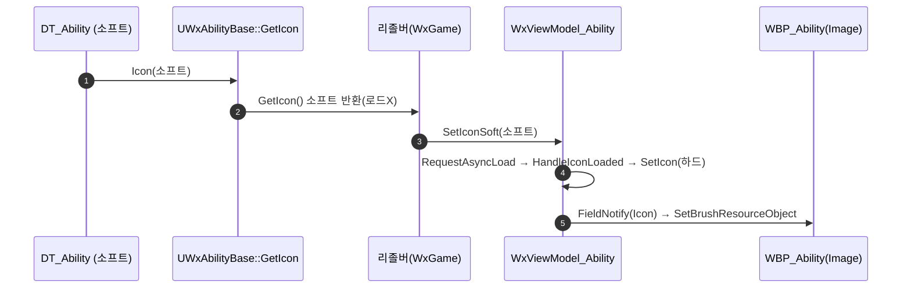

# UWxAbilityComponent 제거 → 아이콘 AbilityDataRow 이관 (소프트/비동기)

## 계획

### 목표
엔진 `UGameplayEffectComponent`를 어빌리티용으로 손수 흉내 낸 확장점 `UWxAbilityComponent`가 실사용은 파생 1개·필드 1개(아이콘)·도메인 1개(WxUI)뿐인 YAGNI 과잉이라, 컴포넌트 장치를 전부 제거하고 아이콘을 어빌리티가 이미 참조 중인 `AbilityDataRow`(DT_Ability)로 이관한다. 겸사겸사 사실상 동기(리졸버의 `LoadSynchronous`)이던 로딩을 소프트/비동기로 전환한다.

제약(사용자 합의): 새 인터페이스 없음 · 캐릭터 코드 무수정 · `UWxLazyImage` 미사용(WBP 일반 Image 유지) · 소프트 포인터를 C++(VM)에서 `StreamableManager`로 비동기 로드.

### 수정 범위
| 파일 | 수정할 내용 | 구분 |
|---|---|---|
| `WxCombat/.../WxAbilityTableRow.h` | `TSoftObjectPtr<UTexture2D> Icon`(Category "Display") 추가 | 수정 |
| `WxCombat/.../WxAbilityBase.h/.cpp` | `Components`·`FindComponent`(선언/정의/템플릿) 제거, `GetIcon()`(행에서 소프트 반환) 추가 | 수정 |
| `WxCore/.../WxAbilityComponent.h` | 앵커 클래스 파일 삭제 | 삭제 |
| `WxUI/.../WxAbilityComponent_UIData.h` | 파생 클래스 파일 삭제 | 삭제 |
| `WxUI/.../WxViewModel_Ability.h/.cpp` | `SetIconSoft()`+`HandleIconLoaded()`+스트림 핸들 추가, `Icon`은 하드 유지, Deinitialize에서 취소 | 수정 |
| `WxGame/.../WxViewModelResolver_PlayerCharacter.cpp` | `FindComponent+LoadSynchronous` → `GetIcon()` 소프트 push(`SetIconSoft`) | 수정 |
| `WxEditor/.../WxAbilityThumbnailRenderer.cpp` | `FindComponent` → `GetIcon()`, 썸네일은 동기 유지 | 수정 |
| `WxCore/README.md`, `WxUI/README.md` | 삭제된 클래스 언급 제거 | 수정 |
| DT_Ability(애셋), 5개 어빌리티 BP | 행에 Icon 채우고 BP `Components` 재저장 정리 | 데이터 이관(에디터) |

### 접근 방식
- **명명 필드 + 기존 인프라 재사용**: 아이콘 보유 5종이 이미 DT_Ability 행을 참조하므로, 아이콘을 그 행에 컬럼 하나로 얹는다. 신규 타입·애셋·인터페이스 0.
- **비동기는 위젯이 아니라 VM에서**: 소프트 포인터를 데이터 행→`GetIcon()`→리졸버→`SetIconSoft`까지 로드 없이 전달하고, VM이 `RequestAsyncLoad` 완료 콜백에서 하드 `Icon`을 세팅. WBP의 일반 Image 바인딩은 무변경.

---

## 완료

### 수정한 파일
| 파일 | 수정한 내용 | 구분 |
|---|---|---|
| `WxCombat/.../WxAbilityTableRow.h` | `TSoftObjectPtr<UTexture2D> Icon`(Category "Display") 추가 | 수정 |
| `WxCombat/.../WxAbilityBase.h/.cpp` | `Components`·`FindComponent`(선언/정의/템플릿)·관련 include 제거, `GetIcon()`(행에서 소프트 반환) 추가 | 수정 |
| `WxCore/.../WxAbilityComponent.h` | 앵커 클래스 파일 삭제 | 삭제 |
| `WxUI/.../WxAbilityComponent_UIData.h` | 파생 클래스 파일 삭제 | 삭제 |
| `WxUI/.../WxViewModel_Ability.h/.cpp` | `SetIconSoft()`+`HandleIconLoaded()`+`PendingIcon`/`IconStreamHandle` 추가, Deinitialize에서 핸들 취소. `Icon`은 하드 유지 | 수정 |
| `WxGame/.../WxViewModelResolver_PlayerCharacter.cpp` | `FindComponent`+`LoadSynchronous` → `GetIcon()` 소프트 `SetIconSoft` push | 수정 |
| `WxEditor/.../WxAbilityThumbnailRenderer.h/.cpp` | `FindComponent`→`GetIcon()`, 주석 갱신, 썸네일은 동기 유지 | 수정 |
| `WxCore/README.md`, `WxUI/README.md`, `WxCombat/README.md` | 삭제된 클래스 언급 정리, 새 아이콘 위치 반영 | 수정 |

### 구현·결정과 그 이유
- **아이콘을 기존 AbilityDataRow에 얹음**: 아이콘 보유 어빌리티 5종이 이미 DT_Ability 행을 참조하므로, 신규 타입·애셋·인터페이스 없이 컬럼 하나로 해결. 컴포넌트-앵커 장치(배열+IsA 스캔+템플릿+WxCore 앵커+WxUI 파생) 전체가 아이콘 하나만 나르던 YAGNI였다.
- **비동기는 VM에서 스트리밍**: `UWxLazyImage` 미사용 제약을 지키려 위젯이 아닌 VM이 `StreamableManager::RequestAsyncLoad`로 로드, 완료 콜백에서 하드 `Icon` 세팅→FieldNotify. WBP의 일반 Image 바인딩은 무변경. 콜백은 멤버 함수(`HandleIconLoaded`)로 두어 람다 회피, `PendingIcon`으로 대상 전달.
- **캐릭터/인터페이스 무변경**: 아이콘 흐름은 캐릭터를 거치지 않고 리졸버가 ASC 어빌리티를 직접 순회하므로 캐릭터 코드 불변. 리졸버 글루는 그대로 유지(인터페이스 도입 배제).
- **검증**: WxEditor(Development) 빌드 `Result: Succeeded`. 잔여 경고는 엔진 내부(Chaos/GeometryCollection) deprecation뿐.

### 계획 대비 달라진 점
- WxCombat README도 아이콘 위치가 바뀌어 함께 갱신(계획엔 WxCore/WxUI만 명시).
- 썸네일 렌더러 헤더 주석도 갱신 대상에 포함.

### 후속 과제
- **에디터 데이터 이관(필수)**: DT_Ability 5행에 Icon 채우기 — GA_Skill_1=`T_UI_Sword`, 2=`T_UI_Axe`, 3=`T_UI_Shield`, 4=`T_UI_Oxo`, GA_Ultimate=`Wx_192`. **채우기 전까지 인게임 아이콘이 비어 보인다.**
- 5개 어빌리티 BP 재저장(제거된 `Components` 저장값 정리 — 로드 시 자동 드롭되나 재저장으로 정돈).
- 런타임 확인: 어빌리티 HUD 아이콘 비동기 표시, 콘텐츠 브라우저 썸네일 렌더(에디터 필요).
