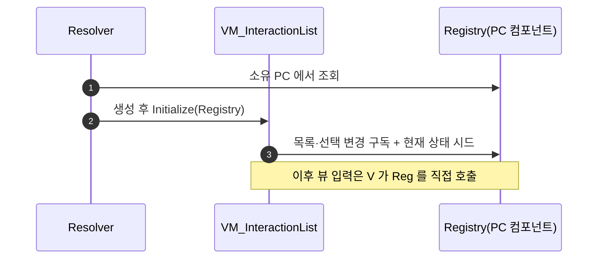

# 상호작용 리스트 뷰모델 WxGame 이관

## 계획

### 목표

직전 작업에서 뷰의 입력 명령 경로를 리졸버에 놓으면서 리졸버가 양방향 배선 허브가 되었다. 리졸버는 뷰모델을 만들어 돌려주는 팩토리여야 한다. 뷰모델을 통합 모듈로 옮겨 데이터 소스를 직접 들게 하면 배선이 뷰모델 안으로 들어가고 리졸버는 팩토리로 돌아간다.

### 수정 범위

| 파일 | 수정할 내용 | 구분 |
|---|---|---|
| `Source/WxGame/MVVM/WxViewModel_InteractionList.h/.cpp` | 뷰모델과 그 리졸버를 한 파일 쌍에. 뷰모델이 레지스트리를 직접 들고 구독·호출 | 신규(이동) |
| `Plugins/WxUI/.../MVVM/WxViewModel_InteractionList.h/.cpp` | 이동에 따른 제거 | 삭제 |
| `Source/WxGame/MVVM/WxViewModelResolver_InteractionList.h/.cpp` | 뷰모델 파일 쌍으로 흡수 | 삭제 |
| `Plugins/WxWorld/.../Interaction/WxInteractionRegistryComponent.h` | 직전에 붙인 리플렉션 지정자 되돌림, 주석 현행화 | 수정 |
| `Config/DefaultEngine.ini` | 뷰모델 클래스 이동 리다이렉트 | 수정 |

### 접근 방식

- **도메인을 보는 뷰모델은 통합 모듈에 둔다**: 이 코드베이스는 이미 그렇게 하고 있다. 인벤토리 뷰모델이 인벤토리 매니저를, 보스 네임플레이트 뷰모델이 보스 액터를 직접 들고 통합 모듈에 산다. 상호작용 리스트 뷰모델만 UI 플러그인에 남아 있어서, 플러그인 의존 방향을 지키려면 누군가 대신 배선해 줘야 했고 그 역할이 리졸버에 얹혀 있었다. 뷰모델을 옮기면 그 이유가 사라진다.
- **새 추상화를 만들지 않는다**: 공용 계약 인터페이스를 하나 더 두는 안도 검토했으나, 기존 형제 뷰모델과 같은 자리로 옮기는 것만으로 해결되므로 채택하지 않았다.
- **뷰에 노출되는 요청 함수의 이름과 시그니처는 유지**한다. 위젯 배선 계획이 그대로 유효하다.

---

## 완료

### 수정한 파일

| 파일 | 수정한 내용 | 구분 |
|---|---|---|
| `Source/WxGame/MVVM/WxViewModel_InteractionList.h/.cpp` | 뷰모델과 리졸버를 한 파일 쌍에. 뷰모델이 레지스트리를 약참조로 들고 구독·시드·명령 호출을 전담 | 신규 |
| `Plugins/WxUI/.../MVVM/WxViewModel_InteractionList.h/.cpp` | 이동 완료로 제거 | 삭제 |
| `Source/WxGame/MVVM/WxViewModelResolver_InteractionList.h/.cpp` | 뷰모델 파일 쌍으로 흡수 | 삭제 |
| `Plugins/WxWorld/.../Interaction/WxInteractionRegistryComponent.h` | 직전에 붙인 리플렉션 지정자 2개 제거, 입력 수신 경로 주석 현행화 | 수정 |
| `Config/DefaultEngine.ini` | 뷰모델 클래스 이동 리다이렉트 추가 | 수정 |

### 구현·결정과 그 이유

- **뷰모델을 통합 모듈로 옮긴 이유**: 배선이 리졸버에 얹혀 있던 원인은 하나였다 — 뷰모델이 UI 플러그인에 있어 월드 플러그인의 레지스트리를 볼 수 없었다. 이 코드베이스는 도메인을 봐야 하는 뷰모델을 이미 통합 모듈에 두고 있어(인벤토리·보스 네임플레이트), 상호작용 리스트만 예외였다. 자리를 맞추자 리졸버가 형제들과 같은 네 줄짜리 팩토리로 돌아왔다.
- **공용 계약 인터페이스를 만들지 않은 이유**: 뷰모델이 소스를 추상 계약으로 잡는 안도 성립하지만, 이동만으로 해결되는 문제에 새 추상화를 얹는 셈이라 접었다.
- **리졸버와 뷰모델을 한 파일 쌍에 둔 것**은 인벤토리 뷰모델의 기존 구성을 따랐다. 리졸버가 그 뷰모델 전용이라 붙여 두는 편이 찾기 쉽다.
- **레지스트리를 약참조로 든 이유**: 뷰모델의 Outer 가 레지스트리 자신이라 강참조는 되돌아가는 참조가 된다. 인벤토리 뷰모델도 매니저를 약참조로 든다.
- **구독 해제를 뷰모델이 직접 한다**: 구독 주체가 뷰모델이 되었으므로 해제도 짝을 맞췄다. 이전에는 리졸버가 걸어 두고 동적 멀티캐스트의 자동 정리에 맡겼다.
- **뷰에 노출되는 요청 함수 이름·시그니처는 그대로 두었다.** 위젯 배선 계획이 영향을 받지 않는다.
- 클래스가 모듈을 옮기므로 위젯의 View Bindings 가 뷰모델 클래스를 잃지 않도록 리다이렉트를 넣었다.

### 계획 대비 달라진 점

계획대로.

### 후속 과제

- 에디터 작업(선택 이동 입력 액션 2종 생성, 매핑 컨텍스트에 휠 위/아래 매핑, 위젯 그래프를 Enhanced Input 이벤트 + 뷰모델 요청 호출로 교체)과 플레이 동작 확인까지 마쳤다. 클래스 이동 리다이렉트도 적용돼 위젯의 View Bindings 가 뷰모델을 그대로 유지했다.
- **미검증**: 리슨 서버 2인 환경, 사망 후 리스폰 시 위젯 재생성 경로. 단일 플레이에서만 확인했다.
- 상호작용 시스템 문서와 관련 README 가 이전 커밋 기준으로 낡아 있어 갱신이 필요하다.
