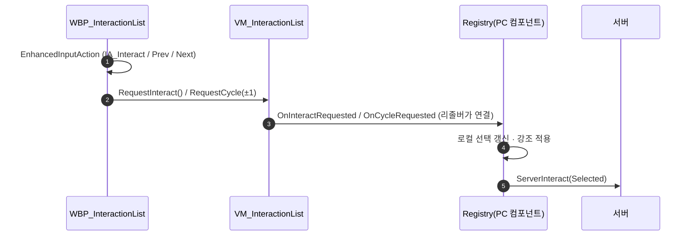

# 상호작용 입력 WBP Enhanced Input + VM 커맨드 이관

## 계획

### 목표

`WBP_InteractionList`가 제거된 `UWxInteractionRegistrySubsystem`을 참조해 컴파일 에러를 냈고, 임시 배선으로 풀었지만 위젯이 `WxWorld` C++ 클래스를 직접 참조하는 구조는 남아 재발 위험이 그대로다. 상호작용 입력 수신을 WBP의 Enhanced Input으로 모으고, 명령은 뷰모델을 거쳐 레지스트리로 흘려 위젯이 `WxUI` 뷰모델만 알게 만든다. `UWxInputConfig`에서 `InteractAction`을 제거한다.

### 수정 범위

| 파일 | 수정할 내용 | 구분 |
|---|---|---|
| `Plugins/WxUI/.../MVVM/WxViewModel_InteractionList.h/.cpp` | 뷰→레지스트리 커맨드 채널(요청 함수 2개 + 동적 델리게이트 2개) 추가 | 수정 |
| `Source/WxGame/MVVM/WxViewModelResolver_InteractionList.cpp` | VM 요청 델리게이트를 레지스트리에 역방향 연결 | 수정 |
| `Plugins/WxWorld/.../Interaction/WxInteractionRegistryComponent.h` | `TryInteractSelected`에 `UFUNCTION()` 추가, `CycleSelection`의 `BlueprintCallable` 축소 | 수정 |
| `Source/WxGame/Input/WxInputConfig.h` | `InteractAction` 제거 | 수정 |
| `Source/WxGame/Character/WxPlayerCharacter.cpp` | 상호작용 입력 바인딩 블록·include 삭제 | 수정 |
| `Content/Input/Actions/IA_Interact_Prev`, `IA_Interact_Next` | 선택 이동 입력 액션 | 신규(에디터) |
| `Content/Input/IMC_PlayerCharacter` | 휠 위/아래를 두 액션에 매핑 | 수정(에디터) |
| `Content/UI/Widget/WBP_InteractionList` | 레거시 InputKey 노드를 EnhancedInputAction으로 교체, 호출 대상을 VM 요청 함수로 | 수정(에디터) |

### 접근 방식

- **입력 수신은 위젯이 소유**: UMG는 위젯 전용 Enhanced Input 바인딩을 스톡으로 지원한다. `NativeOnInitialized`의 `CreateInputComponent()`가 PC의 InputComponent 클래스로 위젯 전용 입력 컴포넌트를 만들어 그래프 델리게이트를 바인딩하고, `NativeConstruct`/`NativeDestruct`가 PC 입력 스택에 push/pop 해 수명을 맞춘다. 직접 만들 객체가 없다.
- **명령은 리졸버가 잇는다**: `WxUI` 뷰모델은 `WxWorld` 레지스트리를 참조할 수 없으므로, 이미 목록·선택을 아래에서 위로 흘리고 있는 리졸버에 반대 방향 연결을 추가한다. 뷰모델은 요청을 발행만 하고 무엇이 받는지 모른다.
- **뷰모델의 Command 함수는 `BlueprintCallable` 규칙의 예외**로 승인받았다. 뷰가 그래프에서 호출해야 성립하는 경로다.

---

## 완료

### 수정한 파일

| 파일 | 수정한 내용 | 구분 |
|---|---|---|
| `Plugins/WxUI/.../MVVM/WxViewModel_InteractionList.h/.cpp` | 요청 함수 `RequestInteract`/`RequestCycle`과 발행 델리게이트 2개 추가, 클래스 주석에 입력 중계 역할 명시 | 수정 |
| `Source/WxGame/MVVM/WxViewModelResolver_InteractionList.h/.cpp` | VM 요청 델리게이트를 레지스트리 진입점에 역방향 연결 | 수정 |
| `Plugins/WxWorld/.../Interaction/WxInteractionRegistryComponent.h` | `TryInteractSelected`에 `UFUNCTION()` 부여, `CycleSelection`의 `BlueprintCallable` 제거, 입력 수신 경로 주석 추가 | 수정 |
| `Source/WxGame/Input/WxInputConfig.h` | `InteractAction` 제거, 상호작용 입력을 담지 않는 이유 명시 | 수정 |
| `Source/WxGame/Character/WxPlayerCharacter.cpp` | 상호작용 바인딩 블록과 더 이상 쓰이지 않는 include 2개 삭제 | 수정 |
| `Source/WxGame/Controller/WxPlayerController.h` | 레지스트리 게터 주석 현행화 | 수정 |

### 구현·결정과 그 이유

- **입력 수신을 위젯에 둔 이유**: UMG가 위젯 전용 Enhanced Input 바인딩을 이미 스톡으로 제공한다. 위젯 초기화 때 플레이어 컨트롤러의 입력 컴포넌트 클래스로 전용 입력 컴포넌트를 만들어 그래프 델리게이트를 묶고, 구성·해제 시점에 입력 스택에 넣고 뺀다. 수명 관리를 엔진이 하므로 직접 만들 객체가 없다.
- **명령을 뷰모델 경유로 흘린 이유**: 위젯이 레지스트리 컴포넌트를 직접 잡으면 애셋이 다른 플러그인의 C++ 클래스를 참조하게 되어, 이번 컴파일 에러를 만든 결합이 그대로 남는다. 뷰모델은 위젯이 이미 뷰 바인딩 소스로 선언한 대상이라 새 의존이 생기지 않는다.
- **연결 지점을 리졸버로 잡은 이유**: 리졸버는 이미 레지스트리의 목록·선택 변경을 뷰모델로 흘리고 있다. 반대 방향을 같은 자리에 두면 두 방향이 한곳에 모이고, 뷰모델은 요청을 발행만 할 뿐 수신자를 몰라 플러그인 의존 방향이 보존된다.
- **레지스트리 진입점 두 함수의 지정자 조정**: 동적 델리게이트 대상이 되려면 리플렉션 등록이 필요해 실행 진입점에 지정자를 붙였고, 반대로 선택 이동은 블루프린트 직접 호출자가 사라져 블루프린트 노출을 거뒀다.
- **뷰모델의 Command 함수는 블루프린트 호출 허용 규칙의 예외**로 승인받았다. 뷰가 그래프에서 호출해야 성립하는 경로다.

### 계획 대비 달라진 점

- 계획에 후속 과제로 적었던 **"멀티플레이 중복 발화" 는 존재하지 않아 철회**했다. 목록 위젯 컴포넌트는 Screen space이고, 이 경우 위젯은 보이는 상태일 때만 화면에 올라가며 그때 비로소 구성되어 입력 스택에 들어간다. 캐릭터가 원격 프록시에서 이 컴포넌트를 숨겨 두므로 남의 캐릭터 위젯은 구성 자체가 되지 않는다. 위젯 생성 시 플레이어 컨텍스트를 넣는 경로도 입력 컴포넌트가 만들어지기 전이라 스택에 올리지 않는다.

### 후속 과제

- 리졸버가 양방향 배선 허브가 된 점이 걸려, 후속 작업에서 뷰모델을 WxGame 으로 옮겨 소스를 직접 들게 정리했다 — `2026-07-23-상호작용-뷰모델-WxGame-이관.md`. 남아 있던 에디터 작업과 동작 확인도 그쪽에서 마무리했다.
