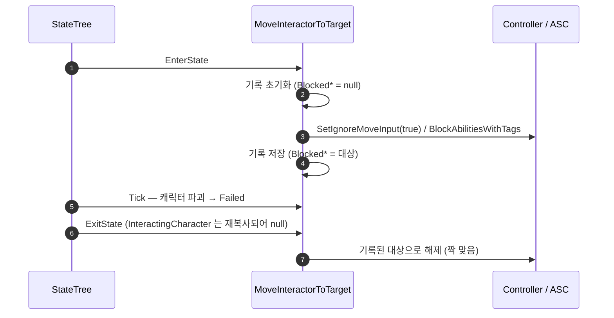

# MoveInteractorToTarget 입력 차단 해제 누락 수정

## 계획

### 목표
`/module-review WxWorld`가 유일한 🔴로 지적한 결함을 고친다. `FWxStateTreeTask_MoveInteractorToTarget`이 `EnterState`에서 건 입력 차단(`SetIgnoreMoveInput` · `BlockAbilitiesWithTags`, 둘 다 스택 카운터)을 `ExitState`가 해제하지 못하고 넘어가는 경로가 있어, 배선 이후 컨트롤러가 영구 잠길 수 있다.

원인은 해제 근거가 **바인딩 프로퍼티** `Instance.InteractingCharacter`라는 점이다. `bShouldCopyBoundPropertiesOnExitState`가 기본 `true`라 이 값은 `ExitState` 직전 바인딩 소스에서 재복사되므로 진입 시점 스냅샷이 아니다. 이동 중 캐릭터가 파괴되면(`Tick`이 `Failed` 반환) 또는 언포제스로 `IsLocallyControlled()`가 false가 되면 해제가 통째로 스킵된다. `SetIgnoreMoveInput`은 폰이 아니라 **Controller**에 걸린 카운터이고 ASC도 흔히 PlayerState에 살아, 리스폰 후에도 복구되지 않는다.

### 수정 범위
| 파일 | 수정할 내용 | 구분 |
|---|---|---|
| `Plugins/WxWorld/Source/WxWorld/Public/Gimmick/WxGimmickStateTreeNodes.h` | 전방 선언 `AController`·`UAbilitySystemComponent` 추가. 인스턴스 데이터에 런타임 약참조 필드 `BlockedController`·`BlockedAbilitySystem` 추가. 태스크 doc-comment의 해제 설명 갱신 | 수정 |
| `Plugins/WxWorld/Source/WxWorld/Private/Gimmick/WxGimmickStateTreeNodes.cpp` | `EnterState`에서 기록 초기화 + 차단 성공 시 대상 기록, `ExitState`가 그 기록으로만 해제하도록 교체, 관련 주석 갱신 | 수정 |

### 접근 방식
- **해제 근거를 바인딩 값에서 분리**: 차단을 실제로 건 대상(Controller·ASC) 자체를 인스턴스 데이터에 약참조로 남기고, `ExitState`는 그 기록만 본다. 바인딩 값의 재복사·캐릭터 소멸·언포제스와 무관하게 +1/-1이 짝을 이룬다.
- **별도 `bBlocked` 플래그 없음**: 포인터가 유효하다는 것이 곧 "여기에 걸었다"는 뜻이라 상태가 하나로 줄고 어긋날 여지가 없다.
- **런타임 필드 선례 재사용**: 같은 구조체의 `MoveSpeed`/`TurnSpeed`가 이미 `UPROPERTY()` 런타임 필드로 `EnterState`→`Tick` 값을 유지한다(바인딩 없는 필드는 `ExitState` 직전 재복사 대상이 아님). 새 필드도 동일 방식.
- **새 헬퍼 없음**: 호출부 인라인으로 충분하다.

### 범위 밖
같은 리뷰의 🟡·🟢(`EnablePlayerInput` 피어 공유 부작용, `bPlayOnRestore` 死파라미터, `bConsideredForCompletion` 미설정, README 스테일)는 포함하지 않는다.

---

## 완료

### 수정한 파일
| 파일 | 수정한 내용 | 구분 |
|---|---|---|
| `Plugins/WxWorld/Source/WxWorld/Public/Gimmick/WxGimmickStateTreeNodes.h` | `AController`·`UAbilitySystemComponent` 전방 선언 추가. 인스턴스 데이터에 런타임 약참조 `BlockedController`·`BlockedAbilitySystem` 추가. 태스크 doc-comment의 해제 설명을 기록 기반으로 갱신 | 수정 |
| `Plugins/WxWorld/Source/WxWorld/Private/Gimmick/WxGimmickStateTreeNodes.cpp` | `EnterState` 진입부에서 기록 초기화, 차단 성공 지점마다 대상 기록. `ExitState`가 `InteractingCharacter` 대신 기록만 근거로 해제 후 기록 비움. 관련 주석 교체 | 수정 |

### 구현·결정과 그 이유
- **해제 근거를 바인딩 값에서 분리**: `bShouldCopyBoundPropertiesOnExitState`가 기본 `true`라 `InteractingCharacter`는 `ExitState` 직전 재복사된다. 진입 시점의 차단 대상을 되짚을 수 없는 값이므로, 차단에 성공한 Controller·ASC 자체를 기록해 그 기록으로만 해제한다.
- **약참조(`TWeakObjectPtr`) 선택**: 강참조면 인스턴스 데이터가 죽은 컨트롤러·ASC를 붙잡아 수명을 왜곡한다. 대상이 이미 사라졌다면 해제할 카운터도 함께 사라진 것이라 스킵이 정답이다.
- **별도 `bBlocked` 플래그를 두지 않음**: 포인터 유효성 자체가 "여기에 걸었다"는 뜻이라 상태가 하나로 줄고, 플래그와 대상이 어긋날 여지가 없다.
- **기록 초기화를 조기 완료 검사보다 앞에 둠**: 초기/복원 진입과 대상 부재 경로는 차단 전에 완료하므로, 진입부에서 먼저 비워 두면 `ExitState`가 걸지 않은 차단을 해제하는 일이 구조적으로 불가능해진다.
- **새 헬퍼 함수를 만들지 않음**: 차단·해제가 각 호출부 3~4줄이라 인라인이 더 읽기 쉽고, 이 파일의 기존 스타일과도 맞는다.

### 계획 대비 달라진 점
- 계획대로.

### 후속 과제
- **런타임 검증 미완**: 이 태스크는 아직 휴면 경로다(어떤 기믹도 `SetInteractingCharacter`를 호출하지 않아 `InteractingCharacter`가 항상 null). 인게임 재현 경로가 없어 컴파일 검증까지만 했다. 기믹이 `SetInteractingCharacter`를 배선한 뒤, 이동 중 캐릭터를 죽여 리스폰 후 이동·어빌리티가 정상 복구되는지 확인해야 한다.
- **같은 리뷰의 🟡·🟢 미처리**: `EnablePlayerInput`의 피어 공유 부작용 및 이탈 시 복구 부재, `SpawnNiagara`의 `bPlayOnRestore` 死파라미터, 세 태스크의 `bConsideredForCompletion` 미설정, 스캐너 리네임 이후 스테일한 README. `Docs/Programmer/module_review_WxWorld.md` 참조.
