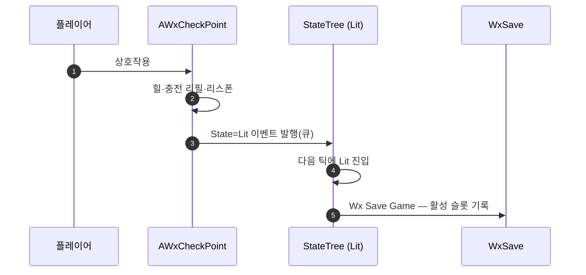

# 게임 저장 StateTreeTask 신설

## 계획

### 목표
체크포인트 오토세이브가 액터 C++ 에 박혀 있어 어느 상태에서 저장이 일어나는지 에셋만 봐선 알 수 없고 재사용도 불가하다. 저장을 StateTree 태스크로 만들어 ST_CheckPoint 의 Lit 상태가 자기 저장을 직접 선언하게 하고, 다른 기믹도 같은 노드를 재사용할 수 있게 한다.

### 수정 범위
| 파일 | 수정할 내용 | 구분 |
|---|---|---|
| `Plugins/WxSave/Source/WxSave/Public/WxSaveStateTreeNodes.h` | `FWxStateTreeTask_SaveGame` 선언 | 신규 |
| `Plugins/WxSave/Source/WxSave/Private/WxSaveStateTreeNodes.cpp` | 위 태스크 구현 | 신규 |
| `Plugins/WxSave/Source/WxSave/WxSave.Build.cs` | `StateTreeModule` 의존 추가 | 수정 |
| `Source/WxGame/WorldObject/WxCheckPoint.cpp` | 저장 호출·관련 include 제거 | 수정 |
| `Source/WxGame/WorldObject/WxCheckPoint.h` | 클래스 주석에 저장 책임 이관 반영 | 수정 |

### 접근 방식
- **배치**: WxSave 플러그인에 둔다. 저장은 WxSave 도메인 자체 기능이고, WxInventory 가 보상 지급 태스크를 자기 플러그인에 둔 선례와 동형이다.
- **태스크**: `FWxStateTreeTask_SaveGame`(DisplayName `Wx Save Game`). 인스턴스 데이터 없음 — 무인자 저장이 곧 "활성 슬롯에 그대로 기록"인 체크포인트 오토세이브 경로이고, 명명 슬롯은 UI 몫이다. EnterState 에서 1회 저장 후 완료하며 틱하지 않는다.
- **진입 구분**: 초기·복원 진입이면 스킵한다(보상 지급 태스크와 같은 판정). 막 로드한 세이브를 로드 직후 되쓰지 않게 한다.
- **권위**: 저장 파일은 서버가 소유하므로 권위 측에서만 실행하고 클라 진입은 노옵이다.
- **완료 구동 제외**: 체크포인트 Lit 은 머무는 정지 leaf 라, 즉시완료 태스크가 상태 완료를 구동하면 루트 재선택 루프에 빠진다. 사운드·Niagara 태스크와 같은 처리.
- **저장 시점**: 상태 이벤트는 큐에 들어가 다음 ST 틱에 처리되므로, 상호작용 핸들러의 힐·충전 리필·리스폰이 모두 끝난 뒤 저장이 실행된다. 기존 C++ 호출이 보장하던 "리셋된 월드 상태 + Lit State 를 저장" 순서가 유지된다.

---

## 완료

### 수정한 파일
| 파일 | 수정한 내용 | 구분 |
|---|---|---|
| `Plugins/WxSave/Source/WxSave/Public/WxStateTreeTask_SaveGame.h` | `FWxStateTreeTask_SaveGame` 선언 | 신규 |
| `Plugins/WxSave/Source/WxSave/Private/WxStateTreeTask_SaveGame.cpp` | 위 태스크 구현 | 신규 |
| `Plugins/WxSave/Source/WxSave/WxSave.Build.cs` | `StateTreeModule`·`GameplayTags` 의존 추가 | 수정 |
| `Plugins/WxSave/WxSave.uplugin` | `StateTree` 플러그인 의존 추가 | 수정 |
| `Source/WxGame/WorldObject/WxCheckPoint.cpp` | 저장 호출·include 제거, 저장 주체 주석 갱신 | 수정 |
| `Source/WxGame/WorldObject/WxCheckPoint.h` | 클래스 주석에 저장 책임 이관 반영 | 수정 |

### 구현·결정과 그 이유
- **WxSave 에 배치**: 저장은 이 도메인 자체 기능이라 소유가 명확하고, 보상 지급 태스크를 WxInventory 가 소유한 선례와 같은 모양이 된다.
- **파라미터 없음**: 슬롯을 노출하면 오토세이브가 아닌 임의 슬롯 기록이 가능해져 명명 슬롯을 소유한 UI 와 책임이 겹친다. 무인자 저장은 "활성 슬롯 덮어쓰기"로 의미가 하나뿐이다.
- **복원 진입 스킵**: 로드 직후 진입에서 저장하면 막 읽은 파일을 그 시점 라이브 상태로 되쓴다. 보상 지급과 동일한 판정을 쓰되 헬퍼를 공유하지 않고 인라인으로 뒀다 — WxWorld 의 파일 지역 헬퍼라 플러그인 경계를 넘지 못한다.
- **저장 호출을 라이브러리 경유**: 서브시스템 해석과 부재 경고가 이미 담겨 있어 태스크가 저장 트리거만 남긴다.
- **완료 판정 제외**: 체크포인트 Lit 은 머무는 정지 leaf 라, 즉시완료 태스크가 완료를 구동하면 루트 재선택이 반복된다.

### 계획 대비 달라진 점
- `GameplayTags` 모듈과 `StateTree` 플러그인 의존을 추가로 명시했다. 상위 의존을 통한 전이만으로는 링크가 되지 않아 첫 빌드가 실패했다.
- 파일명을 노드 이름과 같게 지었다. 노드 모음(`~StateTreeNodes`) 형태로 시작했으나 이 플러그인에 더 붙을 노드가 없어, 파일명이 곧 내용이 되는 편이 찾기 쉽다.

### 후속 과제
- ST_CheckPoint 의 Lit 상태에 `Wx Save Game` 태스크 배치(에디터 작업). 이미 켜진 체크포인트를 다시 켤 때도 저장하려면 Lit 재진입 전이가 필요하다.
- 배치 후 PIE 로 저장 1회 발생·복원 시 미발생 확인.
