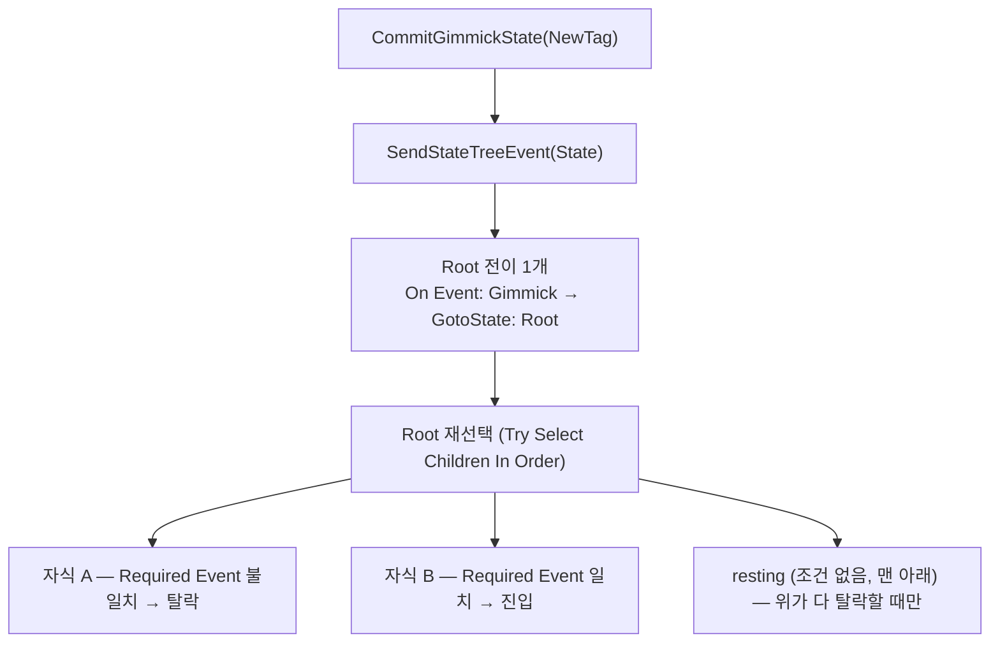

# 기믹 ST Root 전이 단일화

## 계획

### 목표
ST 에셋마다 Root에 상태 개수만큼 `On Event <상태태그> → GotoState <그 상태>` 전이를 거는 배선을, **전이 1개**(`On Event: Gimmick → GotoState: Root`)로 줄인다. 상태를 추가할 때 손댈 곳이 자식의 `Required Event to Enter` 한 군데로 준다.

이건 편의 개선이 아니라 **엔진 정통 형태로의 복귀**다. 엔진 테스트 `FStateTreeTest_StateRequiringEvent`(`StateTreeTest.cpp:882-971`)가 보여주듯, StateTree에서 전이는 목적지를 못박는 장치가 아니라 **재선택 방아쇠**이고(`:933` — 타깃이 `&Root`), 목적지를 고르는 주체는 `RequiredEventToEnter`를 가진 자식이며(`:899-927`), 조건 없는 fallback 상태는 맨 마지막에 둔다(`:930-932`). `RequiredEventToEnter`가 `StateTreeState.h:470-472`에서 `Category = "Enter Conditions"`로 분류된 것도 같은 의도다.

여러 상태 태그를 전이 하나로 받는 수단도 엔진이 이미 제공한다 — `FCompactEventDesc::DoesEventMatchDesc`(`StateTreeTypes.cpp:249-263`)의 `Event.Tag.MatchesTag(Tag)` 계층 매칭. 부모 태그 `Gimmick`을 걸면 `Gimmick.*` 전부가 걸리므로 별도 펄스 이벤트를 발명할 필요가 없다.

전제조건: 복원 마커 `Gimmick.Restore`가 상태 태그와 같은 부모 아래 있어 부모 태그 `Gimmick`이 "기믹 상태"만 뜻하지 않는다. 이 마커를 밖으로 옮긴다.

### 수정 범위
| 파일 | 수정할 내용 | 구분 |
|---|---|---|
| `Plugins/WxCore/Source/WxCore/Public/WxGameplayTags.h` | `Gimmick_Restore` → `StateTree_Restore`(`"StateTree.Restore"`)로 리네임 + 새 StateTree 섹션으로 이동. 부모 태그 `Gimmick` 명시 선언 추가 | 수정 |
| `Plugins/WxCore/Source/WxCore/Private/WxGameplayTags.cpp` | 위 선언에 대응하는 정의 갱신 | 수정 |
| `Plugins/WxWorld/.../Private/Gimmick/WxGimmick.cpp` | 마커 발행부 태그 치환 (`:141`) | 수정 |
| `Plugins/WxWorld/.../Private/Gimmick/WxGimmickStateTreeNodes.cpp` | `IsInitialOrRestoreEntry` 태그 치환 (`:72`) | 수정 |
| `Plugins/WxInventory/.../Private/Inventory/WxRewardStateTreeNodes.cpp` | 복원 판정 태그 치환 (`:21`) | 수정 |
| `Plugins/WxSave/.../Private/WxStateTreeTask_SaveGame.cpp` | 복원 판정 태그 치환 (`:24`) | 수정 |
| `Docs/Programmer/Gimmick_State_Authority.md` | 규칙 2를 재선택 패턴으로 재작성, mermaid·검증불가계약·참조표의 마커명 갱신 | 수정 |
| `Plugins/WxWorld/README.md` | 태그 어휘 문장(`:36`)·새 기믹 추가 규약(`:39`) | 수정 |
| `Plugins/WxCore/README.md` | `Gimmick.Restore` 언급을 새 이름으로 | 수정 |
| `Content/WorldObject/Gimmick/ST_*.uasset` (8개) | Root 전이 N개 → 1개, resting 상태를 자식 중 맨 아래로 | **사용자가 에디터에서** |

### 접근 방식
- **C++ 변경은 태그 리네임 하나뿐**: `SendGimmickStateEvent` 등 구동 로직은 손대지 않는다. 이미 상태 태그를 ST 이벤트로 보내고 있고, 그게 엔진 패턴이 요구하는 신호 그대로다.
- **마커 이름 `StateTree.Restore`**: 정체(ST 이벤트)를 드러내고 도메인 중립적이며, ASC 게임플레이 이벤트 전용인 `Event.*`와 섞이지 않는다. 네이티브 태그 + ST 에셋 참조 0건(8개 에셋 바이너리 스캔으로 확인)이라 리다이렉터 없이 기계적 리네임으로 끝난다.
- **부모 태그 `Gimmick` 명시 선언**: 자식들이 부모 노드를 암묵 생성하지만, 이제 이 태그는 ST Root 전이가 직접 참조하는 계약면이므로 선언과 주석으로 못박는다.
- **새 규칙 하나 — resting은 맨 아래**: 지금까지는 전이가 목적지를 못박아 자식 순서가 무의미했으나, 재선택 방식에서는 순서가 곧 우선순위다. 조건 없는 resting 상태가 위에 있으면 항상 먼저 선택된다.

---

## 완료

### 수정한 파일
| 파일 | 수정한 내용 | 구분 |
|---|---|---|
| `Plugins/WxCore/.../Public/WxGameplayTags.h` | `Gimmick_Restore` → `StateTree_Restore`로 리네임 후 새 StateTree 섹션으로 이동. 부모 태그 `Gimmick` 명시 선언 + Gimmick 섹션 주석에 "이 계층엔 상태만" 계약 명문화 | 수정 |
| `Plugins/WxCore/.../Private/WxGameplayTags.cpp` | 대응 정의 (`"StateTree.Restore"`, `"Gimmick"`) | 수정 |
| `WxGimmick.cpp:141` · `WxGimmickStateTreeNodes.cpp:72` · `WxRewardStateTreeNodes.cpp:21` · `WxStateTreeTask_SaveGame.cpp:24` | 마커 태그 참조 치환 | 수정 |
| `WxGimmick.h` | 상태 구동 패턴 doc-comment에 재선택 배선(Root 전이 1개)과 resting 순서 규칙 추가, 마커명 갱신 | 수정 |
| `WxDoor.h` · `WxTreasureChest.h` · `WxSpawnConsole.h` · `WxAlarmConsole.h` | 마커명 갱신, Door는 재선택 서술로 보강 | 수정 |
| `Docs/Programmer/Gimmick_State_Authority.md` | 규칙 2를 재선택 패턴으로 재작성(Root 전이 1개·자식 자가 필터·resting 마지막·엔진 근거), mermaid에 전이 단계 추가, 검증불가계약·크로스모듈·참조표 갱신 | 수정 |
| `Plugins/WxWorld/README.md` · `Plugins/WxCore/README.md` | 태그 어휘와 ST 배선 규약 갱신 | 수정 |

### 구현·결정과 그 이유
- **구동 로직 무변경**: `SendGimmickStateEvent`는 손대지 않았다. 이미 상태 태그를 ST 이벤트로 보내고 있고 그게 엔진 패턴이 요구하는 신호 그대로다. 전용 펄스 이벤트를 새로 만드는 안도 검토했으나, 엔진 테스트가 트리거 태그와 자식 요구 태그를 같은 것으로 쓰고 태그 계층 매칭(`DoesEventMatchDesc`)이 이미 "태그 패밀리 하나로 받기"를 지원하므로 발명이 불필요하다고 판단했다.
- **마커 이름 `StateTree.Restore`**: 정체(ST 이벤트)를 드러내고 도메인 중립적이다. `Event.*`는 이 코드베이스에서 ASC 게임플레이 이벤트 전용이라 섞지 않았다. 상태 태그 17개를 `Gimmick.State.*`로 내리는 대안은 ST 에셋 8개가 상태 태그를 참조해 리다이렉터가 필요하지만, 마커 1개 이동은 에셋 참조 0건이라 리다이렉터 없이 끝난다 — 17:1의 비용 차이로 후자를 택했다.
- **부모 태그 `Gimmick` 명시 선언**: 자식들이 부모 노드를 암묵 생성하므로 기능상 불필요하지만, 이제 이 태그가 ST Root 전이가 직접 참조하는 계약면이 되었으므로 선언과 doc-comment로 못박아 "여기엔 상태만 둔다"는 규칙이 코드에 남게 했다.
- **문서를 계약 변경으로 취급**: 배선 지점이 둘(자식 Required Event + Root 전이)에서 하나로 줄고 대신 resting 순서 규칙이 생겼다. 침묵 실패 표면이 바뀌는 변경이라 `Gimmick_State_Authority.md`의 규칙 2와 「검증 불가능한 계약」을 함께 다시 썼다.

### 계획 대비 달라진 점
- 계획에 없던 주석 정리가 추가됐다. 마커명이 doc-comment에 박혀 있는 곳이 C++ 9군데(기믹 헤더 5·노드 cpp 3·베이스 2)라 함께 갱신했다. `WxGimmick.h`·`WxDoor.h`는 단순 치환이 아니라 재선택 패턴 서술로 보강했다 — 이 두 헤더가 패턴을 설명하는 자리라서다.

### 후속 과제
- **에셋 8개 편집 미완 (사용자)**: `Content/WorldObject/Gimmick/ST_*.uasset` 각각에서 ① Root의 기존 `On Event <상태태그> → GotoState <그 상태>` 전이 전부 삭제 ② `On Event: Gimmick → GotoState: Root` 전이 하나만 추가 ③ resting 상태를 Root 자식 중 맨 아래로 이동. 자식의 `Required Event to Enter`는 수정 불필요. `ST_Door` 하나만 먼저 바꿔 확인 후 확장 권장.
- **`ST_Door` 완료 (2026-07-25, unreal-mcp 직접 편집)**: Root 전이 2개(`Gimmick.Door.Open`→Open, `Gimmick.Door.Close`→Close) → 1개(`OnEvent: Gimmick → GotoState: Root`)로 교체하고 저장. **발견**: 이 에셋의 자식 필터는 `RequiredEventToEnter`가 아니라 `WxStateTreeCondition_GimmickStateIs` **진입 조건**이었다(Open=`GimmickStateIs(Gimmick.Door.Open)`, Close=`GimmickStateIs(Gimmick.Door.Close)`). 두 조건이 상호 배타적이라 (a) 자식 진입조건은 이미 재선택 필터로 동작하므로 추가 배선 불필요, (b) Close가 무조건 resting이 아니라 조건부라 **자식 순서 이동도 불필요**했다 — ST_Door의 실제 편집은 전이 교체 하나로 끝. 계획의 "resting 맨 아래" 규칙은 *무조건 resting*을 전제한 것이니, 나머지 7개도 자식이 `GimmickStateIs` 조건을 갖는지(→순서 무관) vs 무조건 resting인지(→순서 이동 필요)를 에셋별로 확인해야 한다.
- **`ST_Door` 컴파일 확인 필요 (사용자)**: unreal-mcp의 `set_properties`는 StateTree 에디터의 자동 컴파일을 우회한다. 편집 당시 에디터에 ST_Door가 열려 있었고 F7로 컴파일을 시도했으나 dirty 반영이 확인되지 않았다. **열린 ST_Door 에디터에서 Compile 버튼을 눌러 재컴파일 후 저장**해야 런타임(베이크)에 반영된다. 그 뒤 PIE로 문 토글·세이브/로드 복원 검증. (이후 사용자가 컴파일·PIE로 "잘 됨" 확인.)
- **`ST_Door` 이벤트 방식으로 재전환 (2026-07-25, 사용자 요청)**: 엘리베이터와 통일하기 위해 GimmickStateIs 진입조건 → RequiredEventToEnter로 교체. Open에 `RequiredEventToEnter=Gimmick.Door.Open` 추가하고 두 자식의 `GimmickStateIs` 진입조건 제거, Close(기본값 `Gimmick.Door.Close`)를 무조건 fallback으로 두고 자식 순서 `[Open, Close]`로 이동, Root 전이 `bConsumeEventOnSelect` true→false. 이로써 문·엘리베이터가 동일 패턴(비-resting=RequiredEventToEnter, resting=무조건 fallback+맨 아래, 전이=이벤트 비소비)으로 수렴. 컴파일·PIE 재검증 필요(사용자).
- **나머지 6개 완료 (2026-07-25, unreal-mcp 직접 편집) — 8개 전부 이벤트 패턴으로 통일**: 각 에셋 기본 State(resting)를 C++ 생성자에서 확인해 적용. 기본값: TreasureChest=`Closed`, AlarmConsole=`Idle`, SpawnConsole=`Idle`, CutsceneTrigger=`Idle`, LaserCorridor=`Active`, CheckPoint=`Unlit`. (AWxLaserCorridor·AWxCheckPoint는 WxWorld가 아니라 **WxGame**(`Source/WxGame/WorldObject/`) 소속.)
  - **무필터 5개(TreasureChest·AlarmConsole·SpawnConsole·CutsceneTrigger·LaserCorridor)**: 엘리베이터처럼 진입조건·RequiredEventToEnter 둘 다 없이 pinning 전이에만 의존. → 비-resting에 `RequiredEventToEnter=그 태그` 추가, resting을 자식 맨 아래로(TreasureChest는 이미 Closed가 마지막이라 순서 유지, 나머지 4개는 뒤집음), Root 전이 2→1(`Gimmick→Root`, consume=false).
  - **CheckPoint(특수)**: 문처럼 `GimmickStateIs` 진입조건을 갖되 **Root 전이가 0개**였다(재선택 트리거가 없어 라이브 상호작용 시 Unlit→Lit 비주얼이 안 바뀌고 리로드 후에야 반영됐을 가능성 — 이번에 전이를 넣어 해소). Lit에 `RequiredEventToEnter=Gimmick.CheckPoint.Lit` 추가+두 자식 GimmickStateIs 제거, Unlit(이미 마지막)은 무조건 fallback, Root 전이 **신규 추가**(0→1). **부수 확인**: unreal-mcp `set_properties`는 struct 배열 **성장(0→1)도 가능**했다(과거 "배열증가 불가" 메모는 Niagara Custom입력 한정). 단 축소+값변경 동시는 여전히 불가 → 전이 교체는 "먼저 첫 원소만 남기고 축소 → 남은 1개 수정" 2단계로 처리.
  - **컴파일·PIE 검증 미완(사용자)**: 6개 모두 MCP 편집이 자동 컴파일을 우회하므로 각 에디터에서 Compile 후 저장 필요. `bConsumeEventOnSelect=false`의 이벤트 전달은 각 기믹 라이브 전이(상자 열기·경보·스폰·컷신 진입·레이저 비활성·체크포인트 점등)에서 확인.
- **`ST_Elevator` 완료 (2026-07-25, unreal-mcp 직접 편집, 사용자 승인)**: 문과 **다른 구조**였다 — 3개 leaf(Closed/Location A/Location B)에 **필터가 전혀 없이**(진입조건도 RequiredEventToEnter도 없음) Root 전이 고정에만 의존. 게다가 Location A/B는 하위 5개 서브상태로 "문 닫기→이동→문 열기" 안무를 도는 컨테이너다. `WxElevator.h`가 명시한 설계("각 leaf의 Required Event to Enter = 그 State 태그")와 `WxGimmick::BeginPlay`의 타이밍(초기 선택은 이벤트 발행 *전*, 기본 상태는 이벤트 없이 선택)을 근거로 **RequiredEventToEnter 방식**을 사용자 승인 후 택했다. 편집: ① Location A에 `RequiredEventToEnter=Gimmick.Elevator.AtStart`, Location B에 `=Gimmick.Elevator.AtEnd` 추가 ② Closed는 무조건 fallback으로 두고 **자식 순서 맨 아래로 이동**(Closed가 위에 있으면 재선택 때 항상 먼저 잡힘) ③ Root 전이 2개 → 1개(`OnEvent: Gimmick → Root`). **핵심 결정 — 전이의 `bConsumeEventOnSelect=false`**: 재선택 시 트리거 이벤트가 자식의 RequiredEventToEnter까지 살아남아야 하므로 소비하지 않게 했다(문은 GimmickStateIs라 이 값 무관이었지만 여기선 이벤트 전달이 필수). 하위 안무 5개는 손대지 않음. → **문과 결론이 갈림**: 필터 없는 시퀀스 기믹은 RequiredEventToEnter를 새로 넣고 resting을 맨 아래로 옮겨야 한다.
- **`ST_Elevator` 컴파일 확인 필요 (사용자)**: ST_Door와 동일하게 MCP 편집이 자동 컴파일을 우회. 열린 ST_Elevator 에디터에서 **Compile 후 저장** 필요. PIE 검증 항목 — 콜드 스타트 시 Closed 진입(이벤트 없이 fallback), CallConsoleA/B·플랫폼 토글로 AtStart↔AtEnd 순차 이동(닫기→이동→열기 안무), 세이브/로드 시 저장된 위치로 스냅 복원(FX 재생 없음), PIE 2인 클라 추종. **특히 `bConsumeEventOnSelect=false`가 재선택에서 이벤트를 자식에 전달하는지**를 라이브 이동으로 확인(안 되면 Location A/B 진입 실패로 드러남).
- **런타임 검증 미완**: C++ 변경은 태그 리네임뿐이라 빌드로 충분하지만, 재선택 패턴 자체는 에셋 편집 후에야 검증된다. 확인 항목 — Door/TreasureChest 토글, Elevator 순차 진행, CutsceneTrigger 종료 후 Idle 복귀, 세이브/로드 시 보상 재지급·재스폰·FX 재생 없음(`StateTree.Restore` 경로), PIE 2인 클라 추종.
- **에디터 태그 피커 확인**: 새로 명시 선언한 `Gimmick` 부모 태그가 전이의 Tag 드롭다운에 노출되는지 첫 에셋 편집 때 함께 확인.
- `Docs/Programmer/module_review_WxWorld.md`가 이 변경으로 stale 상태가 된다(다음 `/module-review WxWorld` 실행 시 자동 갱신).
- **(보류) 태그 피커 노출 정리**: UE에는 태그 단위 숨김 기능이 없고 필터는 프로퍼티 단위 `meta=(Categories=...)` 뿐이다. 우리 쪽 유일한 디자이너용 피커(`FWxStateTreeCondition_GimmickStateIs::State`, `Categories="Gimmick"`)에서는 이번 리네임으로 `StateTree.Restore`가 이미 사라졌다. 남은 노출은 ① 엔진 ST 피커(`RequiredEvent.Tag`·`RequiredEventToEnter.Tag` — 엔진 프로퍼티라 필터 불가, `UE_DEFINE_GAMEPLAY_TAG_COMMENT` 툴팁 경고가 유일한 수단) ② 필터가 빠진 우리 프로퍼티 3곳(`WxAnimNotify_SendGameplayEvent::EventTag`, `WxBGMSourceComponent::MusicTag`·`ActivationTag`). 필요해지면 착수.
