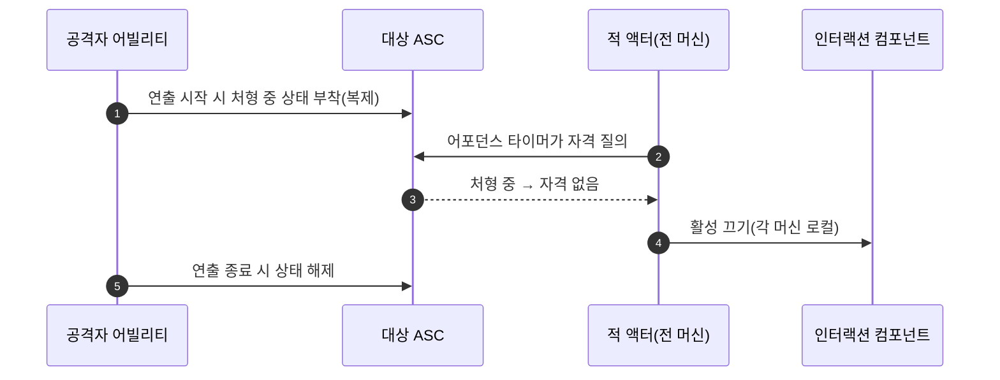

# 상호작용 계약 역할 경계 정리

## 계획

### 목표

`IWxInteractable`(WxCore)과 `UWxInteractionComponent`(WxWorld)의 역할 구분이 모호하다는 지적에서 출발했다. 경계 자체(컴포넌트=어디·여부·강조 / 액터=무엇·문구)는 깨져 있지 않았고, 모호함의 원인은 컴포넌트가 메시를 가리키는 포인터를 둘 들고 있는 것, 아무도 쓰지 않는 프롬프트 `Source` 파라미터, 불필요한 활성 상태 복제 셋이었다. 컴포넌트를 없애는 게 아니라 존재 이유를 "이 메시가 상호작용 영역이고 그 영역의 활성·강조 상태를 소유한다" 한 문장으로 만드는 것이 목표다.

### 수정 범위

| 파일 | 수정할 내용 | 구분 |
|---|---|---|
| `Plugins/WxWorld/.../Interaction/WxInteractionComponent.{h,cpp}` | `CollisionVolume`+`HighlightTarget`을 `TargetMesh` 하나로 통합, 사용되지 않는 `GetCollisionVolume` 삭제, `FindByCollisionVolume`→`FindByTargetMesh`, `bInteractionEnabled` 복제·OnRep 제거 | 수정 |
| `Plugins/WxWorld/.../Interaction/WxInteractionRegistryComponent.cpp` | 역참조 호출명 갱신, 프롬프트 호출에서 인자 제거 | 수정 |
| `Plugins/WxCore/.../WxInteractable.h` | `GetInteractionPrompt`에서 `Source` 파라미터 제거(`OnInteracted`는 유지) | 수정 |
| `Plugins/WxWorld/.../Gimmick/Wx{AlarmConsole,CutsceneTrigger,Door,SpawnConsole,TreasureChest}.cpp` | 자동 채택으로 불필요해진 하이라이트 지정 줄 삭제 | 수정 |
| `Plugins/WxWorld/.../Gimmick/WxElevator.cpp` | 콜콘솔 두 줄 삭제, 플랫폼만 `SetTargetMesh`로 유지 | 수정 |
| `Plugins/WxWorld/.../Gimmick/WxGimmick.{h,cpp}` | 프롬프트 시그니처 갱신 | 수정 |
| `Plugins/WxInventory/.../Items/WxItemPickup.{h,cpp}` | 프롬프트 시그니처 갱신 | 수정 |
| `Plugins/WxCombat/.../Ability/WxAbility_Finisher.cpp` | 연출 동안 대상 ASC에 `State.Finisher`를 복제 루즈 태그로 부착·해제 | 수정 |
| `Source/WxGame/Character/WxEnemyCharacter.{h,cpp}` | `bFinisherTriggered` 멤버 제거, 자격 판정에 처형 중 검사 추가, 어포던스 타이머를 전 머신 구동으로 전환 | 수정 |
| `Source/WxGame/WorldObject/Wx{CheckPoint,LaserCorridor}.cpp` | 하이라이트 지정 줄 삭제 | 수정 |
| `Docs/Programmer/Interaction_System.md` | 현행화 + 역할 경계 규칙 명시 | 수정 |

### 접근 방식

- **영역의 정체성을 하나로**: 배선 10곳을 전수 확인한 결과 콜리전 볼륨과 하이라이트 대상이 예외 없이 같은 메시였다. 둘을 `TargetMesh` 하나로 합치면 "볼륨은 부착 부모 자동 채택, 하이라이트는 명시 필수"라는 비대칭이 사라지고, 부착 부모가 곧 대상 메시인 9곳은 지정 줄 자체가 없어진다. 부착 부모가 메시가 아닌 엘리베이터 플랫폼만 명시가 남는다.

- **당기지 않는 훅 제거**: 프롬프트의 `Source`는 구현 3곳이 전부 무시한다. 영역별 문구가 실제로 필요해지면 그때 컴포넌트의 편집 필드로 내린다. 픽업의 동적 프롬프트와 두 소스가 되지 않도록 지금은 액터 pull 단일 경로를 유지한다.

- **복제 대신 파생**: 처형 자격의 판정 입력(HP·그로기·전투 상태·트랜스폼)은 전부 이미 복제된다. 복제에 묶여 있던 유일한 이유는 서버 전용 멤버 플래그였으므로, 연출 진행 상태를 공격자 어빌리티가 대상에게 직접 발행하게 바꾼다. 그러면 각 머신이 로컬로 같은 답에 수렴해 활성 상태 복제가 통째로 불필요해지고, 각 클라가 자기 로컬 플레이어 기준으로 평가하게 되어 플레이어별 노출 부정합도 함께 풀린다. 판정을 자격 함수 한 곳에 모으므로 노출뿐 아니라 발동 검증까지 같은 규칙이 덮는다.

- **컴포넌트 복제 자체는 존치**: 상호작용 RPC가 컴포넌트 포인터를 실어 보내므로 net-addressable해야 한다. 제거 대상은 활성 상태 프로퍼티지 컴포넌트의 복제 설정이 아니다.

---

## 완료

### 수정한 파일
| 파일 | 수정한 내용 | 구분 |
|---|---|---|
| `Plugins/WxWorld/.../Interaction/WxInteractionComponent.{h,cpp}` | 두 포인터를 `TargetMesh` 하나로 통합, 미사용 게터 삭제, 역참조 함수 개명, 활성 상태 복제·OnRep·복제 프로퍼티 등록 제거(컴포넌트 복제 설정 자체는 존치) | 수정 |
| `Plugins/WxWorld/.../Interaction/WxInteractionRegistryComponent.cpp` | 역참조 호출명 갱신, 프롬프트 호출 인자 제거 | 수정 |
| `Plugins/WxCore/.../WxInteractable.h` | 프롬프트에서 `Source` 파라미터 제거 | 수정 |
| `Plugins/WxWorld/.../Gimmick/Wx{AlarmConsole,CutsceneTrigger,Door,SpawnConsole,TreasureChest}.cpp` | 하이라이트 지정 줄 삭제(자동 채택) | 수정 |
| `Plugins/WxWorld/.../Gimmick/WxElevator.cpp` | 콜콘솔 두 줄 삭제, 플랫폼만 `SetTargetMesh` 한 줄로 축약 | 수정 |
| `Plugins/WxWorld/.../Gimmick/WxGimmick.{h,cpp}` | 프롬프트 시그니처 갱신 | 수정 |
| `Plugins/WxInventory/.../Items/WxItemPickup.{h,cpp}` | 프롬프트 시그니처 갱신 | 수정 |
| `Plugins/WxCombat/.../Ability/WxAbility_Finisher.cpp` | 연출 동안 대상 ASC에 `State.Finisher` 복제 루즈 태그 부착·해제, 종료 시 대상 참조 정리 | 수정 |
| `Source/WxGame/Character/WxEnemyCharacter.{h,cpp}` | 래치 멤버 제거, 자격 판정에 연출 중 검사 추가, 어포던스 타이머를 전 머신 구동으로 전환, 사망 시 타이머 해제를 권위 가드 바깥으로 이동 | 수정 |
| `Source/WxGame/Controller/WxPlayerController.cpp` | 선택 뷰모델 푸시의 프롬프트 호출 인자 제거 | 수정 |
| `Source/WxGame/WorldObject/Wx{CheckPoint,LaserCorridor}.cpp` | 하이라이트 지정 줄 삭제 | 수정 |
| `Docs/Programmer/Interaction_System.md` | 현행화(스캐너 주체·채널 쿼리·ServerOnly 실행·위젯 입력) + 역할 경계 규칙 명시 | 수정 |

### 구현·결정과 그 이유

- **하이라이트 대상과 쿼리 볼륨의 통합**: 배선 10곳 전수 조사에서 둘이 언제나 같은 메시였다. 합치니 부착 부모가 곧 대상인 9곳은 지정 자체가 사라지고, 부착 부모가 메시가 아닌 엘리베이터 플랫폼만 명시가 남았다. 컴포넌트가 "이 메시가 내 영역"이라는 한 문장으로 읽힌다.

- **프롬프트 파라미터 제거**: 다중 영역이 영역별 문구를 내라고 열어둔 훅인데 구현 셋이 전부 무시했다. 쓰지 않는 확장점은 경계를 흐리기만 하므로 걷어냈다. 실제로 필요해지면 영역의 속성이니 컴포넌트로 내리는 게 맞고, 그때 픽업의 동적 문구와 두 갈래가 되지 않도록 설계하면 된다.

- **복제 대신 파생**: 처형 자격의 판정 입력이 이미 전부 복제되므로 활성 상태를 따로 복제할 이유가 없었다. 유일한 걸림돌이던 서버 전용 래치를, 연출을 아는 주체인 공격자 어빌리티가 대상에게 직접 상태를 발행하는 방식으로 바꿔 없앴다. 피격 상태에서 파생시키는 대안도 검토했으나, 공격자와 피해자의 몽타주 길이가 달라 연출 중간에 자격이 되살아나는 구멍이 있어 기각했다.

- **판정을 자격 함수 한 곳으로**: 연출 중 검사를 노출 경로가 아니라 자격 함수에 넣었다. 노출과 발동 검증이 같은 함수를 지나므로 규칙이 하나가 되고, 기존 래치가 덮지 못하던 다른 플레이어의 중복 발동까지 함께 막힌다.

- **컴포넌트 복제 설정 존치**: 상호작용 RPC가 컴포넌트 포인터를 실어 보내므로 net-addressable해야 한다. 제거 대상은 활성 상태 프로퍼티지 복제 설정이 아니다.

### 계획 대비 달라진 점
- 계획에 없던 두 곳을 추가로 고쳤다. 프롬프트 호출부가 레지스트리 외에 선택 뷰모델 푸시 경로에도 있었고, 문서가 이번 변경뿐 아니라 이전 네댓 커밋만큼 뒤처져 있어 스캐너 주체·채널 쿼리 방식·실행 정책·입력 경로까지 함께 현행화했다.

### 후속 과제
- 멀티플레이 실기 확인 미완: 처형 연출 중 제3의 플레이어에게 프롬프트가 재노출되지 않는지, 어포던스 로컬 평가가 각 클라에서 올바른지는 PIE 다중 클라로 봐야 한다.
- 데디 서버에서 서버 측 어포던스 평가가 player0 기준이라는 기존 한계는 그대로다. 발동 검증이 실제 instigator를 쓰므로 실동작에는 영향이 없지만, 서버 측 활성 게이트는 여전히 성긴 판정이다.
