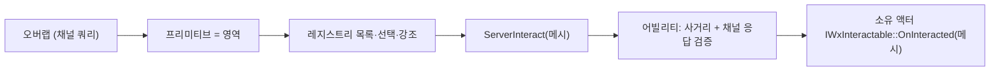

# 인터랙션 컴포넌트 제거 — 영역 = 메시 그 자체

## 계획

### 목표

`UWxInteractionComponent`를 없애고 대상 메시가 영역 역할을 직접 맡게 한다. 직전 작업으로 컴포넌트에 남은 것이 "메시 포인터 + 활성 bool + 강조 게이트"뿐이었는데, 활성 여부는 메시의 채널 응답 자체로 표현되고 강조 게이트는 엘리베이터 바닥 예외가 없어지며 소멸한다. 결과적으로 간접층 하나와 역참조 하나가 사라진다.

### 수정 범위

| 파일 | 수정할 내용 | 구분 |
|---|---|---|
| `Plugins/WxWorld/.../Interaction/WxInteractionComponent.{h,cpp}` | 전체 삭제 | 삭제 |
| `Plugins/WxWorld/.../Interaction/WxInteractionRegistryComponent.{h,cpp}` | 보관·선택·RPC 타입을 프리미티브로 교체, 역참조 제거, 강조를 직접 기록, 스텐실 값 승격 | 수정 |
| `Plugins/WxWorld/.../Gimmick/WxGimmickStateTreeNodes.{h,cpp}` | 인터랙션 토글 태스크가 메시를 받아 채널 응답만 토글, 강조 게이트 파라미터 삭제 | 수정 |
| `Plugins/WxWorld/.../Gimmick/Wx{AlarmConsole,CutsceneTrigger,Door,SpawnConsole,TreasureChest,Elevator}.{h,cpp}` | 컴포넌트 제거, 생성자에서 메시 표식, ST 바인딩용 메타 이관 | 수정 |
| `Plugins/WxCore/.../WxInteractable.h` | `Source` 인자의 의미를 대상 메시로 주석 갱신(시그니처 불변) | 수정 |
| `Plugins/WxInventory/.../Items/WxItemPickup.{h,cpp}` | 생성자에서 자기 메시 표식, BP 컴포넌트 추가 제약 주석 정리 | 수정 |
| `Source/WxGame/AbilitySystem/Ability/WxAbility_Interact.{h,cpp}` | 사거리 + 활성 검증 후 대상 인터페이스를 직접 호출 | 수정 |
| `Source/WxGame/Character/WxEnemyCharacter.{h,cpp}` | 컴포넌트 제거, 캐릭터 메시를 대상으로 어포던스 토글 | 수정 |
| `Source/WxGame/Controller/WxPlayerController.cpp` | 선택 게터명 갱신 | 수정 |
| `Source/WxGame/WorldObject/Wx{CheckPoint,LaserCorridor}.{h,cpp}` | 컴포넌트 제거, 생성자에서 메시 표식 | 수정 |
| `Docs/Programmer/Interaction_System.md` | 새 구조 반영 | 수정 |

### 접근 방식

- **활성 상태를 저장하지 않는다**: 메시의 `ECC_WxInteractable` 채널 응답이 곧 활성 여부다. 켜면 스캔에 잡히고 끄면 탈락하므로, 별도 bool과 그것을 담을 객체가 동시에 불필요해진다.

- **스캔 결과가 곧 영역**: 오버랩이 반환하는 프리미티브를 그대로 후보로 쓴다. 컴포넌트를 찾아 되짚던 정적 역참조가 통째로 사라진다.

- **강조의 단일 기록자**: 선택을 소유한 레지스트리만 외곽선을 쓴다. 지금은 레지스트리와 컴포넌트 비활성 경로 둘이 쓰는데, 후자를 버리는 대가로 선택 중인 영역이 꺼질 때 최대 한 스캔 주기만큼 외곽선이 남는다. 경계가 선명해지는 편을 택한다.

- **인터페이스는 건드리지 않는다**: 프리미티브도 액터 컴포넌트이므로 `Source` 인자 타입을 그대로 두면 구현 열한 곳을 손대지 않아도 된다. 엘리베이터의 영역 분기는 자연히 메시 비교가 된다.

- **RPC 주소 지정 근거**: 컴포넌트 참조는 복제 여부가 아니라 이름 안정성으로도 지원된다. C++ 생성자가 만든 서브오브젝트는 후자를 만족하므로, 보낼 대상을 메시로 바꾸면 지금 픽업 때문에 필요했던 복제 설정 자체가 불필요해진다.

---

## 완료

### 수정한 파일
| 파일 | 수정한 내용 | 구분 |
|---|---|---|
| `Plugins/WxWorld/.../Interaction/WxInteractionComponent.{h,cpp}` | 전체 삭제 | 삭제 |
| `Plugins/WxWorld/.../Interaction/WxInteractionRegistryComponent.{h,cpp}` | 보관·선택·RPC를 프리미티브 기준으로 전환, 역참조 제거, 외곽선을 직접 기록, 스텐실 값을 레지스트리 설정으로 승격 | 수정 |
| `Plugins/WxWorld/.../Gimmick/WxGimmickStateTreeNodes.{h,cpp}` | 토글 태스크가 메시를 받아 채널 응답만 바꾸도록 축약, 강조 게이트 파라미터 삭제 | 수정 |
| `Plugins/WxWorld/.../Gimmick/Wx{AlarmConsole,CutsceneTrigger,Door,SpawnConsole,TreasureChest,Elevator}.{h,cpp}` | 컴포넌트 제거, 생성자에서 메시 표식, ST 바인딩용 메타를 메시로 이관 | 수정 |
| `Plugins/WxCore/.../WxInteractable.h` | `Source`를 const로 좁히고 의미를 대상 메시로 갱신 | 수정 |
| `Plugins/WxCore/.../WxCollisionChannels.h` | 채널 주석을 새 구조로 갱신 | 수정 |
| `Plugins/WxInventory/.../Items/WxItemPickup.{h,cpp}` | 생성자에서 자기 메시 표식, 쿼리 콜리전 활성화, BP 컴포넌트 제약 주석 정리 | 수정 |
| `Plugins/WxCombat/.../Ability/WxAbility_Finisher.cpp` | 대상 const_cast의 근거 주석 추가 | 수정 |
| `Source/WxGame/AbilitySystem/Ability/WxAbility_Interact.{h,cpp}` | 사거리·활성 검증 후 대상 인터페이스를 직접 호출, const_cast 제거 | 수정 |
| `Source/WxGame/Character/WxEnemyCharacter.{h,cpp}` | 컴포넌트 제거, 캐릭터 메시 채널 응답으로 어포던스 토글 | 수정 |
| `Source/WxGame/Controller/WxPlayerController.cpp` | 선택 게터명·타입 갱신 | 수정 |
| `Source/WxGame/WorldObject/Wx{CheckPoint,LaserCorridor}.{h,cpp}` | 컴포넌트 제거, 생성자에서 메시 표식 | 수정 |
| `Docs/Programmer/Interaction_System.md`, `Docs/Programmer/Gimmick_State_Authority.md`, `Plugins/WxWorld/README.md` | 새 구조 반영 | 수정 |

### 구현·결정과 그 이유

- **활성 상태를 저장하지 않는다**: 메시의 채널 응답 자체가 활성 여부라 담을 객체가 필요 없어졌다. 컴포넌트가 대표하던 것이 전부 메시로 흡수되면서 영역을 가리키는 간접층과 스캔 결과를 되짚던 역참조가 함께 사라졌다.

- **외곽선의 단일 기록자**: 선택을 소유한 레지스트리만 외곽선을 쓴다. 비활성화 즉시 끄던 경로를 버려 최대 한 스캔 주기의 잔상이 생기지만, 쓰는 주체가 하나로 줄어 경계가 선명해지는 편을 택했다.

- **인터페이스 인자를 const로**: 실행 경로가 선택 메시를 읽기만 하는데 인자가 비const라서 캐스트가 필요했다. 인자를 좁히니 캐스트가 사라지고, 응답 핸들러가 영역을 건드리지 않는다는 계약도 타입으로 드러났다.

- **처형 쪽 캐스트는 유지**: 엔진이 이벤트 페이로드의 대상을 const로 들고 있는 반면 소비처(이벤트 송출·ASC 조회)는 비const를 요구한다. 처형은 대상에 실제로 태그·효과를 적용하므로 비const가 옳고, 상호작용 쪽처럼 소비처 시그니처를 우리가 좁힐 수 없어 근거만 주석으로 남겼다.

- **RPC 주소 지정 근거 확인**: 컴포넌트 참조는 복제 여부가 아니라 이름 안정성으로도 지원된다는 것을 엔진 소스에서 확인했다. 보낼 대상이 전부 C++ 생성자 서브오브젝트인 메시가 되므로, 지금까지 픽업의 BP 추가 컴포넌트 때문에 필요했던 복제 요구가 사라졌다.

### 계획 대비 달라진 점
- 픽업 메시가 물리 전용이라 채널 쿼리에 잡히지 않는 문제를 발견해 쿼리 콜리전을 켰다. 아울러 모든 응답을 Block으로 깔고 있어 상호작용 채널만 Overlap으로 명시했다(Block이면 어빌리티의 활성 검증에 걸린다).
- 인터페이스 인자를 const로 좁히는 작업이 추가됐다(계획 시점엔 시그니처를 건드리지 않을 생각이었으나, 캐스트를 없애는 편이 나았다).

### 후속 과제
- **에디터 수동 작업 필요**: ST 애셋 8개의 `Wx Enable Interaction` 바인딩을 대응 메시로 재지정해야 한다. 하기 전까지 기믹 인터랙션 토글이 동작하지 않는다.
- 픽업 BP에 인터랙션 컴포넌트가 남아 있으면 제거한다(이제 불필요).
- 멀티 PIE 실기 확인 미완: 동적 스폰 액터(적·픽업)의 비복제 메시가 RPC로 서버에 도달하는지, 처형 연출 중 제3의 플레이어에게 프롬프트가 재노출되지 않는지.
