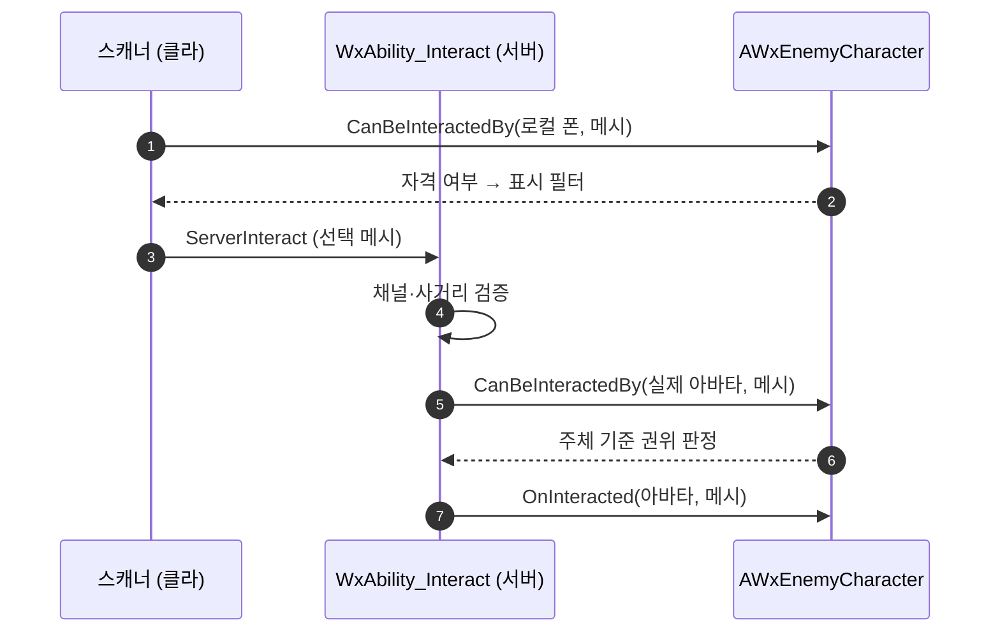

# 처형 어포던스 주체별 자격

## 계획

### 목표

`AWxEnemyCharacter::UpdateFinisherAffordance`가 주체별(per-player) 자격을 머신별(per-machine) 단일 콜리전 응답에 써 넣어, 멀티플레이에서 플레이어 2의 정당한 뒤잡이 서버에 거부된다. 주체별 자격을 `IWxInteractable` 계약으로 승격해 표시(클라)와 권위(서버)가 같은 함수를 각자의 주체로 호출하게 한다.

실패 경로: 클라는 `GetPlayerPawn(this,0)`=자기 폰 기준으로 메시를 노출해 프롬프트를 띄우지만, 데디 서버는 같은 타이머를 **플레이어 0** 기준으로 돌려 `ECR_Ignore`로 둔다. `WxAbility_Interact::ExecuteInteract`의 채널 게이트가 `OnInteracted` 도달 **전에** 거부하므로, 실제 instigator 기준으로 올바르게 재검증하도록 작성된 `AWxEnemyCharacter::OnInteracted`에 도달하지 못한다.

### 수정 범위

| 파일 | 수정할 내용 | 구분 |
|---|---|---|
| `Plugins/WxCore/.../WxInteractable.h` | `CanBeInteractedBy(Interactor, Source)` 가상 함수 추가(기본 `true`) | 수정 |
| `Plugins/WxWorld/.../WxInteractionScannerComponent.cpp` | `ScanAndPush` 수집 루프에서 소유 폰 기준으로 후보 필터(정렬 전) | 수정 |
| `Source/WxGame/AbilitySystem/Ability/WxAbility_Interact.cpp` | `ExecuteInteract`에서 `OnInteracted` 직전 아바타 기준 `CanBeInteractedBy` 검증 | 수정 |
| `Source/WxGame/Character/WxEnemyCharacter.h` / `.cpp` | `CanBeInteractedBy` 오버라이드 추가, `UpdateFinisherAffordance`·`FinisherAffordanceTimerHandle` 삭제, BeginPlay/HandleDeath 채널 처리 변경 | 수정 |

### 접근 방식

- **주체별 자격을 계약으로 승격**: 콜리전 응답은 머신당 값 하나뿐이라 "플레이어 2에겐 가능, 플레이어 1에겐 불가"를 표현할 수 없다. 표현 가능한 자리(인터페이스)로 옮긴다.
- **채널은 역할 유지**: 영역 표식 + 기믹 활성 비트는 그대로다. 기믹들(`AWxDoor` 등)의 `OnInteracted`는 자체 검증이 전혀 없어 채널 게이트에만 의존하므로, 게이트를 제거하면 변조 클라가 비활성 기믹을 발동시킬 수 있다.
- **적은 살아있는 동안 항상 노출**: 채널 응답에서 플레이어 종속성을 걷어내고, 자격 판정은 `CanBeInteractedBy`가 주체별로 수행한다. 부수 효과로 살아있는 적마다 돌던 0.15초 폴링 타이머가 사라진다.
- **`OnInteracted`의 `GetEligibleFinisherEventTag` 호출은 유지**: 단순 bool이 아니라 발동 변형 태그(`Event.Finisher` / `Event.Backstab`)를 정하는 데 필요하다.

---

## 완료

### 수정한 파일

| 파일 | 수정한 내용 | 구분 |
|---|---|---|
| `Plugins/WxCore/.../WxInteractable.h` | `CanBeInteractedBy(Interactor, Source)` 추가 (기본 `true`) | 수정 |
| `Plugins/WxWorld/.../WxInteractionScannerComponent.cpp` | `ScanAndPush` 수집 루프에 소유 폰 기준 자격 필터 (정렬 전) | 수정 |
| `Source/WxGame/AbilitySystem/Ability/WxAbility_Interact.cpp` | `ExecuteInteract`에서 `Cast` 결과를 조기 반환 구조로 바꾸고, `OnInteracted` 직전 아바타 기준 자격 검증 추가 | 수정 |
| `Source/WxGame/Character/WxEnemyCharacter.h` / `.cpp` | `CanBeInteractedBy` 오버라이드, `UpdateFinisherAffordance`·`FinisherAffordanceTimerHandle` 삭제, BeginPlay `ECR_Overlap`·HandleDeath `ECR_Ignore`, 미사용 `TimerManager.h` include 제거 | 수정 |

### 구현·결정과 그 이유

- **자격 질의를 인터페이스로 승격한 이유**: 리슨 호스트는 서버이면서 로컬 플레이어를 가지는데, 콜리전 응답은 머신당 값이 하나뿐이다. 표시용으로 쓰면 원격 플레이어의 정당한 처형을 서버가 거부하고, 서버 게이트용으로 쓰면 호스트가 모든 살아있는 적에게 프롬프트를 본다. `HasAuthority()` 분기로도 해결되지 않아(리슨 호스트는 양쪽 모두) 표시 필터를 채널 밖으로 빼는 것이 강제됐다.
- **기존 함수 재사용 대신 신규 추가**: 인터페이스 멤버는 `OnInteracted`(서버 전용·void)와 `GetInteractionPrompt`(라벨) 둘뿐이라, 표시 시점 판정을 실을 수 있는 건 후자뿐이었다. 빈 `FText`를 "미노출"로 쓰는 안은 신규 함수가 0개지만 `GetPrompts()`에서 빈 텍스트가 이미 "대상 소실" 자리표시자로 쓰여 의미가 겹치고, 시그니처에 주체가 없어 로컬 플레이어 의존이 호출부에서 안 보인다. 술어를 명시적으로 모델링하는 쪽을 택했다.
- **기본 구현 `true`**: 나머지 구현체 8종(`AWxGimmick` 및 파생 6종, `AWxItemPickup`, `AWxCheckPoint`, `AWxLaserCorridor`)은 한 줄도 바뀌지 않는다.
- **채널 게이트 유지**: 기믹들의 `OnInteracted`는 자체 검증이 전혀 없어 채널 게이트에만 의존한다. 제거하면 변조 클라가 비활성 기믹을 발동시킬 수 있어, 채널은 "영역이 켜져 있는가", `CanBeInteractedBy`는 "이 주체가 자격이 있는가"로 역할을 나눴다.
- **`OnInteracted`의 자체 재검증 유지**: 단순 bool이 아니라 발동 변형 태그(`Event.Finisher` / `Event.Backstab`)를 정하는 데 필요하다.
- **부수 효과**: 살아있는 적마다 돌던 0.15초 폴링 타이머가 사라졌다.

### 계획 대비 달라진 점

- 계획엔 없던 미사용 `#include "TimerManager.h"` 제거를 추가했다(타이머 삭제로 미사용이 됨).

### 후속 과제

- **런타임 검증 미실시**: WxEditor(Development) 빌드 성공과 잔여 참조 0건만 확인했다. 계획에 적은 PIE 검증 — 특히 **2인 + Play As Client(데디 서버)에서 플레이어 2의 뒤잡이 실제로 발동되는지**(이번 버그의 본질) — 는 에디터 실행이 필요해 수행하지 않았다.
- 기믹의 `OnInteracted`가 자체 검증 없이 어빌리티 게이트에만 의존하는 구조는 그대로다. 호출부가 `WxAbility_Interact.cpp:95` 한 곳뿐이라 현재는 안전하지만, 다른 경로(StateTree 태스크·치트 커맨드 등)에서 직접 호출되면 무방비다.
