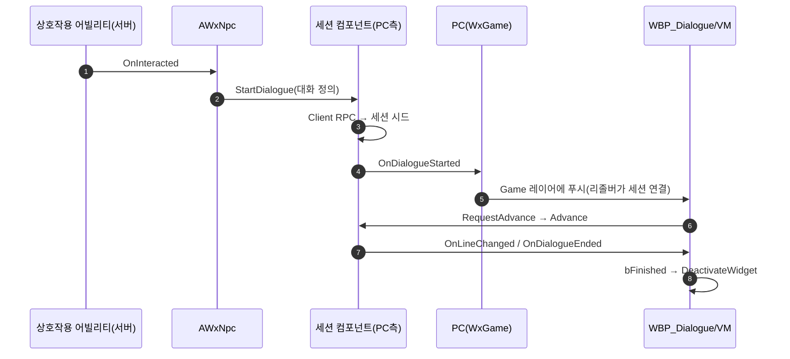

# NPC 대화 시스템 (WxDialogue 플러그인)

## 계획

### 목표
NPC와 상호작용하면 HUD 레이어(UI.Layer.Game)에 대화 창이 열려 대사를 읽을 수 있게 한다. 이번 범위는 선형 대화(넘기기→종료)이며, 데이터 스키마는 선택지 분기까지 지금 확정해 이후 UI 작업만으로 분기를 붙일 수 있게 한다.

### 수정 범위
| 파일 | 수정할 내용 | 구분 |
|---|---|---|
| `Plugins/WxDialogue/WxDialogue.uplugin` + 모듈 부트스트랩 | 플러그인 신설(WxCore만 참조) | 신규 |
| `Plugins/WxDialogue/.../Public/WxDialogueTableRow.h` | 대화 노드 행 구조체(대사들+선택지+다음 행) | 신규 |
| `Plugins/WxDialogue/.../Public/WxDialogueComponent.h` | 대화 정의 컴포넌트(시작 노드 보유, 대화 대상에 부착) | 신규 |
| `Plugins/WxDialogue/.../WxDialogueSessionComponent.h/.cpp` | PC측 세션 컴포넌트(클라 전달 RPC+진행+델리게이트) | 신규 |
| `Plugins/WxDialogue/.../WxNpc.h/.cpp` | 대화 NPC 액터(IWxInteractable) | 신규 |
| `Source/WxGame/Controller/WxPlayerController.h/.cpp` | 세션 컴포넌트 생성·시작 신호 구독·대화 위젯 푸시 | 수정 |
| `Source/WxGame/MVVM/WxViewModel_Dialogue.h/.cpp` | 대화 뷰모델+리졸버 | 신규 |
| `Source/WxGame/WxGame.Build.cs`, `Wx.uproject` | WxDialogue 등록 | 수정 |

### 접근 방식
- **데이터 = DataTable 노드 그래프**: 행 하나가 대화 노드 하나. 대사 배열을 순서대로 출력한 뒤 선택지가 있으면 선택 점프로, 없으면 다음 행으로 잇고, 그마저 없으면 종료한다. 대화 1편 = 테이블 1개. StateTree 기반 흐름은 조건부 선택지·부수효과가 실제로 등장할 때 세션 내부 교체로 도입한다(UI·NPC·전송 경로 무변경). 텍스트 자산은 그때도 DT를 태스크가 참조하는 식으로 살릴 수 있다.
- **역할 분담은 상호작용 시스템과 동형**: 대화 정의(시작 노드)는 대화 대상에 붙는 컴포넌트가, 세션 진행은 PC에 붙는 컴포넌트가 소유한다. 정의 컴포넌트를 분리한 이유는 NPC 외 다른 상호작용 대상도 이 컴포넌트를 붙이고 자기 상호작용 응답에서 세션에 넘기면 대화를 걸 수 있게 하기 위함이다. 서버의 상호작용 응답을 그 클라이언트의 UI로 잇는 전달은 소유 액터에서만 가능한 Client RPC 제약 때문에 PC측이 담당한다. 스캐너와 같은 배치라 플러그인은 WxCore만 참조하고, 세션은 표시 전용 로컬 상태라 서버 검증 없이 클라가 진행을 소유한다.
- **UI는 기존 관용구 재사용**: PC가 시작 신호를 받아 대화 위젯을 Game 레이어에 푸시(사망 화면과 동형), 위젯은 Menu 입력 모드(무정지)로 게임 입력을 차단, 뷰모델은 세션 약참조+구독+커맨드(상호작용 리스트 VM과 동형), 종료 시 위젯이 스스로 닫혀 HUD가 복귀한다.
- **에디터 저작물**(코드 검증 후): DT_Dialogue(생존자 대사), WBP_Dialogue(Menu 모드·리졸버 바인딩·전면 넘기기 버튼), BP_Npc(메시 지정), BP_PlayerController에 위젯 클래스 지정, 레벨 배치.

---

## 완료

### 수정한 파일
| 파일 | 수정한 내용 | 구분 |
|---|---|---|
| `Plugins/WxDialogue/` (uplugin·Build.cs·모듈 h/cpp) | 플러그인 신설(WxCore만 참조) | 신규 |
| `Plugins/WxDialogue/.../Public/WxDialogueTableRow.h` | 대화 노드 행 구조체(Lines·Choices·NextRow) | 신규 |
| `Plugins/WxDialogue/.../Public/WxDialogueComponent.h` | 대화 정의 컴포넌트(시작 노드 보유) | 신규 |
| `Plugins/WxDialogue/.../WxDialogueSessionComponent.h/.cpp` | 세션 진행+Client RPC+시작·대사·종료 델리게이트 | 신규 |
| `Plugins/WxDialogue/.../WxNpc.h/.cpp` | 대화 NPC 액터(메시=상호작용 영역) | 신규 |
| `Source/WxGame/MVVM/WxViewModel_Dialogue.h/.cpp` | 대화 뷰모델+리졸버 | 신규 |
| `Source/WxGame/Controller/WxPlayerController.h/.cpp` | 세션 컴포넌트 생성·시작 신호 구독·대화 위젯 푸시 | 수정 |
| `Source/WxGame/WxGame.Build.cs`, `Wx.uproject` | WxDialogue 등록 | 수정 |

### 구현·결정과 그 이유
- **정의/세션 컴포넌트 분리**: 대화 정의는 대상 액터에, 세션 진행은 플레이어(PC)에 둔다. 비소유 액터는 Client RPC를 쏠 수 없고 세션은 본질적으로 플레이어별 상태이기 때문. NPC가 아닌 액터도 정의 컴포넌트를 붙이고 자기 상호작용 응답에서 한 줄 위임하면 대화를 걸 수 있다.
- **DataTable 노드 그래프 채택**: 선형+선택지 분기까지는 테이블로 완전히 표현되고 텍스트 저작에 유리하다. StateTree는 조건부 선택지·부수효과가 실제로 등장할 때 세션 내부 교체로 도입한다(장단점 비교 후 사용자 확정). 진행 로직이 세션 안에 격리돼 있어 교체 시 UI·NPC·전송 경로는 무변경.
- **선택지는 스키마·세션까지, UI는 후속**: 데이터 구조와 세션의 선택 점프(Choose)는 지금 구현하되 선택지 표시 UI는 다음 단계로 미룬다. 넘기기가 선택지 노드에서 멈추는 것은 미래 선택 UI가 이어받기 위한 의도된 의미론.
- **세션은 로컬 무검증**: 대화가 게임 상태를 바꾸지 않는 표시 전용이라 서버 검증을 두지 않았다. 보상·퀘스트가 붙는 시점에 서버측으로 이관한다.

### 계획 대비 달라진 점
- 계획대로 (설계 중 컴포넌트 배치·데이터 구조 조정은 승인 전에 반영됨).

### 에디터 저작 (unreal-mcp로 수행)
- `Content/Dialogue/DT_Dialogue`: RowStruct=WxDialogueTableRow, 생존자 대화 2노드(Intro→Warning→종료) 저작.
- `Content/WorldObject/Npc/BP_Npc`: 부모 AWxNpc, 이름 "생존자", SKM_Manny+MM_Idle(단일 노드), StartRow=DT_Dialogue.Intro.
- `Content/UI/Widget/WBP_Dialogue`: 부모 WxActivatableWidget(InputMode=Menu·무정지), 전면 투명 버튼+하단 말풍선(화자/대사 CommonTextBlock) 트리.
- `BP_PlayerController.DialogueWidgetClass = WBP_Dialogue`, LV_DevCombat 플레이어 스타트 전방에 BP_Npc 배치.

### 후속 과제
- ~~WBP_Dialogue 수동 마무리~~ → 사용자가 View Bindings·버튼 그래프·스타일까지 완료(그래프 검수 완료).
- ~~PIE 검증~~ → 프롬프트→F→대화창 표시(자동 재현)·대사 넘기기·닫힘(사용자 확인)까지 전부 검증 완료.
- 선택지 UI(뷰모델 RequestChoose 커맨드+선택지 패널).

### 특이사항: Live Coding 함정 (F 무반응 사건)
사용자가 WxNpc.cpp의 프롬프트 문구를 고치고 Live Coding으로 패치한 뒤부터, 프롬프트는 뜨는데 F를 눌러도 대화가 시작되지 않는 증상이 발생했다. 진단 로그를 심은 풀 빌드+에디터 재시작만으로(코드 동일) 전 체인이 정상 동작했다 — 즉 코드 문제가 아니라 **신설 모듈(WxDialogue)에 Live Coding 패치가 적용된 프로세스 상태가 인터페이스 가상 호출~델리게이트 체인을 조용히 끊은 것**. 같은 프로세스에서 보물상자(기존 모듈)는 정상이었다. 신설 모듈·신설 클래스 직후에는 Live Coding 대신 재시작 빌드를 쓸 것.
- ~~run-editor 스킬 종료 필터가 DebugGame 에디터를 못 잡는 문제~~ → 와일드카드 필터로 수정 완료(같은 날).
