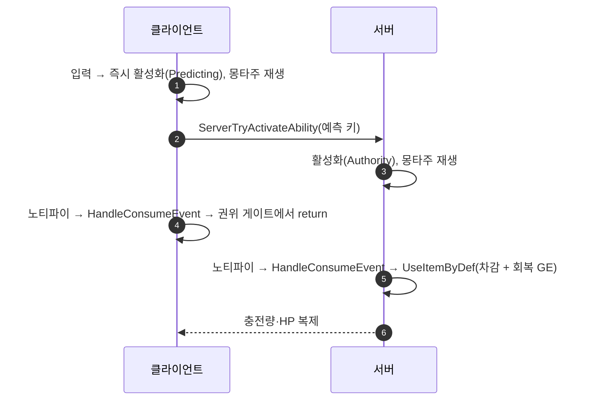

# UseItem 어빌리티: LocalPredicted 전환 + 인벤토리 차감 권위 게이트

## 계획

### 목표

`/module-review` 가 `WxGame` 에서 🔴 심각으로 잡은 클라 크래시를 고치고, 동시에 이 어빌리티의 넷 정책을 입력 모델에 맞게 바로잡는다.

`UWxAbility_UseItem` 은 `ServerInitiated` 인데 이는 `ServerOnly` 가 아니므로 엔진이 소유 클라에 활성화를 복제한다. 클라에서도 몽타주가 재생되고 `WxAnimNotify_UseItem` 이 로컬로 `Event.UseItem` 을 송출해 `HandleConsumeEvent` → `UseItemByDef` 가 비권한에서 호출되고, 그 첫 줄 `check(GetOwner() && GetOwner()->HasAuthority())`(`WxInventoryManagerComponent.cpp:494`)에 걸려 비-Shipping 빌드에서 클라가 크래시한다.

### 수정 범위

| 파일 | 수정할 내용 | 구분 |
|---|---|---|
| `Source/WxGame/AbilitySystem/Ability/WxAbility_UseItem.cpp` | `NetExecutionPolicy` 오버라이드 제거(베이스 기본값 `LocalPredicted` 상속), `HandleConsumeEvent` 에 권위 게이트 추가, 사실과 다른 주석 정정 | 수정 |
| `Source/WxGame/AbilitySystem/Ability/WxAbility_UseItem.h` | 「사용 흐름」 주석의 정책·권위 서술 정정 | 수정 |
| `Source/WxGame/AnimNotify/WxAnimNotify_UseItem.h` | "ServerInitiated 어빌리티에서만 일어나므로 안전하다" 주석 정정 | 수정 |

### 접근 방식

- **정책과 권위의 분리**: 기존 생성자 주석은 "인벤토리 차감은 서버 권한 작업이므로 서버에서 활성화한다"며 어빌리티 **전체**의 넷 정책을 그 한 단계에 맞췄다. 이것이 설계 오류의 뿌리다. 정책은 입력 모델(플레이어 입력 주도 → `LocalPredicted`)에 맞추고, 서버 전용 단계인 인벤토리 차감만 권위로 게이팅한다.
- **오버라이드 제거로 전환**: 베이스 `UWxAbilityBase` 가 이미 `LocalPredicted` + `InstancedPerActor` 기본값이다(`WxAbilityBase.cpp:22-23`). 명시적 `LocalPredicted` 대입을 새로 넣는 대신 오버라이드를 지워 "평범한 플레이어 어빌리티" 임을 드러낸다. 같은 모듈의 `ServerInitiated` 사용처(HitReact·Groggy·Finisher·Death)는 모두 서버 주도 피격 반응이라 정책이 맞고, UseItem 만 입력 주도인데 섞여 있었다.
- **예측 전제 충족 확인**: 클라 예측이 성립하려면 클라가 "지금 충전이 있나"를 스스로 답할 수 있어야 한다. `InventoryList` 가 `UPROPERTY(Replicated)` 이고 `UWxItemInstance::CurrentCharges` 가 `ReplicatedUsing = OnRep_CurrentCharges` 라 소유 클라가 정확한 충전량을 갖는다. 따라서 `ActivateAbility` 의 사전 검사 `CanUseItemByDef`(`:43`)가 클라에서도 올바르게 동작하며, 새 배선이 필요 없다.
- **차감은 예측 대상 아님**: GAS 예측이 덮는 범위는 예측 GE 의 어트리뷰트 변화·태그·몽타주·큐다. `UWxItemInstance` 충전량이나 인벤토리 배열 변경에는 롤백 장치가 없다. `UseItemByDef` 는 서버 전용으로 남고 `check()` 도 올바른 불변식이라 유지한다.

### 알려진 리스크

- **미스프리딕트 팝**: 클라는 충전이 있다고 봤는데 서버가 거부하면(동시 소비 등) 클라가 마시기 모션을 시작한 뒤 취소된다. `ServerInitiated` 에는 없던 리스크이나 창이 좁다.
- **회복 체감 지연**: 회복 GE 는 서버의 `UseItemByDef` 안에서 적용되므로 HP 변화는 어트리뷰트 복제로 도착한다. 기존과 동일하다.

---

## 완료

### 수정한 파일

| 파일 | 수정한 내용 | 구분 |
|---|---|---|
| `Source/WxGame/AbilitySystem/Ability/WxAbility_UseItem.cpp` | `NetExecutionPolicy` 오버라이드 제거(베이스 `LocalPredicted` 상속), `HandleConsumeEvent` 진입부에 `HasAuthority(&CurrentActivationInfo)` 게이트 추가, 주석 2곳 정정 | 수정 |
| `Source/WxGame/AbilitySystem/Ability/WxAbility_UseItem.h` | 「사용 흐름」 1·2·4단계를 새 정책·권위 모델로 정정 | 수정 |
| `Source/WxGame/AnimNotify/WxAnimNotify_UseItem.h` | "ServerInitiated 어빌리티에서만 일어나므로 안전하다" → 권위 검사 주체를 `HandleConsumeEvent` 로 명시 | 수정 |

### 구현·결정과 그 이유

- **정책 전환은 오버라이드 삭제로**: 명시적 `LocalPredicted` 대입을 새로 넣는 대신 `ServerInitiated` 오버라이드를 지워 베이스 기본값을 상속하게 했다. "이 어빌리티는 정책상 특별할 것이 없는 평범한 플레이어 어빌리티" 라는 사실이 코드에 드러난다. 대신 왜 오버라이드하지 **않는지**를 생성자에 주석으로 남겨, 다음 사람이 같은 실수(차감이 서버 전용이니 정책도 서버로)를 반복하지 않게 했다.
- **게이트를 `HandleConsumeEvent` 에 둔 이유**: `UseItemByDef` 안이 아니라 호출부에 뒀다. `UseItemByDef` 의 `check()` 는 "이 함수는 서버에서만 불려야 한다" 는 올바른 불변식이므로 완화하면 안 되고, 클라가 애초에 호출하지 않게 막는 것이 맞다.
- **`HasAuthority(&CurrentActivationInfo)` 사용**: 아바타의 `HasAuthority()` 대신 어빌리티의 활성화 모드를 본다. `LocalPredicted` 에서 클라 인스턴스는 `Predicting`(서버 확정 후 `Confirmed`)이고 서버만 `Authority` 라, 예측·확정 양쪽 클라 상태를 한 번에 거른다.
- **예측 전제 사전 확인**: `InventoryList` 가 `UPROPERTY(Replicated)`, `UWxItemInstance::CurrentCharges` 가 `ReplicatedUsing` 이라 소유 클라가 정확한 충전량을 갖는다. 따라서 빈 병 방지 검사(`CanUseItemByDef`)가 클라에서도 성립해 새 배선 없이 전환이 가능했다.

### 계획 대비 달라진 점

계획대로.

### 후속 과제

- **런타임 검증 미수행**: 컴파일만 확인했다(WxEditor Win64 Development, exit 0). Net Mode = Play As Client / 플레이어 2 로 PIE 검증이 필요하다. 확인할 것: (a) 클라가 크래시하지 않는지, (b) 입력 즉시 마시기 모션이 시작되는지(기존에는 RTT 지연), (c) 충전이 1 만 감소하는지, (d) 충전 0 에서 눌렀을 때 모션이 나오지 않는지.
- **미스프리딕트 거동 미확인**: 클라는 충전이 있다고 봤는데 서버가 거부하는 경우의 모션 취소 모양새를 확인하지 못했다. 창이 좁아 인위적 지연(`Net PktLag`) 없이는 재현이 어렵다.
- **다른 입력 주도 어빌리티 점검**: 같은 패턴의 정책 오선택이 있는지 확인할 가치가 있다. 현재 `ServerInitiated` 사용처(HitReact·Groggy·Finisher·Death)는 모두 서버 주도 피격 반응이라 정책이 맞고, `WxAbility_Interact` 는 `ServerOnly` 다 — 이번 확인 범위에서는 UseItem 만 어긋나 있었다.
