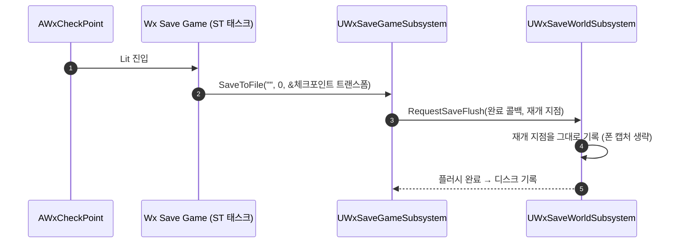

# 체크포인트 재개 지점을 체크포인트 위치로 고정

## 계획

### 목표

체크포인트 오토세이브가 재개 지점으로 저장 시점 플레이어 폰의 트랜스폼을 캡처해, 상호작용 반경 안에서 어디에 섰느냐에 따라 부활·로드 지점이 매번 달라진다. 이를 체크포인트 액터 자신의 트랜스폼으로 고정한다.

### 수정 범위

| 파일 | 수정할 내용 | 구분 |
|---|---|---|
| `Plugins/WxSave/Source/WxSave/Public/WxSaveWorldSubsystem.h` `.../Private/WxSaveWorldSubsystem.cpp` | `RequestSaveFlush` 에 재개 지점 오버라이드 인자 추가. `FlushPlayerTransform` 은 값이 오면 폰 조회 없이 그 값을 기록하고, 없으면 기존 첫 폰 캡처 유지 | 수정 |
| `Plugins/WxSave/Source/WxSave/Public/WxSaveGameSubsystem.h` `.../Private/WxSaveGameSubsystem.cpp` | `SaveToFile` 에 오버라이드 인자 추가 후 플러시로 전달. 월드 서브시스템 부재 폴백은 변화 없음 | 수정 |
| `Plugins/WxSave/Source/WxSave/Private/WxStateTreeTask_SaveGame.cpp` `.../Public/WxStateTreeTask_SaveGame.h` | BP 라이브러리 대신 게임 서브시스템을 직접 잡아 ST 오너(=체크포인트) 트랜스폼을 재개 지점으로 넘겨 저장 | 수정 |
| `Plugins/WxSave/Source/WxSave/Public/WxSaveGame.h` | 재개 지점 필드 주석 갱신 — 오토세이브는 체크포인트, 명시 저장은 폰 | 수정 |
| `Plugins/WxWorld/Source/WxWorld/Public/Gimmick/WxCheckPoint.h` | 재개 지점을 플레이어 위치로 근사한다는 클래스 주석 갱신 | 수정 |

### 접근 방식

- **저장 요청에 재개 지점을 실어 보낸다**: 저장 경로가 체크포인트 오토세이브(ST 태스크)와 메뉴 명명 저장 둘인데 후자는 계속 플레이어가 선 자리여야 한다. 그래서 플러시 기본 동작(폰 캡처)은 두고, 체크포인트 경로만 자기 트랜스폼을 오버라이드로 넘긴다.
- **BP 라이브러리 시그니처 불변**: 태스크가 게임 서브시스템을 직접 호출하므로 메뉴·사망 화면의 세이브 노드는 영향받지 않는다.
- **저장 값**: 액터 월드 트랜스폼 그대로. 스폰 경로가 위치와 Yaw만 쓰므로 스케일은 무의미하고, 방향·높이 보정은 코드가 아니라 레벨 배치로 잡는다.

---

## 완료

### 수정한 파일

| 파일 | 수정한 내용 | 구분 |
|---|---|---|
| `Plugins/WxSave/Source/WxSave/Public/WxSaveWorldSubsystem.h` `.../Private/WxSaveWorldSubsystem.cpp` | 플러시 요청에 재개 지점 오버라이드를 받아, 값이 오면 폰을 보지 않고 그대로 기록하고 없으면 기존 폰 캡처를 유지 | 수정 |
| `Plugins/WxSave/Source/WxSave/Public/WxSaveGameSubsystem.h` `.../Private/WxSaveGameSubsystem.cpp` | 저장 진입점에 같은 오버라이드를 받아 플러시로 전달 | 수정 |
| `Plugins/WxSave/Source/WxSave/Private/WxStateTreeTask_SaveGame.cpp` `.../Public/WxStateTreeTask_SaveGame.h` | BP 라이브러리 대신 게임 서브시스템을 직접 호출하고, ST 오너(=체크포인트) 트랜스폼을 재개 지점으로 전달 | 수정 |
| `Plugins/WxSave/Source/WxSave/Public/WxSaveGame.h` | 재개 지점 필드 주석을 오토세이브(체크포인트)·명시 저장(폰) 두 갈래로 갱신 | 수정 |
| `Plugins/WxWorld/Source/WxWorld/Public/Gimmick/WxCheckPoint.h` | 재개 지점을 플레이어 위치로 근사한다는 서술을 자기 트랜스폼 기준으로 갱신 | 수정 |
| (2차) `Plugins/WxSave/.../WxStateTreeTask_SaveGame.h` `.../Private/WxStateTreeTask_SaveGame.cpp` | 재개 지점을 오너에서 읽던 것을 인스턴스 데이터 `ResumePoint`(바인딩 가능 컴포넌트)로 전환. 비면 오버라이드 없이 저장(폰 위치). 설명에 재개 지점 소스 표기 | 수정 |
| (2차) `Plugins/WxWorld/.../Gimmick/WxCheckPoint.h` `.../Private/Gimmick/WxCheckPoint.cpp` | 부활 자리용 빈 `ResumePoint` 씬 컴포넌트를 루트와 같은 자리에 추가 | 수정 |
| (2차) `Content/WorldObject/Gimmick/ST_CheckPoint.uasset` | Lit 상태 Save Game 태스크의 `ResumePoint` 를 Context 액터의 `ResumePoint` 컴포넌트로 바인딩 | 수정(대기) |

### 구현·결정과 그 이유

- **기본 동작은 폰 캡처, 체크포인트만 오버라이드**: 저장 경로가 체크포인트 오토세이브와 메뉴의 명명 저장 둘인데, 메뉴 저장은 계속 플레이어가 선 자리에서 재개해야 자연스럽다. 플러시의 기본값을 바꾸는 대신 저장 요청에 재개 지점을 실어 보내 두 경로를 갈랐다.
- **재개 지점 소유자는 여전히 플러시**: 외부가 세이브 필드를 직접 쓰면 뒤이은 플러시가 덮어쓰므로, 값의 출처만 요청자에게 열고 기록 시점은 플러시에 남겼다.
- **태스크가 BP 라이브러리를 우회**: 라이브러리는 BP 진입점이라 포인터 인자를 노출할 수 없다. 태스크가 서브시스템을 직접 잡으면 BP 시그니처를 건드리지 않아 메뉴·사망 화면의 세이브 노드가 영향받지 않는다.
- **방향·높이 보정은 코드에 넣지 않음**: 스폰이 위치와 Yaw만 쓰므로 액터 트랜스폼을 그대로 넘겼다. 서는 방향과 지면 높이는 레벨 배치로 잡는 편이 매직 넘버를 코드에 박는 것보다 낫다고 봤다.
- **(2차) 재개 지점을 ST 가 지정하는 데이터로**: 오너 트랜스폼을 쓰는 것은 체크포인트의 정책인데 범용 저장 태스크가 그것을 품고 있었다. 저장만 원하는 기믹이 같은 태스크를 쓰면 그 기믹 자리로 부활하게 되므로, 어디서 재개할지를 ST 에셋이 지정하게 했다.
- **액터가 아니라 컴포넌트로 받음**: 오너 액터를 물리면 코드가 읽던 값과 같아 배선만 늘고 얻는 것이 없다. 컴포넌트면 나중에 토치 비주얼과 독립적으로 서는 자리·방향을 잡을 수 있다.
- **미지정 폴백은 폰 위치**: 지정이 없으면 세이브의 기본 동작이 남는 것이 정직하다. 빠뜨린 배선은 노드 표기가 재개 지점 소스를 보여 주므로 트리에서 바로 드러난다.
- **부활 자리를 전용 컴포넌트로**: 토치 메시가 루트 기준 X −100 이라 루트를 서는 자리로 쓰면 방향·거리가 메시 배치에 묶인다. 빈 씬 컴포넌트를 루트와 같은 자리에 두면 토치를 그대로 둔 채 서는 위치·방향만 옮길 수 있다.
- **설명 폴백 문구의 겹괄호 정리**: 기존 노드들이 `Play Animation ((none))` 처럼 괄호가 겹쳐 보이던 것을 sentinel 에서 괄호를 빼 `(none)` 한 겹으로 맞췄다(표시 문구만 변경).

### 계획 대비 달라진 점

- 계획대로.

### 후속 과제

- 부활 시 서는 방향 확인: 현재 BP 구성은 토치 메시가 루트 기준 X −100 이라, 액터 Yaw 그대로면 토치를 등지고 선다. 어색하면 레벨 배치 회전이나 메시 오프셋 부호로 조정한다.
- 지면 높이 확인: 폰 트랜스폼과 달리 체크포인트 루트는 바닥 근처라 캡슐이 절반 묻힌 채 스폰될 수 있다(스폰 자체는 AlwaysSpawn 이라 실패하지 않음). 실측 후 필요하면 배치 Z 조정 또는 재개 지점 전용 씬 컴포넌트 도입.
- PIE 실측 미완: 빌드까지만 확인했다. 상호작용 → 사망 → 부활 좌표 일치는 다음 실행에서 확인 필요.
- **ST_CheckPoint 바인딩 미완(필수)**: `ResumePoint` 를 Scene Root 로 물리기 전까지는 체크포인트 저장이 폰 위치로 동작한다. MCP 의 StateTree 툴셋은 조회 전용이고 `editorBindings` 가 프로퍼티로 노출되지 않아 자동화가 불가해, 에디터에서 직접 물려야 한다.
- 겹괄호 정리분은 빌드 대기: 에디터 실행 중 Live Coding 이 빌드를 막아 아직 컴파일되지 않았다(에디터 종료 후 빌드 또는 Live Coding 패치 필요).
