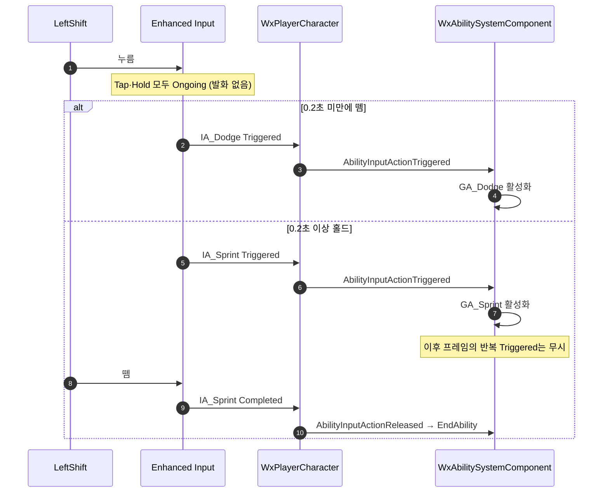

# 탭=회피 / 홀드=스프린트 입력 분리

## 계획

### 목표
BP_Player로 플레이할 때 GA_Sprint가 발동되지 않는 버그를 고친다. IA_Dodge와 IA_Sprint가 같은 키를 공유하는데 어빌리티 입력이 `Started`로 바인딩돼 한 번의 입력에서 둘이 함께 활성화를 시도하고, 회피가 `Ability` 태그를 취소·차단해 스프린트가 항상 진다. 같은 키를 유지한 채 탭=회피, 홀드=스프린트로 갈리게 만든다.

### 수정 범위
| 파일 | 수정할 내용 | 구분 |
|---|---|---|
| `Content/Input/Actions/IA_Dodge.uasset` | Triggers를 `Pressed` → `Tap`(TapReleaseTimeThreshold 0.2)으로 교체 | 수정 |
| `Content/Input/Actions/IA_Sprint.uasset` | Triggers를 `Down` → `Hold`(HoldTimeThreshold 0.2, bIsOneShot false)로 교체 | 수정 |
| `Source/WxGame/Character/WxPlayerCharacter.cpp` | 어빌리티 입력 활성화 바인딩을 `Started` → `Triggered`로 변경(`Completed`는 유지) | 수정 |
| `Plugins/WxCombat/.../Public/AbilitySystem/WxAbilitySystemComponent.h` | 눌려 있는 액션 집합 멤버 추가 | 수정 |
| `Plugins/WxCombat/.../Private/AbilitySystem/WxAbilitySystemComponent.cpp` | 눌림 중 반복 `Triggered`를 방송 이전에 무시, 릴리즈에서 해제 | 수정 |

IMC의 키 매핑은 건드리지 않는다. 두 액션이 같은 키를 공유하는 것이 곧 의도다.

### 접근 방식
- **트리거로 탭/홀드를 가른다**: `Started`는 트리거 종류와 무관하게 키 다운 순간 발화하므로 에셋만 고쳐선 구분이 GAS까지 전달되지 않는다. 활성화 바인딩을 `Triggered`로 옮기면 Tap은 임계 내 릴리즈에서, Hold는 임계 도달 시점에 각각 한 번만 발화한다. 임계값을 양쪽 0.2초로 맞추면 경계에서 빈틈도 겹침도 없다. 두 어빌리티가 애초에 동시에 발화하지 않으므로 GAS 레벨의 Cancel/Block 충돌은 자연히 사라지고, 어빌리티 C++는 손대지 않는다.
- **`bIsOneShot`은 false**: true면 임계 도달 다음 프레임에 트리거 상태가 `None`으로 떨어져 키를 쥔 채로 `Completed`가 떠 스프린트가 즉시 끊긴다.
- **반복 발화 흡수**: 홀드형 트리거(가드의 Down, 스프린트의 Hold, 궁극기의 트리거 없음)는 눌린 동안 매 프레임 `Triggered`를 낸다. ASC가 눌린 액션 집합을 들고 방송 이전에 반복을 걷어내, `OnInputActionTriggered`가 "눌린 순간" 신호라는 의미를 지킨다. `Pressed` 계열은 누름당 1회라 기존과 동일하고 콤보 재발동도 그대로다.
- **가드·궁극기 트리거는 유지**: 릴리즈 시점의 `Completed`가 정확히 뜨는 구성이 이것뿐이다. `Pressed`로 바꾸면 키를 쥔 채 다음 프레임에 `Completed`가 떠 홀드가 깨진다.

---

## 완료

### 수정한 파일
| 파일 | 수정한 내용 | 구분 |
|---|---|---|
| `Content/Input/Actions/IA_Dodge.uasset` | Triggers를 `Tap`(TapReleaseTimeThreshold 0.2)으로 교체 | 수정 |
| `Content/Input/Actions/IA_Sprint.uasset` | Triggers를 `Hold`(HoldTimeThreshold 0.2, bIsOneShot false)로 교체 | 수정 |
| `Source/WxGame/Character/WxPlayerCharacter.h/.cpp` | 어빌리티 입력을 `Started`·`Triggered`·`Completed` 세 이벤트로 나눠 바인딩, 핸들러를 이벤트 이름에 맞춰 정리 | 수정 |
| `Plugins/WxCombat/.../Public/AbilitySystem/WxAbilitySystemComponent.h` | `AbilityInputActionStarted` 진입점 추가, 두 진입점의 역할을 주석으로 구분 | 수정 |
| `Plugins/WxCombat/.../Private/AbilitySystem/WxAbilitySystemComponent.cpp` | 최근 입력 기록·방송을 `Started`로 분리, 발동은 `Triggered`에서 `Spec.InputPressed`로 반복을 거름 | 수정 |

### 구현·결정과 그 이유
- **키 매핑은 그대로 두고 트리거로 갈랐다**: 한 키에서 탭과 홀드를 나누는 것이 의도이므로 키를 떼어놓는 대신 각 액션의 발화 조건을 좁혔다. 임계값을 양쪽 0.2초로 맞추면 경계에서 한쪽만 발화해 빈틈도 겹침도 없고, 두 어빌리티가 동시에 시도되지 않으니 회피가 스프린트를 취소·차단하던 문제가 어빌리티 코드를 손대지 않고 사라진다.
- **활성화를 `Triggered`로 옮긴 것이 핵심**: `Started`는 트리거 종류와 무관하게 키 다운 순간 발화해 탭/홀드 구분을 삼켜버린다. 에셋만 고쳤다면 증상이 그대로였을 것이다.
- **입력 이벤트를 뜻대로 나눠 쓰고 상태를 따로 들지 않았다**: 홀드형 트리거는 눌린 내내 `Triggered`를 내므로 "눌린 순간"이 필요한 곳까지 여기서 받으면 반복을 걸러낼 장부가 필요해진다. 대신 최근 입력 기록과 입력 대기 방송은 정의상 한 번만 뜨는 `Started`로 옮기고, 발동만 `Triggered`로 받았다. 남은 반복은 이 함수가 이미 세우고 릴리즈에서 내리는 `Spec.InputPressed`로 걸러진다. 별도 눌림 집합을 캐싱하지 않아도 되고, 각 이벤트가 코드가 원하는 의미를 그대로 실어 나른다.
- **방송이 `Started`인 편이 의미도 맞다**: 반격 윈도우는 새로 누른 입력에 반응해야 한다. 윈도우가 열리기 전부터 쥐고 있던 키에 즉시 반응하면 안 되므로 조건 충족(`Triggered`)이 아니라 누름(`Started`)이 옳다. 변경 전 동작과도 같아 회귀 위험이 없다.
- **`bIsOneShot`은 false**: true면 임계 도달 다음 프레임에 트리거 상태가 `None`으로 떨어져 키를 쥔 채로 릴리즈 이벤트가 뜬다. 스프린트가 즉시 끊긴다.
- **가드·궁극기 트리거는 유지**: 릴리즈 시점이 정확한 구성이 이것뿐이라 그대로 두고, 대신 반복 발화를 위 장치로 흡수했다.

### 계획 대비 달라진 점
- **반복 발화 대응 방식이 바뀌었다**: 계획은 ASC가 눌린 액션 집합을 들고 거르는 것이었으나, `Started`/`Triggered`를 용도대로 나눠 바인딩하니 새 상태 없이 해결됐다. 엔진에 "첫 `Triggered` 프레임"을 알려주는 값이 없는지 먼저 확인했는데, `ElapsedTriggeredTime`은 델리게이트 호출 전에 이미 가산돼 첫 프레임에도 0이 아니라 쓸 수 없었다. 결국 필요한 건 눌림 장부가 아니라 신호를 알맞은 이벤트에서 받는 것이었다.
- `IA_Dodge.uasset`이 읽기 전용이라 저장이 한 번 실패해, 파일 속성을 해제하고 다시 저장했다.

### 후속 과제
- **인게임 검증 미완**: 컴파일까지만 확인했다. 탭=회피 / 0.2초 홀드=스프린트 / 홀드 해제 시 종료, 그리고 가드·궁극기·공격 콤보 회귀는 PIE에서 직접 눌러봐야 한다.
- C++ 변경 반영에는 에디터 재시작이 필요하다. 현재 열려 있는 에디터는 DebugGame 구성이라 그 구성으로 재실행하려면 DebugGame 타겟도 빌드해야 한다.
- 입력 지연이 체감되면 두 임계값을 함께 0.15 정도로 낮춘다.
