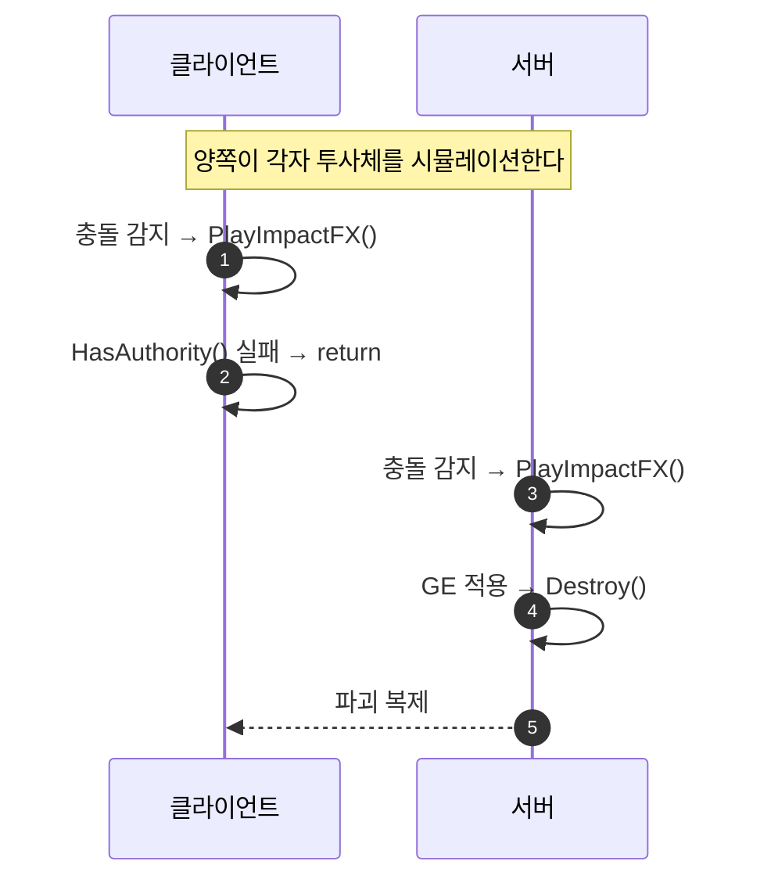

# 투사체: 충돌 연출은 즉시 로컬 재생, 파괴는 서버 권위

## 계획

### 목표

`/module-review` 가 `WxCombat` 에서 🔴 심각으로 잡은 항목을 해결한다. `AWxProjectileBase` 는 복제 액터이고 스폰이 서버 권위로 게이팅돼 있는데 히트 처리만 게이트가 없어 클라에서도 `Destroy()` 가 돈다. 클라 투사체가 먼저 사라져도 서버 투사체는 계속 날아가 실제 타겟을 맞히므로, 화면에서 투사체가 증발하거나 명중 연출이 누락된다.

### 수정 범위

| 파일 | 수정할 내용 | 구분 |
|---|---|---|
| `Plugins/WxCombat/Source/WxCombat/Public/Weapon/WxProjectileBase.h` | `Destroyed()` override 선언 제거, private `PlayImpactFX()` 선언 추가 | 수정 |
| `Plugins/WxCombat/Source/WxCombat/Private/Weapon/WxProjectileBase.cpp` | `Destroyed()` 정의를 `PlayImpactFX()` 로 이전, 두 히트 핸들러에 권위 게이트 삽입, `OtherComp` 널 검사 추가 | 수정 |

### 접근 방식

- **연출과 권위의 분리**: 임팩트 FX 재생은 권위 게이트 **앞**에 두어 충돌을 감지한 머신이 각자 즉시 재생한다. 대미지 적용과 `Destroy()` 만 게이트 뒤로 보낸다. 클라는 서버 파괴가 복제돼 오기를 기다리지 않고, 서버는 유일한 파괴 권위를 갖는다.
- **FX 재생 시점 이동**: 기존에는 `Destroyed()` 에서 스폰했다. 복제 파괴 시에도 불리므로 동작은 했으나, 수명 만료로 소멸할 때도 임팩트 FX 가 터지는 부작용이 있었다. 충돌 시점으로 옮기면서 함께 사라진다.
- **히트 위치 산출은 서버 전용으로**: 산출된 `FHitResult` 는 GE 컨텍스트에만 쓰이므로 게이트 뒤에 남긴다. 이 과정에서 `OtherComp` 널 역참조를 `WxWeaponBase.cpp:228` 과 동일한 형태로 검사한다.

### 범위 밖

연출 정확도를 위한 장치(복제 플래그, 지연 파괴, GameplayCue 이관)와 FX 중복 재생 가드는 넣지 않는다. 연출이 미리 나오거나 두 번 나와도 무방하다는 판단에 따른다.

---

## 완료

### 수정한 파일

| 파일 | 수정한 내용 | 구분 |
|---|---|---|
| `Plugins/WxCombat/Source/WxCombat/Public/Weapon/WxProjectileBase.h` | `Destroyed()` override 선언 제거, private `PlayImpactFX()` 선언 추가, 클래스 주석에 권위 조건 명시 | 수정 |
| `Plugins/WxCombat/Source/WxCombat/Private/Weapon/WxProjectileBase.cpp` | `Destroyed()` 정의를 `PlayImpactFX()` 로 이전, 두 히트 핸들러에 `PlayImpactFX()` + 권위 게이트 삽입, `OtherComp` 널 검사 추가 | 수정 |

### 구현·결정과 그 이유

- **게이트 위치를 FX 재생 뒤로**: 권위 검사를 자기충돌 검사와 FX 재생 사이에 두었다. 앞에 두면 클라가 서버 파괴 복제를 기다려야 해 연출이 RTT 만큼 늦고, 뒤로 더 밀면 대미지가 비권한에서 시도된다. 이 위치가 "연출은 즉시, 판정은 서버" 를 만족하는 유일한 지점이다.
- **히트 위치 산출을 게이트 뒤에 유지**: 산출한 `FHitResult` 는 `CachedEffectContext` 에만 쓰이므로 클라에서 계산할 이유가 없다. 게이트 뒤로 남기면서 스윕이 아닌 경로의 `OtherComp` 널 검사를 `else` 에서 `else if (OtherComp)` 로 바꿔 함께 해결했다.
- **`Destroyed()` override 제거**: FX 를 충돌 시점으로 옮기고 나면 남는 일이 없다. 제거하면서 "아무것도 맞히지 않고 수명 만료로 소멸할 때 임팩트 FX 가 터지던" 부작용도 사라졌다.
- **FX 중복 재생 가드 없음**: 연출을 엄밀히 맞추지 않기로 한 판단에 따라 복제 플래그·지연 파괴를 넣지 않았다. 클라 투사체가 서버와 다른 것을 스치면 그 자리에서 FX 가 한 번 더 날 수 있다.

### 계획 대비 달라진 점

계획대로.

### 후속 과제

- **런타임 검증 미수행**: 컴파일만 확인했다(WxEditor Win64 Development, exit 0). Net Mode = Play As Client / 플레이어 2 로 PIE 를 띄워 클라 화면에서 투사체가 허공에서 증발하지 않는지, 충돌 즉시 양쪽에서 임팩트 연출이 뜨는지 확인이 필요하다.
- **GameplayCue 이관**: 이 모듈의 임팩트 연출 표준은 GameplayCue 인데(`WxCueNotify_Damage`, `WxExecCalc_Damage` 의 `ExecuteGameplayCue`) 투사체만 직접 Niagara 를 스폰해 관례에서 벗어나 있다. 옮기려면 `BP_Projectile` 의 `ImpactFX` 를 큐 에셋으로 마이그레이션하는 에디터 작업이 따른다.
- **넷 렐러번시 이탈 시 거동**: 이제 FX 는 충돌 시점에만 재생되므로, 클라가 충돌을 감지하지 못한 채 렐러번시 밖으로 나가면 그 클라에는 연출이 없다. 기존의 "렐러번시 이탈 시 유령 FX" 와 맞바꾼 특성이다.
