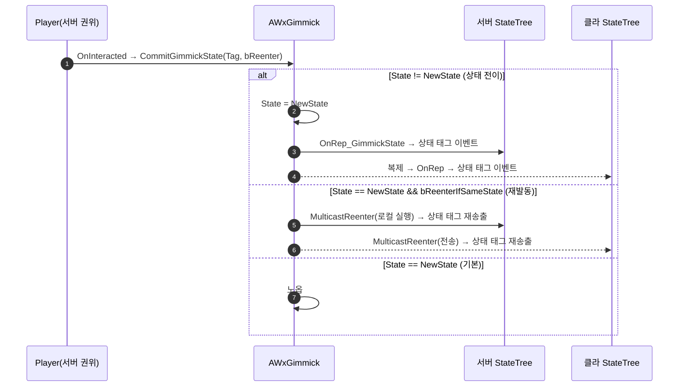

# WxWorld 코드 리뷰 지적 수정

## 계획

### 목표
`/module-review WxWorld`(커밋 `00b2e3f4` 기준)가 남긴 🟡 7건 · 🟢 1건 중 **발견 5(Interactor 배선)를 제외한 7건**을 고친다. 발견 5는 사용자 지시로 보류하며, 그에 딸린 `SetInteractingCharacter`·`InteractingCharacter` 복제 필드·`Move Interactor To Target`·`Play Interactor Montage` 는 손대지 않는다.

### 수정 범위
| 파일 | 수정할 내용 | 구분 |
|---|---|---|
| `Plugins/WxWorld/Source/WxWorld/Private/Gimmick/WxGimmickStateTreeNodes.cpp` | 발견 1: `SpawnNiagara::EnterState` 에 `bPlayOnRestore` 복원 게이트 추가 / 발견 4: `EnablePlayerInput` 을 기록·언와인드 구조로 재작성, 익명 헬퍼 `SetLocalPlayerInputEnabled` 제거 | 수정 |
| `Plugins/WxWorld/Source/WxWorld/Public/Gimmick/WxGimmickStateTreeNodes.h` | 발견 4: `EnablePlayerInput` 인스턴스 데이터에 차단 기록 필드 + `ExitState` 선언 / 발견 8: 죽은 `#include "StateTreeConditionBase.h"` 제거 | 수정 |
| `Plugins/WxWorld/Source/WxWorld/Public/Gimmick/WxGimmick.h` | 발견 2: `CommitGimmickState` 에 `bReenterIfSameState` 기본 인자, `MulticastReenterGimmickState` 선언 / 발견 8: 스테일 주석 2건 정정 | 수정 |
| `Plugins/WxWorld/Source/WxWorld/Private/Gimmick/WxGimmick.cpp` | 발견 2: 동일값 가드 + 멀티캐스트 재발동 구현 | 수정 |
| `Plugins/WxWorld/Source/WxWorld/Private/Gimmick/WxCheckPoint.cpp` | 발견 2: 재휴식 재발동 옵트인(유일한 호출부 변경) | 수정 |
| `Plugins/WxWorld/Source/WxWorld/Public/Interaction/WxInteractionScannerComponent.h` | 발견 3: 프롬프트 스냅샷 멤버 `LastPrompts` 추가 | 수정 |
| `Plugins/WxWorld/Source/WxWorld/Private/Interaction/WxInteractionScannerComponent.cpp` | 발견 3: `UpdateInRange` 를 「멤버십 변경」과 「문구 변경」 두 축으로 분리 | 수정 |
| `Plugins/WxWorld/Source/WxWorld/Private/Spawnable/WxSpawner.cpp` | 발견 6: 스폰체 영구 Attach 제거 / 발견 7: 액터 라벨 갱신을 `PostEditChangeProperty` 경로로 한정 | 수정 |
| `Plugins/WxWorld/README.md` | 발견 8: 삭제된 `Wx Gimmick State Is` 언급 제거 | 수정 |

### 접근 방식
- **발견 1 (복원 게이트)**: 헤더가 선언만 하고 구현이 없던 `bPlayOnRestore` 를 같은 파일 `PlaySound::EnterState` 와 **동형**으로 채운다. 게이트가 생기면 `ST_CheckPoint` 의 모닥불 지속 FX 는 로드 후 꺼지므로, 그 노드의 `bPlayOnRestore = true` 세팅은 에셋 후속 조치로 넘긴다.
- **발견 2 (동일값 커밋)**: 「기본 무시 + 재발동 옵트인」. 동일값이면 복제 프로퍼티가 변하지 않아 클라 OnRep 이 없는데 서버만 `OnRep_GimmickState()` 를 직접 불러 ST 를 재진입하던 비대칭을 없앤다. 재발동이 의미 있는 기믹(체크포인트 재휴식 → `Refill Item Charges`·`Save Game`)만 `bReenterIfSameState` 로 옵트인하고, 그 재발동은 값 변경이 아니므로 **NetMulticast** 로 전 피어에 전달해 대칭을 맞춘다(리비전 카운터·미러 없음).
- **발견 3 (프롬프트 통지)**: 프롬프트는 대상에서 pull 하는 값이라 in-range 멤버십이 그대로여도 문구만 바뀔 수 있는데, `if (!bChanged) return;` 가 그 갱신을 삼켰다. 선택·하이라이트는 멤버십 축, 목록 브로드캐스트는 문구 스냅샷 비교 축으로 분리한다. 주변이 빈 대부분의 스캔은 조기 이탈시켜 `GetPrompts()` 할당을 만들지 않는다.
- **발견 4 (입력 언와인드)**: 대상 지정(그 머신의 첫 로컬 플레이어)은 발견 5 보류에 묶여 그대로 두고, `Move Interactor To Target` 의 `BlockedController` 패턴대로 **실제로 끈 대상만 기록해 `ExitState` 가 그 기록만 근거로 되돌리는** 안전망을 추가한다. 남는 다중 피어 한계는 헤더 주석에 명시한다.
- **발견 6·7 (스포너)**: CMC 캐릭터를 스포너에 붙이면 `AttachmentReplication` 경로를 타므로 attach 를 걷어낸다(수명은 이미 약참조 + 명시 Destroy 가 담당). 라벨은 디자이너가 클래스를 바꾼 순간에만 갱신해, 맵/셀을 열 때마다 도는 `PostRegisterAllComponents` 가 사용자 라벨을 덮고 패키지를 dirty 로 만들지 않게 한다.

---

## 완료

### 수정한 파일
| 파일 | 수정한 내용 | 구분 |
|---|---|---|
| `Plugins/WxWorld/Source/WxWorld/Public/Gimmick/WxGimmick.h` | `CommitGimmickState` 동일값 노옵 계약 명시, `GetGimmickState`·`SetInteractingCharacter` 주석 정정 | 수정 |
| `Plugins/WxWorld/Source/WxWorld/Private/Gimmick/WxGimmick.cpp` | 동일값 커밋 조기 이탈 | 수정 |
| `Plugins/WxWorld/Source/WxWorld/Private/Gimmick/WxCheckPoint.cpp` | 재휴식이 노옵이 되는 사실을 주석에 명시 | 수정 |
| `Plugins/WxWorld/Source/WxWorld/Public/Gimmick/WxGimmickStateTreeNodes.h` | `EnablePlayerInput` 인스턴스 데이터에 `DisabledPawn`/`DisabledController` + `ExitState` 선언·doc, `SpawnNiagara` 에 `SpawnedComponent` 핸들, 생성자 4개 선언, 재선택 규약 카탈로그 주석, 전방 선언 3개, 죽은 `StateTreeConditionBase.h` include 제거 | 수정 |
| `Plugins/WxWorld/Source/WxWorld/Private/Gimmick/WxGimmickStateTreeNodes.cpp` | `SpawnNiagara` 복원 게이트 + 중복 스폰 스킵, `EnablePlayerInput` 을 기록·언와인드 구조로 재작성, 익명 헬퍼 `SetLocalPlayerInputEnabled` 제거, 태스크 6종에 `bShouldStateChangeOnReselect = false` | 수정 |
| `Plugins/WxWorld/Source/WxWorld/Public/Interaction/WxInteractionScannerComponent.h` | `LastPrompts` 스냅샷 멤버 추가, `UpdateInRange` 계약 주석 갱신 | 수정 |
| `Plugins/WxWorld/Source/WxWorld/Private/Interaction/WxInteractionScannerComponent.cpp` | `UpdateInRange` 를 멤버십 축(선택·강조)과 문구 축(목록 브로드캐스트)으로 분리 | 수정 |
| `Plugins/WxWorld/Source/WxWorld/Private/Spawnable/WxSpawner.cpp` | 스폰체 영구 Attach 제거, 액터 라벨 갱신을 `PostEditChangeProperty` 로 이동 | 수정 |
| `Plugins/WxWorld/README.md` | 삭제된 `Wx Gimmick State Is` 조건 노드 언급 2곳 정정 | 수정 |

### 구현·결정과 그 이유
- **동일값 커밋은 노옵, 재실행 판단은 태스크로**: 값이 안 바뀌면 복제가 없어 클라 OnRep 이 생기지 않으므로, 베이스가 통지를 돌리면 권위 측만 ST 를 재진입해 피어가 갈린다. 초안에서는 이를 `bReenterIfSameState` 플래그 + NetMulticast 로 풀었으나, "재진입에서 무엇을 다시 실행할지"는 태스크의 판단이라 액터로 끌어올릴 일이 아니었다. 둘 다 걷어내고 베이스는 값이 바뀔 때만 통지하도록 했다.
- **재선택 정책은 엔진 기본 기능을 쓴다**: StateTree 는 같은 상태 재선택을 `ChangeType = Sustained` 로 알리고 `FStateTreeTaskBase::bShouldStateChangeOnReselect`(기본 true)로 `EnterState`/`ExitState` 를 대칭 게이팅한다. 커스텀 배관 없이 각 태스크가 생성자에서 한 줄로 선언하면 되고, 이미 `bShouldCallTick` 을 쓰는 자리와 같다. 액션형(사운드·애니·스폰 트리거)은 기본값 true 로 두고, 상태형(메시 이동·상호작용/입력 토글·시퀀스)과 머무는 태스크만 false 로 내렸다.
- **`Spawn Niagara` 는 재생 여부 하나로 자기완결**: 디자이너 플래그(`bPlayOnRestore`)와 진입 경로 구분(`IsInitialOrRestoreEntry`)을 모두 걷어내고, 자기가 띄운 컴포넌트가 `IsComplete()` 인지만 본다. 재생 중이면 두고 아니면 띄운다. 지속 FX 는 배선 없이 로드·복원·스트리밍 인에서 알아서 살아나고 이미터가 겹치지도 않는다 — 한 규칙이 중복 방지와 복원 재개를 동시에 만족시킨다.
- **프롬프트 비교를 `FText::EqualTo` 로**: `IdenticalTo` 는 텍스트 데이터 포인터 비교라 같은 문구가 재생성되면 변경으로 오탐한다. 후보가 보통 3개 이하라 표시 문자열 비교 비용이 무의미하고, 의미상으로도 "문구가 달라졌는가"가 맞다. 주변이 빈 대부분의 스캔은 조기 이탈시켜 `GetPrompts()` 할당 자체를 만들지 않는다.
- **`EnablePlayerInput` 대상은 그대로 두고 언와인드만**: 당사자 지정으로 좁히려면 `InteractingCharacter` 가 채워져야 하는데 그 배선(발견 5)이 보류라, 지금 대상을 바꾸면 항상 null 이 되어 태스크가 통째로 죽는다. 안전망만 먼저 넣고 남은 한계는 헤더 주석에 명시했다.
- **스포너 라벨을 프리뷰 갱신에서 분리**: 두 동작이 한 함수에 묶여 있어 로드 경로(`PostRegisterAllComponents`)까지 라벨을 덮었다. 라벨은 클래스 변경이라는 사용자 행위에만 반응해야 하므로 그 분기로 옮겼다.

### 계획 대비 달라진 점
- README 는 계획의 `:25` 외에 같은 오류가 있는 「책임」 절(`:8`)의 "태스크/조건 노드" 표현도 함께 정정했다.
- **발견 2 를 리뷰 후 재설계했다.** 초안의 `bReenterIfSameState` 플래그와 `MulticastReenterGimmickState` RPC 를 모두 제거하고, 동일값 커밋은 노옵 + 재선택 재실행은 태스크의 `bShouldStateChangeOnReselect` 로 옮겼다. **동작 변화**: 이미 불이 켜진 체크포인트에서 다시 쉬어도 Lit 을 재진입하지 않아 `Refill Item Charges`·`Save Game` 이 돌지 않는다(회복·리스폰은 `OnInteracted` 의 C++ 경로라 그대로). 재휴식 리필·저장이 기획상 필요하면 상태 재진입이 아닌 별도 경로로 다뤄야 한다.
- 엘리베이터 같은 층 호출은 베이스 노옵으로 해결돼 `WxElevator.cpp` 는 수정하지 않았다.
- **`Spawn Niagara` 의 `bPlayOnRestore` 를 제거했다.** 발견 1 은 원래 이 플래그의 미구현이 문제였으나, 플래그 자체를 없애고 "재생 중이 아니면 재생"으로 단일화하는 편이 낫다고 판단했다. 덕분에 `ST_CheckPoint` 에 `bPlayOnRestore = true` 를 세팅하는 에셋 후속 조치가 불필요해졌다. 대신 **일회성 트리거 FX 는 복원·셀 스트리밍 인에서 다시 한 번 터진다**(예: `ST_AlarmConsole` 의 경보 버스트) — 순간 연출용으로 이 노드를 쓰는 상태가 있으면 확인이 필요하다.

### 후속 과제
- **런타임 검증(미수행)**: ① 불 켜진 체크포인트를 저장 후 재로드했을 때 모닥불이 자동으로 살아나고 겹치지 않는지, ② `ST_AlarmConsole` 처럼 일회성 FX 를 쓰는 상태의 복원 시 재발화가 허용 가능한지, ③ 같은 층 엘리베이터 호출이 전 피어에서 조용한지, ④ 이동 중인 문/플랫폼이 재선택에 끊기지 않는지, ⑤ 상태 전이 중에도 켜져 있는 영역(체크포인트 Unlit→Lit)의 HUD 문구가 영역 안에 선 채로 즉시 갱신되는지, ⑥ 스포너 attach 제거 후 스폰 AI 의 원격 이동 스무딩, ⑦ 체크포인트 재휴식에서 리필·저장이 빠지는 변화가 기획 의도에 맞는지.
- **`Spawn Niagara` 의 `ExitState` 부재**: 상태를 떠나도 루프 FX 가 계속 탄다(Lit→Unlit 후에도 모닥불 유지). 이번 스킵 규칙은 중복 누적만 막는다. 상태 소유 컴포넌트로 바꿔야 제대로 풀리는 문제라 범위에서 제외했다.
- **보류**: 발견 5(`SetInteractingCharacter` 배선). 이것이 풀리면 `EnablePlayerInput` 의 다중 피어 한계와 `Move Interactor To Target`·`Play Interactor Montage` 휴면도 함께 해소된다.
