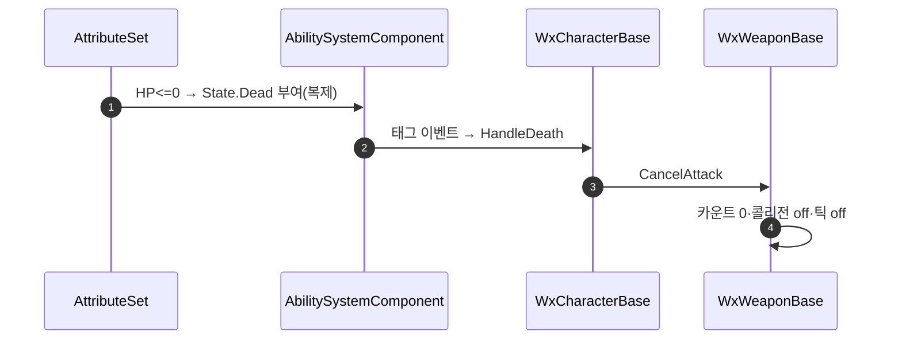

# 사망 시 무기 공격 판정 해제

## 계획

### 목표

캐릭터가 스윙 도중 사망하면 시체가 든 무기의 히트 판정이 남을 수 있다. 사망 시점에 무기 판정을 명시적으로 끊어, "죽으면 공격 판정도 사라진다"를 애님 노티파이 타이밍과 무관한 보장으로 만든다.

### 수정 범위

| 파일 | 수정할 내용 | 구분 |
|---|---|---|
| `Plugins/WxCombat/.../Public/Weapon/WxWeaponBase.h` | 강제 종료용 `CancelAttack()` 선언 | 수정 |
| `Plugins/WxCombat/.../Private/Weapon/WxWeaponBase.cpp` | `CancelAttack()` 정의, `DetachFromCharacter()`가 이를 호출하도록 중복 제거 | 수정 |
| `Source/WxGame/Character/WxCharacterBase.cpp` | `HandleDeath()`에서 장착 무기의 `CancelAttack()` 호출 | 수정 |

### 접근 방식

- **강제 종료 함수 분리**: 히트 판정은 레퍼런스 카운트가 0이 될 때만 꺼진다. `EndAttack()`은 카운트를 1만 깎으므로 겹친 ANS 구간에서 죽으면 판정이 남는다. 카운트와 무관하게 전부 해제하는 `CancelAttack()`을 둔다. 같은 강제 종료 블록이 이미 `DetachFromCharacter()`에 있으므로 그쪽이 새 함수를 호출하게 해 중복을 없앤다. 정상 종료 `EndAttack`과 강제 종료 `CancelAttack`으로 어휘를 가른다.
- **호출 지점은 `HandleDeath`**: `State.Dead`는 복제되는 루스 태그라 태그 이벤트가 모든 머신에서 발화한다. 무기 판정은 몽타주를 재생하는 각 머신에서 로컬로 켜지고 히트 처리도 클라·서버 양쪽에서 돌기 때문에, 정리도 각 머신에서 일어나야 한다. 사망 어빌리티는 서버 개시라 시뮬레이티드 프록시에 들어오지 않아 부적합하다.
- **무기는 떼지 않는다**: 시체가 무기를 계속 들고 있는 외형은 유지하고 판정만 끈다.

---

## 완료

### 수정한 파일

| 파일 | 수정한 내용 | 구분 |
|---|---|---|
| `Plugins/WxCombat/.../Public/Weapon/WxWeaponBase.h` | `CancelAttack()` 선언 추가 | 수정 |
| `Plugins/WxCombat/.../Private/Weapon/WxWeaponBase.cpp` | `CancelAttack()` 정의 추가, `DetachFromCharacter()`의 강제 종료 블록을 호출로 대체 | 수정 |
| `Source/WxGame/Character/WxCharacterBase.cpp` | `HandleDeath()`에서 장착 무기의 공격을 취소 | 수정 |

### 구현·결정과 그 이유

- **`EndAttack` 재사용 대신 강제 종료를 따로 둔 이유**: 정상 종료는 활성 구간을 하나씩 닫는 카운트 감소라서, 구간이 겹친 상태에서 죽으면 판정이 그대로 남는다. 콤보 전환 순간의 사망이 바로 그 경우다. 사망은 남은 구간 수를 따질 상황이 아니므로 전부 닫는 별도 경로가 맞다.
- **호출 지점을 사망 어빌리티가 아닌 캐릭터 사망 처리로**: 판정은 몽타주를 재생하는 각 머신에서 로컬로 켜지고 히트 처리도 양쪽에서 돈다. 사망 태그는 복제되어 모든 머신에서 이 처리를 타지만, 사망 어빌리티는 서버 개시라 시뮬레이티드 프록시를 놓친다.
- **취소를 방송보다 먼저**: 사망을 구독하는 쪽이 이미 판정이 걷힌 상태를 보게 된다.
- **부활·지연 노티파이 대응 불필요**: 다음 공격 시작이 콜리전을 다시 켜고, 뒤늦게 도착한 구간 종료는 남은 구간이 없을 때 조기 반환에 걸려 무시된다.

### 계획 대비 달라진 점

- 계획대로

### 후속 과제

- 에디터 실동작 검증(스윙 도중 처치 시 잔여 판정 없음, 살아있는 상태의 콤보 히트 회귀)은 미수행. 컴파일만 확인했다.
