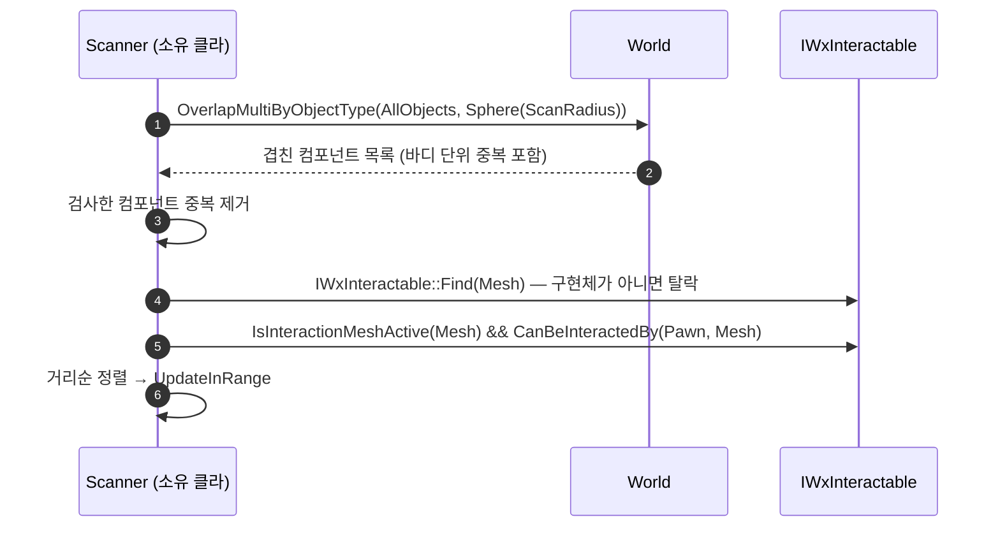

# 상호작용 스캐너 — 전수 액터 순회를 반경 오버랩으로 교체

## 계획

### 목표

`UWxInteractionScannerComponent::ScanAndPush` 가 `TActorIterator<AActor>` 로 월드에 로드된 전 액터를 초당 10회 훑는 구조를 걷어낸다. 스캔 비용을 "월드에 로드된 액터 수"가 아니라 "주변 밀도"에 비례하게 만든다. `module_review_WxWorld.md` 발견 3 대응.

### 수정 범위

| 파일 | 수정할 내용 | 구분 |
|---|---|---|
| `Plugins/WxCore/.../Public/WxInteractable.h` | `GetActiveInteractionMeshes` → `IsInteractionMeshActive` 술어로 교체, 계약 주석 갱신 | 수정 |
| `Plugins/WxWorld/.../Gimmick/WxGimmick.{h,cpp}` | 술어 구현으로 교체, `SetInteractionEnabled` 주석 갱신 | 수정 |
| `Plugins/WxInventory/.../Items/WxItemPickup.{h,cpp}` | 술어 구현으로 교체 | 수정 |
| `Plugins/WxDialogue/.../WxNpc.{h,cpp}` | 술어 구현으로 교체 | 수정 |
| `Source/WxGame/Character/WxEnemyCharacter.{h,cpp}` | 술어 구현으로 교체 | 수정 |
| `Source/WxGame/AbilitySystem/Ability/WxAbility_Interact.cpp` | 서버 활성 검증을 배열+`Contains` 에서 술어 한 줄로 | 수정 |
| `Plugins/WxWorld/.../Interaction/WxInteractionScannerComponent.{h,cpp}` | 후보 수집을 오버랩 기반으로 교체, 주석 갱신 | 수정 |
| `Plugins/WxWorld/README.md`, `Plugins/WxCore/README.md` | 스캔 방식·인터페이스 표현 정합 | 수정 |

### 접근 방식

- **오버랩 1회로 후보 축소와 사거리 판정을 겸한다**: `ScanRadius` 구를 던져 겹친 컴포넌트를 받고, 소유 액터가 `IWxInteractable` 인 것만 남긴 뒤 「지금 켜진 영역인가」와 「이 주체에게 자격이 있는가」만 본다. 겹쳤다는 사실이 곧 사거리 판정이므로 `IsMeshInRange` 를 스캔 경로에서 제거한다 — `IsMeshInRange(Mesh, Origin, R)` 는 `Mesh->OverlapComponent(Origin, Identity, Sphere(R))` 이고 오버랩 쿼리는 같은 원점·반경·심플 형상을 같은 셰이프 집합에 던지므로 "결과에 들어옴" ≡ "사거리 통과"다.

- **채널이 아니라 오브젝트 타입으로 질의한다**: 오브젝트 쿼리는 셰이프의 오브젝트 타입만 보고 채널 응답 매트릭스를 보지 않으므로(`FCollisionQueryFilterCallback::CalcQueryHitType` 의 `EQueryType::ObjectType` 분기), `AllObjects` 로 던지면 "대상 자격은 콜리전 응답·프리셋과 무관하다"는 기존 설계가 유지된다. 전제 차이는 영역 메시에 쿼리 콜리전이 켜져 있어야 한다는 것뿐인데(`NoCollision` 은 피직스 스테이트가 없어 지금도 미감지), 이는 `WxInteractable.h` 가 이미 명문화한 계약이다.

- **검사한 컴포넌트 단위 중복 제거**: 엔진은 오버랩 결과를 `(Component, ItemIndex)` 로만 중복 제거하고 스켈레탈은 ItemIndex 가 피직스 애셋 바디 인덱스라, 근처 캐릭터 하나가 결과를 10~15개 만든다. 가드를 "채택된 후보"가 아니라 **"이미 검사한 컴포넌트"** 기준으로 걸어야 자격 미달 대상(정면을 본 적 등)의 `GetEligibleFinisherEventTag` 가 바디 수만큼 반복되지 않는다.

- **활성 판정을 배열에서 술어로**: 이 변경 후 `GetActiveInteractionMeshes` 의 소비처는 스캐너와 서버 어빌리티 둘뿐이고 양쪽 다 `Contains` 멤버십 질의다. `IsInteractionMeshActive(const UPrimitiveComponent*)` 로 내리면 구현 4개가 한 줄이 되고 스캔마다의 TArray 채우기가 사라진다.

- **검토했으나 넣지 않음**: `USphereComponent` 로 엔진 증분 오버랩 추적에 얹기(오버랩 이벤트는 응답 매트릭스를 양쪽 다 Overlap 으로 요구 — 영역 메시들이 전 채널 Ignore 라 성립 불가, 바꾸면 콜리전 무관 설계가 깨짐), `ECC_WxAttack` 채널 제외(안전하나 이득이 작음), 스캔당 TArray 할당·정렬(n 이 한 자릿수), 10Hz 주기 조정.

---

## 완료

### 수정한 파일
| 파일 | 수정한 내용 | 구분 |
|---|---|---|
| `Plugins/WxCore/.../Public/WxInteractable.h` | `GetActiveInteractionMeshes` → `IsInteractionMeshActive` 술어로 교체, 쿼리 콜리전이 감지 전제이기도 함을 계약에 명시 | 수정 |
| `Plugins/WxWorld/.../Gimmick/WxGimmick.{h,cpp}` | 술어 구현(`ActiveInteractionMeshes` 순회 + null 가드), `SetInteractionEnabled` 주석 갱신 | 수정 |
| `Plugins/WxInventory/.../Items/WxItemPickup.{h,cpp}` | 술어 구현(`Mesh == MeshComponent`), 생성자 주석 갱신 | 수정 |
| `Plugins/WxDialogue/.../WxNpc.{h,cpp}` | 술어 구현(`Mesh == MeshComponent`), 생성자 주석 갱신 | 수정 |
| `Source/WxGame/Character/WxEnemyCharacter.{h,cpp}` | 술어 구현(`InMesh == GetMesh()`) | 수정 |
| `Source/WxGame/AbilitySystem/Ability/WxAbility_Interact.cpp` | 서버 활성 검증을 배열+`Contains` 에서 술어 한 줄로 | 수정 |
| `Plugins/WxWorld/.../Interaction/WxInteractionScannerComponent.cpp` | `TActorIterator` 순회를 `OverlapMultiByObjectType` 기반 수집으로 교체, include 정리 | 수정 |
| `Plugins/WxWorld/.../Interaction/WxInteractionScannerComponent.h` | 클래스·`ScanAndPush`·`ScanRadius` 주석을 오버랩 기준으로 갱신 | 수정 |
| `Plugins/WxCore/README.md`, `Plugins/WxWorld/README.md` | 인터페이스명·스캔 방식 표현 정합 | 수정 |

### 구현·결정과 그 이유
- **오버랩 결과를 사거리 판정으로 그대로 쓴다**: `IsMeshInRange` 는 결국 같은 원점·반경·심플 형상의 오버랩 테스트라, 구 오버랩 결과에 들어왔다는 사실이 이미 그 판정을 통과했다는 뜻이다. 스캔 경로에서 메시별 물리 테스트를 통째로 제거했다.
- **채널이 아니라 오브젝트 타입(`AllObjects`)으로 질의**: 오브젝트 쿼리는 셰이프의 오브젝트 타입만 보고 응답 매트릭스를 보지 않으므로, 영역 메시들이 전 채널 Ignore 인 현재 배선(`AWxNpc`)을 그대로 두고도 감지된다. 전용 채널을 팔 수도 없다 — 영역 메시가 곧 실제 메시라 적 메시는 `ECC_WxAttack` 피격 때문에 `Pawn`, 픽업 메시는 물리 발사 때문에 `WorldDynamic` 이어야 한다.
- **중복 가드를 "검사한 컴포넌트" 기준으로**: 엔진은 오버랩 결과를 `(Component, ItemIndex)` 로만 중복 제거하고 스켈레탈은 ItemIndex 가 피직스 애셋 바디 인덱스라, 근처 캐릭터 하나가 결과를 10여 개 만든다. "채택된 후보" 기준으로 걸면 자격 미달로 탈락하는 적(살아있고 정면)의 `GetEligibleFinisherEventTag` 가 바디 수만큼 반복되므로, 채택 여부와 무관하게 검사 여부로 걸었다.
- **활성 판정을 술어로 내림**: 소비처가 스캐너와 서버 어빌리티 둘뿐이고 양쪽 다 멤버십 질의라 배열을 만들 이유가 없었다. 구현 4개가 한 줄이 되고 스캔·서버 검증 양쪽의 TArray 채우기가 사라졌다.
- **`AddIgnoredActor(Pawn)`**: 캐릭터 캡슐·메시는 `AllObjects` 오브젝트 쿼리에 그대로 잡혀 매 스캔 결과를 바디 수만큼 채운다. 자기 자신은 상호작용 대상이 아니므로 쿼리 단계에서 제외했다.

### 계획 대비 달라진 점
- `AWxEnemyCharacter` 의 술어 파라미터명만 `InMesh` 로 바꿨다 — `ACharacter::Mesh` 멤버를 가려 C4458(= 이 프로젝트에선 에러)이 났다.

### 후속 과제
- PIE 실기 검증 미완: 기믹 State 전환으로 영역이 꺼질 때 목록에서 빠지는지, 적 처형이 후방에서만 뜨는지, 엘리베이터처럼 영역이 여럿인 대상에서 메시 단위로 각각 잡히는지.
- 영역 메시가 `PhysicsOnly`(쿼리 콜리전 off, 피직스 바디는 있음)로 설정돼 있으면 이제 감지되지 않는다. 계약상 이미 금지된 배선이지만 기존 기믹 BP 에 그런 설정이 있는지는 확인하지 않았다.
- `Docs/Programmer/Interaction_System.md` 가 `GetActiveInteractionMeshes` 기준으로 쓰여 있어 스테일하다(`/analyze-system` 으로 갱신 대상).
