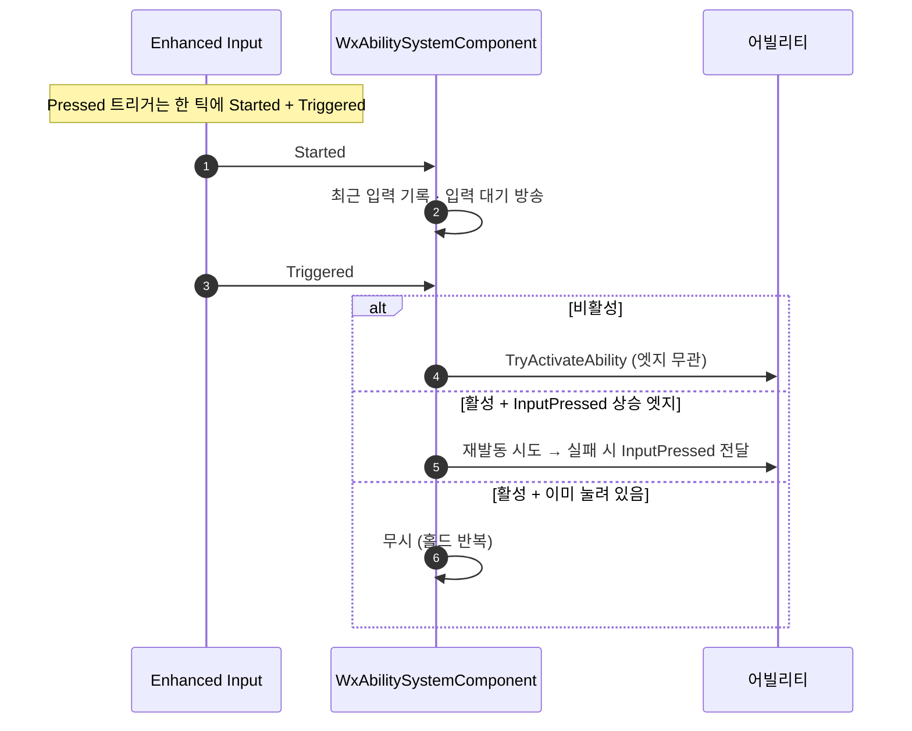

# 어빌리티 입력 라우팅을 Triggered 단일 진입점으로 통합

## 계획

### 목표
락온을 켠 뒤 같은 키를 다시 눌러도 해제되지 않는 버그를 고친다. `Pressed` 트리거는 누른 틱에 `Started`와 `Triggered`를 모두 발화하는데, 두 이벤트에 각각 재입력과 발동을 걸어 두고 배타 조건을 `Spec.IsActive()`로 삼은 탓에, 락온이 `Started`에서 꺼지며 그 조건을 뒤집어 뒤따르는 `Triggered`가 다시 켠다. 어빌리티 라우팅을 한 진입점으로 합쳐 한 번의 입력이 두 번 처리되지 않게 한다.

### 수정 범위
| 파일 | 수정할 내용 | 구분 |
|---|---|---|
| `Plugins/WxCombat/.../Private/AbilitySystem/WxAbilitySystemComponent.cpp` | `Started`에서 어빌리티 순회 제거, `Triggered`에 재입력 처리 병합 | 수정 |
| `Plugins/WxCombat/.../Public/AbilitySystem/WxAbilitySystemComponent.h` | 두 진입점의 역할 주석 갱신 | 수정 |
| `Docs/Programmer/Ability_Activation_Flow.md` | 진입점 역할 서술을 단일 라우팅으로 갱신 | 수정 |

헤더에 멤버는 추가하지 않는다. 어빌리티 C++와 입력 에셋, `WxPlayerCharacter`의 세 바인딩은 건드리지 않는다.

### 접근 방식
- **라우팅을 `Triggered` 한 곳으로**: `Started`는 최근 입력 기록과 입력 대기 방송만 맡는다. 발동도 재입력도 `Triggered`가 처리하므로 한 물리 입력이 두 경로로 갈라질 수 없다.
- **반복 흡수는 엔진 스톡 필드의 엣지로**: 홀드형 트리거가 매 프레임 내는 반복을 걸러낼 장부를 새로 만들지 않는다. `FGameplayAbilitySpec::InputPressed`가 이미 "이 spec의 입력이 눌려 있는가"를 뜻하고 릴리즈 진입점이 이미 되돌리고 있으므로, 그 상승 엣지가 곧 "다시 눌렀다"다. 프레임이나 시간에 기대지 않고 spec 단위라 액션 단위 기록보다 정밀하다.
- **발동은 엣지를 보지 않는다**: 비활성이면 조건 없이 발동을 시도해, 차단이 풀리는 순간 쥐고 있던 입력이 발동하는 재평가 동작을 유지한다. 엣지는 활성 상태의 재입력에만 건다.

---

## 완료

### 수정한 파일
| 파일 | 수정한 내용 | 구분 |
|---|---|---|
| | | |

### 구현·결정과 그 이유
-

### 계획 대비 달라진 점
-

### 후속 과제
-
