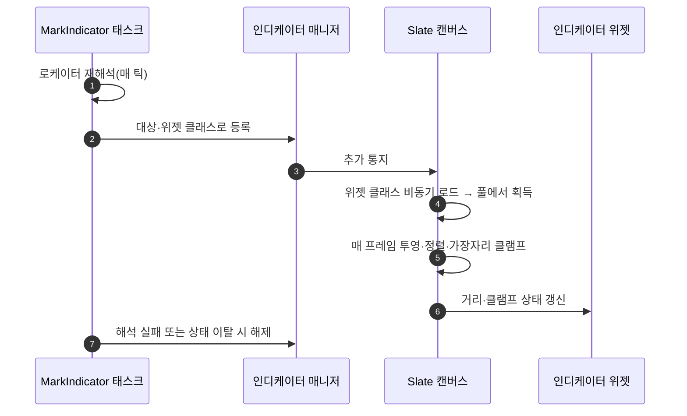

# 퀘스트 인디케이터를 Lyra IndicatorSystem 방식으로 전환

## 계획

### 목표
퀘스트 마커를 월드 액터 스폰에서 화면 인디케이터 등록으로 바꾼다. 지금은 대상 위치에 마커 액터(빔 + 월드공간 위젯)를 스폰하는데, 월드에 존재하는 물건이라 **대상이 화면 밖이면 아무 단서가 없고**, 거리에 따라 작아지고 지형에 가려지며, 스폰 시점 위치로 고정되어 움직이는 대상을 따라가지 못한다. 오픈월드 퀘스트에서 가장 중요한 "어느 쪽으로 가야 하나"를 주려면 화면 가장자리 클램프와 방향 화살표가 필요하고, 그것이 Lyra 방식의 핵심이다. 마커 액터와 빔은 전면 폐기한다.

### 수정 범위
| 파일 | 수정할 내용 | 구분 |
|---|---|---|
| `Plugins/WxUI/.../Public/Indicator/WxIndicatorDescriptor.h/.cpp` | 인디케이터 1개의 등록증(대상 컴포넌트·월드 오프셋·위젯 클래스 + 런타임 슬롯), 자기 해제 | 신규 |
| `Plugins/WxUI/.../Public/Indicator/WxIndicatorManagerComponent.h/.cpp` | `UControllerComponent` 레지스트리. 등록증 팩토리 겸 Add/Remove, 변경 통지 | 신규 |
| `Plugins/WxUI/.../Public/Indicator/WxIndicatorWidget.h/.cpp` | 인디케이터 위젯 베이스. 거리·클램프 상태 수신 이벤트 하나만 노출 | 신규 |
| `Plugins/WxUI/.../Public/Indicator/WxIndicatorCanvas.h/.cpp` | HUD에 배치하는 UMG 래퍼. 클램프 화살표 브러시 소유 | 신규 |
| `Plugins/WxUI/.../Private/Indicator/SWxIndicatorCanvas.h/.cpp` | 투영·깊이 정렬·가장자리 클램프·화살표·위젯 풀·비동기 로드 담당 Slate 패널 | 신규 |
| `Plugins/WxUI/.../Public/Indicator/WxIndicatorStateTreeNodes.h/.cpp` | `FWxStateTreeTask_MarkIndicator` 를 WxQuest 에서 이전·재구현 | 신규 |
| `Plugins/WxUI/Source/WxUI/WxUI.Build.cs` | `ModularGameplay`·`StateTreeModule`·`UniversalObjectLocator` 의존성 추가 | 수정 |
| `Plugins/WxQuest/.../Quest/WxQuestStateTreeNodes.h/.cpp` | `MarkIndicator` 태스크·인스턴스 데이터·마커 스폰 헬퍼 삭제, 노드 목록 주석 갱신 | 수정 |
| `/Game/UI/Widget/WBP_QuestIndicator` | 인디케이터 위젯 베이스를 부모로 신설(다이아몬드 + 거리 텍스트) | 신규(MCP) |
| `/Game/UI/Widget/WBP_GameHUD` | 루트 첫 자식으로 인디케이터 캔버스 배치, 화살표 브러시 지정 | 수정(MCP) |
| `/Game/Framework/GM_Combat` | `FrameworkComponents` 에 인디케이터 매니저 컴포넌트 추가 | 수정(MCP) |
| `/Game/Quest/ST_Quest` | `Mark Indicator` 노드를 새 파라미터로 재저작 | 수정(MCP) |
| `/Game/Quest/BP_QuestMarker` | 폐기 | 삭제 |

### 접근 방식
- **소유 모듈**: 인디케이터는 도메인 무관 UI 인프라이므로 ST 태스크까지 WxUI 가 소유한다. 보상 지급 노드를 WxInventory 가 소유하는 기존 전례와 같은 모양이라, 퀘스트 플러그인이 UI 플러그인을 참조할 필요가 없어 플러그인 규칙이 지켜진다.
- **부착은 데이터로**: 매니저는 컨트롤러 컴포넌트라 게임모드 에셋의 프레임워크 컴포넌트 목록에 넣으면 ModularGameplay 가 플레이어 컨트롤러에 자동 주입한다. 컨트롤러 코드는 건드리지 않는다(스폰 컴포넌트·퀘스트 컴포넌트와 동일 경로).
- **레이어 태그 없음**: 캔버스는 CommonUI 스택에 푸시되지 않고 이미 Game 레이어에 떠 있는 HUD 안의 자식 위젯이다. Lyra 의 이름(`IndicatorLayer`)은 우리 어휘에서 스택 레이어로 오해되므로 캔버스로 바꿔 가져온다.
- **핵심만 채택**: 클램프·화살표·카메라 뒤 처리·타이머 자동 정지·dirty 무효화·위젯 풀·소프트 클래스 비동기 로드를 취한다. 투영 모드 5종, 정렬 우선순위, 정렬 스위치, 미사용 필드, 자동 제거, BP 게터/세터 다발은 버린다. Lyra 의 깊이 정렬은 카메라 거리가 아니라 화면 가로 좌표를 키로 쓰는 버그가 있어 바로잡아 가져온다. 화살표 풀은 고정 10개 상한 대신 필요할 때 늘린다.
- **수명 단일 소유**: 태스크가 매 틱 로케이터를 재해석해 해석되면 등록, 해석 실패(스트리밍 아웃·파괴)면 해제하고, 상태를 떠날 때도 해제한다. 자동 제거를 겹치지 않아 "누가 지웠는지"가 모호해지지 않는다. 표시는 로컬 사건이라 0번 컨트롤러의 매니저를 찾는다(기존 도달 판정 태스크와 같은 전제).
- **위젯 계약**: 인터페이스 대신 구체 베이스 클래스를 두고, 캔버스가 이미 계산하는 카메라 거리와 클램프 여부를 넘기는 이벤트 하나만 노출한다. 거리 표시가 공짜로 따라오고 픽커 타입도 좁혀진다. 매 프레임 BP 호출을 피해 값이 유의미하게 바뀔 때만 호출한다.

---

## 완료

### 수정한 파일
| 파일 | 수정한 내용 | 구분 |
|---|---|---|
| `Plugins/WxUI/.../Public/Indicator/WxIndicatorDescriptor.h`, `Private/Indicator/WxIndicatorDescriptor.cpp` | 등록증(대상·오프셋·위젯 클래스 + 자기 해제). 표시 측 기록은 캔버스 슬롯이 들고 있어 순수 데이터로 유지 | 신규 |
| `Plugins/WxUI/.../Public/Indicator/WxIndicatorManagerComponent.h/.cpp` | 컨트롤러 레지스트리. 인자 3개 팩토리 하나로 발급, 변경 통지 | 신규 |
| `Plugins/WxUI/.../Public/Indicator/WxIndicatorWidget.h` | 위젯 베이스. 거리·클램프 상태 수신 이벤트 하나만 노출 | 신규 |
| `Plugins/WxUI/.../Private/Indicator/SWxIndicatorCanvas.h/.cpp` | 투영·깊이 정렬·가장자리 클램프·화살표·위젯 풀·비동기 로드 담당 Slate 패널 | 신규 |
| `Plugins/WxUI/.../Public/Widget/WxHUDLayout.h`, `Private/Widget/WxHUDLayout.cpp` | `RebuildWidget` 오버라이드로 HUD 내용 아래에 캔버스를 깔고, 클램프 화살표 브러시를 소유 | 수정 |
| `Plugins/WxUI/.../Public/Indicator/WxIndicatorStateTreeNodes.h`, `Private/.../WxIndicatorStateTreeNodes.cpp` | `FWxStateTreeTask_MarkIndicator` 를 WxQuest 에서 이전·재구현(등록/해제 수명 관리) | 신규 |
| `Plugins/WxUI/Source/WxUI/WxUI.Build.cs`, `Plugins/WxUI/WxUI.uplugin` | `ModularGameplay`·`StateTreeModule`·`UniversalObjectLocator` 의존성, 플러그인 의존성 2건 | 수정 |
| `Plugins/WxUI/.../WxUIModule.h/.cpp` | `LogWxUI` 로그 카테고리 신설(다른 플러그인과 동일 관례) | 수정 |
| `Plugins/WxQuest/.../Quest/WxQuestStateTreeNodes.h/.cpp` | MarkIndicator 태스크·인스턴스 데이터·마커 스폰 헬퍼 삭제, 불용 include·전방선언·노드 목록 주석 정리 | 수정 |
| `/Game/UI/Widget/WBP_QuestIndicator` | 인디케이터 위젯 베이스 상속. 다이아몬드 아이콘(45° 회전 RoundedBox) | 신규(MCP) |
| `/Game/UI/Widget/WBP_GameHUD` | (되돌림) 화살표 브러시를 지정했다가 화살표 기능 자체를 걷어내며 불용 처리 | 수정(MCP) |
| `/Game/Framework/GM_Combat` | `FrameworkComponents` 에 인디케이터 매니저 추가 | 수정(MCP) |
| `/Game/Quest/ST_Quest` | Step1 의 Mark Indicator 노드를 새 구조체·파라미터로 재저작(완료 판정 제외), 컴파일·저장 | 수정(MCP) |
| `/Game/Quest/BP_QuestMarker` | 폐기(참조자 0 확인 후 삭제) | 삭제 |

### 구현·결정과 그 이유
- **캔버스는 HUD 루트 위젯이 코드로 깐다**: `RebuildWidget` 이 부모가 만든 HUD 트리 루트를 오버레이로 감싸고 그 아래 슬롯에 캔버스를 넣는다. 위젯 트리를 편집하지 않아도 모든 HUD 레이아웃이 인디케이터를 갖고, HUD 루트와 같은 전체화면 지오메트리를 받으며, HUD 의 자식이라 표시 여부가 HUD 를 따라간다. `UCommonActivatableWidget::RebuildWidget` 은 Super 위임만 하므로 체이닝도 안전하다.
- **UMG 트리에 배치하지 않은 이유**: 자식 HUD 는 부모의 Named Slot 을 채우는 구조라 전체화면 캔버스를 놓을 루트 패널이 자신에게 없고, 코너 슬롯에 넣으면 좌표계가 그 사각형 안으로 접힌다. 부모 레이아웃 에셋에 직접 배치하는 방법도 되지만 스캐폴드 에셋을 건드리게 되므로, 코드로 깔아 에셋을 아예 손대지 않는 쪽을 택했다.
- **뷰포트 직접 부착·AHUD 를 쓰지 않은 이유**: 뷰포트에 바로 붙이면 캔버스가 HUD 트리 밖이라 메뉴로 HUD 가 가려질 때 표시가 따로 움직여 별도 연동 코드가 필요하다. AHUD 는 본질이 Canvas 즉시 모드 드로잉이라 풀링되는 UMG 위젯과 방향이 반대이며, Lyra 의 HUD 액터도 클래스 주석대로 디버그 렌더링 전용이고 인디케이터와 무관하다(레이어는 HUD 위젯 안에, 레지스트리는 컨트롤러 컴포넌트에 있다).
- **화살표는 v1 범위에서 제외(사용자 결정)**: 지금은 인디케이터 위젯만 뜨면 충분하다는 판단으로 화살표 브러시·리프 위젯·회전 테이블·화살표 슬롯 풀을 모두 걷어냈다. 가장자리 클램프 자체는 남아 화면 밖 대상도 계속 보이며, 클램프 여부는 위젯 갱신 이벤트로 여전히 전달되므로 위젯이 스스로 외형을 바꿀 수 있다. 화살표 슬롯이 사라져 자식 목록이 하나로 줄었고 `FCombinedChildren` 도 필요 없어졌다.
- **등록증에서 표시 기록을 뺐다**: Lyra 는 위젯·슬롯 호스트·로드 핸들을 등록증에 얹고 캔버스를 friend 로 열어 두는데, 그 기록의 주인은 캔버스 슬롯이다. 슬롯으로 옮기니 friend 도 사라지고 등록증이 순수 데이터로 남았다.
- **카메라 앞뒤 플래그 제거**: Lyra 의 투영 함수는 앞뒤 판정을 내부에서 계산하고도 항상 true 를 돌려주므로, 캔버스의 앞뒤 플래그와 그것에 의존하는 사분면 고정 분기가 실행되지 않는 죽은 코드다. 화면 밖으로 밀어내는 처리만 있으면 클램프가 뒤쪽 대상도 올바른 가장자리에 붙이므로 플래그 자체를 없앴다.
- **깊이 정렬 키 수정**: Lyra 는 카메라 거리가 아니라 화면 가로 좌표로 정렬한다(투영 결과의 Z 대신 X 를 넣는 버그). 거리로 바로잡았다.
- **모서리 클램프 정확도**: 사각형 밖 대상은 두 평면과 함께 교차하는데 Lyra 는 마지막 교차를 채택해 다른 축이 범위를 벗어날 수 있다. 경계 위에 놓인 교차점만 채택하도록 바꿨다.
- **화살표 상한 제거**: 미리 열 개를 만들어 두는 대신 필요할 때 슬롯을 늘린다. 동시 클램프가 열한 개를 넘기면 화살표가 빠지는 조용한 상한이 없다.
- **비동기 로드 대체**: Lyra 의 `AsyncMixin` 은 엔진에 없는 Lyra 번들 플러그인이다. 프로젝트가 이미 쓰는 StreamableManager 요청으로 갈았고, 대기 목록 자체를 "늦게 온 완료 통지 버리기"의 근거로 써서 취소 성공 여부에 기대지 않는다.
- **수명은 태스크가 단독 소유**: 대상 컴포넌트가 null 이 되면 캔버스는 표시만 접고, 등록증 제거는 매 틱 로케이터를 재해석하는 태스크가 한다. Lyra 의 자동 제거를 겹치지 않아 "누가 지웠는지"가 모호해지지 않는다.

### 계획 대비 달라진 점
- **HUD 배치를 위젯이 아니라 코드로**: 계획은 UMG 래퍼 위젯을 HUD 에셋에 배치하는 것이었다. 처음엔 부모 레이아웃 에셋에 배치했으나(자식엔 전체화면 루트가 없어서), HUD 스캐폴드 에셋을 건드리지 않는 편이 낫다는 사용자 판단으로 `RebuildWidget` 오버라이드로 옮겼다. 그 결과 UMG 래퍼 클래스가 불필요해져 삭제하고 에셋은 원본 바이트로 되돌렸다.
- **계획의 읽기 전용 근거는 틀렸다**: "부모가 읽기 전용이라 저장 불가"라고 적었으나 읽기 전용은 그 파일만의 잠금이 아니라 콘텐츠 4,789개 전체의 기본 상태이고 에디터가 저장할 때 풀린다. 배치 위치를 가른 실제 근거는 전체화면 루트의 부재였다.
- **거리 텍스트 미배선**: 위젯에 거리를 넘기는 훅은 구현했지만 WBP 쪽 표시는 넣지 않았다(그래프 배선 필요). v1 은 아이콘만 그린다.
- **대상 픽커 제한 미계승**: 작업 중 사용자가 구 노드의 Target 픽커를 WxSpawner 로 제한했으나 새 노드는 제한 없이 뒀다. 실제 Step1 의 대상은 TargetPoint(도달 지점)이라 제한하면 그 노드를 다시 지정할 수 없고, 인디케이터는 도메인 무관 UI 라 특정 도메인 클래스에 묶을 이유도 없다.
- **비주얼은 임시**: 아이콘은 회전한 RoundedBox 다.
- **화살표 제거**: 계획의 핵심 항목이었으나 사용자 결정으로 v1 에서 빼고 클램프만 남겼다(위 결정 항목 참조).

### 후속 과제
- **PIE 시각 확인 보류**: 퀘스트가 Start 게이트(`Quest.Start` 이벤트 대기)에 머물고 그 이벤트를 쏘는 주체가 아직 없어(직전 세션 worklog 의 후속 과제) 마커·화살표를 화면으로 확인하지 못했다. 빌드·경고 0, ST 컴파일 통과, PIE 실행 중 인디케이터 관련 에러·경고 없음까지는 확인했다. 이벤트 발화 수단이 생기면 클램프·화살표·거리 갱신을 한 번 눈으로 볼 것.
- 거리 문구를 WBP 그래프에서 `OnIndicatorRefreshed` 로 잇기(또는 네이티브 처리 여부 결정).
- Step2(적 소탕)에도 스포너 마커를 둘지 결정 — 현재 인디케이터는 Step1 에만 있다.
- 아이콘 실제 아트 교체.
- `WBP_GameHUD` 에 불용이 된 화살표 브러시 값(과 그에 딸린 SDF 머티리얼 참조)이 남아 있다 — C++ 속성이 사라져 로드 시 버려지므로 동작에는 영향이 없고, 다음 저장 때 참조까지 사라진다.
