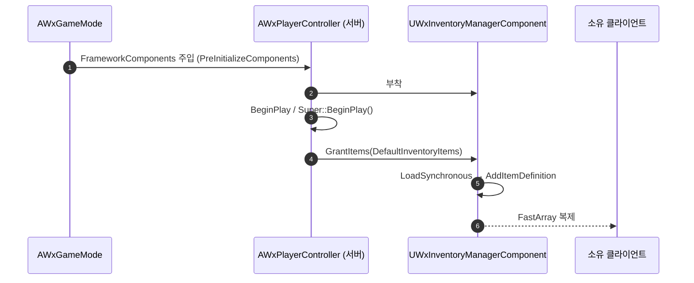

# 기본 지급 아이템 설정을 WxPlayerController 프로퍼티로 이전

## 계획

### 목표
인벤토리 매니저를 ModularGameplay 주입으로 바꾼 뒤 설정 불가능해진 기본 지급 아이템 목록을, 이미 BP 서브클래스로 운영 중인 `AWxPlayerController` 의 프로퍼티로 옮겨 다시 설정 가능하게 만든다. "누가 무엇을 들고 시작하는가"는 아이템 컨테이너가 아니라 게임 레벨 정책이므로 소유 지점도 PC 로 확정한다.

### 수정 범위
| 파일 | 수정할 내용 | 구분 |
|---|---|---|
| `Source/WxGame/Controller/WxPlayerController.h` | `Items/WxRewardTableRow.h` include, `DefaultInventoryItems` 프로퍼티 추가 | 수정 |
| `Source/WxGame/Controller/WxPlayerController.cpp` | `BeginPlay` 에서 권한일 때 인벤토리에 지급 요청 | 수정 |
| `Plugins/WxInventory/.../Public/Inventory/WxInventoryManagerComponent.h` | `DefaultItems` 멤버·`GrantDefaultItems()`·`BeginPlay` 오버라이드 제거, public `GrantItems(const TArray<FWxItemRewardEntry>&)` 추가 | 수정 |
| `Plugins/WxInventory/.../Private/Inventory/WxInventoryManagerComponent.cpp` | 위 선언 변경 반영(지급 루프 본문은 그대로 이동) | 수정 |

### 접근 방식
- **데이터는 PC, 지급 절차는 컴포넌트**: 목록은 PC 가 `EditDefaultsOnly` 로 노출하고, "빈 항목 무시 → `LoadSynchronous` → `AddItemDefinition`" 루프는 기존 `GrantDefaultItems()` 본문을 살려 컴포넌트의 public `GrantItems` 로 바꾼다. 지연 로드 정책이 인벤토리 플러그인에 남고 PC 는 한 줄 호출만 한다.
- **컴포넌트의 `DefaultItems` 제거**: 설정 지점이 둘이면 둘 다 발화해 중복 지급이 된다. 지급이 `BeginPlay` 오버라이드의 유일한 내용이었으므로 오버라이드도 지운다.
- **호출 시점은 PC `BeginPlay`(`Super::BeginPlay()` 이후)**: 서버에서 인벤토리는 `PreInitializeComponents` 의 receiver 등록 시점에 주입되므로 이 시점엔 이미 부착돼 있고, `Super` 가 컴포넌트 `BeginPlay` 를 먼저 돌린 뒤라 초기화도 끝나 있다.
- **권한 게이팅**: `AddItemDefinition` 은 `check(HasAuthority())` 라 클라 호출은 크래시다. `HasAuthority()` 로 감싸고 클라는 FastArray 복제로만 받는다. 인벤토리가 없으면(GameMode 미등록) 조용히 건너뛴다.

---

## 완료

### 수정한 파일
| 파일 | 수정한 내용 | 구분 |
|---|---|---|
| `Source/WxGame/Controller/WxPlayerController.h` | `Items/WxRewardTableRow.h` include, `DefaultInventoryItems`(EditDefaultsOnly) 추가 | 수정 |
| `Source/WxGame/Controller/WxPlayerController.cpp` | `BeginPlay` 에 권한·비어있음 게이트를 건 지급 호출 추가 | 수정 |
| `.../Public/Inventory/WxInventoryManagerComponent.h` | `DefaultItems` 멤버·`GrantDefaultItems()`·`BeginPlay` 오버라이드 제거, public `GrantItems(const TArray<FWxItemRewardEntry>&)` 추가 | 수정 |
| `.../Private/Inventory/WxInventoryManagerComponent.cpp` | `BeginPlay` 제거, 지급 루프를 `GrantItems` 로 옮겨 `AddItemDefinition` 뒤(public 구현부)에 배치 | 수정 |

### 구현·결정과 그 이유
- **목록은 PC, 루프는 컴포넌트**: 무엇을 들고 시작하는가는 게임 정책이라 PC 가 갖고, `TSoftObjectPtr` 동기 로드 정책은 인벤토리 플러그인에 남겼다. WxGame 이 로드 규칙을 재구현하지 않는다.
- **컴포넌트의 `DefaultItems` 를 남기지 않음**: 설정 지점이 둘이면 둘 다 발화해 중복 지급이 된다. 지급이 컴포넌트 `BeginPlay` 의 유일한 내용이었으므로 오버라이드까지 걷어냈다.
- **`GrantItems` 를 public 범용 API 로**: 이름에서 "Default" 를 뺐다. 목록을 소유하지 않고 받은 대로 지급하므로, 체크포인트 보급 같은 다른 서버 지급 경로도 그대로 쓸 수 있다.
- **`HasAuthority()` 게이트**: `AddItemDefinition` 이 `check(HasAuthority())` 라 클라 호출은 크래시다. 클라는 결과를 FastArray 복제로만 받는다.
- **`Super::BeginPlay()` 이후 호출**: 인벤토리는 receiver 등록(`PreInitializeComponents`)에서 주입되고 `Super` 가 컴포넌트 `BeginPlay` 까지 마치므로, 그 뒤에 부르면 부착·초기화가 모두 끝난 상태다.

### 계획 대비 달라진 점
- 계획대로. 지급 함수 위치만 계획에 없던 결정으로, cpp 안에서 private 헬퍼 구역이 아니라 `AddItemDefinition` 바로 뒤(헤더의 public 선언 순서와 일치)로 옮겼다.

### 후속 과제
- `BP_WxPlayerController` 의 `Wx|Inventory > Default Inventory Items` 를 실제로 채워야 지급이 일어난다 — C++ 기본값은 비어 있다.
- 컴포넌트 BP 서브클래스에 `DefaultItems` 를 채워 쓰던 에셋이 있으면 값이 사라진다(현재 그런 에셋은 확인되지 않음).
- 세이브 로드로 시작할 때의 중복 지급 여부는 미검증. 현재 세이브 시스템이 인벤토리를 복원하지 않아 문제가 없지만, 복원이 생기면 지급 시점을 재검토해야 한다.
