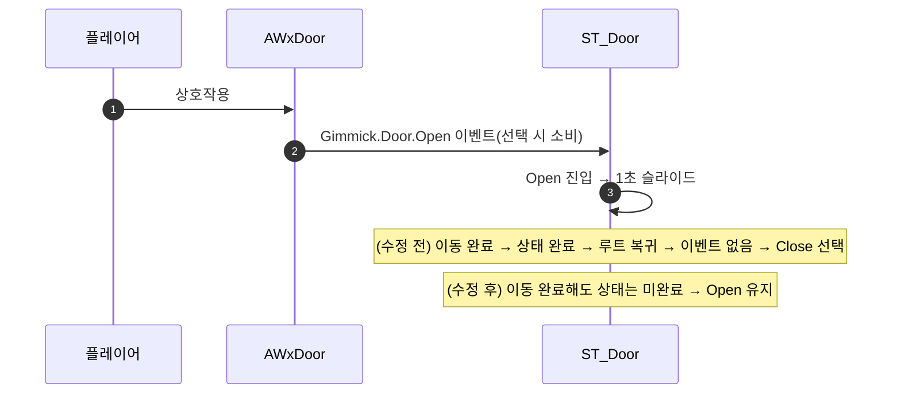

# 문이 열리자마자 닫히는 현상 수정 (ST_Door 완료 판정)

## 계획

### 목표
BP_Door 가 상호작용으로 열린 직후 곧바로 다시 닫히는 문제를 없앤다. 원인은 ST_Door 의 Open·Close 가 머무는 상태인데도 이동 태스크가 완료 판정에 포함돼 있어, 슬라이드가 끝나면 상태가 완료되고 엔진이 루트로 되돌아가 조건 없는 Close 를 다시 고르기 때문이다.

### 수정 범위
| 파일 | 수정할 내용 | 구분 |
|---|---|---|
| `Content/WorldObject/Gimmick/ST_Door.uasset` | Open·Close 두 상태의 Component Move 4개를 완료 판정에서 제외(Considered for Completion 해제) | 수정 |

### 접근 방식
- **머무는 상태는 완료시키지 않는다**: 기믹 ST 는 상태 태그 이벤트로만 전이하는 재선택 패턴이라, 완료 전이가 없는 상태가 스스로 완료되면 엔진이 "완료 전이를 못 찾음 → 루트로 복귀"로 처리해 조건 없는 마지막 자식(Close)을 다시 고른다. Open 의 진입 이벤트는 선택 시 소비되므로 되돌아온 재선택에서는 Open 이 후보에서 빠지고, 결국 문이 닫힌다. 두 상태 모두 목표 포즈를 선언만 하는 자리이므로 이동 태스크를 완료 판정에서 빼 상태가 영영 완료되지 않게 한다(ST_Elevator 의 Idle 과 동일한 처리).
- **다른 선택지를 쓰지 않는 이유**: 완료 전이로 자기 자신을 다시 지목하면 매 프레임 재선택이 남고, 보물상자·체크포인트처럼 완료 시 트리를 Succeeded 로 멈추면 이후 Close 이벤트를 받을 수 없어 문의 양방향 구조가 죽는다. Close 에 Required Event 를 주는 방법은 시작 시 아무 상태도 못 골라 트리가 실패한다.

---

## 완료

### 수정한 파일
| 파일 | 수정한 내용 | 구분 |
|---|---|---|
| `Content/WorldObject/Gimmick/ST_Door.uasset` | Open·Close 의 Component Move 4개를 완료 판정에서 제외 | 수정 |

### 구현·결정과 그 이유
- **완료 판정 제외로 해결**: 엔진은 완료된 상태의 완료 전이를 못 찾으면 루트로 되돌아가 재선택한다("Could not trigger completion transition, jump back to root state"). 이 재선택에는 진입 이벤트가 남아 있지 않으므로 조건 없는 Close 가 뽑히고, 그 이동 태스크가 문을 원위치로 되돌리고 있었다. 상태 자체를 완료시키지 않으면 이 경로가 아예 열리지 않는다.
- **Close 도 함께 처리**: 증상은 Open 에서만 보였지만 Close 도 같은 구조라 매 프레임 완료→루트 복귀→Close 재선택을 반복하고 있었다. 재선택 시 태스크가 다시 진입하지 않아 눈에 띄지 않았을 뿐, 같은 오작성이라 함께 껐다.
- **태스크가 하나도 완료 판정에 없어도 안전한 이유**: 컴파일러가 상태마다 여분의 비트를 하나 넣어 완료 마스크가 0 이 되지 않게 하므로, 판정 대상이 없으면 상태는 완료되지 않고 계속 Running 으로 남는다(TasksCompletion 이 All 이어도 동일).

### 계획 대비 달라진 점
- 계획대로.

### 후속 과제
- 실제 열기 동작(플레이어 상호작용)은 PIE 수동 확인이 필요하다. 자동 검증은 시뮬레이트로 Close 쪽만 확인했다(문 액터의 루트 복귀 로그가 매 프레임 → 0 회, 상태 진입도 시작·복원 2회로 정상화).
- `ST_CheckPoint` 의 Unlit 도 같은 오작성이라 루트 복귀가 매 프레임 발생한다. 태스크가 Enable Interaction 뿐이고 재선택 시 재진입하지 않아 증상은 없지만 정리 대상이다.
