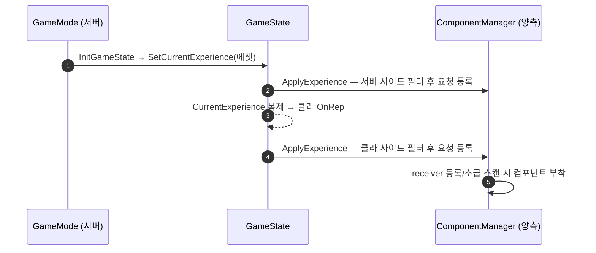

# 프레임워크 주입 Lyra Experience 전환

## 계획

### 목표

프레임워크 컴포넌트 주입 등록이 GameMode 한 곳(서버 전용)에만 있어 데디 서버 구성에서 클라 전용 컴포넌트(인디케이터 매니저)가 클라에 생기지 않는다. Lyra Experience 방식 — 구성을 데이터 에셋으로 빼고 GameState 가 복제해 서버·클라가 각자 로컬 적용 — 의 핵심만 이식해 이를 해소한다.

### 수정 범위

| 파일 | 수정할 내용 | 구분 |
|---|---|---|
| `Source/WxGame/Framework/WxExperienceDefinition.h/.cpp` | 사이드 플래그 엔트리 구조체 + 컴포넌트 목록 데이터 에셋 | 신규 |
| `Source/WxGame/Framework/WxGameMode.h/.cpp` | InitGame 주입·목록·핸들 삭제, Experience 에셋 참조 + InitGameState 에서 GameState 로 전달 | 수정 |
| `Source/WxGame/Framework/WxGameState.h/.cpp` | 복제 프로퍼티 + OnRep + 양측 적용(receiver 추론 이관) + 핸들 보유·정리 | 수정 |
| 주입 컴포넌트 5종 헤더·README 3곳 | "GameMode 의 FrameworkComponents 주입" 문구를 Experience 로 갱신 | 수정 |
| `Content/Framework/DA_ExperienceCombat`, `DA_ExperienceChangYoung` | 신설, 사이드 플래그와 함께 목록 기입 | 신규(에셋) |
| `Content/Framework/GM_Combat`, `GM_ChangYoung` | Experience 연결, 재저장 | 수정(에셋) |

### 접근 방식

- **Experience 에셋 복제 + 양측 로컬 적용**: 모드별 컴포넌트 목록을 데이터 에셋으로 빼고, GameMode 는 그 에셋을 고르기만 한다. GameState 가 에셋 참조를 복제하고, 서버는 직접 호출·클라는 OnRep 으로 같은 적용 경로를 타므로 클라 매니저에도 요청이 등록된다. Lyra 에서 확인한 구조에서 GameFeature 플러그인·비동기 로드·ActionSet 합성 등 동적 확장용 간접은 생략하고, 별도 매니저 컴포넌트 없이 GameState 가 직접 보유한다.
- **엔트리별 사이드 플래그**: 복제 컴포넌트·서버 권위 컴포넌트는 서버만, 로컬 UI 는 클라만 붙도록 엔진 GameFeatures 의 엔트리 명명을 따라 데이터로 지정한다. 사이드 판정은 넷모드에서 파생한다.
- **타이밍 보존**: 서버 등록을 InitGameState(모든 로그인 전) 시점에 동기로 수행해, 스폰 컴포넌트의 PostLogin 구독 전제와 접속 시 시작 아이템 지급 전제를 그대로 유지한다. Reset() 이 InitGameState 를 재호출하는 엔진 경로가 있어 설정은 멱등으로 만든다.

---

## 완료

### 수정한 파일
| 파일 | 수정한 내용 | 구분 |
|---|---|---|
| `Source/WxGame/Framework/WxExperienceDefinition.h/.cpp` | 사이드 플래그 엔트리 구조체 + 컴포넌트 목록 데이터 에셋 | 신규 |
| `Source/WxGame/Framework/WxGameMode.h/.cpp` | InitGame 주입·목록·핸들 삭제, Experience 참조 + InitGameState 전달 | 수정 |
| `Source/WxGame/Framework/WxGameState.h/.cpp` | 복제 프로퍼티 + OnRep + 양측 적용(추론 이관) + 핸들 보유·EndPlay 정리 | 수정 |
| 주입 컴포넌트 5종 헤더 + README 4곳 + 컨트롤러·뷰모델 주석 | 부착 경로 서술을 Experience 로 갱신 | 수정 |
| `Content/Framework/DA_ExperienceCombat`, `DA_ExperienceChangYoung` | 신설, 사이드 플래그와 함께 목록 기입 | 신규(에셋) |
| `Content/Framework/GM_Combat`, `GM_ChangYoung` | Experience 연결, 컴파일·재저장 | 수정(에셋) |

### 구현·결정과 그 이유
- **서버 적용은 InitGameState 동기 호출**: 모든 플레이어 로그인보다 앞서는 유일한 공통 시점이라, 스폰 컴포넌트의 로그인 구독 전제와 접속 시 아이템 지급 전제가 그대로 유지된다. Lyra 의 다음 틱 지연·비동기 로드는 매치메이킹이 없고 하드 참조라 생략했다.
- **멱등 처리는 설정값 유무로**: 엔진의 레벨 리셋 경로가 초기화 함수를 재호출하므로 최초 1회만 수용하되, 별도 플래그 없이 이미 설정됐는지로 판정한다.
- **핸들 해제를 EndPlay 에 명시**: GC 시점에 맡기지 않고 receiver 해제 직후 결정적으로 푼다.
- **검증 결과**: 스탠드얼론 PIE 에서 기존과 동일 부착을 확인했고, Play As Client(인프로세스 데디)에서 서버 PC 는 인디케이터 없이 서버 전용 3종, 클라 PC 는 인디케이터 로컬 생성 + 인벤토리·스캐너 복제 도착, 클라 GameState 는 TimeDilation 복제만 도착(퀘스트 없음)을 확인했다. 성공 실행에서 경고 0건.

### 계획 대비 달라진 점
- 에셋 마이그레이션에서 GM 블루프린트 CDO 를 MCP 로 기입한 뒤 **컴파일 단계가 추가로 필요**했다 — set_properties 만으론 스폰 인스턴스의 아키타입에 반영되지 않아 첫 PIE 두 번이 "Experience 미설정"으로 떨어졌고, compile_blueprint 후 정상 반영됐다. 그 외 계획대로.

### 후속 과제
- 상호작용 리스트 VM 관찰 전환(스캐너 늦은 도착 흡수) — 인벤토리 패턴 이식.
- 퀘스트 상태 복제(클라 퀘스트 UI 표시), 인디케이터 클라 푸시 경로.
- (선택) 쿠킹된 데디+클라로 에셋 참조 동기 로드 경로 1회 실검증.
