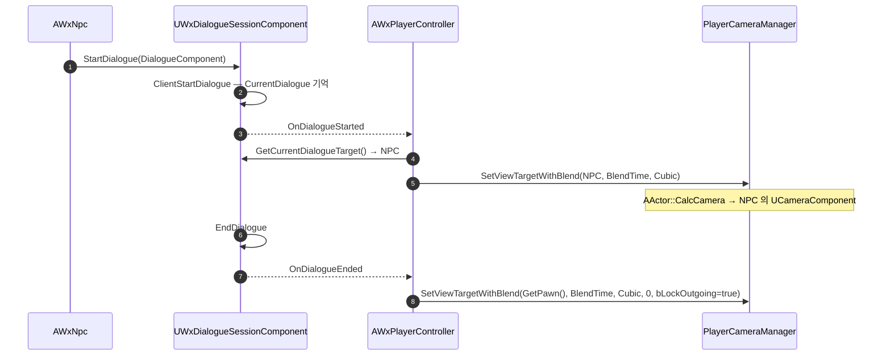

# NPC 대화 카메라

## 계획

### 목표
`AWxNpc`에 대화용 카메라를 부착하고, 대화 세션이 열려 있는 동안에만 플레이어의 뷰 타겟이 그 카메라로 부드럽게 전환되게 한다. 현재는 대화를 시작해도 화면이 플레이어 3인칭 팔로우 카메라에 그대로 머물러 NPC를 연출로 잡아주지 못한다.

### 수정 범위
| 파일 | 수정할 내용 | 구분 |
|---|---|---|
| `Plugins/WxDialogue/Source/WxDialogue/Public/WxNpc.h` | `UCameraComponent` 전방선언, `DialogueCameraComponent` 멤버(`VisibleAnywhere`) 추가 | 수정 |
| `Plugins/WxDialogue/Source/WxDialogue/Private/WxNpc.cpp` | `Camera/CameraComponent.h` include, 생성자에서 카메라 생성·`CapsuleComponent`에 부착·기본 구도 지정 | 수정 |
| `Source/WxGame/Controller/WxPlayerController.h` | `HandleDialogueEnded()` 선언, `DialogueCameraBlendTime`(`EditDefaultsOnly`) 추가 | 수정 |
| `Source/WxGame/Controller/WxPlayerController.cpp` | `BeginPlay`에서 `OnDialogueEnded` 구독, `HandleDialogueStarted`에 뷰 전환 추가, `HandleDialogueEnded` 구현 | 수정 |

`.Build.cs`·에셋 변경은 없다. `UCameraComponent`는 `Engine` 모듈이라 `WxDialogue`의 기존 의존성으로 충분하다.

### 접근 방식
- **카메라는 NPC 소유**: 구도는 NPC별 데이터다. 생성자에서 만들면 모든 NPC BP가 기본 구도를 물려받고 개별 BP·레벨 인스턴스에서 트랜스폼만 조정하면 된다. 부착 대상은 루트인 `CapsuleComponent` — `MeshComponent`는 캐릭터 정렬 보정(Z −90, Yaw −90)이 걸려 있어 거기 붙이면 구도 수치가 직관과 어긋난다.
- **전환은 PC 소유**: 뷰 타겟은 `APlayerController`의 것이고 `WxDialogue`는 `WxGame`을 참조할 수 없다. 기존 "세션이 `OnDialogueStarted` 발행 → PC가 대화 위젯 푸시" 글루와 같은 패턴으로 카메라 전환도 PC에 붙여 의존 방향을 보존한다.
- **엔진 기본 경로 활용**: `AActor::CalcCamera`가 `bFindCameraComponentWhenViewTarget`(기본 true)일 때 액터의 첫 활성 `UCameraComponent`를 쓰므로, PC는 `SetViewTargetWithBlend(NpcActor, ...)`만 호출하면 된다. NPC 카메라를 꺼내오는 접근자·캐스팅이 필요 없다.
- **블렌드 파라미터**: 프로젝트 선례(`WxAnimNotifyState_CameraMove`)를 따라 `VTBlend_Cubic`, 복귀 시 `bLockOutgoing=true`.

기존 코드가 보장하는 순서 두 가지에 기댄다 — `CurrentDialogue`는 `OnDialogueStarted` 발행 **이전**에 세팅되고, `EndDialogue()`는 `CurrentDialogue.Reset()` **이후** 종료를 발행한다(종료 시엔 폰으로만 복귀하므로 대상이 필요 없다).

---

## 완료

### 수정한 파일
| 파일 | 수정한 내용 | 구분 |
|---|---|---|
| `Plugins/WxDialogue/Source/WxDialogue/Public/WxNpc.h` | `UCameraComponent` 전방선언, `DialogueCameraComponent` 멤버 추가 | 수정 |
| `Plugins/WxDialogue/Source/WxDialogue/Private/WxNpc.cpp` | 생성자에서 카메라 생성·캡슐에 부착·기본 구도 지정 | 수정 |
| `Source/WxGame/Controller/WxPlayerController.h` | `DialogueCameraBlendTime`, `HandleDialogueEnded()` 추가 | 수정 |
| `Source/WxGame/Controller/WxPlayerController.cpp` | `OnDialogueEnded` 구독, 시작 시 NPC 로 블렌드·종료 시 폰으로 복귀 / UI push 3 곳을 라이브러리 경유로 교체 | 수정 |
| `Plugins/WxUI/Source/WxUI/Public/WxUILibrary.h` | `PushSoftContentToLayer` 파사드 선언 추가 | 수정 |
| `Plugins/WxUI/Source/WxUI/Private/WxUILibrary.cpp` | 같은 함수 구현 (서브시스템 조회 후 위임) | 수정 |

검증: `WxEditor` Win64 Development 빌드 성공(UE 5.8).

### 구현·결정과 그 이유
- **카메라는 NPC, 전환은 PC**: 구도는 NPC 마다 다른 데이터라 액터가 들고, 뷰 타겟은 컨트롤러의 것이라 전환은 PC 가 한다. `WxDialogue` 가 `WxGame` 을 참조할 수 없다는 제약과도 맞아떨어져, 기존 "세션이 `OnDialogueStarted` 발행 → PC 가 대화 위젯 푸시" 글루에 카메라 전환을 얹는 형태가 됐다.
- **카메라 접근자를 두지 않음**: `AActor::CalcCamera` 가 `bFindCameraComponentWhenViewTarget`(기본 true)일 때 액터의 첫 활성 카메라 컴포넌트를 골라 쓴다. PC 는 `GetCurrentDialogueTarget()` 이 준 액터를 그대로 넘기면 되고, `AWxNpc` 캐스팅도 카메라 게터도 필요 없다.
- **캡슐에 부착**: 메시엔 캐릭터 정렬 보정(Z −90, Yaw −90)이 걸려 있어 그 기준으론 구도 수치가 직관과 어긋난다. 루트인 캡슐에 붙여 액터 프레임 그대로 읽히게 했다.
- **기본 구도 (110, 40, 70) / Yaw −160**: 눈높이(캡슐 중심 +70)에 두고 같은 높이를 겨눠 피치를 0 으로 뒀다. Yaw −160 은 그 위치에서 원점을 향하는 정확한 각이고, 약 117cm 거리는 기본 화각 90도에서 허리 위가 화면을 채우는 거리다. 어디까지나 기본값이며 실제 구도는 BP·인스턴스에서 조정한다.
- **블렌드 시간은 PC 소유**: NPC 별 연출 값이 아니라 대화 전반의 정책이라 `EditDefaultsOnly` 로 PC 에 뒀다. 블렌드 함수·복귀 시 `bLockOutgoing=true` 는 프로젝트 선례(`WxAnimNotifyState_CameraMove`)를 그대로 따랐다.
- **UI push 는 라이브러리 파사드 경유(사용자 지시)**: `UWxUIManagerSubsystem` 을 호출부에서 직접 잡던 3 곳(HUD·사망 화면·대화 위젯)을 `UWxUILibrary::PushSoftContentToLayer` 한 줄로 바꿨다. 서브시스템 조회·널 체크가 라이브러리 안으로 들어가 호출부가 의도만 남고, `System/WxUIManagerSubsystem.h` 인클루드도 걷혔다. 팝업(`ShowConfirmationPopup`/`ShowErrorPopup`)이 이미 쓰던 파사드 형태와 같다. 이전 작업([2026-07-28-PlayerController-위젯-클래스-설정-이관](2026-07-28-PlayerController-위젯-클래스-설정-이관.md))이 남긴 "서브시스템 조회는 `GetUIManagerSubsystem`" 결정을 대체한다.

### 계획 대비 달라진 점
- 기본 구도 수치를 계획서의 `(180, 60, 60)` / Yaw −162 에서 `(110, 40, 70)` / Yaw −160 으로 바꿨다. 앞의 값은 기본 화각 90도에서 190cm 거리라 전신이 작게 잡혀 대화 샷으로 헐거웠다. 눈높이·정각 조준으로 다시 잡으니 수치도 깔끔해졌다.

### 후속 과제
- 에디터·PIE 육안 검증 미실시(빌드까지만 확인). 기본 구도는 실제 NPC 메시로 한 번 보고 미세 조정할 여지가 있다.
- 대화 중 플레이어 이동·시선 입력은 잠기지 않는다. 카메라가 NPC 에 있는 동안 캐릭터가 움직일 수 있으므로 입력 잠금이 필요하면 별도 작업으로 다룬다.
- `EndDialogue()` 는 `Advance`/`Choose` 경로에서만 호출된다. 사망·월드 트래블 등 비정상 이탈에선 `OnDialogueEnded` 가 오지 않아 카메라가 NPC 에 남는다(대화 위젯도 같은 한계). 사망은 월드 리로드로 정리되므로 당장은 문제되지 않는다.
- `StartDialogue` 재진입 가드 부재(`Docs/Programmer/module_review_WxDialogue.md:24-31`)가 카메라에도 전이돼, 중복 시작 시 뷰 타겟이 두 번 블렌드된다. 위젯 푸시가 이미 같은 결함을 공유하므로 세션 쪽에서 한 번에 고치는 게 맞다.
- 선택지(`Choices`) 노드 소프트락(같은 문서 `:14-22`)이 남아 있어 선택지로 끝나는 대화는 아직 종료 경로를 타지 못한다.
