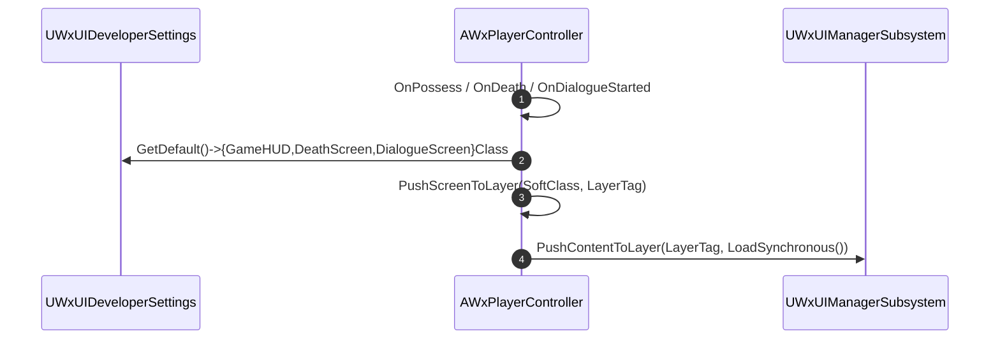

# PlayerController 위젯 클래스 지정을 WxUIDeveloperSettings 로 이관

## 계획

### 목표
`AWxPlayerController` 가 직접 소유하던 HUD·사망 화면·대화 창 위젯 클래스 3개를 `UWxUIDeveloperSettings` 로 옮긴다. "어떤 역할에 어떤 위젯을 쓰는가"는 컨트롤러 인스턴스 속성이 아니라 프로젝트 전역 UI 정책이고, 이미 `LayoutClass`·`ConfirmationPopupClass`·`ErrorPopupClass` 가 같은 자리에 있다.

### 수정 범위
| 파일 | 수정할 내용 | 구분 |
|---|---|---|
| `Plugins/WxUI/Source/WxUI/Public/System/WxUIDeveloperSettings.h` | `GameHUDClass`·`DeathScreenClass`·`DialogueScreenClass` 를 `TSoftClassPtr<UWxActivatableWidget>` Config 프로퍼티(Category `"Screen"`)로 추가 | 수정 |
| `Source/WxGame/Controller/WxPlayerController.h` | 위젯 클래스 UPROPERTY 3개 삭제, private 헬퍼 `PushScreenToLayer` 선언 | 수정 |
| `Source/WxGame/Controller/WxPlayerController.cpp` | 설정에서 클래스를 읽도록 변경, 3중 복제돼 있던 push 블록을 헬퍼로 통합 | 수정 |

### 접근 방식
- **DeveloperSettings 를 택한 이유**: `UWxExperienceDefinition` 은 `FrameworkComponents` 하나만 가진 ModularGameplay 주입 전용 에셋이고 실제 에셋도 `EXP_Combat` 하나뿐이라 판별 HUD 교체 요구가 없다. 또 Experience 는 `AWxGameState::CurrentExperience` 로 복제되는데 public getter 도 `OnExperienceLoaded` 후크도 없어서, `OnPossess`/`OnRep_Pawn` 시점의 HUD push 와 도착 순서를 맞추려면 델리게이트와 지연 push 경로를 새로 만들어야 한다. DeveloperSettings 는 이 레이스가 없다.
- **헬퍼 통합**: `PushGameHUD`/`HandleCharacterDeath`/`HandleDialogueStarted` 에 "GameInstance → UIManager → `LoadSynchronous` → `PushContentToLayer`" 블록이 그대로 세 번 복제돼 있다. 레이어 태그와 소프트 클래스를 인자로 받는 private 멤버 하나로 합친다.
- **`GameHUDClass` 만 soft 로 전환**: 셋 중 이것만 하드 `TSubclassOf` 였다. 나머지 둘·기존 설정 필드와 맞춰 soft 로 통일하면 PC 클래스 로드에 HUD 에셋이 딸려오지 않는다.

---

## 완료

### 수정한 파일
| 파일 | 수정한 내용 | 구분 |
|---|---|---|
| `Plugins/WxUI/Source/WxUI/Public/System/WxUIDeveloperSettings.h` | `UWxActivatableWidget` 전방 선언과 Category `"Screen"` 의 `GameHUDClass`·`DeathScreenClass`·`DialogueScreenClass` 추가 | 수정 |
| `Plugins/WxUI/Source/WxUI/Public/System/WxUIManagerSubsystem.h` | `PushSoftContentToLayer` 선언 추가 | 수정 |
| `Plugins/WxUI/Source/WxUI/Private/System/WxUIManagerSubsystem.cpp` | `PushSoftContentToLayer` 구현 (동기 로드 후 `PushContentToLayer` 위임) | 수정 |
| `Source/WxGame/Controller/WxPlayerController.h` | 위젯 클래스 UPROPERTY 3개와 `UWxActivatableWidget` 전방 선언 삭제 | 수정 |
| `Source/WxGame/Controller/WxPlayerController.cpp` | `WxUIDeveloperSettings.h`·`WxUILibrary.h` 인클루드, 세 진입점을 설정 조회 + `PushSoftContentToLayer` 호출로 축약 | 수정 |

### 구현·결정과 그 이유
- **ExperienceDefinition 이 아니라 DeveloperSettings**: Experience 는 `FrameworkComponents` 하나만 가진 ModularGameplay 주입 전용 에셋이고 에셋도 `EXP_Combat` 하나뿐이라 판별 HUD 교체 요구가 없다. 더 결정적으로 `AWxGameState::CurrentExperience` 는 private 이고 getter·로드 완료 델리게이트가 전혀 없어서, 클라에서 `OnRep_Pawn` 시점의 HUD push 와 Experience 복제 도착 순서를 맞출 후크를 새로 만들어야 했다. 설정은 이 레이스가 없고, 이미 `LayoutClass`·팝업 클래스가 같은 자리에 있어 조회 패턴(`GetDefault<UWxUIDeveloperSettings>()`)도 그대로 재사용된다.
- **필드명에서 `Widget` 제거**: 기존 이웃 필드가 `LayoutClass`·`ConfirmationPopupClass` 라 접미사 관례를 맞췄다.
- **소프트 로드 push 는 WxUI 가 소유**: 동일한 "GameInstance → UIManager → `LoadSynchronous` → `PushContentToLayer`" 블록이 세 함수에 복제돼 있었다. 처음엔 PC 의 private 헬퍼로 합쳤으나, 레이어 push 는 UI 모듈의 책임이므로 `UWxUIManagerSubsystem::PushSoftContentToLayer` 로 옮겼다. 서브시스템은 이미 `PushPopup` 에서 같은 소프트 로드-push 를 하고 있어 자리가 맞고, 게임 모듈이 UI 배관을 재구현하지 않게 된다.
- **`PushContentToLayer` 오버로드가 아닌 별도 이름**: 하드/소프트 오버로드는 raw `UClass*` 인자에서 모호해질 수 있고, 이름 자체가 "동기 로드가 일어난다"를 알린다. 비동기가 필요한 경로는 기존 `UWxAsyncAction_PushWidgetToLayer` 를 쓰라고 주석에 남겼다.
- **서브시스템 조회는 `UWxUILibrary::GetUIManagerSubsystem`**: WxUI 가 이미 제공하는 world-context 조회를 재사용해 호출부를 `if` 한 줄로 유지했다. 레이어 정책(Game/Menu)은 호출부에 남겨 각 상황의 의도가 보이게 했다.
- **`HandleCharacterDeath` 의 `IsLocalController()` 가드 유지**: 클래스 널 체크만 헬퍼로 넘기고 로컬 게이팅은 남겼다. 다른 두 경로와 달리 사망 델리게이트는 로컬 여부를 스스로 판단해야 한다.

### 계획 대비 달라진 점
- 계획에서는 소프트 로드 push 헬퍼를 `AWxPlayerController` 의 private 멤버로 두려 했으나, 리뷰 지적에 따라 `UWxUIManagerSubsystem::PushSoftContentToLayer` 로 옮겼다. 이에 따라 PC 헤더의 `GameplayTagContainer.h` 인클루드와 `UWxActivatableWidget` 전방 선언도 불필요해져 함께 제거했다.

### 후속 과제
- **에디터 작업 필요(코드 범위 밖)**: 기존 값이 `Content/Framework/BP_PlayerController` 디폴트에 남아 있다. Project Settings → Wx → UI → Screen 의 세 항목에 옮겨 지정하기 전까지 HUD·사망 화면·대화 창이 뜨지 않는다. 지정하면 `Config/DefaultGame.ini` 의 `[/Script/WxUI.WxUIDeveloperSettings]` 섹션에 기록된다.
- PIE 실행 검증(HUD 표시/사망 화면/대화 창)은 위 지정 이후에 가능하며 아직 수행하지 않았다.
