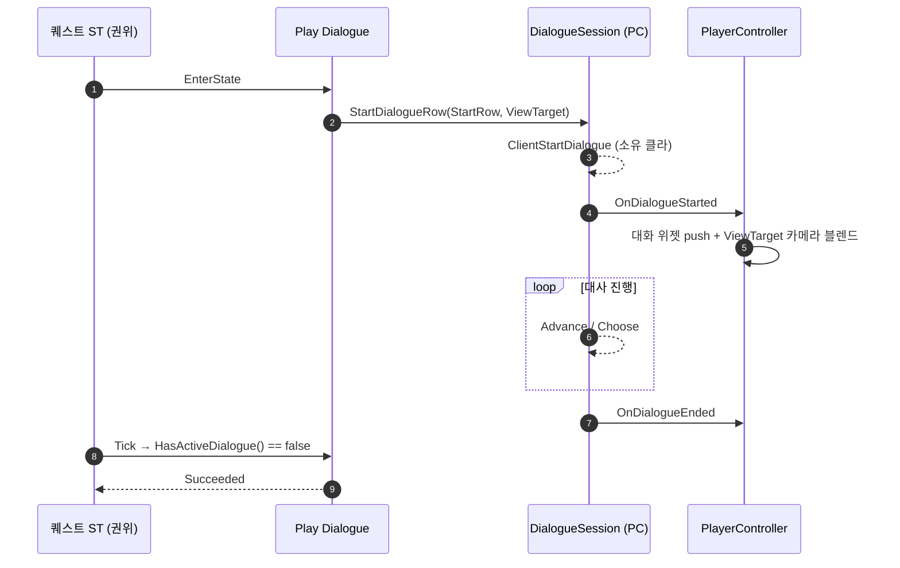

# 퀘스트 StateTree 용 대화 출력 태스크 (Play Dialogue)

## 계획

### 목표

대화는 플레이어가 NPC 에게 말을 거는 경로로만 열리고, 퀘스트 쪽 대화 노드는 관찰 전용인 `Wait Dialogue Completed` 하나뿐이라 퀘스트가 스스로 대사를 띄우는 연출(수주 직후 독백, 목표 도달 시 무전 등)을 데이터로 짤 수 없다.
퀘스트 StateTree 에셋이 자기 단계에 맞는 대사를 직접 골라 출력하고, 그 대화가 끝나면 다음 단계로 넘어가는 태스크를 추가한다.

### 수정 범위

| 파일 | 수정할 내용 | 구분 |
|---|---|---|
| `Plugins/WxDialogue/.../Public/WxDialogueSessionComponent.h` | 행 핸들로 대화를 여는 진입점 추가, 세션 대상 보관을 컴포넌트→액터로 교체 | 수정 |
| `Plugins/WxDialogue/.../Private/WxDialogueSessionComponent.cpp` | 두 진입점(NPC·행 지정)이 같은 Client RPC 로 수렴하도록 정리 | 수정 |
| `Plugins/WxDialogue/.../Public/WxDialogueStateTreeNodes.h` | `FWxStateTreeTask_PlayDialogue` 선언 추가 | 수정 |
| `Plugins/WxDialogue/.../Private/WxDialogueStateTreeNodes.cpp` | 위 태스크 구현 | 수정 |

노드는 WxDialogue 모듈에 둔다 — 기존 `Wait Dialogue Completed` 와 같은 자리다(WxQuest 는 WxDialogue 를 참조하지 않고, ST 에디터의 노드 목록은 로드된 모든 모듈에서 모인다).

### 접근 방식

- **세션 컴포넌트에 행 핸들 진입점 추가**: 지금 `ClientStartDialogue` 는 `UWxDialogueComponent*` 를 받아 그 안의 `StartRow` 를 꺼내 쓴다. 퀘스트는 컴포넌트가 아니라 행을 지정하므로 RPC 인자를 행 핸들과 대상 액터로 낮춘다.
  - 신규 public `StartDialogueRow(const FDataTableRowHandle&, AActor* Target)` — 대상은 카메라·관찰 노출용이며 null 허용(나레이션)
  - 기존 `StartDialogue(UWxDialogueComponent*)` 유지 — 컴포넌트의 `StartRow` 와 소유 액터를 뽑아 위 진입점으로 넘긴다(NPC 호출부 무변경)
  - 대상 보관을 `CurrentDialogue`(컴포넌트) → `CurrentTarget`(액터)로 교체. `GetCurrentDialogueTarget()` 의 의미는 그대로라 PC 의 대화 카메라 전환·`Wait Dialogue Completed` 의 관찰은 영향 없다

- **신규 태스크 `Play Dialogue`**: 파라미터는 출력할 대화의 시작 노드(`FDataTableRowHandle StartRow`)와 대화 중 비출 배치 액터(`FWxActorTarget ViewTarget`, 비우면 카메라 전환 없이 대사만 출력)다.
  - EnterState: 0번 컨트롤러의 세션을 찾아 `StartDialogueRow` 호출 후 Running. 세션 부재·StartRow 미지정·행 해석 실패는 완주할 수 없는 잘못된 조립이므로 경고 후 Failed
  - Tick: `HasActiveDialogue()` 가 꺼지면 Succeeded
  - ExitState 없음 — 상태를 먼저 떠나도 대화를 강제로 끊지 않는다(읽던 대사가 사라지는 편이 더 나쁘다)
  - `bShouldStateChangeOnReselect = false` — 같은 상태 재선택으로 대사가 다시 열리지 않게 한다

대화 종료 판정은 권위 측에서 세션 상태를 폴링한다 — `Wait Dialogue Completed`·`Grant Reward` 와 같은 v1 싱글/리슨 호스트(소유 클라 = 권위 동일 머신) 전제다.

---

## 완료

### 수정한 파일
| 파일 | 수정한 내용 | 구분 |
|---|---|---|
| `Plugins/WxDialogue/.../Public/WxDialogueSessionComponent.h` | `StartDialogueRow` 진입점 추가, Client RPC 인자를 행 핸들+대상 액터로 변경, 세션 대상 보관을 `CurrentDialogue`→`CurrentTarget` 으로 교체 | 수정 |
| `Plugins/WxDialogue/.../Private/WxDialogueSessionComponent.cpp` | 두 진입점이 같은 RPC 로 수렴하도록 정리, `GetCurrentDialogueTarget` 을 보관 액터 반환으로 단순화 | 수정 |
| `Plugins/WxDialogue/.../Public/WxDialogueStateTreeNodes.h` | `FWxStateTreeTask_PlayDialogue` 와 인스턴스 데이터 선언 | 수정 |
| `Plugins/WxDialogue/.../Private/WxDialogueStateTreeNodes.cpp` | 위 태스크 구현(진입 시 대화 열기, 종료까지 대기) | 수정 |

### 구현·결정과 그 이유
- **세션이 컴포넌트가 아닌 행을 받게 함**: 대사를 고르는 쪽이 늘 액터인 것은 아니다(퀘스트 ST). 정의 컴포넌트는 행과 대상을 담은 껍데기일 뿐이라, RPC 인자를 행 핸들+대상으로 낮추고 기존 `StartDialogue(UWxDialogueComponent*)` 는 그 위의 얇은 어댑터로 남겼다 — NPC 호출부는 그대로다.
- **대상 보관을 액터로 교체**: `GetCurrentDialogueTarget` 은 애초에 정의 컴포넌트의 소유자만 필요로 했고, 화자 없는 대사에선 컴포넌트 자체가 없다. 액터를 직접 들면 두 경로가 같은 값을 채운다.
- **잘못된 조립은 Failed**: 행 미지정·세션 부재·행 해석 실패는 영원히 끝나지 않는 대기가 되므로, 침묵 대기 대신 경고 후 실패를 낸다(기존 퀘스트 노드들의 처리와 같다).
- **진입 직후 `HasActiveDialogue()` 로 개시 확인**: 소유 클라와 권위가 같은 머신이라 Client RPC 가 호출 안에서 실행된다. 덕분에 `Wait Dialogue Completed` 같은 목격 플래그 없이도 "열렸다가 닫혔다"를 폴링 한 줄로 판정할 수 있다.
- **ExitState 로 대화를 끊지 않음**: 상태가 먼저 떠나는 경우(퀘스트 교체·실패)에도 읽던 대사가 증발하는 편이 더 나쁘다. 세션은 자기 데이터를 끝까지 진행한다.

### 계획 대비 달라진 점
- **`ViewTarget` 파라미터를 뺐다**: 태스크는 대사만 책임지고 대상 없이 세션을 연다(카메라는 플레이어에 머문다). 특정 액터를 비추는 연출은 별도 태스크로 분리하는 쪽을 나중에 검토한다.
  세션의 `StartDialogueRow(StartRow, Target)` 는 대상 인자를 그대로 둔다 — NPC 말 걸기 경로가 쓰고 있고, 분리될 태스크도 같은 진입점을 쓴다.

### 후속 과제
- 에디터 실기 확인: `ST_Quest_Main1` 에 Play Dialogue 를 얹어 PIE 로 대사 출력·전이를 보고, 기존 NPC 말 걸기 회귀를 확인한다.
- 대화 카메라(대상 비추기) 태스크 분리 검토.
- 대화 중 퀘스트가 교체되면 대사가 남는다 — 실제로 문제가 되면 그때 세션 측 강제 종료 API 를 검토한다.
