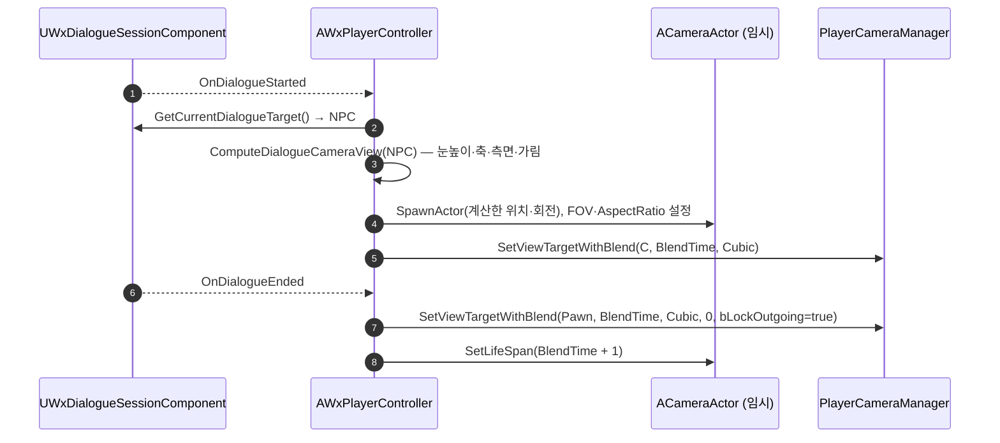

# 대화 카메라 런타임 계산 전환

## 계획

### 목표
`AWxNpc` 가 들고 있던 고정 `DialogueCameraComponent` 를 걷어내고, 대화 시작 시점에 플레이어·NPC 두 위치로부터 카메라 구도를 계산한다. 지금은 구도가 NPC 로컬 프레임에 못박혀 있어 어느 방향에서 말을 걸든 카메라 자리가 같고, 뒤나 옆에서 접근하면 플레이어가 화면 밖으로 밀리거나 카메라가 플레이어를 관통한다. 구도는 두 사람을 잇는 축의 중간에서 옆으로 비껴선 **측면 2-shot** 이며 NPC 를 바라본다.

### 수정 범위
| 파일 | 수정할 내용 | 구분 |
|---|---|---|
| `Plugins/WxDialogue/Source/WxDialogue/Public/WxNpc.h` | `DialogueCameraComponent` 멤버·`UCameraComponent` 전방선언 제거 | 수정 |
| `Plugins/WxDialogue/Source/WxDialogue/Private/WxNpc.cpp` | 카메라 생성 블록·`Camera/CameraComponent.h` include 제거 | 수정 |
| `Source/WxGame/Controller/WxPlayerController.h` | 구도 파라미터 4 개, `DialogueCamera` 약참조, `ComputeDialogueCameraView`·`RetireDialogueCamera` 선언 | 수정 |
| `Source/WxGame/Controller/WxPlayerController.cpp` | 시작 시 구도 계산 → 임시 `ACameraActor` 스폰 → 블렌드, 종료 시 폰 복귀 + 카메라 수명 부여 | 수정 |

`.Build.cs` 변경 없음 — `ACameraActor` 는 `Engine` 모듈이고 `WxGame` 이 이미 의존한다.

### 접근 방식

- **임시 `ACameraActor` 를 뷰 타겟으로**: 뷰 타겟은 액터 단위라, NPC 에서 카메라를 걷어내면 `SetViewTargetWithBlend(NpcActor, ...)` 가 기본 `CalcCamera`(액터 원점)로 떨어져 쓸 수 없다. 계산한 구도를 담을 액터가 필요하고, 프로젝트에 이미 같은 선례가 있다 — `UWxAnimNotifyState_CameraMove` 가 컷 연출용으로 `ACameraActor` 를 스폰해 블렌드하고 `SetLifeSpan` 으로 회수한다. 그 패턴(FOV 설정 + `SetConstraintAspectRatio(false)` 로 16:9 레터박스 제거 포함)을 그대로 따르고 새 액터 클래스는 만들지 않는다.

- **구도 계산 (`ComputeDialogueCameraView`)**: 플레이어 폰과 대상 액터 위치만 읽는 순수 계산이다.
  1. **눈높이 보정** — 두 액터 원점(캡슐 중심)에 `DialogueCameraEyeHeight` 를 더해 `PlayerEye`, `TargetEye`.
  2. **기준점** — `Pivot = Lerp(PlayerEye, TargetEye, DialogueCameraPivotAlpha)`. 카메라 높이도 여기서 나오므로 지면 높이가 다르면 응시 피치가 자연히 기울고, 평지면 피치 0 이다.
  3. **축·측면** — `Axis` = `(TargetEye - PlayerEye)` 의 수평 성분 정규화, `Side = Up × Axis`. 축 길이가 0 에 가까우면(둘이 겹침) `false` 를 돌려 뷰를 폰에 남긴다.
  4. **어느 쪽 옆인가 (180도 법칙)** — 현재 카메라가 축의 어느 쪽에 있는지로 부호를 고른다. 시작 순간 화면이 축을 넘어 좌우로 뒤집히는 걸 막는다.
  5. **가림 보정** — `Pivot → 목표 위치` 로 반경 12 구체를 `ECC_Camera` 로 훑어(플레이어·대상 무시) 막히면 히트 지점까지 당긴다. NPC 캡슐은 이미 `ECC_Camera` 를 Ignore 한다.
  6. **회전** — `(TargetEye - CameraLocation).Rotation()`.

- **파라미터는 PC 소유(`EditDefaultsOnly`)**: NPC 별 데이터가 아니라 대화 연출 전반의 정책이라 기존 `DialogueCameraBlendTime`(0.75) 옆에 둔다. `DialogueCameraEyeHeight` 70, `DialogueCameraPivotAlpha` 0.5, `DialogueCameraLateralOffset` 120, `DialogueCameraFov` 60. 상호작용 사거리가 `ScanRadius = 150` 이라 대화 시작 시 두 사람 거리는 대략 100~200cm 이고, 그 구간에서 NPC 까지 약 140cm — FOV 60 이면 NPC 상반신이 화면 중앙을, 플레이어 뒷모습이 가장자리를 채운다.

- **수명 관리**: `TWeakObjectPtr<ACameraActor>` 로 들고(`DialogueScreen` 과 같은 방식) `RetireDialogueCamera()` 하나가 회수를 맡는다. 즉시 `Destroy()` 하면 복귀 블렌드의 출발 뷰 타겟이 사라지므로 `SetLifeSpan(BlendTime + 1)` 을 걸고 포인터만 비운다. 대화 재시작 시에도 스폰 직전 같은 함수로 이전 것을 정리한다(세션의 재진입 가드 부재 대비).

대상이 없는 대사(`StartDialogueRow(Row, nullptr)` — 퀘스트 ST 나레이션)에선 지금처럼 뷰가 폰에 머문다. 계산이 실패해도(둘이 겹침) 같은 결과다.

**에셋 영향**: `Content/WorldObject/Npc/BP_Npc.uasset` 이 `DialogueCameraComponent` 오버라이드를 직렬화하고 있으나, 컴포넌트가 사라지면 에디터가 로드 시 버린다(무해). 구도가 런타임 계산으로 대체되므로 마이그레이션할 값이 없다.

---

## 완료

### 수정한 파일
| 파일 | 수정한 내용 | 구분 |
|---|---|---|
| `Plugins/WxDialogue/Source/WxDialogue/Public/WxNpc.h` | `DialogueCameraComponent` 멤버·`UCameraComponent` 전방선언 제거 | 수정 |
| `Plugins/WxDialogue/Source/WxDialogue/Private/WxNpc.cpp` | 카메라 생성 블록·`Camera/CameraComponent.h` include 제거 | 수정 |
| `Source/WxGame/Controller/WxPlayerController.h` | 구도 파라미터 4 개, `DialogueCamera` 약참조, `ComputeDialogueCameraView`·`RetireDialogueCamera` 선언 | 수정 |
| `Source/WxGame/Controller/WxPlayerController.cpp` | 구도 계산·임시 `ACameraActor` 스폰·회수 구현, 시작/종료 핸들러 연결 | 수정 |

검증: `WxEditor` Win64 Development 빌드 성공(UE 5.8).

### 구현·결정과 그 이유
- **구도를 액터에서 계산으로**: 고정 컴포넌트는 NPC 로컬 프레임에 묶여 있어 접근 방향을 못 따라간다. 대화 시작 시점의 두 위치로 계산하면 어느 방향에서 말을 걸든 같은 품질의 샷이 나오고, NPC BP·레벨 인스턴스마다 구도를 손보던 비용도 사라진다. 계산은 시작 1 회로 끝내 대화 중 카메라가 흔들리지 않게 했다.
- **계산은 PC 가**: 뷰 타겟은 컨트롤러의 것이고 `WxDialogue` 는 `WxGame` 을 참조할 수 없다. 기존 "세션이 `OnDialogueStarted` 발행 → PC 가 위젯 푸시·뷰 전환" 글루를 그대로 쓰고 계산만 얹었다 — 의존 방향도 파일 수도 그대로다.
- **임시 `ACameraActor` 를 그릇으로**: 뷰 타겟은 액터 단위라 계산 결과를 담을 액터가 필요하다. 새 클래스를 만들지 않고 `UWxAnimNotifyState_CameraMove` 의 선례(스폰 → FOV·`SetConstraintAspectRatio(false)` → `SetViewTargetWithBlend` → `SetLifeSpan` 회수)를 그대로 따랐다. 레터박스 제거도 같은 이유로 함께 가져왔다.
- **눈높이 오프셋 하나로 높이와 응시점을 동시에**: 카메라 Z 와 응시점 Z 에 같은 오프셋을 쓰면 평지에선 피치가 저절로 0 이 되고, 지면 높이가 다를 때만 그 차이만큼 기운다. 피치를 따로 노출할 필요가 없어졌다.
- **180 도 법칙 부호**: 어느 쪽 옆으로 나갈지를 현재 카메라 위치로 정한다. 고정 부호였다면 플레이어가 NPC 를 어느 쪽에서 잡느냐에 따라 대화가 열리는 순간 화면이 축을 넘어 좌우로 뒤집힌다. 내적 한 번으로 끝나는 판정이라 값싸다.
- **즉시 파괴 대신 수명 부여**: 복귀 블렌드는 출발 뷰 타겟이 살아 있어야 한다. `RetireDialogueCamera()` 가 `SetLifeSpan(BlendTime + 1)` 만 걸고 포인터를 놓는 형태라 종료 경로와 재진입 경로가 같은 한 줄을 공유한다.

### 계획 대비 달라진 점
- 계획대로. 가림 보정의 `FCollisionQueryParams` 만 프로젝트 관례(`SCENE_QUERY_STAT`)에 맞추고, 무시 액터를 PC 대신 폰으로 잡았다.

### 후속 과제
- PIE 육안 검증 미실시(빌드까지만 확인). 확인할 것 — 정면/옆/뒤 세 방향에서 각각 말 걸었을 때의 구도, 시작 순간 좌우 뒤집힘 여부, 벽을 등졌을 때 카메라 관통, 종료 후 팔로우 카메라 복귀. 기본값(눈높이 70 / 알파 0.5 / 측면 120 / FOV 60)은 실제 메시로 한 번 보고 미세 조정할 여지가 있다.
- `BP_Npc` 에 남은 `DialogueCameraComponent` 오버라이드는 로드 시 버려진다. 무해하지만 BP 를 한 번 열어 저장하면 정리된다.
- 앞선 작업([2026-07-28-NPC-대화-카메라](2026-07-28-NPC-대화-카메라.md))이 남긴 한계는 그대로다 — 대화 중 이동·시선 입력 미잠금, `EndDialogue()` 가 `Advance`/`Choose` 경로에서만 호출돼 비정상 이탈 시 뷰가 카메라에 남음, `StartDialogue` 재진입 가드 부재(카메라는 스폰 직전 회수로 완화했지만 뷰 타겟은 여전히 두 번 블렌드된다), 선택지 노드 소프트락.
