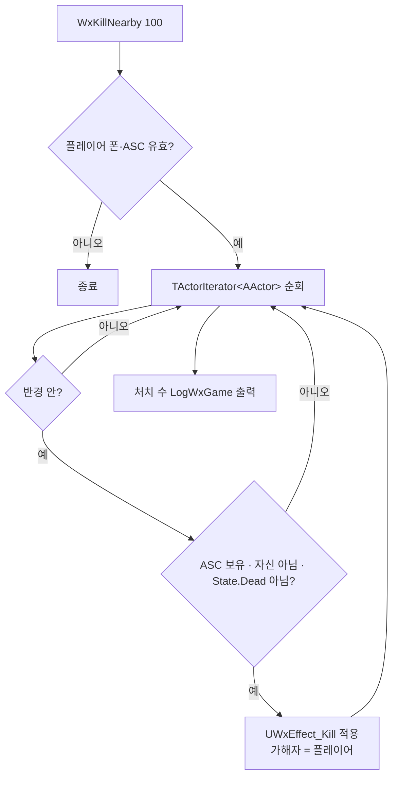

# WxCheatManager — 주변 광역 즉사 치트 추가

## 계획

### 목표
지금 치트는 대상을 하나씩만 다룬다(`WxKillPlayer`, `WxDamagePlayer`). 스포너의 `MarkKilled` 집계, 「전원 처치」 조건의 기믹·퀘스트 진행, 전투 종료 후 BGM 전환처럼 한 구역의 적을 전부 치워야 확인되는 흐름을 검증하려면 매번 손으로 다 잡아야 한다. 플레이어 주변 일정 반경의 액터를 한 번에 즉사시키는 `WxKillNearby` 치트를 추가한다.

### 수정 범위
| 파일 | 수정할 내용 | 구분 |
|---|---|---|
| `Source/WxGame/Cheat/WxCheatManager.h` | `UFUNCTION(Exec) void WxKillNearby(float RadiusMeters = 100.f)` 선언 추가 | 수정 |
| `Source/WxGame/Cheat/WxCheatManager.cpp` | 월드 액터 순회 → 반경·ASC·생존 필터 → `UWxEffect_Kill` 적용, 처치 수 로그 | 수정 |

`WxGame.Build.cs`는 변경 없음.

### 접근 방식
- **기존 `UWxEffect_Kill` 재사용, 가해자는 플레이어**: 즉사 GE는 Target의 현재 HP를 그대로 IncomingDamage로 넣어 방어력·무적과 무관하게 확정 처치한다. `WxKillPlayer`의 self-apply 대신 플레이어 ASC의 `MakeOutgoingSpec` → `ApplyGameplayEffectSpecToTarget(대상 ASC)` 로 적용해 가해자를 플레이어로 남긴다. HP 캡처는 `AttributeSource = Target`이라 대상별로 각자 HP가 잡힌다.
- **`TActorIterator<AActor>` + ASC 존재 여부로 필터**: "모든 액터"를 문자 그대로 받되, 실제로 죽일 수 있는 건 ASC 보유 액터뿐이라 `GetAbilitySystemComponentFromActor` 결과가 있는 액터만 대상으로 삼는다. `AWxCharacterBase`로 좁히지 않아야 캐릭터 아닌 ASC 보유 액터가 나중에 생겨도 그대로 커버된다. 오버랩 질의는 콜리전 설정에 따라 대상이 새므로 쓰지 않는다.
- **플레이어 자신과 이미 죽은 대상 제외**: 구역을 비우는 것이 목적이라 시전자는 살려 둔다(플레이어 사망은 `WxKillPlayer` 담당). `State.Dead` 대상은 건너뛰어 헛도는 GE를 막고 처치 수 로그를 정확하게 만든다.
- **반경은 미터 단위 파라미터(`RadiusMeters`, 기본 100)**: 콘솔에서 바로 읽히는 값을 쓰고 내부에서 100배로 변환해 언리얼 단위로 비교한다. 이름에 단위를 박아 uu 혼동을 막는다.
- **처치 수를 `LogWxGame`에 남긴다**: 화면 밖에서 벌어지는 일이라 결과가 눈에 안 보인다. 0명일 때 "치트가 안 먹은 건지, 대상이 없었던 건지" 구분되게 한다.

---

## 완료

### 수정한 파일
| 파일 | 수정한 내용 | 구분 |
|---|---|---|
| `Source/WxGame/Cheat/WxCheatManager.h` | `UFUNCTION(Exec) WxKillNearby(float RadiusMeters = 100.f)` 선언 추가 | 수정 |
| `Source/WxGame/Cheat/WxCheatManager.cpp` | 액터 순회 → 반경·ASC·생존 필터 → `UWxEffect_Kill` 적용, 처치 수 로그. `EngineUtils.h`·`WxGame.h` include 추가 | 수정 |

### 구현·결정과 그 이유
- **가해자를 플레이어로 남기는 적용 방식**: `WxKillPlayer`의 self-apply 대신 플레이어 ASC에서 `MakeOutgoingSpec` → `ApplyGameplayEffectSpecToTarget(대상 ASC)`을 쓴다. 즉사 GE의 HP 캡처가 `AttributeSource = Target`이라 스펙 하나를 대상별로 새로 만들어도 각자의 HP가 잡히며, 죽인 주체가 플레이어로 남아 킬 크레딧 기반 로직이 나중에 붙어도 어긋나지 않는다. (현재 보상 지급은 0번 플레이어 컨트롤러 고정이라 가해자와 무관하다.)
- **오버랩 질의가 아니라 액터 순회**: 콜리전 프로파일 설정에 따라 대상이 새면 "구역을 비운다"는 목적 자체가 깨진다. 1회성 개발 치트라 전체 순회 비용은 문제되지 않는다.
- **클래스가 아니라 ASC 유무로 필터**: 죽일 수 있는 대상은 결국 ASC 보유 액터뿐이다. `AWxCharacterBase`로 좁히면 캐릭터가 아닌 ASC 보유 액터(파괴 가능 오브젝트 등)가 생겼을 때 치트가 조용히 놓친다.
- **시전자·사망 대상 제외**: 구역을 비우는 것이 목적이라 플레이어 자신은 살려 둔다(그쪽은 `WxKillPlayer` 담당). `State.Dead` 대상은 어차피 HP 0이라 무해하지만, 헛도는 GE를 막고 로그의 처치 수를 정확하게 만든다.
- **반경 단위를 이름에 박은 미터 파라미터**: 코드베이스는 언리얼 단위를 쓰지만 콘솔에서 `10000`을 치는 것보다 `100`이 낫다. `RadiusMeters`라는 이름으로 단위 혼동을 막고 내부에서만 환산한다.
- **처치 수 로그**: 반경 100m는 대부분 화면 밖이라 결과가 보이지 않는다. 0명일 때 대상이 없었던 것과 치트가 안 먹은 것을 구분할 수 있어야 한다.

### 계획 대비 달라진 점
- 계획대로.

### 후속 과제
- **PIE 실동작 미검증** — 컴파일까지만 확인했다. 적 무리 근처에서 `WxKillNearby`(전멸·플레이어 생존), `WxKillNearby 10`(반경 파라미터), 스포너 구역에서 「전원 처치」 집계·기믹 진행, 로그의 처치 수를 눈으로 볼 것.
- 대상이 많을 때 사망 몽타주·보상 드랍이 한 프레임에 몰리는 부하는 확인하지 않았다.
- `Source/WxGame/README.md` 갱신은 `/readme-writer`가 담당(수동 편집하지 않음).
