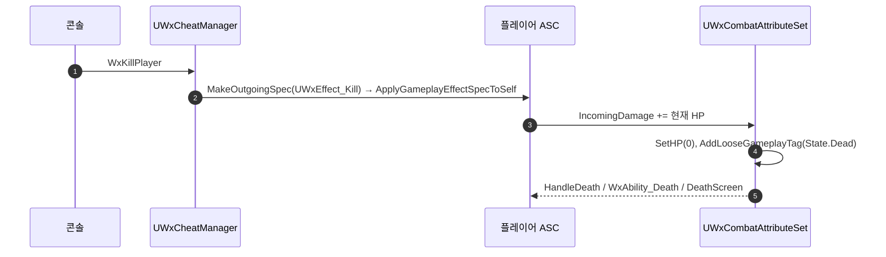

# WxGame 치트매니저 도입 — 플레이어 즉사 치트

## 계획

### 목표
플레이어 사망 흐름(사망 몽타주 → 래그돌 → DeathScreen → 세이브 로드 복귀)을 반복 검증할 수단이 없다. WxGame에 치트매니저 골격을 세우고 첫 치트로 "플레이어 즉사"를 넣는다. WxCombat에 이미 있으나 미사용인 치트용 GE(`FullHP`/`InfiniteMP`/`NoCooldown`)가 앞으로 붙을 진입점도 함께 마련된다.

### 수정 범위
| 파일 | 수정할 내용 | 구분 |
|---|---|---|
| `Source/WxGame/Cheat/WxCheatManager.h` | `UWxCheatManager : public UCheatManager` 선언, `UFUNCTION(Exec) void WxKillPlayer()` | 신규 |
| `Source/WxGame/Cheat/WxCheatManager.cpp` | 소유 PC의 폰 ASC에 `UWxEffect_Kill` self-apply | 신규 |
| `Source/WxGame/Controller/WxPlayerController.cpp` | 생성자에 `CheatClass = UWxCheatManager::StaticClass();` + include | 수정 |

`WxGame.Build.cs`는 변경 없음 — `GameplayAbilities`, `WxCombat` 모두 이미 Public 의존.

### 접근 방식
- **HP 직접 조작이 아니라 `UWxEffect_Kill` self-apply**: 사망 판정은 `UWxCombatAttributeSet::PostGameplayEffectExecute`의 IncomingDamage 경로에서만 `State.Dead`를 붙인다. HP를 직접 0으로 세팅하면 `PreAttributeChange` 클램프만 걸리고 사망이 발동하지 않는다. `UWxEffect_Kill`은 Target 현재 HP를 그대로 IncomingDamage로 넣는 Instant GE라 사망 전 경로가 정상 발동하고, ExecCalc를 타지 않아 무적/가드에도 막히지 않는다(치트에 적합). 뒤잡 처형이 이미 쓰는 검증된 경로다.
- **등록은 `AWxPlayerController` 생성자의 `CheatClass`**: ini에 PlayerController 기본 클래스 자리가 없고(GameMode는 BP `GM_Combat`) 생성자가 이미 `FObjectInitializer` 형태다. 엔진이 `AGameModeBase::AllowCheats`(Standalone·에디터)일 때만 생성하므로 배포 빌드 차단 가드도, 권위 판정용 Server RPC 배선도 불필요하다.

---

## 완료

### 수정한 파일
| 파일 | 수정한 내용 | 구분 |
|---|---|---|
| `Source/WxGame/Cheat/WxCheatManager.h` | `UWxCheatManager` 선언, `UFUNCTION(Exec) WxKillPlayer()` | 신규 |
| `Source/WxGame/Cheat/WxCheatManager.cpp` | 소유 PC의 폰 ASC에 `UWxEffect_Kill` self-apply | 신규 |
| `Source/WxGame/Controller/WxPlayerController.cpp` | 생성자에서 `CheatClass` 지정 + include | 수정 |

### 구현·결정과 그 이유
- **HP 직접 조작 대신 즉사 GE**: 사망 처리가 IncomingDamage 경로에만 걸려 있어 HP를 0으로 써도 클램프만 되고 `State.Dead`가 붙지 않는다. 기존 `UWxEffect_Kill`을 태우면 사망 어빌리티·래그돌·사망 화면까지 실제 경로를 그대로 밟아, 치트로 확인한 결과가 실전 사망과 같아진다.
- **컨텍스트는 `MakeEffectContext()` 그대로**: 이 함수가 이미 자기 자신을 Instigator·Avatar로 실어 주므로 `AddInstigator` 재지정이 불필요하다. 자해 치트라 가해자가 자기 자신인 것이 의미상으로도 맞다.
- **권위·빌드 가드 없음**: 엔진이 `AllowCheats`(Standalone·에디터)에서만 CheatManager를 만들기 때문에 배포 빌드에는 아예 존재하지 않고, 존재하는 시점은 항상 권위 측이다. `#if !UE_BUILD_SHIPPING`이나 Server RPC를 얹으면 실제로 도달할 수 없는 분기만 늘어난다.
- **새 `Cheat/` 폴더**: 치트가 계속 늘어날 자리다. 파일 하나짜리 폴더는 `Input/`에 선례가 있다.

### 계획 대비 달라진 점
- 계획대로.

### 후속 과제
- **PIE 실동작 미검증** — 컴파일까지만 확인했다. 콘솔에 `WxKillPlayer` 입력 → HP 0·사망 몽타주·래그돌·DeathScreen 표시를 눈으로 볼 것.
- `Source/WxGame/README.md` "핵심 타입" 갱신은 `/readme-writer`가 담당(수동 편집하지 않음).
- 미사용 상태인 `UWxEffect_FullHP` / `UWxEffect_InfiniteMP` / `UWxEffect_NoCooldown`을 후속 치트로 얹을 수 있다.
