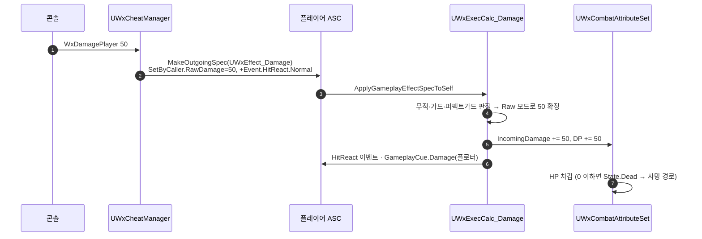

# WxCheatManager — 플레이어 피해 치트 추가

## 계획

### 목표
현재 치트는 `WxKillPlayer`(즉사) 하나뿐이라 "죽는다/안 죽는다"만 확인할 수 있다. HP 감소 연출·대미지 플로터·피격 리액션·DP 축적·가드 감산 같은 부분 피해 구간을 검증하려면 매번 적에게 맞아야 한다. 임의 수치의 피해를 플레이어에게 넣는 `WxDamagePlayer` 치트를 추가해 대미지 파이프라인 전 구간을 콘솔에서 재현한다.

### 수정 범위
| 파일 | 수정할 내용 | 구분 |
|---|---|---|
| `Source/WxGame/Cheat/WxCheatManager.h` | `UFUNCTION(Exec) void WxDamagePlayer(float Amount = 30.f)` 선언 추가 | 수정 |
| `Source/WxGame/Cheat/WxCheatManager.cpp` | 폰 ASC에 `UWxEffect_Damage` self-apply (RawDamage SetByCaller + HitReact 태그) | 수정 |

`WxGame.Build.cs`는 변경 없음 — `GameplayAbilities`·`WxCombat`·`WxCore` 모두 이미 Public 의존.

### 접근 방식
- **`UWxEffect_Damage`를 `SetByCaller.RawDamage` 모드로 self-apply**: `WxExecCalc_Damage::CalcDamage`는 RawDamage가 양수면 ATK·DEF·Coeff·크리를 전부 우회하고 그 값을 그대로 최종 대미지로 쓴다(환경 대미지 경로). 치트가 입력한 수치가 스탯·난수에 흔들리지 않고 정확히 들어가야 하므로 이 모드가 맞다. 새 GE 클래스는 만들지 않는다.
- **즉사 치트와 달리 ExecCalc를 그대로 탄다**: `WxKillPlayer`는 사망 확정이 목적이라 ExecCalc 없는 `UWxEffect_Kill`로 무적·가드를 무시한다. 반대로 이 치트는 대미지 파이프라인 자체가 검증 대상이므로 무적(회피 i-frame)·퍼펙트 가드 반사·가드 감산·`State.Dead` 타겟 차단이 전부 정상 작동하는 편이 낫다.
- **`Event.HitReact.Normal` DynamicAssetTag 부착**: 비가드 상태에서 HitReact 태그가 없으면 `ApplyHitReaction`이 이벤트를 발송하지 않아 HP만 깎이고 피격 반응이 빠진다. `FWxDamageInfo`의 기본값과 같은 표준 피격 태그를 붙여 실전과 같은 경로를 밟게 한다.
- **컨텍스트는 `MakeEffectContext()` 그대로**: `WxKillPlayer`와 동일. 자해 치트라 Source·Target이 같은 ASC다.
- **`Amount <= 0` 조기 리턴**: 0 이하는 Raw 모드 조건(`RawDamage > 0`)을 벗어나 Coeff 미설정 상태의 ATK·DEF 공식으로 빠지고 0 대미지 GE만 헛돈다. 입구에서 막는다.
- **ASC 획득 3줄은 헬퍼로 빼지 않고 반복**: 지금 규모에선 private 헬퍼 도입보다 각 치트가 자기완결로 읽히는 편이 낫다.

---

## 완료

### 수정한 파일
| 파일 | 수정한 내용 | 구분 |
|---|---|---|
| `Source/WxGame/Cheat/WxCheatManager.h` | `UFUNCTION(Exec) WxDamagePlayer(float Amount = 30.f)` 선언 추가 | 수정 |
| `Source/WxGame/Cheat/WxCheatManager.cpp` | 폰 ASC에 `UWxEffect_Damage` self-apply — RawDamage SetByCaller + `Event.HitReact.Normal` 동적 태그, `WxEffect_Damage.h`·`WxGameplayTags.h` include 추가 | 수정 |

### 구현·결정과 그 이유
- **새 GE 없이 표준 대미지 GE의 Raw 모드 재사용**: `UWxEffect_Damage`는 SetByCaller.RawDamage가 양수면 ATK·DEF·계수·치명타를 우회해 그 값을 그대로 최종 대미지로 쓴다. 치트가 요구한 수치가 스탯·난수에 흔들리지 않고 정확히 들어가며, 이펙트존이 이미 쓰는 검증된 경로라 치트 전용 GE를 새로 만들 이유가 없다.
- **ExecCalc를 우회하지 않는다**: 즉사 치트(`UWxEffect_Kill`)는 사망 확정이 목적이라 무적·가드를 무시하지만, 이 치트는 대미지 파이프라인 자체가 검증 대상이다. 무적 회피·퍼펙트 가드 반사·가드 감산·`State.Dead` 타겟 차단이 그대로 걸리는 편이 치트로 확인한 결과와 실전 피격을 일치시킨다.
- **`Event.HitReact.Normal` 동적 태그 부착**: 이 태그가 없으면 비가드 상태에서 HitReact 이벤트가 발송되지 않아 HP·플로터만 움직이고 피격 반응이 통째로 빠진다. `FWxDamageInfo`의 기본 피격 태그와 같은 값을 써서 실전과 같은 반응을 재현한다.
- **`Amount <= 0` 조기 리턴**: 0 이하는 Raw 모드 조건을 벗어나 계수 없는 ATK·DEF 공식으로 빠져 0 대미지 GE만 헛돈다. 조용히 아무 일도 없는 것보다 입구에서 막는 편이 의도가 분명하다.
- **기본값 30**: 인자 없이 `WxDamagePlayer`만 쳐도 HP 바가 눈에 띄게 움직이되 한 방에 죽지는 않는 값. Exec 함수의 C++ 기본 인자는 UHT가 메타데이터로 넘겨 콘솔 파서가 그대로 사용한다.
- **ASC 조회는 헬퍼 없이 반복**: 치트 두 개가 같은 `PC → Pawn → ASC` 3줄을 쓰지만, 이 규모에서 private 헬퍼를 두는 것보다 각 치트가 자기완결로 읽히는 편이 낫다.

### 계획 대비 달라진 점
- 계획대로.

### 후속 과제
- **PIE 실동작 미검증** — 컴파일까지만 확인했다. 콘솔에서 `WxDamagePlayer`(기본 30)·`WxDamagePlayer 50`으로 HP 바 감소·대미지 플로터·피격 리액션을, 가드/퍼펙트 가드 중 입력으로 감산·반사를, 남은 HP보다 큰 수치로 사망 경로를 눈으로 볼 것.
- `Source/WxGame/README.md` 갱신은 `/readme-writer`가 담당(수동 편집하지 않음).
- 미사용 상태인 `UWxEffect_FullHP` / `UWxEffect_InfiniteMP` / `UWxEffect_NoCooldown`도 후속 치트로 얹을 수 있다.
