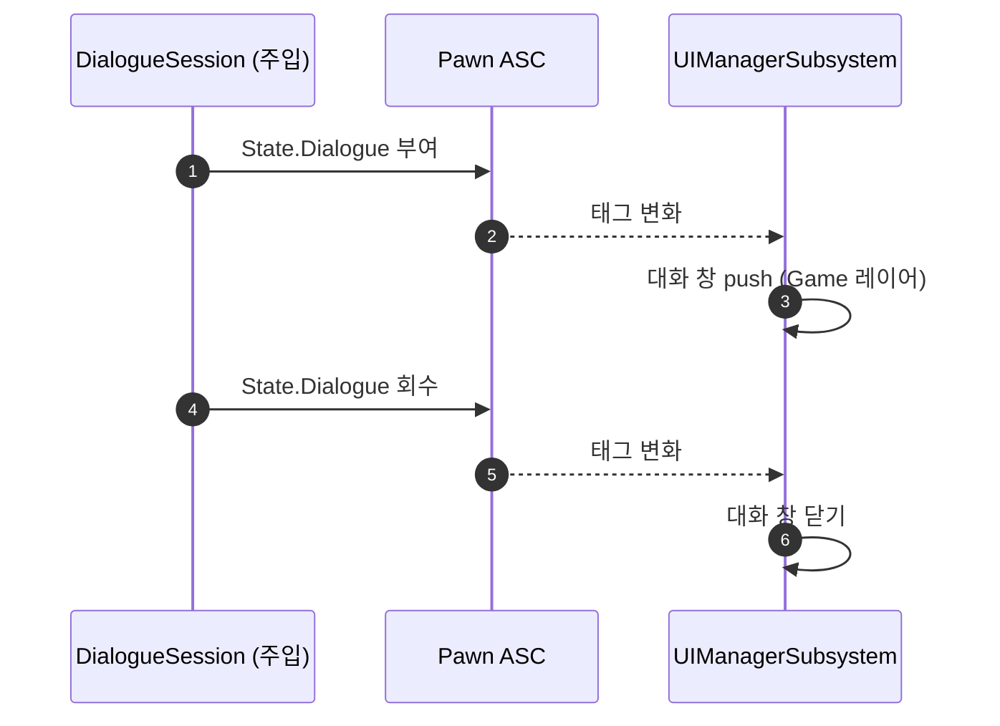

# PlayerController 에서 대화 결합 제거

## 계획

### 목표

`AWxPlayerController` 에 남은 유일한 플러그인 결합인 대화를 걷어낸다. 인벤토리·스캐너·세이브는 Experience 주입으로, HUD·사망 화면은 UI 매니저로 이미 빠졌고 `DialogueSession` 만 생성자 서브오브젝트로 남아 있었다. 소유는 주입으로, 대화 창 글루는 태그 관찰로 옮긴다.

### 수정 범위

| 파일 | 수정할 내용 | 구분 |
|---|---|---|
| `Source/WxGame/Controller/WxPlayerController.h/.cpp` | 세션 멤버·게터·생성·전방선언 제거, `BeginPlay` 오버라이드와 대화 핸들러 2 개·창 약참조 제거, include 4 개 제거, 클래스 주석 갱신 | 수정 |
| `Plugins/WxDialogue/.../Public/WxDialogueSessionComponent.h` | 생성자 선언, 시작·종료 델리게이트 삭제, 주입 컴포넌트가 된 사실을 클래스·카메라 파라미터 주석에 반영 | 수정 |
| `Plugins/WxDialogue/.../Private/WxDialogueSessionComponent.cpp` | 생성자에서 `SetIsReplicatedByDefault(true)`, `Broadcast` 2 곳 삭제 | 수정 |
| `Plugins/WxUI/.../Public/System/WxUIManagerSubsystem.h` | `WatchPawnDeath` → `WatchPawnTags` 개명, 대화 태그 핸들러·창 닫기 선언, 핸들·창 약참조 추가 | 수정 |
| `Plugins/WxUI/.../Private/System/WxUIManagerSubsystem.cpp` | 같은 함수 구현, 폰 ASC 태그 구독을 사망·대화 둘로 확장 | 수정 |
| `Source/WxGame/MVVM/WxViewModel_Dialogue.h/.cpp` | 리졸버가 PC 게터 대신 `FindComponentByClass` 로 세션 조회, PC include 제거 | 수정 |
| `/Game/Framework/WAS_CoreGameplay` | Add Components 에 1 행 추가: `Controller` → `WxDialogueSessionComponent` | 수정(에디터) |

### 접근 방식

- **소유는 Experience 주입으로**: 다른 PC 컴포넌트와 같은 경로다. 다만 세션에는 Client RPC 가 있어, 기본 서브오브젝트일 때 성립하던 "양쪽에 같은 이름으로 존재" 전제가 깨진다. 컴포넌트를 복제 대상으로 만들어(스캐너와 동일) 클라에 실체를 주고, 사이드 분기는 두지 않는다 — 주입 액션이 복제 컴포넌트를 authority 액터에서만 만들기 때문이다.

- **화면 글루는 `State.Dialogue` 태그 관찰로**: 사망 화면 전례 그대로다. UI 매니저는 이미 로컬 PC 의 빙의를 따라가며 폰 ASC 의 사망 태그를 보고 있고, 세션은 이미 같은 ASC 에 대화 태그를 올리고 내린다. 대화 창 클래스도 이미 WxUI 설정 소유라 WxUI 가 새로 아는 것은 없다 — 관찰 태그가 하나 늘 뿐이다.

- **구독자가 사라지는 델리게이트는 삭제**: 이관 후 시작·종료 델리게이트의 구독자가 0 이 된다. 같은 신호를 태그가 온전히 담으므로 남겨 둘 이유가 없다(대사 변경 델리게이트는 뷰모델이 계속 쓴다).

---

## 완료

### 수정한 파일
| 파일 | 수정한 내용 | 구분 |
|---|---|---|
| `Source/WxGame/Controller/WxPlayerController.h/.cpp` | 세션 서브오브젝트·멤버·게터, `BeginPlay` 오버라이드와 대화 핸들러 2 개, 창 약참조, include 4 개 제거. 클래스 주석에서 대화 문단 삭제 | 수정 |
| `Plugins/WxDialogue/.../Public/WxDialogueSessionComponent.h` | 베이스를 `UControllerComponent` 로, 생성자 선언, 시작·종료 델리게이트 삭제, 클래스·카메라 파라미터 주석 갱신 | 수정 |
| `Plugins/WxDialogue/.../Private/WxDialogueSessionComponent.cpp` | 생성자에서 복제 활성화, `Broadcast` 2 곳 삭제, 오너 조회를 `GetController<T>()` 로 | 수정 |
| `Plugins/WxDialogue/.../WxDialogue.Build.cs`, `WxDialogue.uplugin` | `ModularGameplay` 의존 추가 | 수정 |
| `Plugins/WxUI/.../System/WxUIManagerSubsystem.h/.cpp` | `WatchPawnDeath` → `WatchPawnTags`, 대화 태그 구독·핸들러·창 닫기 추가 | 수정 |
| `Source/WxGame/MVVM/WxViewModel_Dialogue.h/.cpp` | 리졸버가 `FindComponentByClass` 로 세션 조회, PC include 제거 | 수정 |

검증: `WxEditor` Win64 Development 빌드 성공(경고 0). PC 는 헤더·구현 합쳐 117 → 57 줄. PIE 육안 검증은 미실시(아래 후속 과제).

### 구현·결정과 그 이유

- **화면 글루를 옮기지 않고 태그로 갈아탔다**: 대화 창을 여닫는 신호는 이미 폰 ASC 의 `State.Dialogue` 에 다 들어 있었다. UI 매니저는 같은 ASC 의 사망 태그를 이미 보고 있고 대화 창 클래스도 이미 갖고 있어, 관찰 태그 하나 추가로 글루가 통째로 사라졌다. 결합을 다른 클래스로 이사시키는 대신 이유를 없앤 셈이라, 신규 클래스도 에셋 등록도 필요 없었다.

- **시작·종료 델리게이트 삭제**: 위 이관으로 구독자가 0 이 됐다. 같은 사실을 태그가 발행하고 있으므로 남겨 두면 두 갈래 신호가 공존한다.

- **복제 활성화가 주입의 전제**: 기본 서브오브젝트일 때는 이름이 서버·클라 양쪽에 같아 Client RPC 가 도착할 자리가 있었다. 동적 생성으로 바뀌면 그 자리가 사라지므로 복제로 실체를 세운다 — 스캐너가 같은 이유로 같은 선택을 해 뒀다.

- **폰 교체 시 대화 창을 닫는다**: 태그 관찰을 새 ASC 로 옮기는 순간 옛 ASC 의 태그 회수를 볼 수 없다. 관찰을 놓는 자리에서 창도 함께 닫아 남지 않게 했다.

### 계획 대비 달라진 점

- **주입 액션이 작업 도중 바뀌어 있었다**: 워킹 트리에 미커밋 리팩터가 있어, 엔트리에서 `ActorClass` 가 사라지고 대상 액터를 컴포넌트의 ModularGameplay 베이스에서 도출하도록 바뀌어 있었다. 그래서 계획의 "`Controller` → 컴포넌트" 2 열 등록 대신, 세션 컴포넌트의 베이스를 `UControllerComponent` 로 바꾸는 것으로 대상을 선언했다(다른 주입 컴포넌트 전부가 이미 그 형태다). `ModularGameplay` 의존 2 곳 추가가 따라왔다.

- **에셋 1 행은 MCP 로 못 넣었다**: PythonScriptPlugin 이 꺼져 있어 프로퍼티 편집 툴셋이 등록되지 않는다(현재 MCP 툴셋 목록에 자산 프로퍼티 계열이 없음). 에디터를 띄워 뒀으니 손으로 넣어야 한다.

### 후속 과제

- **`WAS_CoreGameplay` 에 행 추가 (미완)**: Add Components 액션의 `ComponentList` 에 `WxDialogueSessionComponent` 한 행. **이 행이 없으면 세션 컴포넌트가 안 붙어 대화가 전면 무동작**이다.
- **`BP_PlayerController` 재저장**: 상속 컴포넌트(`DialogueSession`)가 사라졌으므로 열어서 확인 후 저장한다(오버라이드 값은 없었다).
- **PIE 검증 미실시**: 대화 창 표시·넘기기·종료, 카메라 전환·복귀, 대화 중 프롬프트 게이트, 퀘스트 ST 경로, 그리고 같은 함수를 손댄 HUD·사망 화면.
- 카메라 파라미터를 에셋에서 조정하고 싶어지면 세션 컴포넌트의 BP 서브클래스를 만들어 주입 액션에 등록한다.
