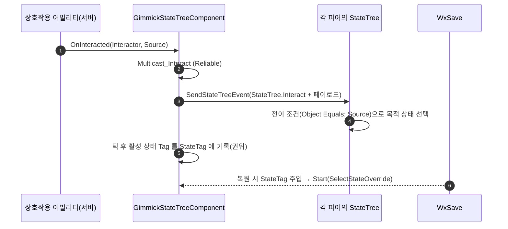

# 기믹 StateTree 컴포넌트 이관 — 순정 전이·상태태그로 전환

## 계획

### 목표
신규 기믹을 C++ 없이 BP + StateTree 저작만으로 만들 수 있게 한다. `AWxGimmick` 이 들고 있던 상태·세이브·상호작용 책임을 `UWxGimmickStateTreeComponent` 로 내리고, 그 과정에서 자체 상태 프로토콜(`Gimmick.*` 태그 + Root 재선택 + 복원 마커)을 엔진 5.8 순정 기능(상태 Tag + 전이 + 시작 상태 지정)으로 대체한다. 1단계는 인프라 이관과 자식 4종의 C++ 로직 제거까지이며, BP 리페어런팅과 클래스 삭제는 2단계로 미룬다.

### 수정 범위
| 파일 | 수정할 내용 | 구분 |
|---|---|---|
| `Plugins/WxWorld/.../Gimmick/WxGimmickStateTreeComponent.h/.cpp` | `UStateTreeComponent` 파생. `IWxSavable`+`IWxInteractable` 구현, 상호작용 멀티캐스트, 활성 상태 Tag 저장·복제, 시작 상태 지정, SaveId 자가 치유 | 신규 |
| `Plugins/WxWorld/.../Gimmick/WxGimmick.h/.cpp` | State·프롬프트·활성목록·인터페이스·SaveId·시퀀스 훅 제거. `SceneRoot`+`ArrowComponent`+새 컴포넌트만 남김 | 수정 |
| `.../Gimmick/WxDoor·WxElevator·WxTreasureChest·WxCheckPoint` | `OnInteracted` override, 생성자의 `State=`·`ActiveInteractionMeshes.Add` 제거 | 수정 |
| `.../Gimmick/WxGimmickStateTreeNodes.h/.cpp` | 오너 조회 6곳을 컴포넌트 조회로 교체, 복원 마커 검사 제거, 시퀀스 통지 삭제, 태스크 2종 추가 | 수정 |
| `Plugins/WxCore/.../WxInteractable.cpp` | `Find` 가 액터 → 컴포넌트 순으로 계약 구현자를 찾도록 확장 | 수정 |
| `Plugins/WxSave/.../WxSaveWorldSubsystem.cpp` | savable 발견을 헬퍼로 일원화(액터 우선, 없으면 컴포넌트) | 수정 |
| `Plugins/WxCore/.../WxGameplayTags.h/.cpp` | `StateTree.Interact` 추가, `Gimmick`·`Gimmick.*`·`StateTree.Restore` 삭제(ini 이관 후) | 수정 |
| `Plugins/WxInventory/.../WxRewardStateTreeNodes.cpp` | 복원 마커 인라인 검사 제거 | 수정 |
| `Content/WorldObject/Gimmick/ST_*.uasset` (4) | 상태 Tag 지정, `On Event: StateTree.Interact` 전이 배선, Root 재선택·Required Event 제거, resting 을 첫 자식으로 | 수정 |
| `Docs/Programmer/Gimmick_State_Authority.md`, README 2종 | 규칙 재작성 | 수정 |

### 접근 방식
- **전이는 ST 가 결정한다**: 컴포넌트는 상호작용을 `StateTree.Interact` 이벤트(페이로드: Source 메시·Interactor)로 뿌리기만 하고, 목적지는 에셋의 전이가 지목한다. 영역이 여럿인 기믹은 전이 조건에서 페이로드 Source 를 순정 `Object Equals` 로 비교한다. 자식 C++ 의 분기가 전부 여기로 옮겨간다.
- **상태 식별은 순정 상태 Tag**: `UStateTreeState::Tag` 를 그대로 쓴다. 컴포넌트는 틱 이후 활성 leaf 에서 위로 올라가며 첫 유효 Tag 를 읽어 `SaveGame`+복제 프로퍼티에 담고, 복원·레이트조인은 `Start(SelectStateOverrideArgs)` 로 그 상태에서 트리를 연다. 초기 진입(`SourceStateID` 무효)이라 노드의 스냅·스킵이 그대로 맞는다 — 복원 마커가 필요 없어진다.
- **라이브 표현은 Reliable 멀티캐스트**: 각 피어가 같은 이벤트로 각자 전이해 비주얼이 살아 있고, 복제 Tag 는 어긋난 피어를 재시작으로 교정하는 안전망으로만 쓴다.
- **비순정 지점 1개**: 엔진의 `StartTree()` 가 protected·비가상이고 시작 파라미터를 하드코딩해서, 시작 상태를 넣으려면 서브클래스에서 재구현해야 한다. 엔진 업그레이드 확인 지점으로 주석에 남긴다.

---

## 완료

### 수정한 파일
| 파일 | 수정한 내용 | 구분 |
|---|---|---|
| `Plugins/WxWorld/.../Gimmick/WxGimmickStateTreeComponent.h/.cpp` | `UStateTreeComponent` 파생. 두 계약 구현, 상호작용 멀티캐스트(영역별 이벤트 태그), 활성 상태 Tag 폴링·복제·SaveGame, 저장 상태에서 트리 열기, SaveId 자가 치유 | 신규 |
| `Plugins/WxWorld/.../Gimmick/WxGimmick.h/.cpp` | 부착 루트·화살표·컴포넌트만 남기고 상태·계약·시퀀스 훅 제거 | 수정 |
| `.../Gimmick/WxDoor·WxElevator·WxTreasureChest·WxCheckPoint` | `OnInteracted`·초기 State·기본 활성 영역·HealEffect 제거(메시 생성만 잔존) | 수정 |
| `.../Gimmick/WxGimmickStateTreeNodes.h/.cpp` | 오너 조회를 컴포넌트로, `IsInitialEntry` 단순화, 시퀀스 통지 삭제, `Enable Interaction` 에 `InteractEvent` 추가, 태스크 2종 신설 | 수정 |
| `Plugins/WxCore/.../WxInteractable.cpp` · `WxSave/.../WxSaveWorldSubsystem.cpp` | 계약 구현자 조회를 액터→컴포넌트 순으로 확장 | 수정 |
| `Plugins/WxCore/.../WxGameplayTags.h/.cpp` | `StateTree.Interact` 추가, `Gimmick` 부모·`StateTree.Restore` 삭제 | 수정 |
| `Plugins/WxInventory`·`WxSave`·`WxWorld` 의 ST 태스크 4종 | 복원 마커 검사 제거 | 수정 |
| `Config/DefaultGameplayTags.ini` | 엘리베이터 영역 태그 3종(콘텐츠 태그의 자리) | 신규 |
| `Content/WorldObject/Gimmick/ST_*.uasset` (4) | 상태 Tag 부여, Root 재선택·Required Event 제거, 상호작용 이벤트 전이 배선, resting 을 첫 자식으로, 체크포인트에 태스크 2종 | 수정 |
| `Docs/Programmer/Gimmick_State_Authority.md`, README 3종 | 규칙 재작성 | 수정 |

### 구현·결정과 그 이유
- **엔진 순정으로 갈아탄 것이 이 작업의 본질**: 상태 식별은 `UStateTreeState::Tag`, 복원은 `Start(SelectStateOverrideArgs)`, 전이는 순정 `On Event`. 그 결과 자체 프로토콜(권위 State 쓰기·Root 재선택·복원 마커)이 통째로 사라지고 규칙이 3개에서 실질 2개로 줄었다.
- **영역 식별을 이벤트 태그로 올림**: 애초엔 전이 조건에서 이벤트 페이로드의 Source 를 비교할 생각이었으나, 바인딩 저작이 MCP 로는 위험이 커 `Enable Interaction` 이 영역별 이벤트 태그를 선언하는 형태로 바꿨다. 전이는 조건 없이 태그만으로 갈라지고, 태그 계층 덕에 "아무 영역이나"(부모)와 "이 영역만"(자식)이 공짜로 나온다.
- **당사자 복제를 멀티캐스트로 대체**: 상호작용 멀티캐스트가 각 피어에 당사자를 나르므로 복제 프로퍼티가 필요 없어졌다. 덤으로 호출자가 0건이라 죽어 있던 이동·몽타주 태스크가 살아났다.
- **`StartTree` 재구현이 유일한 비순정 지점**: 엔진의 것이 protected·비가상이고 시작 파라미터를 하드코딩한다. 실행 확장(`FStateTreeComponentExecutionExtension`)도 export 되지 않아 동형 확장을 자체 정의했다.
- **정지 직전 상태 기록**: 종착 상태에 들어간 그 틱에 트리가 멈추면 틱 후 폴링이 빈 값을 읽는다. `StopLogic` 오버라이드에서 한 번 더 기록해 막았다.

### 계획 대비 달라진 점
- **`Gimmick.*` 네이티브 태그는 남겼다**: 이제 코드가 읽지 않는 라벨이지만, 이미 배치된 4종 에셋이 그 이름을 쓰고 있어 ini 이관은 실익 없이 위험만 있다. 부모 태그 `Gimmick` 과 `StateTree.Restore` 만 삭제했다.
- **체크포인트 재휴식 동작이 넓어졌다**: 예전엔 회복·리스폰만 다시 돌았으나, 이제 자기 자신으로의 전이가 상태 전체를 재진입시켜 리필·저장도 함께 다시 돈다(모닥불 의미상 더 맞다고 판단).
- **엘리베이터는 층 상태에 전이를 하나씩만 걸었다**: 각 층에서 켜져 있는 영역(플랫폼·반대편 콘솔)이 전부 같은 목적지라, 부모 태그 `StateTree.Interact` 하나로 받는다. 영역별 태그는 두 콘솔이 갈리는 Closed 에만 필요해 거기만 지정했다.

### 후속 과제
- **세이브 키를 굽기에서 계산으로 교체(사후 수정)**: 컴포넌트 `OnRegister` 에서 오너 액터 GUID 를 굽는 방식이 실제로는 유효한 값을 남기지 못해, PIE 에서 네 기믹 전부 "WxSaveId 가 유효하지 않아 저장에서 제외됨" 으로 빠졌다. 굽기를 버리고 오너 경로(PIE 접두사 제거)에서 결정적 GUID 를 산출하도록 바꿔 해결했다 — 에디터 훅·에셋 재저장에 기대지 않고 쿠킹에서도 성립한다. 대가로 액터를 옮기거나 개명하면 그 기믹의 저장 상태를 잃는다.
- **검증된 것**: 상태 폴링(문 컴포넌트의 StateTag 가 `Gimmick.Door.Close` 로 기록됨), 캡처(`FlushSavableActors: IWxSavable 9개 캡처`, 경고 0건).
- **미검증(불러오기)**: PIE 는 시작마다 `StartNewSaveFile` 로 새 슬롯을 열어 이전 세션 레코드가 남지 않으므로, 실제 저장→불러오기 왕복은 체크포인트 상호작용(파일 기록)과 슬롯 로드를 거쳐야 확인된다. 플레이 입력이 필요해 이번엔 못 돌렸다.
- **PIE 실동작 미검증**: 4종 기믹의 상호작용·연출·스트리밍 왕복도 아직 확인하지 않았다.
- **ST_Door 의 Console 프롬프트가 비어 있다**(기존 상태). 문구를 넣으려면 `Enable Interaction` 의 Prompt 를 채운다.
- **2단계(별도 승인)**: BP 4종을 순수 BP 액터로 재저작 → `AWxGimmick` 과 자식 4종 삭제.
- **MCP 저작 함정 2건**: 직접 프로퍼티 기입은 ST 를 dirty 로 표시하지 않아 Compile 버튼이 먹지 않는다(Add State 같은 UI 조작으로 한 번 흔들어야 한다). 그리고 인스턴스드 배열은 원소 타입 변경이 조용히 무시되고 `iD` 만 적용되므로, 재정렬은 비운 뒤 다시 채워야 한다.
