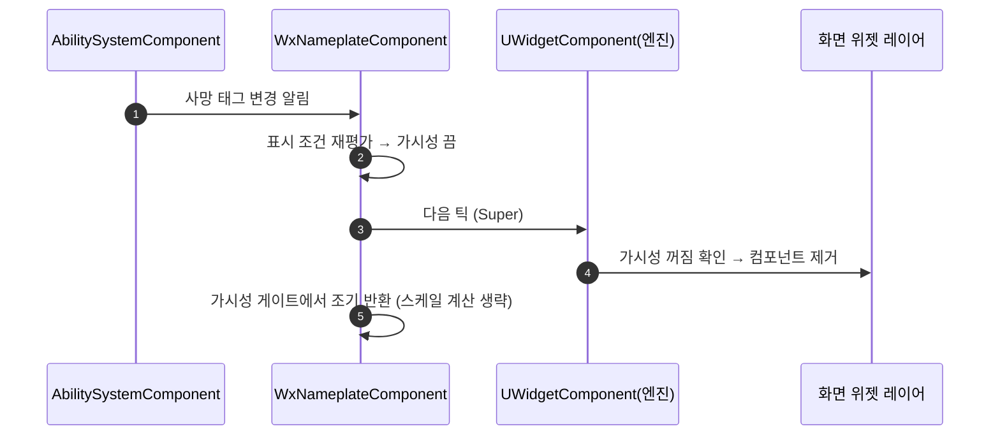

# 네임플레이트: 적 사망 후 화면에 남는 회귀 수정

## 계획

### 목표
적을 죽여도 네임플레이트가 계속 떠 있는 버그를 고친다. 직전 모듈 리뷰 수정에서 넣은 "숨김과 동시에 컴포넌트 틱 정지" 최적화가 원인이며, 스크린 스페이스 위젯을 화면 레이어에서 떼어내는 일 자체가 그 틱에 실려 있어 숨김이 화면에 반영되지 못한다.

### 수정 범위
| 파일 | 수정할 내용 | 구분 |
|---|---|---|
| `Plugins/WxUI/Source/WxUI/Private/Component/WxNameplateComponent.cpp` | 틱 정지 토글과 `bStartWithTickEnabled=false` 제거, 틱 본문에 가시성 게이트 추가, 관련 주석 정정 | 수정 |

### 접근 방식
- **원인**: 표시 판정이 가시성을 끄면서 같은 호출에서 틱까지 껐다. 스크린 스페이스 위젯 컴포넌트의 화면 부착·해제는 엔진이 틱에서만 처리하므로, 숨김을 반영할 다음 틱이 오지 않아 Slate 슬롯이 화면 레이어에 그대로 남는다. 액터가 파괴되는 경로는 언레지스터에서 정리되므로 시체가 남는 사망에서만 증상이 보인다.
- **판정은 무죄**: 사망 태그 부여와 태그 이벤트, 표시 조건 평가는 모두 정상 도달한다. 문제는 숨김 결정이 아니라 그 결정이 화면에 반영되지 않는 것이다.
- **해결**: 틱으로 화면을 동기화하는 엔진 순정 동작을 거스르지 않는다. 컴포넌트 틱은 켜 두고, 아낄 대상을 우리 거리·스케일 계산으로만 한정한다. 숨김 시 컴포넌트가 화면 레이어에서 빠지므로 레이어의 매 프레임 투영 비용까지 함께 사라져, 원래 최적화가 노렸던 절감은 오히려 더 커진다.

---

## 완료

### 수정한 파일
| 파일 | 수정한 내용 | 구분 |
|---|---|---|
| `Plugins/WxUI/.../Private/Component/WxNameplateComponent.cpp` | 생성자의 틱 비활성 시작과 표시 판정의 틱 토글 제거, 틱 본문 앞에 가시성 게이트 추가, 주석 정정 | 수정 |
| `Plugins/WxUI/.../Public/Component/WxNameplateComponent.h` | 표시 판정이 틱을 함께 여닫는다는 설명 제거 | 수정 |

### 구현·결정과 그 이유
- **틱은 항상 켠다**: 스크린 스페이스 위젯을 화면 레이어에 붙이고 떼는 일이 엔진의 위젯 컴포넌트 틱에만 실려 있다. 숨김은 "다음 틱에 떼어내라"는 예약이므로, 숨기면서 틱을 끄면 그 다음 틱이 오지 않아 위젯이 레이어에 영영 남는다. 액터가 파괴되는 경로는 언레지스터가 정리하므로 시체가 남는 사망에서만 증상이 드러났다.
- **게이트는 우리 코드에만**: 엔진의 화면 동기화는 그대로 지나가게 두고, 조기 반환은 거리·스케일 계산 앞에만 둔다. 엔진 순정 동작을 토글로 비틀지 않는 쪽이 안전하다.
- **절감은 오히려 커진다**: 숨겨진 컴포넌트는 화면 레이어에서 빠지므로 레이어가 매 프레임 돌리는 투영 계산 대상에서도 제외된다. 원래 최적화가 노린 스케일 계산 절감은 게이트가 그대로 지키고, 스크린 스페이스에서 남는 엔진 틱 비용은 포인터 검사 몇 번뿐이다.
- **가시성 술어 일치**: 게이트 조건을 엔진의 화면 부착 조건과 같은 술어로 맞춰, 화면에 붙어 있는데 스케일만 멈추는 어긋남이 생기지 않게 했다.

### 계획 대비 달라진 점
- 계획대로. 헤더 주석 한 줄이 틱 토글을 설명하고 있어 함께 정리한 것이 추가분이다.

### 후속 과제
- PIE 실동작 확인은 사용자 몫이다(빌드까지만 검증). 처치 시 즉시 사라지는지, 전투 이탈·락온 반복 후에도 정상 표시/숨김과 거리 스케일 갱신이 유지되는지를 본다.
