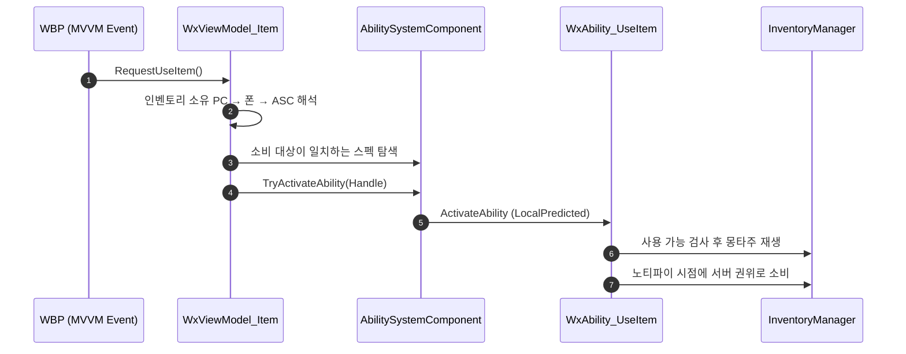

# 아이템 사용 뷰모델 명령

## 계획

### 목표
`UWxViewModel_Item` 은 표시 전용이라 위젯 클릭으로 아이템을 쓸 수 없고, 사용 경로가 Z 키 하나뿐이다. `UWxViewModel_Ability::TryActivateAbility` 처럼 MVVM Event 바인딩에 물릴 수 있는 사용 명령 함수를 뷰모델에 추가한다.

### 수정 범위
| 파일 | 수정할 내용 | 구분 |
|---|---|---|
| `Source/WxGame/AbilitySystem/Ability/WxAbility_UseItem.h/.cpp` | `ConsumableDef` 를 읽는 public 게터 추가 | 수정 |
| `Source/WxGame/MVVM/WxViewModel_Item.h/.cpp` | `RequestUseItem()` 명령 함수 추가 | 수정 |

### 접근 방식
- **어빌리티 경유**: 인벤토리의 사용 진입점은 서버 권한을 `check` 하는 비-UFUNCTION 이라 뷰모델에서 직접 부를 수 없다. 클라→서버 홉은 프로젝트에서 LocalPredicted 어빌리티가 담당하므로, 뷰모델은 Z 키 입력이 타는 그 경로를 그대로 재사용한다 — 인벤토리 소유 컨트롤러의 폰에서 ASC 를 얻고, 부여된 스펙 중 이 아이템을 소비 대상으로 가진 UseItem 어빌리티를 찾아 발동한다. 인벤토리에 Server RPC 를 새로 파지 않는다.
- **판정 위임**: 보유·충전·쿨다운은 뷰모델이 판정하지 않는다. 빈 병 게이트는 어빌리티 활성화 시점의 사용가능 검사가, 마시는 중 재클릭은 어빌리티의 전면 블록 태그가 이미 막는다.
- **명명**: 동작은 `TryActivateAbility` 와 같지만 이름은 같은 모듈 형제 뷰모델의 명령 규약(`RequestInteract`·`RequestAdvance`)을 따라 `Request*` + void + 무인자로 맞춘다.

---

## 완료

### 수정한 파일
| 파일 | 수정한 내용 | 구분 |
|---|---|---|
| `Plugins/WxInventory/.../WxInventoryManagerComponent.h/.cpp` | UseItem 어빌리티를 AssetTag 로 발동하는 진입점 추가 | 수정 |
| `Source/WxGame/AbilitySystem/Ability/WxAbility_UseItem.h` | 발동 경로가 둘임을 클래스 주석에 명시 | 수정 |
| `Source/WxGame/MVVM/WxViewModel_Item.h/.cpp` | `RequestUseConsumable()` 명령 함수 추가 | 수정 |

### 구현·결정과 그 이유
- **어빌리티 경유**: 인벤토리의 사용 진입점이 서버 권한을 `check` 하는 비-UFUNCTION 이라 뷰모델에서 직접 부를 수 없다. 클라→서버 홉을 새로 파는 대신 입력이 타는 경로를 그대로 재사용해, 마시기 몽타주·후딜 캔슬·빈 병 게이트가 전부 따라온다.
- **AssetTag 로 지목**: 어빌리티에 이미 붙어 있던 AssetTag 로 스펙을 찾아 발동한다. 엔진의 태그 발동은 결국 평범한 활성화라 입력 경로와 완전히 같은 동작이 되고, 인벤토리는 WxCore 태그 하나만 알면 되니 WxGame 을 참조하지 않는다. 뷰모델은 이미 들고 있던 인벤토리만 부르면 되므로 신규 include 가 0이다.
- **대상을 지목하지 않는다**: 소비 아이템을 에스트병 하나로 확정했다. 시그니처에 대상을 남겨두면 실제로는 무시되면서 지목하는 척만 하게 되므로 인자 자체를 뺐다 — 종류가 늘 때 컴파일이 막아서므로 엉뚱한 아이템이 조용히 쓰이지 않는다.
- **판정 위임**: 보유·충전·중복 클릭은 뷰모델도 인벤토리도 검사하지 않는다. 빈 병은 어빌리티 활성화 시점 검사가, 마시는 중 재클릭은 전면 블록 태그가 이미 막는다. 같은 판정을 여러 곳에 복제하면 어긋난다.

### 계획 대비 달라진 점
- 계획은 소비 대상 게터를 열고 뷰모델이 ASC 스펙을 순회하는 형태였다. 뷰모델 의존성 지적을 받아 몇 차례 옮겨 다닌 끝에, 기존 AssetTag 를 쓰면 새 장치 없이 인벤토리 함수 하나로 끝난다는 결론에 닿았다. 중간에 도입했던 사용 요청 이벤트 태그와 어빌리티 트리거·수신 판정은 전부 걷어냈다.
- 요청 이벤트 방식은 기각했다. 소비 시점 이벤트와 이름·모양이 비슷하면서 방향이 반대라(하나는 어빌리티를 시작시키고 하나는 활성 중인 어빌리티에 삼킴을 알린다) 읽는 사람이 헷갈린다. 게다가 두 태그를 합치면 마시는 도중의 클릭이 대기 중인 소비 태스크에 직접 전달돼 모션 전에 물약이 사라진다 — 태그 브로드캐스트는 블로킹을 보지 않기 때문이다.

### 후속 과제
- 소비 아이템이 둘 이상이 되면 인벤토리 진입점이 대상을 받아 어느 어빌리티를 발동할지 가려야 한다. AssetTag 발동은 매칭되는 어빌리티를 전부 발동시킨다.
- WBP 쪽 MVVM Event 바인딩(`OnButtonBaseClicked → RequestUseConsumable`)과 PIE 실동작 확인은 아직 안 했다.
- 검증 시점에 WxEditor 타겟 빌드가 실패 상태였다. 원인은 진행 중이던 기믹 ST 컴포넌트 리팩터링(WxWorld)이며 본 작업과 무관하다. 본 작업의 파일은 모두 컴파일을 통과하고 WxInventory·WxGame 링크까지 성공했으나, 타겟 전체 빌드로는 미검증이다.
