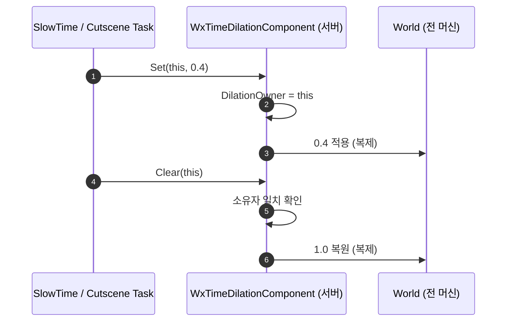

# 전역 타임 딜레이션 소유권을 UWxTimeDilationComponent 로 일원화

## 계획

### 목표
전역 시간 배율을 바꾸는 주체가 둘로 갈려 있다. 컷신 태스크가 컴포넌트를 우회해 `UGameplayStatics::SetGlobalTimeDilation` 을 직접 호출하고, 슬로우 태스크는 소유권 검사 없이 무조건 `1.f` 로 되돌린다. 딜레이션 경로를 컴포넌트 하나로 모으고 서버 권위 → 복제만 남긴다. `Docs/Programmer/module_review_WxCombat.md` 발견 1(🔴) 대응.

### 수정 범위
| 파일 | 수정할 내용 | 구분 |
|---|---|---|
| `Plugins/WxCombat/Source/WxCombat/Public/Time/WxTimeDilationComponent.h` | `Set...` 에 `Requester` 인자 추가, `Clear...` 선언, `DilationOwner` 멤버, Set/Clear 짝 계약 주석 | 수정 |
| `Plugins/WxCombat/Source/WxCombat/Private/Time/WxTimeDilationComponent.cpp` | 소유자 검사 구현, 컴포넌트 미탐색 시 경고 로그 | 수정 |
| `Plugins/WxCombat/Source/WxCombat/Public/AbilitySystem/Task/WxAbilityTask_SlowTime.h` | 클래스 주석 갱신 | 수정 |
| `Plugins/WxCombat/Source/WxCombat/Private/AbilitySystem/Task/WxAbilityTask_SlowTime.cpp` | Set/Clear 로 교체, 하드코딩 `1.f` 복원 삭제 | 수정 |
| `Plugins/WxCombat/Source/WxCombat/Public/AbilitySystem/Task/WxAbilityTask_PlaySkillCutscene.h` | `OriginalTimeDilation`·`bTimeDilationActive`·`RestoreTimeDilation` 삭제 | 수정 |
| `Plugins/WxCombat/Source/WxCombat/Private/AbilitySystem/Task/WxAbilityTask_PlaySkillCutscene.cpp` | GameplayStatics 직접 호출 제거, Set/Clear 경유 | 수정 |

### 접근 방식
- **요청자 객체가 곧 소유자**: 컴포넌트 상태는 현재 값 하나 + 소유자 하나(`TWeakObjectPtr<const UObject> DilationOwner`)뿐. 스택·참조 카운트·토큰 발급 없음. 호출부는 아무것도 저장하지 않고 `this` 만 넘긴다.
- **이름은 Set/Clear**: `Acquire`/`Release` 는 락·참조 카운트를 연상시켜 설계를 실제보다 무겁게 읽히게 한다. 기존 이름 `SetGlobalTimeDilationAuthoritative` 를 살리면 호출부 diff 도 인자 추가뿐이고, `Authoritative` 접미사가 "서버에서만 먹는다"는 계약을 계속 알려 준다.
- **Clear 는 소유자 검사**: 현재 소유자가 살아 있는데 요청자가 아니면 무시해 남의 연출을 걷어내지 않는다. 소유자가 이미 사라진(stale) 경우에는 복원한다.
- **결합 규칙은 last wins**: 겹치면 나중 요청이 값을 가져가고 앞선 쪽의 해제는 무시된다. 실제 겹침 경로는 `CancelAbilitiesWithTag` 로 대부분 차단돼 있다.
- **감시 장치 없음**: `UAbilityTask::OnDestroy` 는 엔진이 보장하므로(EndTask → `OnDestroy(false)`, EndAbility → `TaskOwnerEnded()` → `OnDestroy(true)`) 두 호출자는 Clear 를 잊을 수 없다. 소유자 유효성 감시 Tick 은 발동할 일이 없어 넣지 않고, 계약만 헤더 주석에 못 박는다.

---

## 완료

### 수정한 파일
| 파일 | 수정한 내용 | 구분 |
|---|---|---|
| `Plugins/WxCombat/Source/WxCombat/Public/Time/WxTimeDilationComponent.h` | 공개 API를 정적 `Set/ClearGlobalTimeDilationAuthoritative(Requester, ...)` 한 쌍으로, 실제 동작은 private `SetDilationFrom`·`ClearDilationFrom`·`FindComponent` 로. `DilationOwner` 멤버 추가 | 수정 |
| `Plugins/WxCombat/Source/WxCombat/Private/Time/WxTimeDilationComponent.cpp` | 소유자 기록·검사 구현, 컴포넌트 탐색을 `FindComponent` 로 묶고 미탐색 시 경고 로그 | 수정 |
| `Plugins/WxCombat/Source/WxCombat/Public/AbilitySystem/Task/WxAbilityTask_SlowTime.h` | 클래스 주석 갱신(자기 요청만 거둔다) | 수정 |
| `Plugins/WxCombat/Source/WxCombat/Private/AbilitySystem/Task/WxAbilityTask_SlowTime.cpp` | `OnDestroy` 의 하드코딩 `1.f` 복원을 `Clear...(this)` 로 교체 | 수정 |
| `Plugins/WxCombat/Source/WxCombat/Public/AbilitySystem/Task/WxAbilityTask_PlaySkillCutscene.h` | `OriginalTimeDilation`·`bTimeDilationActive`·`RestoreTimeDilation` 삭제, 주석 갱신 | 수정 |
| `Plugins/WxCombat/Source/WxCombat/Private/AbilitySystem/Task/WxAbilityTask_PlaySkillCutscene.cpp` | `UGameplayStatics` 직접 호출 제거하고 컴포넌트 경유로 교체(3개 해제 지점 포함), 불필요해진 include 정리 | 수정 |

### 구현·결정과 그 이유
- **공개 API는 정적 한 쌍만**: 인스턴스 버전에 `Requester` 를 붙이니 정적과 시그니처가 같아져 C++ 문법상 오버로드가 불가능했다(C2686). 어차피 호출부는 전부 정적 경로를 쓰므로 인스턴스 쪽을 `SetDilationFrom`/`ClearDilationFrom` private 헬퍼로 내렸다. 결과적으로 "항상 GameState 조회를 거친다"는 사용법이 타입으로 강제된다.
- **요청자 객체가 곧 소유자**: 토큰이나 핸들을 두면 호출부가 그걸 멤버로 들고 있어야 한다. `this` 를 넘기면 호출부에 상태가 아예 안 생겨서, 컷신 태스크는 멤버 2개와 헬퍼 1개가 통째로 사라졌다.
- **stale 소유자는 해제를 허용**: 소유자가 이미 GC 된 상태에서 들어온 Clear 는 그대로 복원한다. 감시 장치를 안 두는 대신 이 한 줄이 "값만 남고 주인이 없는" 상태를 자연히 푼다.
- **`IsNearlyEqual` 조기 반환 제거**: 값이 같아도 소유권은 새 요청자에게 넘어가야 한다. 조기 반환을 남기면 같은 배율의 두 연출이 겹칠 때 소유권이 첫 번째에 묶인다.
- **컴포넌트 미탐색 경고**: 컷신이 이 경로로 넘어오면서, 컴포넌트가 GameState 에 없으면 슬로우가 통째로 사라진다(전에는 `UGameplayStatics` 직접 호출이라 무관했다). 화면상 원인이 안 보이는 실패라 `LogWxCombat` 경고를 남겼다 — 모듈에서 이 카테고리를 처음 쓰는 자리다.

### 계획 대비 달라진 점
- 인스턴스 메서드를 공개 API 로 두려던 것을 private 헬퍼(`SetDilationFrom`/`ClearDilationFrom`)로 바꿨다. 정적과 시그니처가 겹쳐 컴파일이 안 되기 때문이며, 호출부 사용법은 계획과 동일하다.

### 후속 과제
- PIE 확인 미실시(컴파일 검증까지만): 단독 퍼펙트 가드·극한 회피, 궁극기 컷신, 퍼펙트 가드 직후 궁극기, 슬로우/컷신 도중 강제 중단 시 배율 복귀.
- 컷신 딜레이션이 서버 권위 경로로 바뀌어, 소유 클라에서는 복제 도착 후(약 1 RTT) 적용된다. 스탠드얼론·PIE 단독·리슨서버 호스트는 차이 없음. 멀티 실측은 미검증.
- 컷신 시퀀스의 `SetPlayRate(1/GlobalTimeDilation)` 보정은 요청값 기준 그대로다. 위 지연 구간에서는 순간적으로 시퀀스가 빠르게 보일 수 있다.
