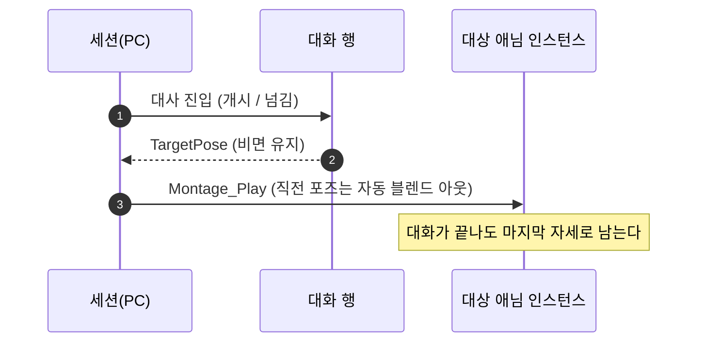

# 대화 NPC 포즈

## 계획

### 목표
대화 중 NPC 가 대사에 맞는 포즈를 취하게 한다. 지금은 세션이 카메라만 연출하고 NPC 는 단일 노드로 도는 아이들 한 자세로 서 있어, 대사가 바뀌어도 몸이 반응하지 않는다.

### 수정 범위
| 파일 | 수정할 내용 | 구분 |
|---|---|---|
| `Plugins/WxDialogue/.../Public/WxDialogueTableRow.h` | 대사가 취할 포즈 몽타주 `TargetPose` 추가 | 수정 |
| `Plugins/WxDialogue/.../Public/WxDialogueSessionComponent.h` | 포즈 재생 헬퍼 | 수정 |
| `Plugins/WxDialogue/.../Private/WxDialogueSessionComponent.cpp` | 세션 개시·대사 넘김 두 지점에서 포즈 재생 | 수정 |
| `Content/WorldObject/Npc/BP_Npc` | 애님 모드를 `ABP_Unarmed` 로 교체 | 수정(에셋) |
| `Content/DesignerTables/DT_Dialogue` | 검증용 포즈 몽타주 기입 | 수정(에셋) |

### 접근 방식
- **포즈는 대사에 딸린다**: 어느 대사에 어떤 자세인지는 대화 데이터가 정하므로 행이 몽타주를 직접 든다. 대상 측에 이름→몽타주 맵을 두는 안도 검토했으나, 같은 값을 두 곳에서 관리하게 될 뿐이라 접었다.
- **비면 유지**: 행에 지목이 없으면 직전 포즈를 그대로 둔다. 한 자세로 여러 대사를 이어가는 것이 기본값이라 시작 행에 한 번만 지정하면 된다. 대화가 끝난 뒤에도 마지막 자세로 남으며, 다음 대사나 다음 대화가 그것을 갈아끼운다.
- **유지·일회성은 몽타주가 정한다**: 자기 자신으로 이어지는 섹션이면 자세를 붙잡고, 루프가 없으면 한 번 연기한 뒤 풀린다. 코드는 재생·정지만 하고 이 구분을 알지 않으며 블렌드 시간도 애셋 값을 그대로 쓴다.
- **세션이 든다**: 카메라와 같은 이유다. 대사를 넘기는 자리가 포즈를 갈아끼울 유일한 지점이고, 대상·현재 행이라는 재료도 세션에 이미 있다. 다만 카메라와 달리 종료 시 되돌리지 않는다. 대상 없는 대사(나레이션)는 카메라와 함께 통째로 건너뛴다.
- **재생 기반**: 단일 노드 모드에는 몽타주 슬롯이 없으므로 NPC 메시를 `ABP_Unarmed` 로 돌린다. 그 애님 BP 는 오너를 캐릭터로 캐스팅해 로코모션 값을 채우는데 NPC 는 캐릭터가 아니라 캐스트가 실패하고, 그래프가 유효성으로 가드하고 있어 값이 0 으로 남아 아이들에 머문다 — 서 있는 NPC 에겐 그것이 원하는 결과라 전용 애님 BP 를 새로 만들지 않는다.

---

## 완료

### 수정한 파일
| 파일 | 수정한 내용 | 구분 |
|---|---|---|
| `Plugins/WxDialogue/.../Public/WxDialogueTableRow.h` | 대사가 취할 포즈 몽타주 `TargetPose` 추가 | 수정 |
| `Plugins/WxDialogue/.../Public/WxDialogueSessionComponent.h` | 포즈 재생 헬퍼 | 수정 |
| `Plugins/WxDialogue/.../Private/WxDialogueSessionComponent.cpp` | 대상 메시에 슬롯 몽타주 재생, 개시·넘김 두 지점 연결 | 수정 |

### 구현·결정과 그 이유
- **포즈를 행에 직접**: 대상 측 맵을 거치면 같은 값을 두 곳에서 관리하게 되고, 저작할 때 대사 옆에서 실제 자세를 못 본다. 리그가 다른 NPC 가 같은 대사를 공유하게 되면 그때 이름으로 한 겹 띄운다.
- **세션이 재생 주체**: 대상 컴포넌트로 옮기면 정의만 갖던 것에 실행 책임이 붙는데, 맵이 없는 이상 그렇게 해서 얻는 것이 없다. 카메라와 같은 자리에 두는 편이 연출의 전환 지점이 한곳에 모인다.
- **대화가 끝나도 포즈를 거두지 않음**: 말을 마치자마자 기본 자세로 돌아가면 NPC 가 대화 전용 인형처럼 보인다. 마지막 자세로 남기고, 다음 대사나 다음 대화가 갈아끼운다. 그 결과 세션은 무엇을 재생했는지 기억할 필요가 없어져 상태 두 개와 정지 경로가 통째로 사라졌다.
- **블렌드·루프를 코드가 정하지 않음**: 자세를 붙잡을지 한 번 연기하고 풀릴지, 얼마나 부드럽게 섞일지는 전부 몽타주 애셋의 값이다. 코드에 연출 파라미터를 두지 않아 조정이 애셋 안에서 끝난다.
- **애님 인스턴스 부재를 경고**: 대상이 단일 노드 모드면 포즈를 얹을 자리가 없는데, 조용히 넘기면 "지정했는데 아무 일도 없다"만 남는다.

### 계획 대비 달라진 점
- **대화 종료 시 포즈 정지 → 유지**(사용자 요구). 되돌릴 일이 없어져 재생 대상을 기억하던 상태와 `ClearPose` 를 걷어냈고, 포즈 지점도 세 곳에서 두 곳(개시·넘김)으로 줄었다.
- 설계 단계에서 대상 측 이름→몽타주 맵 안을 한 차례 거쳤으나 이중 관리라 착수 전 접었다.

### 후속 과제
- 에셋 작업 미완: `BP_Npc` 의 애님 모드를 `ABP_Unarmed` 로 교체, 포즈 몽타주 제작, `DT_Dialogue` 행에 기입. 이 세션에는 에디터가 연결되어 있지 않아 코드와 빌드까지만 마쳤다.
- 따라서 PIE 실동작(포즈 전환·유지·종료 복귀, 겹친 대화에서 앞 포즈 정리)은 미검증이다.
