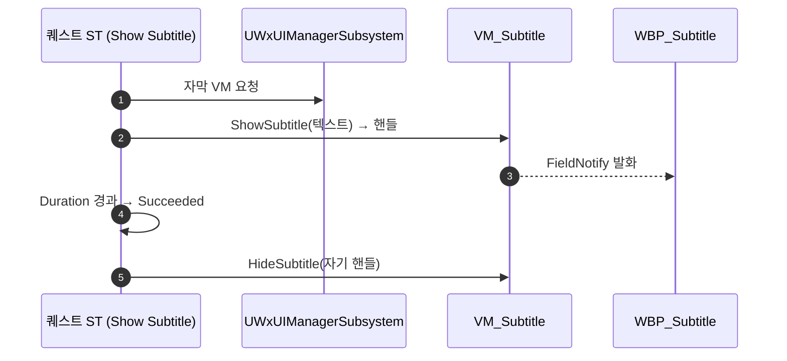

# HUD 자막

## 계획

### 목표

퀘스트 진행 중 화면 하단에 내레이션 한 줄을 띄우는 자막을 붙인다. 출력 주체는 퀘스트 StateTree 의 태스크이며, 자막 자체는 퀘스트 전용이 아니라 ST 를 쓰는 누구나(퀘스트·기믹) 쓸 수 있는 범용 표시로 만든다.

### 수정 범위

| 파일 | 수정할 내용 | 구분 |
|---|---|---|
| `Plugins/WxUI/.../MVVM/WxViewModel_Subtitle.h/.cpp` | 자막 상태를 소유하는 글로벌 뷰모델. 핸들 발급형 Show/Hide 와 표시 필드 | 신규 |
| `Plugins/WxUI/.../Subtitle/WxSubtitleStateTreeNodes.h/.cpp` | `Show Subtitle` ST 태스크. 진입 시 자막을 걸고 Duration 뒤 완료, 이탈 시 회수 | 신규 |
| `Plugins/WxUI/.../System/WxUIManagerSubsystem.h/.cpp` | 자막 VM 생성·`VM_Subtitle` 글로벌 등록·해제, 게터 | 수정 |
| `Content/UI/Widget/WBP_Subtitle` | 하단 중앙 자막 위젯. 글로벌 컬렉션에서 VM 을 물어 본문 바인딩 | 신규 |
| `Content/UI/Widget/WBP_GameHUD` | 위젯 트리에 자막 위젯 배치 | 수정 |

### 접근 방식

- **소유 위치**: 자막 상태는 UI 의 것이지만 요청은 `WxQuest` 에서 온다. `WxQuest` 는 `WxUI` 를 참조할 수 없으므로, 인디케이터가 그랬듯 **시스템을 소유한 `WxUI` 가 ST 노드까지 함께 제공**한다. 퀘스트는 에셋에서 노드만 고른다.
- **상태 보관**: 화면당 하나뿐인 표시라 `UWxUIManagerSubsystem` 이 이미 갖고 있는 **글로벌 뷰모델 축**(`VM_Selection`)에 그대로 얹는다. 신규 프레임워크 컴포넌트도, Experience 주입 목록 변경도, 리졸버도 필요 없다.
- **핸들 규약**: 슬롯은 하나이고 나중 요청이 이긴다. 회수는 발급 핸들이 현재 것과 일치할 때만 성립해, 앞 자막이 뒤늦게 걷어가며 이미 올라온 뒤 자막을 지우는 사고를 막는다(저널 목표의 핸들 규약과 동일).
- **수명**: 표시 수명의 소유자를 노드 하나로 묶기 위해 시간도 태스크가 직접 센다. `Duration <= 0` 은 무한 유지를 뜻하며, 그때는 같은 상태에 얹은 다른 대기 태스크가 완료를 낸다.

---

## 완료

### 수정한 파일
| 파일 | 수정한 내용 | 구분 |
|---|---|---|
| `Plugins/WxUI/.../MVVM/WxViewModel_Subtitle.h/.cpp` | 자막 상태를 소유하는 뷰모델과 그 리졸버. 인스턴스는 스스로 MVVM 글로벌 컬렉션에서 찾거나 만들어 등록 | 신규 |
| `Plugins/WxUI/.../Subtitle/WxSubtitleStateTreeNodes.h/.cpp` | `Show Subtitle` ST 태스크 | 신규 |
| `Content/UI/Widget/WBP_Subtitle` | Overlay + CommonTextBlock(가운데 정렬·자동 줄바꿈, TextStyle_Medium) | 신규 |
| `Content/UI/Widget/WBP_GameHUDBase` | 자막 자리 마련 및 위젯 배치 | 수정 |

### 구현·결정과 그 이유

- **자막 상태의 소유자는 뷰모델 자신**: 처음에는 UI 매니저가 뷰모델을 들고 등록하는 모양이었고, 다음엔 매니저가 문구를 들고 변경을 델리게이트로 알리는 모양이었다. 둘 다 걷어냈다. 화면당 하나뿐인 표시라 엔진의 MVVM 글로벌 컬렉션이 이미 알맞은 보관처이며, 표시하는 위젯과 문구를 거는 ST 노드가 같은 인스턴스를 그곳에서 찾으면 된다. 결과적으로 별도 보관처도, 변경 통지 델리게이트도, 매니저의 관여도 사라지고 자막을 아는 코드가 뷰모델 하나로 줄었다.
- **프레임워크 컴포넌트를 만들지 않음**: 컨트롤러 컴포넌트를 신설하면 Experience 주입 목록까지 손대야 하는데, 자막은 로컬 화면 하나에만 있으면 되는 표시라 그만한 무게가 필요 없다.
- **ST 노드를 UI 모듈이 소유**: 인디케이터 노드와 같은 이유다. 소비 도메인(퀘스트·기믹)이 UI 모듈을 참조하지 않고도 에셋에서 노드를 골라 쓸 수 있다.
- **회수를 상태 이탈에 맡기지 않음**: 처음 구현은 시간이 다 차면 완료만 내고 회수는 상태를 떠날 때 했는데, 같은 상태의 다른 대기 태스크가 상태를 붙잡으면 자막이 계속 떠 있었다(실제로 적 처치 대기와 함께 얹었을 때 드러남). 표시 수명과 상태 완료 신호는 별개이므로 시간이 차는 그 자리에서 걷는다.
- **핸들 일치 회수**: 슬롯이 하나뿐이라 나중 요청이 앞의 것을 덮는다. 회수가 발급 핸들과 일치할 때만 성립하게 해, 앞 자막의 뒤늦은 회수가 이미 올라온 뒤 자막을 지우지 않게 했다. 시간 만료와 상태 이탈 양쪽에서 회수가 불려도 두 번째가 무해한 것도 같은 검사 덕이다.

### 계획 대비 달라진 점

- 자막 위젯을 `WBP_GameHUD` 가 아니라 스캐폴드인 `WBP_GameHUDBase` 에 얹었다. 파생 HUD마다 달라질 요소가 아니라 오히려 이쪽이 맞고, 인디케이터 캔버스를 코드가 HUD 전체에 깔아 주는 것과 취지가 같다.
- 계획의 UI 매니저 수정(뷰모델 생성·등록)은 전부 불필요해져 서브시스템은 손대지 않았다.

### 후속 과제

- 시간 만료 회수는 코드 수정 후 아직 실행 확인 전이다(빌드까지만 확인). 에디터 재시작 후 PIE 로 재확인 필요.
- 페이드 인/아웃 연출과 표시 여부 바인딩(`bHasSubtitle`)은 아직 쓰지 않았다. 배경 박스를 붙일 때 함께 잇는다.
