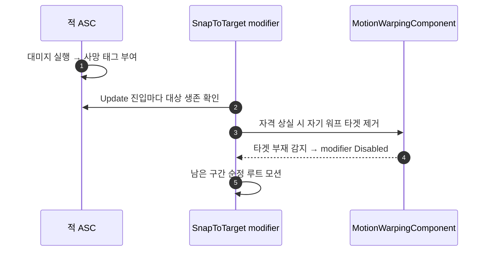

# 스냅 대상 사망 시 워프 폭주 수정

## 계획

### 목표

적이 죽는 순간 `SnapToTarget` 이 걸린 공격을 하면 플레이어가 비정상적인 속도로 튀는 문제를 없앤다. 원인은 스냅 modifier 가 대상을 활성 한 프레임에만 판정하고 그 뒤로는 죽은 대상을 계속 추종하는 것이다. 창 도중 대상이 죽으면 워프를 끊어 남은 구간을 순정 루트 모션으로 재생하게 한다.

### 수정 범위

| 파일 | 수정할 내용 | 구분 |
|---|---|---|
| `Plugins/WxCombat/Source/WxCombat/Public/Targeting/WxRootMotionModifier_SnapToTarget.h` | `Update` 오버라이드 선언, 활성 시 확정한 스냅 대상 약참조 멤버, 생존 판정 헬퍼 선언 | 수정 |
| `Plugins/WxCombat/Source/WxCombat/Private/Targeting/WxRootMotionModifier_SnapToTarget.cpp` | `OnStateChanged` 에서 확정 대상 기억, `Update` 에서 매 프레임 생존을 다시 보고 잃으면 워프 타겟 제거 | 수정 |

### 접근 방식

- **증상의 메커니즘**: 워프 타겟은 대상 루트 컴포넌트를 계속 추종하고, 부모 SkewWarp 는 창 끝까지 반드시 도달시키는 마감형 컨트롤러다. 매 프레임 요구 이동량이 사실상 `남은 거리 / 남은 시간` 이고 속도 상한은 기본 무제한이라, 창 끝 몇 프레임에 타겟 지점이 흔들리면 그 거리가 그대로 속도로 나온다. 사망은 정확히 그 조건을 만든다 — 사망 몽타주 루트모션으로 시체 캡슐이 밀리고, 래그돌로 캡슐 콜리전이 꺼져 살아있을 땐 막히던 안쪽까지 플레이어가 파고들면 대상→오너 방향 오프셋이 프레임마다 뒤집힌다.
- **창 도중 재판정**: `Update` 를 오버라이드해 `Super` 호출 전에 판정한다. 자격을 잃었으면 자기 이름의 워프 타겟을 제거하고, 이어지는 `Super::Update` 가 타겟 부재를 감지해 modifier 를 끈다. 2026-07-28 이 만든 종료 경로를 그대로 재사용하므로 새 상태가 생기지 않는다.
- **판정 기준은 대상 ASC 의 사망 태그**: 활성 시점의 선정 기준(락온·타겟팅 결과)과 창 도중의 생존 여부는 다른 질문이다. 매 프레임 타겟팅 쿼리는 비용이 크고, 락온 자격은 플레이어에 락온 지점이 없어 AI→플레이어 스냅을 즉시 끊는다. 태그 조회는 양쪽에 균일하고 비용이 없다. ASC 가 없는 대상은 판정 근거가 없으므로 통과시킨다.
- **기억 대상은 약참조 1개**: 활성 시 확정한 대상 액터만 들고 있는다. 시체를 붙잡아 두지 않고 분기용 플래그도 늘리지 않는다.
- **이동·회전 modifier 모두 적용**: 두 인스턴스가 같은 클래스라 한 곳만 고치면 둘 다 끊긴다. 죽은 대상을 계속 응시하는 것도 이미 버그로 정리된 동작이다.

범위 밖: 엔진 순정 속도 상한(`MaxSpeedClampRatio`) 도입. 원인 커플링이 끊기면 필요 없고, 값을 잘못 잡으면 기존 몽타주의 정상 스냅 도달 거리를 조용히 줄인다.

---

## 완료

### 수정한 파일
| 파일 | 수정한 내용 | 구분 |
|---|---|---|
| `Plugins/WxCombat/Source/WxCombat/Public/Targeting/WxRootMotionModifier_SnapToTarget.h` | `Update` 오버라이드와 생존 판정 헬퍼 선언, 확정 대상 약참조 멤버 추가, 클래스 doc 에 사망 시 종료 한 줄 추가 | 수정 |
| `Plugins/WxCombat/Source/WxCombat/Private/Targeting/WxRootMotionModifier_SnapToTarget.cpp` | 활성 시 확정 대상 기억, `Update` 에서 생존을 다시 보고 잃으면 워프 타겟 제거, 태그·ASC include 추가 | 수정 |

### 구현·결정과 그 이유
- **`Super` 보다 먼저 판정**: 제거를 같은 프레임의 부모 갱신이 곧바로 집어 modifier 를 끄게 하려는 것이다. 뒤에 두면 이미 갱신된 타겟으로 한 프레임 더 보정이 나간다.
- **판정 기준을 생존으로 좁힘**: 활성 시점은 "누구를 스냅할까"(락온·타겟팅 결과)를, 창 도중은 "그 대상이 아직 유효한가"를 묻는다. 후자에 타겟팅 쿼리를 매 프레임 다시 도는 건 비용이 크고, 락온 자격은 플레이어에 락온 지점이 없어 AI→플레이어 스냅을 즉시 끊는다. ASC 태그 조회만 양쪽에 균일하게 성립한다.
- **ASC 없는 대상은 통과**: 판정 근거가 없을 때 기본 허용하는 태도를 이 클래스가 이미 쓰고 있다(프리셋이 없으면 범위 판정을 생략).
- **약참조로 기억**: 시체를 modifier 수명만큼 붙잡아 두지 않기 위해서다. 대상이 파괴되면 엔진이 마지막 위치로 고정하므로 폭주 조건이 되지 않는다.
- **속도 상한은 도입하지 않음**: 사망과 워프의 커플링이 끊기면 필요 없고, 상한값을 잘못 잡으면 기존 몽타주가 의도한 스냅 도달 거리를 조용히 줄인다.

### 계획 대비 달라진 점
- 계획대로

### 후속 과제
- 인게임 검증 미실시(컴파일까지만 확인). 락온 상태에서 스냅 창 도중 적을 처치했을 때 튐이 없는지, 살아있는 적 상대 스냅 접근이 그대로인지 확인 필요.
- 폭주 자체를 막는 안전망이 더 필요해지면 엔진 순정 `MaxSpeedClampRatio`(SkewWarp 의 애니메이션 속도 배수 상한)를 노티파이에서 주입하는 선택지가 있다.
