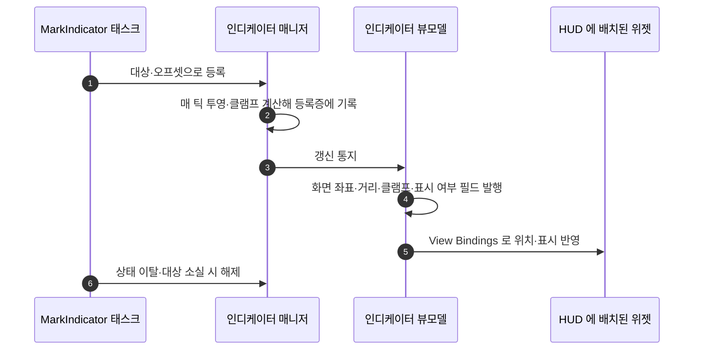

# 화면 인디케이터를 커스텀 Slate 캔버스에서 뷰모델 방식으로 전환

## 계획

### 목표
인디케이터는 HUD 루트의 `RebuildWidget` 이 HUD 트리를 오버레이로 감싸고 그 아래에 네이티브 Slate 패널을 까는 방식이다. 그 패널 하나가 슬롯·배치·페인트·GC·위젯 풀·타이머·비동기 로드를 전부 직접 구현해 650여 줄을 차지하고, 프로젝트의 다른 UI 가 쓰는 MVVM 경로 밖에 홀로 서 있다. 인디케이터 위젯을 다른 HUD 요소처럼 `WBP_GameHUD` 에 배치하고, 화면 위치·거리·클램프 여부를 뷰모델 필드로 흘려 전부 View Bindings 로 소비하게 바꾼다.

### 수정 범위
| 파일 | 수정할 내용 | 구분 |
|---|---|---|
| `Plugins/WxUI/.../Public/MVVM/WxViewModel_Indicator.h`, `Private/MVVM/WxViewModel_Indicator.cpp` | 인디케이터 뷰모델 + 전용 리졸버. 매니저를 관찰해 표시 필드를 노출 | 신규 |
| `Plugins/WxUI/.../Public/Indicator/WxIndicatorManagerComponent.h`, `Private/.../.cpp` | 매 틱 투영·클램프 계산 후 등록증에 기록·통지, 등록 0 이면 틱 정지, `OnAnyManagerReady` 정적 통지, `AddIndicator` 에서 위젯 클래스 인자 제거 | 수정 |
| `Plugins/WxUI/.../Public/Indicator/WxIndicatorDescriptor.h`, `Private/.../.cpp` | 위젯 클래스 필드 제거, 투영 결과 필드 추가 | 수정 |
| `Plugins/WxUI/.../Public/Indicator/WxIndicatorStateTreeNodes.h`, `Private/.../.cpp` | 인스턴스 데이터의 `IndicatorWidgetClass` 파라미터 삭제 | 수정 |
| `Plugins/WxUI/.../Public/Indicator/WxIndicatorWidget.h` | `OnIndicatorRefreshed` 이벤트 삭제(바인딩이 대체) | 수정 |
| `Plugins/WxUI/.../Public/Widget/WxHUDLayout.h`, `Private/.../.cpp` | `RebuildWidget` 오버라이드·관련 include 삭제 | 수정 |
| `Plugins/WxUI/.../Private/Indicator/SWxIndicatorCanvas.h/.cpp` | 폐기 | 삭제 |
| `/Game/UI/Widget/WBP_QuestIndicator` | View Bindings 저작(리졸버 + 위치·표시 바인딩) | 수정(에디터) |
| `/Game/UI/Widget/WBP_GameHUD` | 전체화면 슬롯에 `WBP_QuestIndicator` 배치 | 수정(에디터) |
| `/Game/Quest/ST_Quest_Main1` | 파라미터가 하나 사라지므로 컴파일·저장 | 수정(에디터) |

### 접근 방식
- **위젯은 코드가 아니라 에셋에 배치한다**: 인디케이터 위젯을 런타임에 만들어 붙이던 주체가 사라지고, 위젯이 HUD 에 미리 배치돼 상시 존재하며 표시/숨김만 바인딩이 가른다. 위젯 클래스를 지정·로드할 이유가 없어져 ST 태스크의 위젯 클래스 파라미터와 비동기 로드 경로가 통째로 사라진다.
- **위치는 렌더 트랜슬레이션 바인딩이 만든다**: 전체화면 캔버스에 앵커 `(0,0)`·정렬 `(0.5,0.5)`·Size To Content 로 두면 화면 좌표 필드가 곧 위젯 중심 좌표가 된다. 슬롯 좌표를 코드가 매 프레임 건드리지 않는다.
- **투영은 계산 원천인 매니저가 발행한다**: 기존 캔버스의 투영·카메라 뒤 밀어내기·평면 교차 클램프를 매니저 틱으로 옮기고, 결과를 등록증에 기록한 뒤 통지 하나를 쏜다. 틱 그룹은 카메라 매니저보다 뒤(`TG_LastDemotable`)라야 같은 프레임의 카메라로 투영한다. 등록이 비면 틱 자체를 끈다. 거리는 1m 단위로 반올림해 발행해 매 프레임 바인딩 실행을 막는다.
- **뷰모델은 리졸버가 위젯마다 만든다**: 상호작용 목록 VM 과 같은 구조로, 매니저가 늦게 붙을 수 있으므로 정적 도착 통지를 기다렸다 연결한다. 리졸버의 `Index` 로 동시 표시 개수를 에디터 배치만으로 늘릴 수 있다.

---

## 완료

### 수정한 파일
| 파일 | 수정한 내용 | 구분 |
|---|---|---|
| `Plugins/WxUI/.../Public/MVVM/WxViewModel_Indicator.h`, `Private/MVVM/WxViewModel_Indicator.cpp` | 표시 필드 4개(있음·화면 좌표·거리·클램프)를 노출하는 뷰모델과 전용 리졸버. 매니저 도착을 기다렸다 연결 | 신규 |
| `Plugins/WxUI/.../Public/Indicator/WxIndicatorManagerComponent.h`, `Private/.../.cpp` | 투영·클램프 계산을 틱으로 수행해 등록증에 기록하고 갱신 통지 발행, 등록 유무로 틱 토글, 도착 통지, 위젯 클래스 인자 제거 | 수정 |
| `Plugins/WxUI/.../Public/Indicator/WxIndicatorDescriptor.h`, `Private/.../.cpp` | 위젯 클래스 필드 제거, 투영 결과 4개 필드와 기록·초기화 진입점 추가 | 수정 |
| `Plugins/WxUI/.../Public/Indicator/WxIndicatorStateTreeNodes.h`, `Private/.../.cpp` | 위젯 클래스 파라미터와 전방선언 삭제, 등록 호출 인자 축소 | 수정 |
| `Plugins/WxUI/.../Public/Indicator/WxIndicatorWidget.h` | 폐기 — 갱신 이벤트를 바인딩이 대체하고 위젯 클래스 픽커도 사라져 남을 내용이 없다(사용자가 `WBP_QuestIndicator` 를 `UserWidget` 으로 리페어런트한 뒤 삭제) | 삭제 |
| `Plugins/WxUI/.../Public/Widget/WxHUDLayout.h`, `Private/.../.cpp` | `RebuildWidget` 오버라이드와 관련 include·주석 삭제 | 수정 |
| `Plugins/WxUI/.../Private/Indicator/SWxIndicatorCanvas.h/.cpp` | 폐기 | 삭제 |
| `Plugins/WxUI/README.md` | 인디케이터 표시 경로 서술을 캔버스에서 뷰모델로 교체 | 수정 |

### 구현·결정과 그 이유
- **커스텀 위젯 클래스를 두지 않았다**: 초안은 인디케이터 위젯을 런타임에 만들어 붙일 컨테이너 패널을 네이티브로 두려 했으나, 사용자가 위젯 C++ 클래스 신설을 원치 않아 위젯을 HUD 에 미리 배치하고 표시만 바인딩으로 가르는 쪽으로 갈았다. 그 결과 위젯 생성·풀링·비동기 클래스 로드가 통째로 사라지고, 태스크의 위젯 클래스 파라미터도 함께 없어졌다.
- **등록증이 투영 결과를 들고 있다**: 뷰모델은 위젯마다 리졸버가 만들지만 등록증은 등록 1건마다 있으므로, 매니저가 계산한 값을 담을 자리는 등록증뿐이다. 뷰모델은 갱신 통지를 받아 자기 순번의 등록증을 읽어 간다.
- **통지를 하나로 합쳤다**: 추가·제거 통지 두 개 대신 갱신 통지 하나만 둔다. 표시 측이 알아야 하는 것은 "지금 무엇을 어디에 그릴지" 하나뿐이고, 등록·해제 시점에도 같은 통지를 내면 마지막 하나가 빠져 틱이 멈추는 순간에도 숨김이 반영된다.
- **틱 그룹을 최후미로 잡았다**: 카메라 매니저가 `TG_PostUpdateWork` 라 그보다 앞서 돌면 인디케이터가 카메라를 한 프레임 늦게 따라간다. Slate 타이머로 돌던 기존 타이밍을 맞추려면 그 뒤여야 한다.
- **거리 반올림을 세터 앞에 뒀다**: 예전엔 "1m 이상 변했을 때만 위젯 호출" 이라는 판정을 캔버스가 들고 있었는데, 값을 1m 단위로 반올림해 발행하면 뷰모델 세터의 동등 비교가 같은 일을 한다. 판정 상태가 사라졌다.
- **클램프 여백이 상수가 됐다**: 예전엔 슬롯의 Desired Size 절반을 더해 정확히 화면 안에 들였지만, 계산 주체가 위젯 크기를 모르는 매니저로 옮겨 갔다. "아이콘 절반 + 여백" 을 뜻하는 상수 하나로 대신한다.

### 계획 대비 달라진 점
- 매니저 생성자를 기본 생성자로 잡았다가 `UControllerComponent` 가 `FObjectInitializer` 생성자만 두고 있어 그에 맞춰 바꿨다(빌드 실패 1회, 그 외 계획대로).

### 후속 과제
- **에디터 작업 미완**: `WBP_QuestIndicator` 의 View Bindings 저작(리졸버 + 화면 좌표→렌더 트랜슬레이션, 있음→Visibility)과 `WBP_GameHUD` 전체화면 슬롯 배치, `ST_Quest_Main1` 재컴파일이 남아 있다. 그 전까지 인디케이터는 화면에 뜨지 않는다.
- **PIE 시각 확인 미완**: 위 에디터 작업 후 클램프·카메라 뒤 처리·해제를 눈으로 볼 것.
- 깊이 정렬(가까운 인디케이터가 위)은 사라졌다. 동시 표시가 실제로 필요해지면 순번이 다른 위젯을 HUD 에 더 배치하고, 겹침 순서가 문제되면 그때 정렬을 되살린다.
