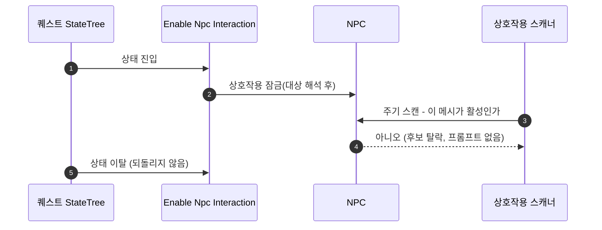

# 퀘스트에서 NPC 상호작용을 잠그는 StateTree 태스크

## 계획

### 목표

퀘스트 단계에 따라 특정 NPC 에게 말을 걸 수 없게 만든다. 지금은 NPC 가 자기 메시를 무조건 활성 영역으로 답해 상호작용을 끌 방법이 아예 없고, 기믹의 상호작용 토글 태스크는 기믹 자신의 트리 전용이라 오너가 GameState 인 퀘스트 러너에서는 쓸 수 없다. NPC 쪽에 켜고 끌 상태를 만들고, 그것을 집는 태스크를 대화 도메인이 제공한다.

### 수정 범위

| 파일 | 수정할 내용 | 구분 |
|---|---|---|
| `Plugins/WxDialogue/Source/WxDialogue/Public/WxNpc.h` | 상호작용 게이트 프로퍼티와 세터 선언 | 수정 |
| `Plugins/WxDialogue/Source/WxDialogue/Private/WxNpc.cpp` | 활성 판정이 게이트를 함께 보게 하고 세터 정의 | 수정 |
| `Plugins/WxDialogue/Source/WxDialogue/Public/WxDialogueStateTreeNodes.h` | `Enable Npc Interaction` 태스크 선언, 파일 상단 노드 목록 갱신 | 수정 |
| `Plugins/WxDialogue/Source/WxDialogue/Private/WxDialogueStateTreeNodes.cpp` | 위 태스크 정의(대상 해석·토글·복원) | 수정 |
| `Plugins/WxDialogue/Source/WxDialogue/WxDialogue.Build.cs` | `UniversalObjectLocator` 명시 | 수정 |

### 접근 방식

- **NPC 의 상호작용 게이트**: 배치 인스턴스가 초기값을 정할 수 있는 프로퍼티 하나와 public 세터를 둔다. 활성 판정이 이 값을 함께 보므로, 꺼지면 다음 스캔에서 후보에서 빠져 프롬프트·외곽선이 사라지고 서버 어빌리티의 활성 검증도 같은 판정으로 막는다 — 클라가 우겨도 대화가 열리지 않는다.

- **태스크는 대화 도메인이 소유**: 보상 노드를 인벤토리가, 대화 노드를 대화 모듈이 소유하고 퀘스트 에셋이 코드 의존 없이 골라 쓰는 기존 관례를 그대로 따른다(플러그인 DAG 유지). 대상 지정은 퀘스트 노드와 같은 UOL 래퍼라 씬 픽커·WP·PIE 해석이 그대로 따라온다.

- **끈 것만 되돌린다**: 진입 시 실제로 잠근 NPC 를 약참조로 기록해 두고 상태를 떠날 때 그 기록만 근거로 푼다. 퀘스트가 중도 실패·교체·언로드돼도 NPC 가 영영 잠기지 않는다. 켜는 쪽은 기록하지 않는다 — 여는 것은 상태를 떠나도 유지되는 해제다.

- **완료 판정에서 제외**: 즉시 완료를 내는 부수효과 태스크가 판정에 끼면 자식을 둔 상태나 대기 태스크와 같은 상태에 얹었을 때 그 상태가 곧바로 완료돼 퀘스트가 통째로 관통된다. 저널 태스크와 같은 이유다.

---

## 완료

### 수정한 파일
| 파일 | 수정한 내용 | 구분 |
|---|---|---|
| `Plugins/WxDialogue/Source/WxDialogue/Public/WxNpc.h` | 상호작용 토글 세터 선언, 클래스 주석에서 "상시 활성" 철회 | 수정 |
| `Plugins/WxDialogue/Source/WxDialogue/Private/WxNpc.cpp` | 세터가 영역 메시의 쿼리 콜리전을 껐다 켜고, 활성 판정이 그 콜리전을 함께 보게 | 수정 |
| `Plugins/WxDialogue/Source/WxDialogue/Public/WxDialogueStateTreeNodes.h` | `Enable Npc Interaction` 태스크 선언, 파일 상단 노드 목록 갱신 | 수정 |
| `Plugins/WxDialogue/Source/WxDialogue/Private/WxDialogueStateTreeNodes.cpp` | 위 태스크 정의와 대상 표시명 헬퍼 | 수정 |
| `Plugins/WxDialogue/Source/WxDialogue/WxDialogue.Build.cs` | `UniversalObjectLocator` 명시 | 수정 |

### 구현·결정과 그 이유
- **콜리전이 곧 상태**: 별도 플래그를 두지 않고 영역 메시의 쿼리 콜리전을 껐다 켠다. 감지(스캐너의 구 오버랩)도 사거리 판정도 그 형상에 걸리므로 끄면 후보에서 통째로 빠지고, 같은 사실을 두 군데 들 일이 없다. 이 메시는 몸통 충돌(캡슐)과 무관한 감지 전용이라 이동·물리에 영향이 없다.

- **그래도 활성 판정이 콜리전을 본다**: 콜리전만 끄면 서버 활성 검증은 통과하고 사거리 판정에서 막히는데, 그 자리에는 쿼리 콜리전이 꺼진 메시를 나무라는 ensure 가 있다(설정 실수를 잡는 진단이라 의도적 잠금과 구분되지 않는다). 검증 순서가 활성 → 사거리이므로 활성 판정이 콜리전을 함께 답하게 해 ensure 앞에서 걸러지게 했다.

- **시작 값은 배치가 선언**: 퀘스트 러너는 그 퀘스트가 탑재된 뒤에야 돌기 때문에 "탑재 전에는 잠겨 있어야 한다"를 태스크로 표현할 수 없다. 그 구간만 시작 값 프로퍼티가 맡고, BeginPlay 가 그것을 콜리전으로 옮긴다(생성자에서는 인스턴스·BP 별 값이 아직 반영되지 않는다). 이후를 정하는 것은 태스크이지 이 값이 아니라, 시작 값과 런타임 상태가 갈리는 것은 의도된 것이다.

- **태스크는 대화 모듈이 제공**: 퀘스트가 대화 모듈을 참조하지 않고도 에셋에서 이 노드를 고를 수 있다. 보상 노드를 인벤토리가, 대화 노드를 대화 모듈이 소유하는 기존 배치와 같은 이유이며 플러그인 DAG 가 그대로 유지된다.

- **되돌리지 않는다**: 잠금은 상태에 딸린 임시 연출이 아니라 월드에 남는 변경이고, 다시 열 시점은 퀘스트마다 다르다. 여는 상태에 같은 태스크를 켜기로 한 번 더 두어 에셋이 정한다.

- **완료 판정 제외**: 즉시 완료를 내는 부수효과 태스크라, 판정에 끼면 자식을 둔 상태나 대기 태스크와 같은 상태가 곧바로 완료돼 퀘스트가 통째로 관통된다. 저널 태스크가 같은 이유로 빠져 있다.

- **대상 표시명 헬퍼 중복**: 퀘스트 노드에도 같은 성격의 헬퍼가 있지만 모듈 경계를 넘겨 공유할 것은 아니라 이쪽에 따로 뒀다. 다만 경로 끝 이름까지 파내는 폴백은 옮기지 않고, 미지정과 미로드만 갈라 보여준다.

### 계획 대비 달라진 점
- **상태를 담는 방식**: 계획의 전용 bool 대신 영역 메시의 쿼리 콜리전을 상태로 쓴다(리뷰 지적). 상태가 한 군데로 모이고 감지 경로와도 일치한다.
- **자동 복원 철회**: 상태를 떠날 때 되돌리지 않는다(리뷰 지적). 진입 시점의 대상을 기록하던 런타임 필드와 ExitState 가 함께 사라졌다.
- **시작 값 프로퍼티 추가**: 퀘스트 탑재 전 구간을 태스크가 덮을 수 없어, 배치가 선언하는 시작 값을 두었다.

### 후속 과제
- **에셋 배선 미완** — 코드만 준비됐다. 잠글 NPC 인스턴스의 시작 값을 끄고, `ST_Quest_Main1` 의 「Before Start」(수주 대화 `BP_Npc_4` 를 기다리는 상태)에 이 태스크를 켜기로 얹어야 한다. 실행 중인 에디터가 DebugGame 옛 빌드라 새 프로퍼티·노드가 아직 없어 재시작이 선행된다.
- 실동작(PIE) 미검증 — 컴파일까지만 확인했다.
- 데디 서버로 확장하면 콜리전 상태의 복제가 필요하다. 지금은 다른 퀘스트·대화 노드와 같은 싱글/리슨 호스트 전제다.
