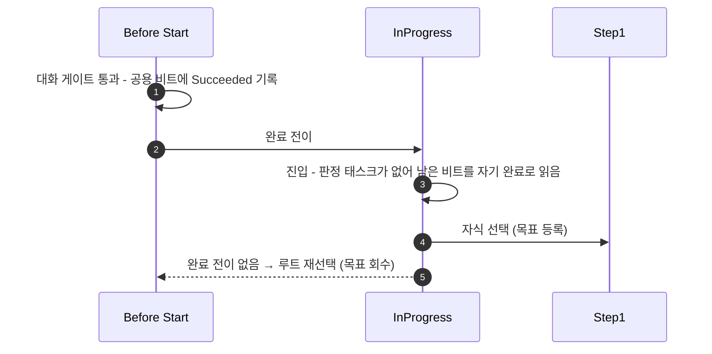

# 퀘스트 수주 후 목표가 지정되지 않는 문제 수정

## 계획

### 목표

수주 대화를 완주해도 저널에 목표가 뜨지 않는다. `InProgress` 상태가 진입 직후 완료로 읽혀 트리가 `Before Start` 로 되감기고, 그 과정에서 등록된 목표가 `ExitState` 로 회수되기 때문이다. 제목 태스크를 상주 태스크로 바꿔 그 상태가 자기 완료 비트를 갖게 한다.

### 수정 범위

| 파일 | 수정할 내용 | 구분 |
|---|---|---|
| `Plugins/WxQuest/Source/WxQuest/Private/Quest/WxQuestStateTreeNodes.cpp` | `FWxStateTreeTask_SetQuestTitle` 생성자·`EnterState` 수정 | 수정 |
| `Plugins/WxQuest/Source/WxQuest/Public/Quest/WxQuestStateTreeNodes.h` | 해당 태스크 주석과 파일 상단 노드 설명 갱신 | 수정 |

### 접근 방식

- **원인**: StateTree 는 상태별 완료 비트를 프레임 공용 버퍼에 담고 형제 상태끼리 같은 비트 범위를 공유한다. 완료 판정 태스크가 하나도 없는 상태에는 컴파일러가 "상태 자신" 비트를 덧붙이는데, 진입 시 비트를 씻는 `ResetStatus(TasksNum)` 은 태스크 개수만큼만 지워 이 덧붙은 비트를 남긴다. `InProgress` 의 유일한 태스크가 완료 판정에서 빠져 있어, 형제 `Before Start` 의 대화 게이트가 세운 Succeeded 를 그대로 물려받는다.

- **되감기는 이유**: 완료 전이 탐색은 활성 체인에서 가장 얕은 비-Running 상태부터 시작한다. `InProgress` 가 먼저 걸리는 바람에 `Step1` 의 완료 전이는 검토조차 되지 않고, `InProgress`·`Root` 에 맞는 완료 전이가 없어 루트 재선택으로 떨어진다.

- **고치는 자리**: 제목 태스크가 `Running` 을 반환하며 완료 판정에 참여하게 한다. 그러면 상태의 마스크가 덧붙은 자신 비트가 아니라 그 태스크 자신의 비트가 되어 진입 때 정상적으로 씻긴다. 완료를 내지 않으므로 상태는 계속 살아 있고, 완료는 자식 상태의 대기 태스크가 낸다.

- **제목의 수명**: 제목은 원래 퀘스트가 진행되는 내내 유효한 값이라, 즉시 빠지는 것보다 상태에 머무는 편이 의미에도 맞다. 목표 태스크가 이미 같은 모양이다.

- **재선택 차단**: 상주가 되면 스텝 전이 때 부모 상태가 유지 재선택되며 진입이 다시 불린다. 이 태스크는 제목을 걸며 목표 목록을 비우므로, 막지 않으면 스텝이 넘어갈 때마다 목표가 지워졌다 다시 붙는 흔들림이 생긴다.

- **다른 태스크는 손대지 않는다**: 대화 게이트를 판정에서 빼면 이번엔 `Before Start` 가 판정 태스크 0개가 되어 증상이 한 단계 앞으로 옮겨간다. 목표·인디케이터 태스크는 `TasksCompletion=All` 인 스텝 상태에 얹혀 있어, 판정에 넣으면 완료를 내지 않는 상주 태스크 때문에 그 상태가 영영 완료되지 않는다.

---

## 완료

### 수정한 파일
| 파일 | 수정한 내용 | 구분 |
|---|---|---|
| `Private/Quest/WxQuestStateTreeNodes.cpp` | 제목 태스크가 상주(`Running`)하며 완료 판정에 참여하도록, 재선택 시 재진입 차단 추가, 목표 태스크의 제외 근거 주석 정정 | 수정 |
| `Public/Quest/WxQuestStateTreeNodes.h` | 제목 태스크 주석 갱신, 파일 상단에 "상태마다 완료 판정 태스크 최소 하나" 규칙과 그 이유 기술 | 수정 |

### 구현·결정과 그 이유

- **증상의 실제 지점은 대화 게이트가 아니었다**: 트레이스를 타임스탬프로 대조하니 게이트는 대화창이 닫히는 그 프레임에 정확히 한 번 통과했다. 문제는 그 다음 상태가 진입 다음 프레임에 완료로 잡히는 것이었고, 등록된 목표가 이탈과 함께 회수되면서 화면에는 아무것도 남지 않았다.

- **완료 비트를 물려받는 구조**: 형제 상태끼리 완료 비트 범위를 공유하는데, 판정 태스크가 없는 상태는 덧붙은 "상태 자신" 비트를 쓴다. 진입 시 비트를 씻는 경로가 태스크 개수만큼만 지워 이 덧붙은 비트를 남기므로, 앞 형제가 세운 완료가 그대로 살아 넘어온다. 트리 구조나 전이 설정 문제가 아니라 이 한 칸의 어긋남이었다.

- **왜 제목 태스크였나**: 물려받는 쪽이 판정 태스크를 하나라도 가지면 덧붙은 비트 자체가 생기지 않는다. 그 상태에 있는 태스크가 제목 하나뿐이라 선택지가 없었다. 비트를 세우는 쪽(대화 게이트)을 판정에서 빼는 안은 증상을 한 단계 앞으로 옮길 뿐이고, 태스크 순서를 바꾸는 안은 제외된 태스크도 자기 비트는 쓰기 때문에 통하지 않는다.

- **상주가 의미에도 맞다**: 제목은 퀘스트가 도는 내내 유효한 값이라, 즉시 빠지는 것보다 상태에 머무는 편이 자연스럽다. 목표 태스크가 이미 같은 수명 모델이라 둘의 모양이 일치하게 됐다.

- **판정 참여 여부는 상태가 정한다**: 제목은 자식을 둔 상태에 홀로 얹히므로 참여하고, 목표·인디케이터는 대기 태스크와 같은 상태(모두 완료 요구)에 얹히므로 빠진다. 같은 성격의 표시용 태스크인데 선택이 갈리는 이유라 헤더에 규칙으로 남겼다.

- **재선택 차단**: 상주가 되면 스텝 전이 때 부모 상태가 유지 재선택되며 진입이 다시 불린다. 이 태스크는 제목을 걸며 목표 목록을 비우므로, 막지 않으면 스텝마다 목표가 지워졌다 붙는 흔들림이 생긴다.

### 계획 대비 달라진 점
- 목표 태스크의 제외 근거 주석을 함께 고쳤다. 상단 규칙이 바뀌면서 "표시용 부수효과라 판정하면 안 된다"는 옛 설명이 규칙과 어긋나게 됐다.

### 후속 과제
- **PIE 실동작 미검증** — 컴파일과 에셋 재컴파일(판정 태스크 0개 상태가 사라짐)까지 확인했다. 에디터가 옛 DLL로 떠 있어 재시작 후 「볼륨 진입 → 대화 완주 → 목표 유지 → 스포너 도달 → Step2 교체」 확인이 필요하다.
- 기믹 StateTree 4종에 판정 태스크 0개 상태가 8개 남아 있다. 형제가 그 인덱스에 완료를 쓰지 않아 지금은 발현하지 않지만, 그런 태스크가 추가되면 같은 증상이 재현된다.
- 대화 게이트가 수락 대사(마지막 행)가 아니라 그 앞 행에 걸려 있다. 현 증상과는 무관하며 의도 확인이 필요하다.
