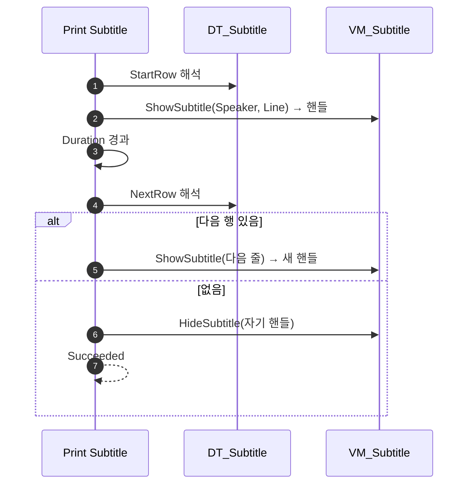

# 자막 데이터테이블

## 계획

### 목표

자막 문구를 ST 노드에 직접 적는 대신 대화처럼 데이터테이블로 편집한다. 한 편의 자막이 여러 줄로 이어질 수 있어야 하므로 대화의 행 연결(NextRow) 구조를 그대로 가져오되, 넘기는 사람이 없는 표시이므로 유지 시간(Duration)을 행이 함께 들고 자동으로 다음 줄로 넘어간다.

### 수정 범위

| 파일 | 수정할 내용 | 구분 |
|---|---|---|
| `Plugins/WxUI/.../Subtitle/WxSubtitleTableRow.h` | 자막 행 구조체. Speaker / Line / Duration / NextRow | 신규 |
| `Plugins/WxUI/.../Subtitle/WxSubtitleStateTreeNodes.h/.cpp` | `Print Subtitle` 파라미터를 인라인 문구에서 시작 행으로 교체, Duration 만료 시 NextRow 로 자동 전진 | 수정 |
| `Plugins/WxUI/.../MVVM/WxViewModel_Subtitle.h/.cpp` | 화자 표시 필드(`SpeakerText`) 추가, `ShowSubtitle` 이 화자와 본문을 함께 받음 | 수정 |

### 접근 방식

- **행 어휘를 대화와 맞춤**: 시작 행만 지목하고 이후 진행은 데이터가 정한다(`Play Dialogue` 와 동형). 테이블 1개 = 자막 1편, 행 1개 = 한 줄.
- **전진 주체는 태스크**: 대화는 플레이어의 `Advance` 가 넘기지만 자막은 넘길 사람이 없다. 표시 수명을 이미 소유한 태스크가 시간을 세다 만료되면 스스로 다음 행을 건다.
- **`Duration <= 0` 규약 유지**: 그 줄에 머문다(같은 상태의 다른 대기 태스크가 완료를 낸다). 무한 유지가 행 단위 선택지가 된다.
- **실패 판정도 대화를 따름**: 시작 행을 못 열면 낼 자막이 없으므로 Failed(`Play Dialogue` 와 동일), 중간에 다음 행이 끊기면 경고만 남기고 거기서 끝낸다(대화 `Advance` 와 동일) — 표시 태스크가 데이터 오타로 트리를 세우지 않게 한다.

---

## 완료

### 수정한 파일
| 파일 | 수정한 내용 | 구분 |
|---|---|---|
| `Plugins/WxUI/.../Subtitle/WxSubtitleTableRow.h` | 자막 행 구조체(Speaker / Line / Duration / NextRow) | 신규 |
| `Plugins/WxUI/.../Subtitle/WxSubtitleStateTreeNodes.h/.cpp` | `Print Subtitle` 이 시작 행을 받아 Duration 만료마다 NextRow 로 전진. 표시 공통부는 `ShowRow` 로 묶음 | 수정 |
| `Plugins/WxUI/.../MVVM/WxViewModel_Subtitle.h/.cpp` | `SpeakerText` 필드 추가, `ShowSubtitle(화자, 본문)` 로 확장 | 수정 |

### 구현·결정과 그 이유

- **인라인 문구를 남기지 않음**: 시작 행과 인라인 문구를 둘 다 받으면 어느 쪽이 이기는지가 노드마다 달라진다. 대화가 행 하나로만 지목하듯 자막도 행으로만 지목하게 했다.
- **유지 시간을 행이 소유**: 줄마다 길이가 다른 것이 자막의 기본이라 노드가 아닌 데이터가 든다. 결과적으로 노드 파라미터는 시작 행 하나로 줄었다.
- **현재 줄의 Duration 을 인스턴스에 받아 둠**: 매 틱 테이블을 되찾지 않기 위해서다. 다음 행 이름은 넘어가는 순간에만 필요하므로 그때 한 번 찾는다.
- **전진 시 회수하지 않음**: 뷰모델 슬롯이 하나라 새 줄이 앞 줄을 덮는다. 중간에 걷으면 줄 사이마다 자막이 한 프레임 사라진다.
- **끝나는 두 갈래를 같이 취급**: 마지막 줄이든 다음 행 해석 실패든 자막은 거기서 끝이다. 실패는 경고로 드러내되 완료는 그대로 낸다 — 표시 태스크가 데이터 오타로 퀘스트를 세우면 손해가 더 크다(대화의 `Advance` 와 같은 판단).

### 계획 대비 달라진 점
- 계획대로.

### 후속 과제
- 자막 테이블 에셋(`DT_...`)과 `ST_Quest_Main1` 의 `Print Subtitle` 노드 재지정이 남았다. 파라미터가 교체되어 기존 인라인 문구("인간! 제거한다!")는 유실되므로, 그 줄을 행으로 옮겨 적어야 한다.
- `WBP_Subtitle` 은 아직 본문만 바인딩한다. 화자를 화면에 내려면 `SpeakerText` 바인딩과 그 자리를 위젯에 추가해야 한다(비면 숨기는 처리 포함).
- 빌드까지만 확인했고 PIE 로 줄 전환·자동 종료는 미검증이다.
