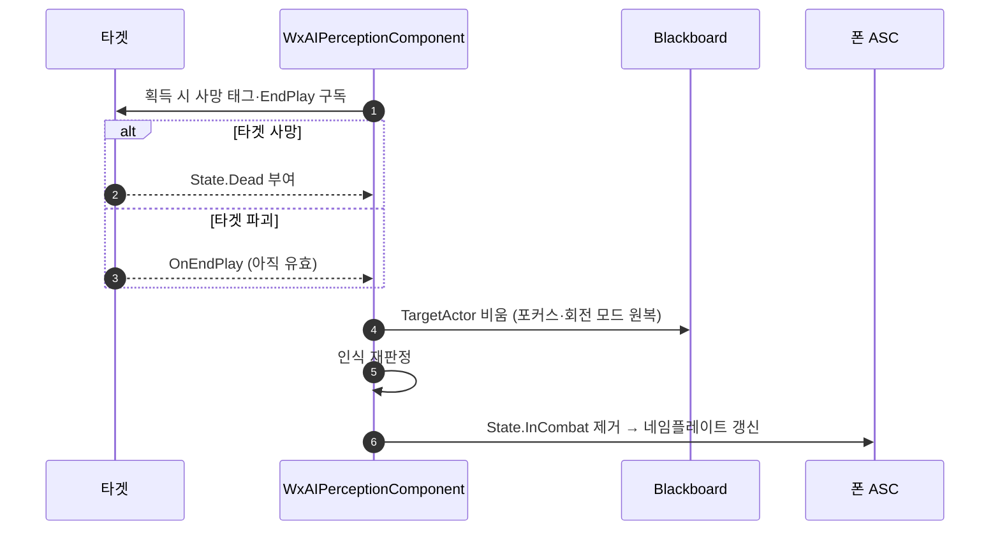

# 타겟 사망·파괴 시 State.InCombat 해제

## 계획

### 목표

`UWxAIPerceptionComponent` 의 인식 판정이 감지 자극이 올 때만 돌고 타겟의 생사를 보지 않아, 타겟이 죽거나 파괴돼도 `State.InCombat` 이 폰 ASC 에 남는다. 자기 폰 사망을 이미 막고 있는 이벤트 구독의 대칭을 타겟 쪽에 채워 인식을 정확히 내린다.

### 수정 범위

| 파일 | 수정할 내용 | 구분 |
|---|---|---|
| `Plugins/WxAI/Source/WxAI/Public/WxAIPerceptionComponent.h` | 타겟 감시용 콜백·바인드 함수·멤버(바인드한 타겟 약참조 + 태그 델리게이트 핸들) 선언, 사망 판정 헬퍼 선언, 인식 수명 주석에 타겟 사망·파괴 반영 | 수정 |
| `Plugins/WxAI/Source/WxAI/Private/WxAIPerceptionComponent.cpp` | 위 구현. `SetTargetActor` 에서 바인드 교체, `EndPlay` 에서 언바인드, 획득 지점에 죽은 액터 가드 | 수정 |

부수 정정 1건: `UpdateRecognition` 의 주석이 근거로 든 `BGMSourceComponent` 는 이미 제거된 시스템이라 현재 소비자인 네임플레이트로 문구를 바로잡는다.

### 접근 방식

- **타겟 사망 구독**: 타겟을 잡는 순간 그 ASC 의 `State.Dead` 태그 이벤트를 구독하고, 타겟이 바뀌거나 풀리면 해제한다. 자기 폰용 `BindOwnerDeath` 와 같은 패턴이며 "시체가 파괴되지 않고 시야에 남는" 주된 경우를 덮는다.
- **타겟 파괴 구독**: 파괴는 ASC 가 액터와 함께 사라져 태그 이벤트가 오지 않고, 엔진도 소스 액터가 무효하면 `OnTargetPerceptionUpdated` 를 방송하지 않는다. 타겟 액터의 `OnEndPlay` 를 함께 구독해 덮는다. 엔진이 EndPlay 를 액터 무효화보다 앞서 방송하므로 이 시점엔 블랙보드의 약참조가 아직 살아 있어 타겟·포커스·회전 모드 원복이 정상 동작한다.
- **판정 위임**: 두 콜백 모두 타겟을 비우고 기존 판정 지점을 부르기만 한다. 인식 판정은 계속 한 곳에서만 내린다.
- **재획득 차단**: 시각 센스는 보이는 동안 매 업데이트마다 자극을 등록하므로, 구독만으로는 시체가 보이는 다음 자극에 다시 타겟으로 잡혀 인식이 되살아난다. 획득 지점에서 죽은 액터를 타겟으로 잡지 않아 "타겟은 살아있는 액터만" 불변식을 세운다.
- **폴링 없음**: 2026-07-13 에 폴 타이머를 걷어내고 이벤트 구독으로 옮긴 방향을 유지한다.

---

## 완료

### 수정한 파일
| 파일 | 수정한 내용 | 구분 |
|---|---|---|
| `Plugins/WxAI/Source/WxAI/Public/WxAIPerceptionComponent.h` | 타겟 소실 콜백 2종·바인드 함수 한 쌍·사망 판정 헬퍼 선언, 바인드한 타겟 약참조와 델리게이트 핸들 추가, 인식 수명 주석 갱신 | 수정 |
| `Plugins/WxAI/Source/WxAI/Private/WxAIPerceptionComponent.cpp` | 위 구현. 타겟 설정 지점에서 감시 교체, 종료 시 언바인드, 획득 지점에 죽은 액터 가드, 사망 판정 중복 제거 | 수정 |

### 구현·결정과 그 이유
- **자극이 아니라 타겟을 구독**: 엔진 시각 센스는 가시 상태가 바뀔 때만 알림을 준다. 타겟이 계속 보이는 채로 죽으면 이후 자극이 아예 없어 판정을 다시 돌릴 계기가 없다. 그래서 타겟 자체를 감시 대상으로 삼았다.
- **사망은 태그로**: WxAI 는 캐릭터 클래스를 볼 수 없으므로 사망을 알 수 있는 통로가 WxCore 태그뿐이다. 자기 폰 사망이 이미 같은 방식이라 대칭이 맞고, 타겟·인식의 소유자가 이 컴포넌트이므로 무효화도 여기가 맡는 게 옳다.
- **파괴는 EndPlay 로 따로**: 파괴는 ASC 를 함께 없애 태그 이벤트가 오지 않고, 엔진도 소스가 무효해진 뒤엔 감지 갱신을 방송하지 않는다. EndPlay 는 액터 무효화보다 앞서 오므로 이 시점엔 블랙보드 약참조가 살아 있어 타겟·포커스·회전 모드가 온전히 원복된다.
- **획득 가드 추가**: 시체는 남아 있어 시야에 다시 들어오면 성공 자극을 또 만든다. 획득 지점에서 죽은 액터를 거르지 않으면 정리가 다음 자극에 되돌려진다. 이 가드 덕에 "타겟은 살아있는 액터만" 이 불변식이 되어 판정은 지금처럼 유무만 봐도 된다.
- **콜백 둘 다 같은 두 줄**: 타겟을 비우고 기존 판정 함수를 부르기만 한다. 인식 판정은 계속 한 곳에서만 내린다.

### 계획 대비 달라진 점
- 계획대로. 다만 사망 판정이 세 군데로 늘어나 짧은 공용 술어로 묶었고, 그 김에 기존 폰 사망 검사도 같은 술어를 쓰게 했다.
- 부수 정정으로 예고한 BGM 주석 외에, 사망 콜백의 "BGM 잔존 방지" 문구도 같은 이유로 함께 정리했다.

### 후속 과제
- 리뷰 1번(타겟 비교 기준이 블랙보드 값이라 조기 반환이 회전 모드를 고착시키는 문제)은 그대로 남았다. 이번 두 콜백은 타겟이 유효한 시점에 돌아 영향받지 않는다.
- 리뷰 8번(자기 폰 사망 후 잔여 자극이 타겟·포커스를 다시 잡는 문제)도 별건으로 남았다.
- PIE 실동작 확인 미실시(컴파일 검증까지).
