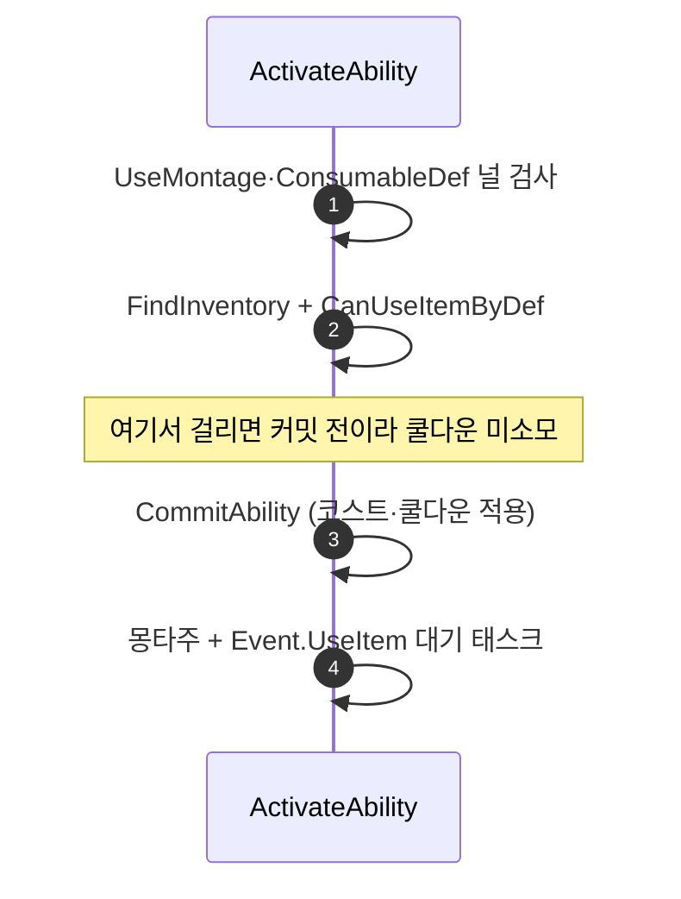

# WxGame 리뷰 5·6·7 수정

## 계획

### 목표
`Docs/Programmer/module_review_WxGame.md`의 🟢 3건(중복 배열, 접근 지정자 좁힘, 커밋 순서 결함)을 정리한다. 셋은 서로 독립이며 각각 파일 하나만 건드린다.

### 수정 범위
| 파일 | 수정할 내용 | 구분 |
|---|---|---|
| `Source/WxGame/MVVM/WxViewModel_Inventory.cpp` | `RefreshAllItems`의 중복 배열 `Retained` 제거, 판정을 `NewItems.Contains`로 대체 | 수정 |
| `Source/WxGame/Character/WxEnemyCharacter.h` | `HandleDeath` 오버라이드 선언을 `protected` → `public` 섹션으로 이동 | 수정 |
| `Source/WxGame/AbilitySystem/Ability/WxAbility_UseItem.cpp` | `ActivateAbility`에서 `CommitAbility`를 인벤토리 보유 검사 뒤로 이동 | 수정 |

### 접근 방식
- **#5 중복 배열**: `NewItems`와 `Retained`는 같은 루프에서 같은 원소만 담아 항상 동일하다. `Retained`를 지우고 미보존 VM 판정을 `NewItems.Contains(OldVM)`로 바꾼다. `AllItems = MoveTemp(NewItems)`가 판정 루프 뒤에 있어 `NewItems`는 아직 유효하다. O(N²) 탐색은 유지 — 슬롯 수 규모에서 측정 가능한 비용이 아니라 `TMap` 도입이 값을 못 한다.
- **#6 접근 지정자**: 베이스 `AWxCharacterBase::HandleDeath`가 `public`이므로 오버라이드도 `public`으로 맞춘다(좁힘 금지 관례). 위치는 `GetBehaviorTree()` 뒤, `IWxSpawnable` 블록 앞 — 인터페이스 블록을 쪼개지 않는다. 베이스를 내리는 반대 방향은 `HandleDeath`가 `BlueprintAssignable OnDeath`를 브로드캐스트하는 공개 사망 진입점이라 택하지 않는다.
- **#7 커밋 순서**: 검사 → 커밋 순으로 뒤집어, 보유 검사에 걸린 발동이 쿨다운·코스트를 소모하지 않게 한다. 검사는 지금도 같은 머신들에서 돌고 있어 실행 주체는 변하지 않는다(`FindInventory`가 Pawn→PlayerController로 해석하고 `CanUseItemByDef`는 복제 데이터 const 조회).

### 포함하지 않는 것
리뷰가 조건부로 덧붙인 `CanActivateAbility` 오버라이드는 넣지 않는다. "빈 병일 때 활성화 자체를 막는다"는 별개 개선이고, 지적된 결함(커밋된 쿨다운이 되돌아오지 않음)은 순서 교체만으로 완결된다.

---

## 완료

### 수정한 파일
| 파일 | 수정한 내용 | 구분 |
|---|---|---|
| `Source/WxGame/MVVM/WxViewModel_Inventory.cpp` | `Retained` 선언·Add 제거, 미보존 판정을 `NewItems.Contains(OldVM)`로 대체 | 수정 |
| `Source/WxGame/Character/WxEnemyCharacter.h` | `HandleDeath` 오버라이드 선언을 `GetBehaviorTree()` 뒤 `public` 섹션으로 이동 | 수정 |
| `Source/WxGame/AbilitySystem/Ability/WxAbility_UseItem.cpp` | 널 검사 / 인벤토리 검사 / `CommitAbility` 3단으로 분리해 커밋을 마지막으로 이동 | 수정 |

### 구현·결정과 그 이유
- **`Retained` 대신 `NewItems`로 판정**: 두 배열이 같은 루프에서 같은 원소만 담아 항상 동일했다. 판정 루프가 `AllItems = MoveTemp(NewItems)`보다 앞이라 `NewItems`가 아직 유효해 그대로 대체된다.
- **O(N²) 탐색 유지**: 리뷰가 조건부로 제안한 인스턴스→VM `TMap`은 넣지 않았다. 인벤토리 슬롯 수 규모에서 측정 가능한 비용이 아니고, 이 함수에 유지해야 할 상태를 하나 더 얹는 값을 못 한다.
- **베이스가 아니라 파생을 `public`으로**: `HandleDeath`는 `BlueprintAssignable OnDeath`를 브로드캐스트하는 공개 사망 진입점이라 `public`이 맞는 자리다. 저장소 전체에서 `AWxEnemyCharacter`가 유일한 오버라이드라 파급도 없다.
- **`CommitAbility`를 조건문에서 떼어냄**: 기존에는 `!UseMontage || !ConsumableDef || !CommitAbility(...)` 한 줄에 묶여 있어 순서를 바꾸려면 분리가 필요했다. 분리하면서 "커밋은 모든 거부 조건 뒤"라는 이유를 주석으로 남겼다 — 다시 앞으로 당겨지는 회귀를 막는 게 목적이다.

### 계획 대비 달라진 점
- 계획대로.

### 후속 과제
- PIE 회귀 검증 미완: ① 인벤토리 UI 획득·소비 반복 시 리스트 갱신과 기존 슬롯 VM 유지 ② 소비 아이템 보유/소진 상태에서 사용 키 동작. 현재 컴파일까지만 확인했다.
- #7의 쿨다운 소모 방지는 현재 에셋에서 무증상이라(`GA_UseItem`의 `AbilityDataRow` 미설정) PIE로 드러나지 않는다. 확인하려면 쿨다운 Row를 임시 지정해 빈 병 사용 후 쿨다운이 남지 않는지 봐야 한다.
- 빈 병 상태에서도 어빌리티 활성화 자체는 일어나 `CancelAbilitiesWithTag`로 스프린트가 끊긴다. 이를 막으려면 `CanActivateAbility` 오버라이드로 인벤토리 조건을 올려야 하며, 이번 범위에서 의도적으로 제외했다.
